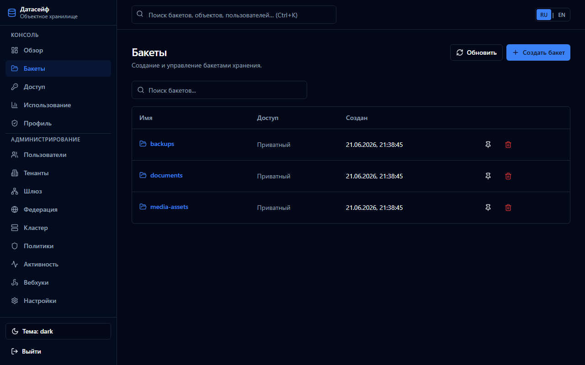
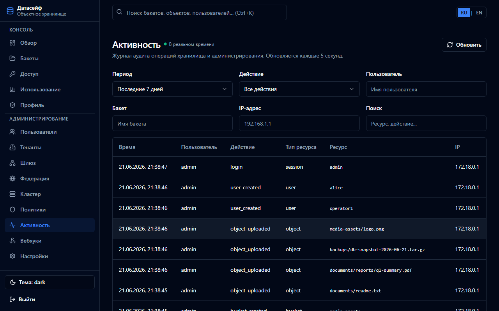
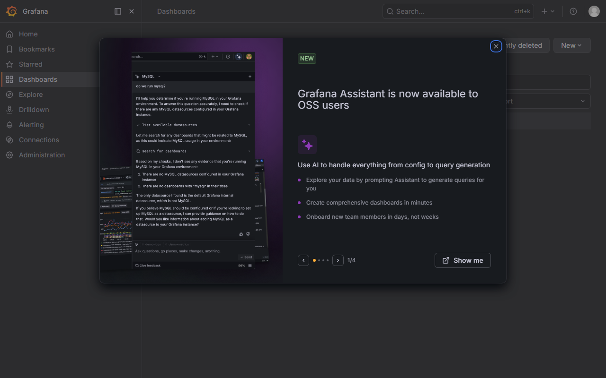
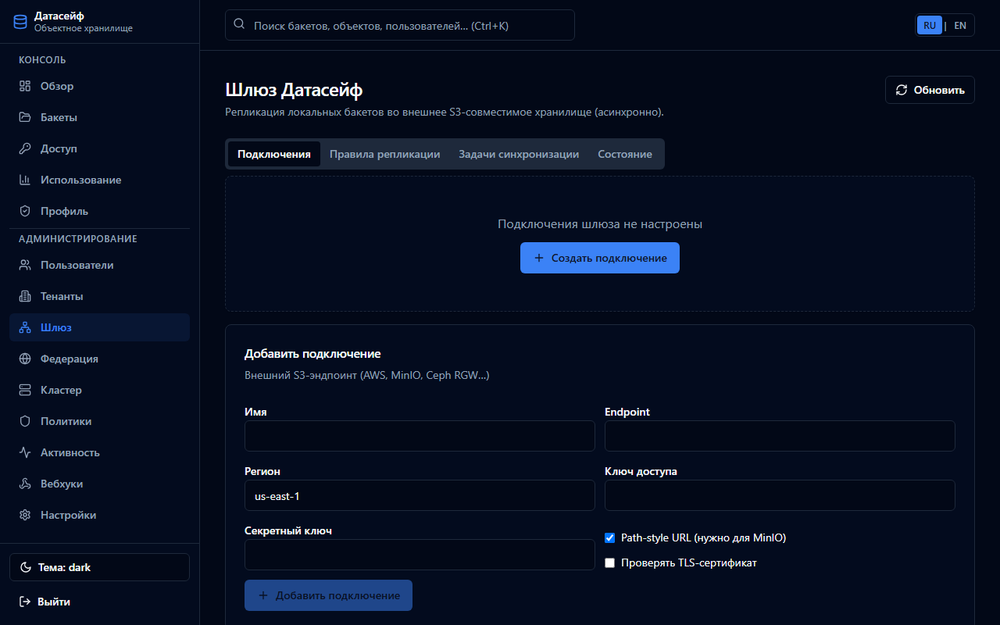
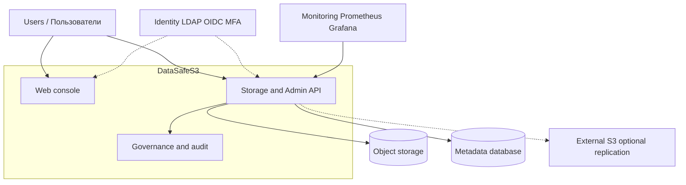

# DataSafeS3 · Датасейф S3

**[English](docs/en/README.md)** · **[Русский](docs/ru/README.md)** · **[Documentation](docs/README.md)**

**Author / Автор:** Ilya Trachuk · **License / Лицензия:** [Apache-2.0](LICENSE) · **Release / Релиз:** [v1.0.3](CHANGELOG.md#103---2026-06-30)

---

## Self-hosted storage platform for secure and governed data management

**Платформа локального хранения для безопасного управления данными и политиками доступа**

---

Organizations accumulate files, backups, media, and application data that must stay under their own control. DataSafeS3 gives teams a single platform to **store data securely**, **integrate corporate identity**, **govern lifecycle and quotas**, and **observe operations** — without depending on a public cloud vendor for administration or policy.

DataSafeS3 is built for **IT administrators**, **platform engineers**, **security teams**, and **business units** that need governed object storage on their infrastructure: on a single server, in Docker Compose, or in Kubernetes with Helm.

The product combines **S3-compatible storage**, a **web console**, **enterprise authentication**, and **operational tooling** in one self-hosted solution.

| | |
|---|---|
| **Secure storage** | Centralized access control, encryption options, object lifecycle |
| **Identity integration** | LDAP, OIDC/SSO, MFA for privileged accounts |
| **Governance** | Tenants, quotas, retention, replication policies |
| **Auditability** | Activity log and external log sinks |
| **Collaboration** | Personal web workspace, bucket/folder sharing, presigned links; desktop sync (`datasafe-sync` CLI + optional Tauri UI) |
| **Observability** | Prometheus metrics and Grafana dashboards |
| **Production trust** | GHCR release images, SBOM, cosign signing, nightly regression CI |
| **High availability** | PostgreSQL replication, read-only standby, failover scripts — [2-node reference](docs/operations-guide/en/reference-deployment-2node.md) |

Подробнее о ценности продукта: [Why DataSafeS3](docs/why-datasafe.md) · [RU](docs/ru/why-datasafe.md)

---

## Product screenshots

| Dashboard / Обзор | Storage / Бакеты | Object browser / Объекты |
|-------------------|------------------|--------------------------|
|  |  |  |

| User management / Пользователи | Audit / Активность | Monitoring / Мониторинг |
|------------------------------|--------------------|-------------------------|
|  |  |  |

| Tenants / Тенанты | Settings / Настройки | Gateway / Репликация |
|-------------------|----------------------|----------------------|
|  |  |  |

---

## Use cases

| Scenario | Description |
|----------|-------------|
| [Enterprise file storage](docs/use-cases/en/corporate-file-storage.md) | Shared storage with SSO, tenants, and audit |
| [Backup repository](docs/use-cases/en/backup-storage.md) | Durable target for backups and snapshots |
| [Private cloud storage](docs/use-cases/en/document-storage.md) | Internal document and content repository |
| [Document archive](docs/use-cases/en/data-archive.md) | Long-term retention and lifecycle policies |
| [Media repository](docs/use-cases/en/media-storage.md) | Large media assets with S3 access |
| [Kubernetes object storage](docs/use-cases/en/k8s-object-storage.md) | S3 backend for clusters and CI/CD |

[All use cases / Все сценарии](docs/use-cases/README.md)

---

## Architecture overview

High-level view — no implementation detail. Deep dives: [Conceptual architecture](docs/learn/en/conceptual-architecture.md) · [RU](docs/learn/ru/conceptual-architecture.md)



---

## Quick start

**Goal:** running console and first bucket in about 5 minutes.

```cmd
copy .env.example .env
docker compose -p datasafe --profile postgres -f docker-compose.yml -f docker-compose.local-binary.yml up -d --build
```

Production console is served from `web/console/dist` (build with `cd web/console && npm run build`). For Vite HMR during UI work: add `-f docker-compose.dev.yml --profile dev`.

Published images (on release tags): `ghcr.io/direktorbani/datasafe-storage-server` and `ghcr.io/direktorbani/datasafe-console`.

1. Open **http://localhost:8080** → sign in `admin` / `admin`
2. Change the administrator password
3. Complete the **setup wizard** (external S3 is optional)
4. Create a bucket in the console or via S3 API

| Service | URL | Default credentials |
|---------|-----|-------------------|
| Console | http://localhost:8080 | `admin` / `admin` (change on first login) |
| S3 API | http://localhost:9000 | `datasafe` / `datasafesecret` |
| Grafana | http://localhost:3000 | `admin` / `admin` |

Step-by-step onboarding: [EN](docs/getting-started/en/onboarding.md) · [RU](docs/getting-started/ru/onboarding.md)

Production: [Deploy guide](docs/README.md#deploy) · [Helm chart](deploy/helm/datasafe/README.md)

---

## Documentation

Documentation is organized by what you need to do:

| Phase | Topics |
|-------|--------|
| **Learn** | [Overview](docs/getting-started/en/what-is-datasafe.md), [architecture](docs/learn/en/conceptual-architecture.md), [security model](docs/administrator-guide/en/mfa.md) |
| **Deploy** | [Docker Compose](docs/getting-started/en/first-run.md), [Kubernetes / Helm](deploy/helm/datasafe/README.md) |
| **Configure** | [LDAP](docs/administrator-guide/en/ldap.md), [OIDC](docs/administrator-guide/en/oidc.md), [monitoring](docs/administrator-guide/en/monitoring.md) |
| **Manage** | [Users](docs/administrator-guide/en/users.md), [tenants](docs/administrator-guide/en/tenants.md), [replication](docs/administrator-guide/en/replication.md) |
| **Operate** | [Backup](docs/operations-guide/en/backup-restore.md), [HA reference](docs/operations-guide/en/reference-deployment-2node.md), [scaling](docs/operations-guide/en/scaling.md), [troubleshooting](docs/operations-guide/en/troubleshooting.md) |
| **Integrate** | [Partner cookbook](docs/operations-guide/en/partner-cookbook.md), [extension hooks](examples/extension-hook/README.md) |
| **Reference** | [Database schema](docs/en/database.md), [Gateway](docs/en/context/gateway.md) |
| **API** | [API guide](docs/api-guide/en/README.md) · Swagger `/api/v1/docs` |

Full hub: **[docs/README.md](docs/README.md)**

---

## Repository layout

| Path | Purpose |
|------|---------|
| `cmd/storage-server` | HTTP server (S3 + Admin API) |
| `cmd/datasafe-sync` | Desktop folder sync CLI (file collaboration Phase 3) |
| `clients/desktop` | Tauri desktop shell |
| `clients/mobile` | Flutter mobile app (Phase 4) |
| `clients/mobile-web` | Mobile PWA preview |
| `web/console` | React web console |
| `internal/metadata` | BoltDB and PostgreSQL metadata |
| `deploy/helm/datasafe` | Kubernetes Helm chart |
| `docs/` | Product documentation |

---

## License

Apache-2.0 · Copyright © Ilya Trachuk
