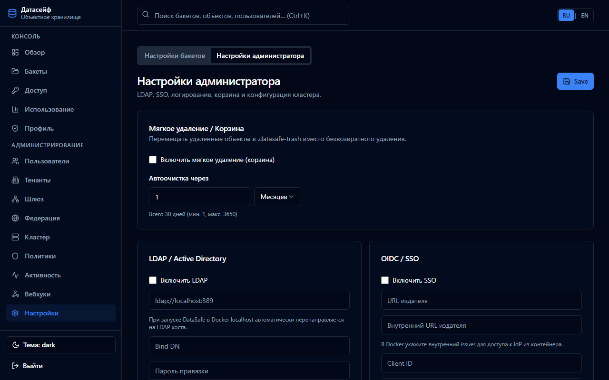

English | **[Русский](../ru/ldap.md)**

# LDAP integration

Sync users and map LDAP groups to DataSafeS3 roles on login.

## Configuration

**Admin → Settings → System → LDAP**

| Field | Description |
|-------|-------------|
| URL | `ldap://host:389` or `ldaps://` |
| Bind DN | Service account |
| Base DN | User search base |
| Group mapping | LDAP group → `administrator` / `operator` / `user` |

## Test and sync

Use **Test connection** and **Sync** buttons in the UI.

## Standalone test environment

[LDAP + Keycloak standalone](../../en/integrations/ldap-keycloak-standalone.md)

## Full guide

[User guide — LDAP and SSO](../../en/user-guide/README.md#7-ldap-and-sso-keycloak)
