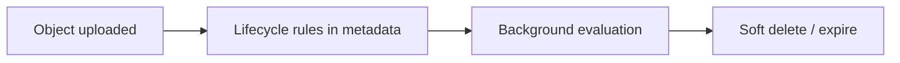

English | **[Русский](../ru/lifecycle.md)**

# Lifecycle policies

Automate object expiration and transition rules per bucket.

## Flow

## Configuration

Bucket settings → **Lifecycle** — define rules (prefix, days, action).

## Related

- **Trash** — soft-deleted objects in `.datasafe-trash`
- **Object Lock** — legal hold and retention (compliance)

## Full guide

[Dashboard and buckets](../../en/user-guide/02-dashboard-and-buckets.md)
