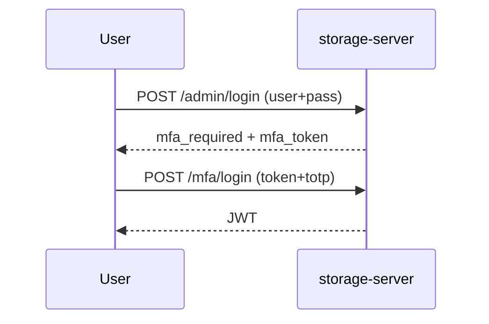

English | **[Русский](../ru/mfa.md)**

# Multi-factor authentication (MFA)

DataSafeS3 supports **TOTP** (authenticator apps) for console users.

## Enable MFA

1. **Profile → Security → Enable MFA**
2. Scan QR code with Google Authenticator / Authy
3. Save recovery codes

## Admin MFA policy

**Admin → Settings → System** — require MFA for administrators.

## Login flow with MFA

## Full guide

[Security and profile](../../en/user-guide/04-security-and-profile.md)
