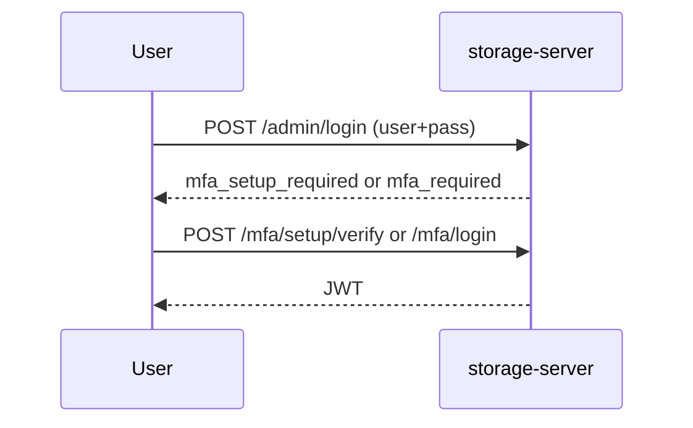

English | **[Русский](../ru/mfa.md)**

# Multi-factor authentication (MFA)

DataSafeS3 supports **TOTP** (authenticator apps) for console users.

## Enable MFA

1. **Profile → Security → Enable MFA**
2. Scan QR code with Google Authenticator / Authy
3. Save recovery codes

## Admin MFA policy

**Admin → Settings → System** — require MFA for administrators.

When the policy is enabled and an administrator has no enrolled TOTP factor, login returns `mfa_setup_required` with a short-lived setup token. The console opens the forced setup wizard before issuing the normal JWT. After the authenticator code is verified, the user can continue with the regular MFA login flow.

## Login flow with MFA

```mermaid
sequenceDiagram
  participant U as User
  participant S as storage-server
  U->>S: POST /admin/login (user+pass)
  S-->>U: mfa_setup_required or mfa_required
  U->>S: POST /mfa/setup/verify or /mfa/login
  S-->>U: JWT
```

## Full guide

[Security and profile](../../en/user-guide/04-security-and-profile.md)
