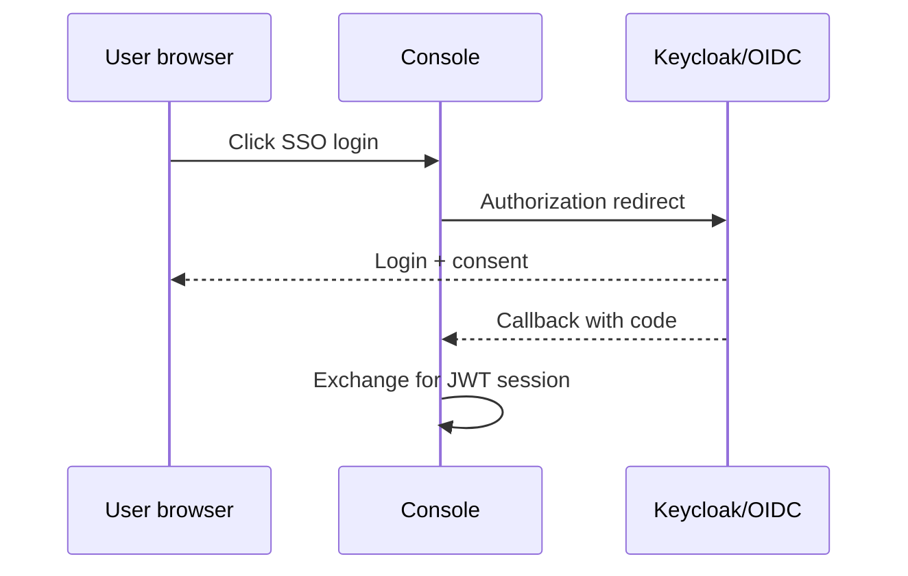

English | **[Русский](../ru/oidc.md)**

# OIDC / SSO

Single sign-on via OpenID Connect (Keycloak and compatible IdPs).

## Configuration

**Admin → Settings → System → OIDC**

- Issuer URL, client ID, client secret
- Redirect URI: `http://your-host:8080/login`
- Optional: password grant for legacy apps

## Login flow

## Test realm

Sample Keycloak realm: [docs/integrations/keycloak-test/](../../integrations/keycloak-test/)

## Full guide

[User guide — LDAP and SSO](../../en/user-guide/README.md#7-ldap-and-sso-keycloak)
