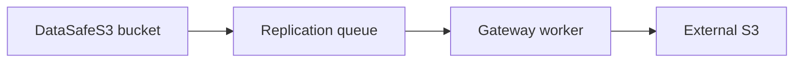

English | **[Русский](../ru/replication.md)**

# Gateway replication


Asynchronous replication from local buckets to external S3 (external S3).

## Architecture



## Setup

1. [Configure external S3](../../getting-started/en/s3-configuration.md)
2. **Gateway** → add connection → create replication rule per bucket
3. Monitor queue and sync jobs on Gateway page

## API

```http
GET  /api/v1/gateway/connections
POST /api/v1/gateway/replication
POST /api/v1/gateway/replication/{id}/sync
```

## Full guide

[Gateway replication](../../en/user-guide/06-gateway-and-minio.md) · [Technical gateway doc](../../en/context/gateway.md)
