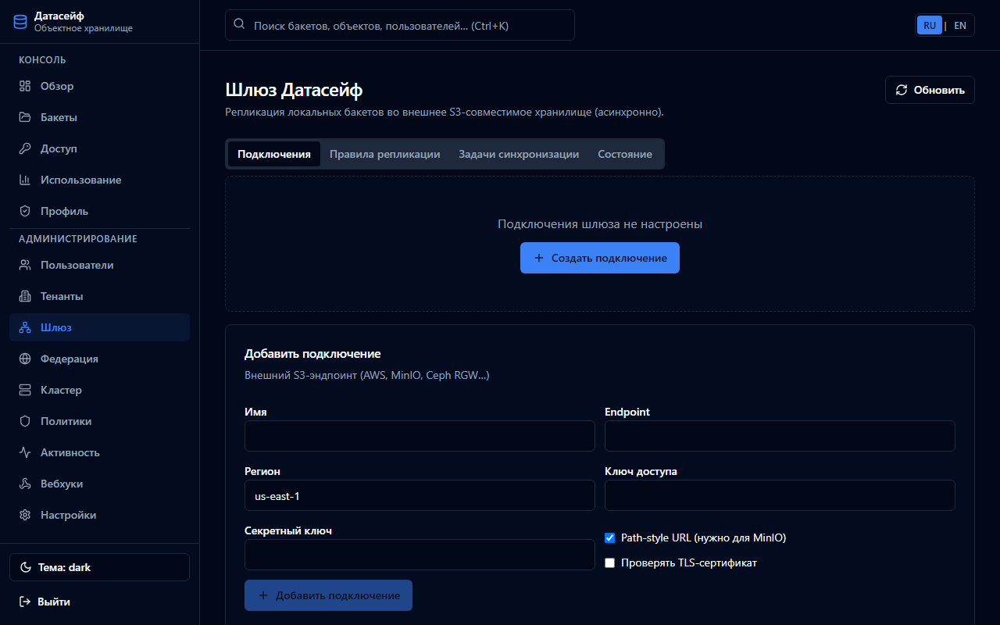
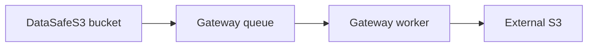
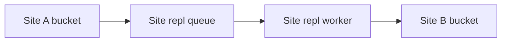
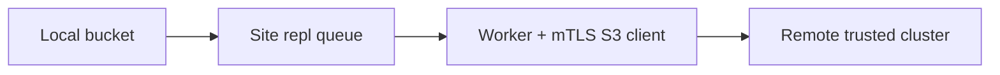

English | **[Русский](../ru/replication.md)**

# Replication

DataSafeS3 supports **three replication models** for DataSafeS3-to-DataSafeS3 scenarios (plus Gateway for external S3). Do not confuse them.

| Feature | Target | Use case |
|---------|--------|----------|
| **Gateway replication** | External S3-compatible endpoint | Backup, hybrid cloud, MinIO/AWS |
| **Site replication** | Another **DataSafeS3** (access keys) | Lab, legacy AK/SK peer |
| **Trusted cluster replication** | Another **paired** DataSafeS3 (mTLS) | DR site with automated trust — **preferred** |



## Gateway replication (external S3)

Asynchronous replication from local buckets to external S3.


```mermaid
flowchart LR
  ds[DataSafeS3 bucket]
  q[Gateway queue]
  gw[Gateway worker]
  ext[External S3]
  ds --> q --> gw --> ext
```

### Setup

1. [Configure external S3](../../getting-started/en/s3-configuration.md)
2. **Gateway** → add connection → create replication rule per bucket
3. Monitor queue on Gateway page

### API

```http
GET  /api/v1/gateway/connections
POST /api/v1/gateway/replication
POST /api/v1/gateway/replication/{id}/sync
```

Full guide: [Gateway replication](../../en/user-guide/06-gateway-and-minio.md) · [Technical gateway doc](../../en/context/gateway.md)

---

## Site replication (DataSafeS3 ↔ DataSafeS3)

Async one-way replication between two DataSafeS3 sites (CE, v1.1.0).


```mermaid
flowchart LR
  a[Site A bucket]
  q[Site repl queue]
  w[Site repl worker]
  b[Site B bucket]
  a --> q --> w --> b
```

### Requirements

- **Source** site: `STORAGE_SITE_REPLICATION_ENABLED=true`
- **Peer** registered with S3 endpoint URL (path-style), access key, secret key
- Outbound URL policy: peer must be reachable (`STORAGE_DEV=true` allows lab HTTP)

### Setup

1. Deploy Site B (peer) — separate Postgres + storage stack.
2. On Site A (Admin): **Site replication** → register peer → create rule (source bucket → dest bucket on peer).
3. Monitor `GET /api/v1/site-replication/status` (`pending_count`, `lag_seconds`).

### Lab (Windows)

```powershell
scripts\ha\start-site-replication-lab.ps1 -FreshVolumes
scripts\ha\test-site-replication.ps1
```

### API

```http
GET    /api/v1/site-replication/peers
POST   /api/v1/site-replication/peers
DELETE /api/v1/site-replication/peers/{id}
GET    /api/v1/site-replication/rules
POST   /api/v1/site-replication/rules
DELETE /api/v1/site-replication/rules/{id}
POST   /api/v1/site-replication/rules/{id}/sync
GET    /api/v1/site-replication/status
```

Bidirectional replication is opt-in (`direction=bidirectional`) — use key prefix guards in production.

See [scaling](../../operations-guide/en/scaling.md) · [disaster recovery](../../operations-guide/en/disaster-recovery.md)

---

## Trusted cluster replication (mTLS, v1.1.0)

Async replication to a **trusted remote cluster** you paired via join token (`dsjoin_*`). Transport uses **mTLS**; pairing is automatic (no manual fingerprint confirmation).


```mermaid
flowchart LR
  a[Local bucket]
  q[Site repl queue]
  w[Worker + mTLS S3 client]
  b[Remote trusted cluster]
  a --> q --> w --> b
```

### When to use

- Two DataSafeS3 sites in different networks / data centers
- You want **hashed join tokens**, **auto cert rotation**, and **revoke** without sharing long-lived peer secrets in metadata

### Setup (console)

1. Pair sites — [Administrator guide — trusted clusters](trusted-clusters.md)
2. On initiator: remote cluster detail → **Add replication rule**
3. Enable worker: `STORAGE_TRUSTED_CLUSTER_REPL_ENABLED=true` (default)

### Setup (API)

```http
POST /api/v1/clusters/pairing-codes
POST /api/v1/clusters/pair/join
GET  /api/v1/clusters/{id}/replication-rules
POST /api/v1/clusters/{id}/replication-rules
```

Operations detail: [Operations guide — trusted clusters](../../operations-guide/en/trusted-clusters.md)
