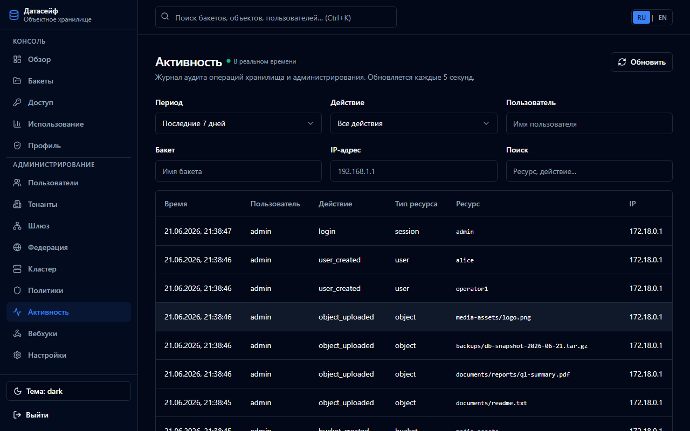

**[English](../en/audit.md)** | Русский

# Аудит и журнал активности



DataSafeS3 записывает административные и data-plane действия в журнал **Activity**.

## События

- CRUD пользователей/buckets/объектов
- Изменения настроек, входы
- Создание share links
- Триггеры репликации Gateway

## Консоль

**Администрирование → Activity** — фильтр по действию, пользователю, ресурсу; **Export CSV / JSON** скачивает отфильтрованный трейл (только admin). Сам экспорт пишется как `activity_exported`.

Смена Object Lock / retention и отказ удаления: `object_lock_changed`, `object_retention_set`, `versioning_changed`, `object_delete_blocked` (Admin JSON delete и S3 SigV4 `DeleteObject`).

## API

```http
GET /api/v1/activity?limit=100
GET /api/v1/activity/export?format=csv&period=30d&bucket=backups
```

Состав хранения (CSV с полями Lock):

```http
POST /api/v1/inventory/jobs
GET  /api/v1/inventory/jobs/{id}
GET  /api/v1/inventory/jobs/{id}/download
```

Чеклист оператора: [Пакет доказательств](../../use-cases/ru/governance-evidence.md).

## Хранение activity

`STORAGE_ACTIVITY_RETENTION_DAYS` (по умолчанию 90; `0` — без purge). GC раз в час на Bolt и Postgres. Это не WORM-журнал — для долгого хранения сохраняйте экспорты.

## Внешнее логирование

Дублирование JSON-логов в Syslog, Loki, Elasticsearch, Webhook — **Settings → External logging**.

См. [operations guide — мониторинг](../../operations-guide/ru/monitoring.md).
