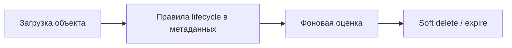

**[English](../en/lifecycle.md)** | Русский

# Политики lifecycle

Автоматическое истечение срока и правила перехода для объектов в bucket.

## Поток

## Настройка

Настройки bucket → **Lifecycle** — правила (prefix, дни, действие).

## Связанное

- **Корзина** — удалённые объекты в `.datasafe-trash`
- **Блокировка объектов (Object Lock)** — юридическое удержание и срок хранения (compliance)

## Полное руководство

[Главная и бакеты](../../ru/user-guide/02-dashbord-i-bakety.md)
