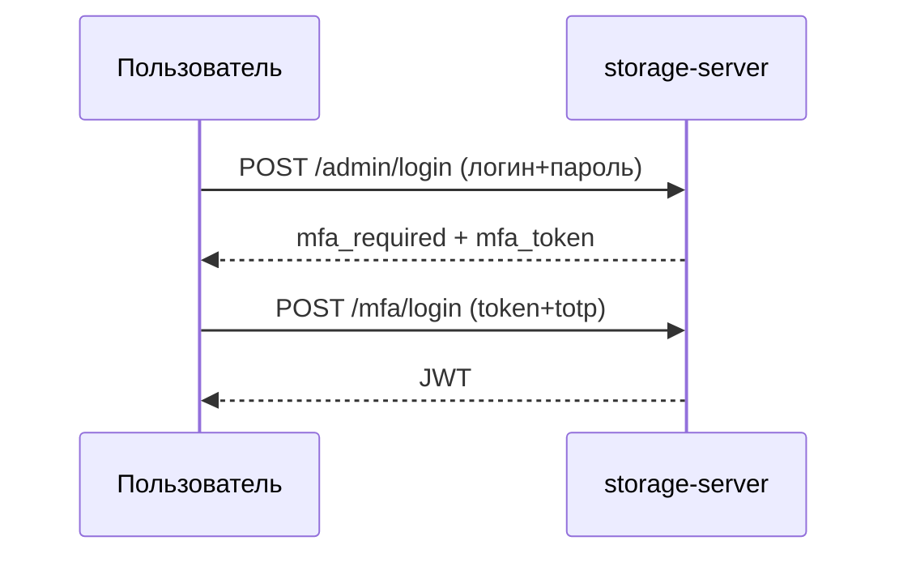

**[English](../en/mfa.md)** | Русский

# Многофакторная аутентификация (MFA)

DataSafeS3 поддерживает **TOTP** (приложения-аутентификаторы) для пользователей консоли.

## Включение MFA

1. **Профиль → Безопасность → Включить MFA**
2. Отсканируйте QR в Google Authenticator / Authy
3. Сохраните коды восстановления

## Политика MFA для админов

**Admin → Settings → System** — обязательный MFA для администраторов.

## Вход с MFA

## Полное руководство

[Безопасность и профиль](../../ru/user-guide/04-bezopasnost-i-profil.md)
