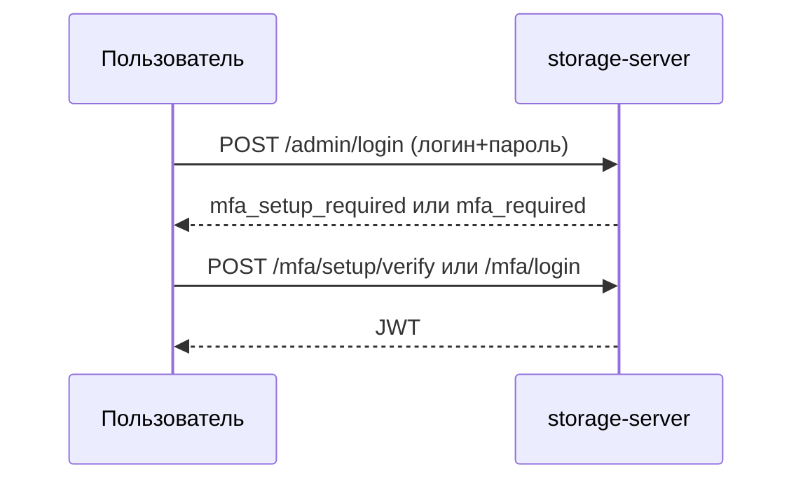

**[English](../en/mfa.md)** | Русский

# Многофакторная аутентификация (MFA)

DataSafeS3 поддерживает **TOTP** (приложения-аутентификаторы) для пользователей консоли.

## Включение MFA

1. **Профиль → Безопасность → Включить MFA**
2. Отсканируйте QR в Google Authenticator / Authy
3. Сохраните коды восстановления

## Политика MFA для админов

**Admin → Settings → System** — обязательный MFA для администраторов.

Если политика включена, а у администратора ещё нет TOTP-фактора, login возвращает `mfa_setup_required` и короткоживущий setup token. Консоль открывает принудительный wizard настройки до выдачи обычного JWT. После проверки кода из authenticator app пользователь продолжает стандартный MFA login flow.

## Вход с MFA

```mermaid
sequenceDiagram
  participant U as Пользователь
  participant S as storage-server
  U->>S: POST /admin/login (логин+пароль)
  S-->>U: mfa_setup_required или mfa_required
  U->>S: POST /mfa/setup/verify или /mfa/login
  S-->>U: JWT
```

## Полное руководство

[Безопасность и профиль](../../ru/user-guide/04-bezopasnost-i-profil.md)
