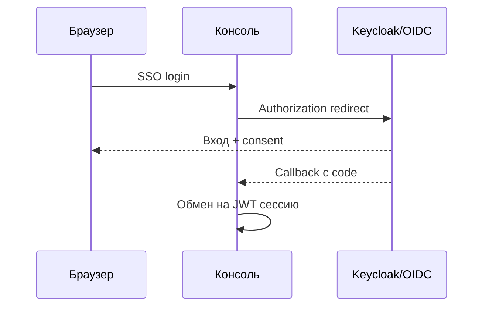

**[English](../en/oidc.md)** | Русский

# OIDC / SSO

Единый вход через OpenID Connect (Keycloak и совместимые IdP).

## Настройка

**Admin → Settings → System → OIDC**

- Issuer URL, client ID, client secret
- Redirect URI: `http://your-host:8080/login`
- Опционально: password grant для legacy-приложений

## Поток входа

## Тестовый realm

Пример Keycloak: [docs/integrations/keycloak-test/](../../integrations/keycloak-test/)

## Полное руководство

[Руководство пользователя — LDAP и SSO](../../ru/user-guide/README.md)
