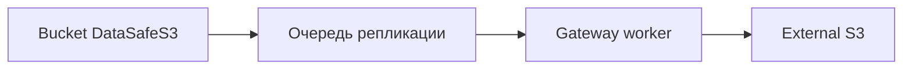

**[English](../en/replication.md)** | Русский

# Репликация Gateway


Асинхронная репликация локальных buckets во внешний S3 (external S3).

## Архитектура



## Настройка

1. [Настройка внешнего S3](../../getting-started/ru/s3-configuration.md)
2. **Gateway** → подключение → правило репликации на bucket
3. Мониторинг очереди и sync jobs на странице Gateway

## API

```http
GET  /api/v1/gateway/connections
POST /api/v1/gateway/replication
POST /api/v1/gateway/replication/{id}/sync
```

## Полное руководство

[Gateway](../../ru/user-guide/06-gateway-i-minio.md) · [Техническая документация](../../ru/context/gateway.md)
