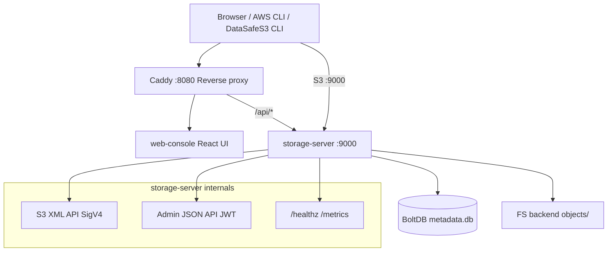

English | **[Русский](../../ru/context/architecture.md)**

# Architecture

**DataSafeS3** is a single-node, S3-compatible object storage service (S3-compatible). Author: **Ilya Trachuk**. Go module: `github.com/DirektorBani/datasafe`.

## Single-node by default

Community Edition ships as **one `storage-server` process** on one host by default. Optional **HA patterns** (PostgreSQL streaming replication, read-only standby, failover scripts, Helm `values-ha.yaml`) are documented for metadata and DR — without multi-AZ erasure at petabyte scale. See [scaling guide](../../operations-guide/en/scaling.md) and [2-node reference](../../operations-guide/en/reference-deployment-2node.md).

| Capability | Status in Community Edition |
|------------|---------------------------|
| Single-node storage + console | **Implemented** |
| PostgreSQL metadata (optional) | **Implemented** |
| Gateway replication to external S3 | **Implemented** |
| Federation (peer registry + S3 proxy) | **Partial (MVP)** — GetObject + ListObjectsV2 across registered peers |
| HA metadata (Postgres replicas + failover scripts) | **Partial** — manual promote; read-replica list routing |
| Read-only `storage-server` standby | **Implemented** — `STORAGE_READ_ONLY`, `docker-compose.ha.yml` |
| Erasure coding / multi-AZ storage | **Partial (MVP)** — 2+1 codec in `internal/storage/erasure/`; not production multi-AZ |
| STS session tokens (scoped S3) | **Implemented** — `POST /api/v1/sts/assume-role`; credentials bound to calling user; `X-Amz-Security-Token` in SigV4 |
| Event notifications | **Implemented** — Webhook + optional NATS (`STORAGE_NATS_URL`) |

## Components

## storage-server (Go)

Entry: `cmd/storage-server/main.go`

| Package | Role |
|---------|------|
| `internal/api` | HTTP mux, admin JSON handlers, wires S3 + auth |
| `internal/api/s3` | S3 XML handlers (buckets, objects, multipart, copy) |
| `internal/storage` | Filesystem object backend |
| `internal/metadata` | BoltDB: buckets, keys, policies, lifecycle |
| `internal/auth` | AWS SigV4 sign/verify, presign, JWT admin auth |
| `internal/policy` | Bucket policy evaluator (Allow subset) |
| `internal/observability` | Structured JSON logs, Prometheus metrics |

### Data layout

Under `STORAGE_DATA_DIR` (default `/data` in Docker, `./data` locally):

- `metadata.db` -- BoltDB
- `objects/` -- object bytes on disk

### Two auth planes

1. **S3 API** -- AWS Signature Version 4 (access key + secret). Bootstrap key from env; additional keys via admin API/metadata.
2. **Admin API** (`/api/v1/*`) -- JWT from `POST /api/v1/admin/login`. All admin routes except `/api/v1/health` require `Authorization: Bearer <token>`.

### S3 vs admin split

- S3 handlers serve XML on `/` (path-style bucket/object routes)
- Admin handlers serve JSON on `/api/v1/*`
- Same process, single port (9000)

## Caddy reverse proxy

File: `deploy/docker/Caddyfile`

| Path | Upstream |
|------|----------|
| `/api/*` | storage-server:9000 |
| `/healthz`, `/metrics` | storage-server:9000 |
| everything else | Pre-built static assets (`web/console/dist`) |

Console and API share origin on `:8080` so the UI uses relative `/api/v1` paths without CORS. For Vite HMR during UI development, use `docker compose --profile dev -f docker-compose.yml -f docker-compose.dev.yml`.

## web-console

React + TypeScript SPA. **Default Compose and Helm** serve a **production build** from `web/console/dist` (or the published `ghcr.io/direktorbani/datasafe-console` image in Kubernetes). The optional **`dev` Compose profile** runs Vite with hot reload via `docker-compose.dev.yml`.

## Observability stack

- **Prometheus** scrapes storage-server metrics (config in `deploy/docker/prometheus.yml`)
- **Grafana** on port 3000 (default install, no custom dashboards in repo)

## CLI

`cmd/storage-cli` (DataSafeS3 CLI) — thin client over S3 API, configured via `DATASAFE_*` env vars (legacy alias `S3FORK_*`).

## Deployment notes

- **Single-node by default** — see table above; do not assume multi-AZ HA without reading [scaling](../../operations-guide/en/scaling.md)
- No TLS in storage-server; terminate at Caddy or external LB
- Path-style addressing required (`--endpoint-url http://host:9000`)
- Rotate default `STORAGE_JWT_SECRET`, `STORAGE_SECRET_KEY`, and admin password before production; set `STORAGE_STRICT_SECRETS=true` to fail fast on defaults
