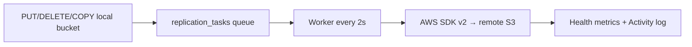

English | **[Русский](../../ru/context/gateway.md)**

# DataSafeS3 Gateway — External S3 Replication

Author: **Ilya Trachuk** | DataSafeS3

Gateway replicates objects from local DataSafeS3 buckets to external S3-compatible storage (any S3-compatible provider) **asynchronously** via a task queue.

---

## Quick Start (UI)

### Step 1 — Open Gateway

1. Sign in to the console as **administrator** (`http://localhost:8080`).
2. In the sidebar: **Gateway** (administrator only).

### Step 2 — Add a Connection

1. **Connections** tab → **Add Connection** block.
2. Fill in the fields:

| Field | Example (local test endpoint) |
|------|-------------------------|
| Name | `External S3 Test` |
| Endpoint | `http://host.docker.internal:9100` *(from DataSafeS3 container)* or `http://localhost:9100` *(from host)* |
| Region | `us-east-1` |
| Access Key | `minioadmin` |
| Secret Key | `minioadmin` |
| Path-style | ✓ enable (required for path-style endpoints) |
| Verify TLS | disable for HTTP without TLS |

3. Click **Add Connection**.
4. Click **Test Connection** — you should see "connected".

> **Tip:** Endpoint is the S3 API URL **without** the bucket name. For the lab container this is port **9100** (not DataSafeS3's 9000).

### Step 3 — Create a Replication Rule

1. **Replication Rules** tab.
2. **Source bucket** — select a local DataSafeS3 bucket (e.g. `my-data`).
3. **Remote connection** — select the connection you created by name.
4. **Remote bucket** — bucket name on remote S3 (e.g. `replica-test`).
5. Click **Add Rule**.

When a rule is created, existing objects are queued for initial replication.

### Step 4 — Verify Replication

1. Upload an object to the local bucket (console or S3 API on `:9000`).
2. Open **Sync Jobs** / **Health** tab — watch `queue_pending`, `bytes_replicated`.
3. Within a few seconds the object appears on the remote endpoint.

---

## S3 test endpoint (Docker)

The test container listens on **9100** (API) and **9101** (console) to avoid conflicting with DataSafeS3 `:9000`.

```cmd
docker run -d --name datasafe-minio-test -p 9100:9000 -p 9101:9001 -e MINIO_ROOT_USER=minioadmin -e MINIO_ROOT_PASSWORD=minioadmin minio/minio server /data --console-address ":9001"
```

> Lab only: the `minio/minio` image is a convenient S3-compatible server for local tests; product docs refer to it as an **external S3 test endpoint**, not as a positioning reference.

Default credentials:

- User: `minioadmin`
- Password: `minioadmin`
- Create bucket `replica-test` manually (example in CLI section below)


---

## How to Verify Replication

Step-by-step end-to-end replication check from DataSafeS3 to remote S3.

### 1. Start S3 test endpoint

The S3 test endpoint is a **separate** Docker container (not in the project `docker-compose`). Ports: **9100** (S3 API), **9101** (web console).

```cmd
docker rm -f datasafe-minio-test
docker run -d --name datasafe-minio-test -p 9100:9000 -p 9101:9001 -e MINIO_ROOT_USER=minioadmin -e MINIO_ROOT_PASSWORD=minioadmin minio/minio server /data --console-address ":9001"
```

Check from host (should respond, not "connection refused"):

```cmd
curl http://localhost:9100/minio/health/live
curl http://localhost:9101/
```

Remote web UI: http://localhost:9101 (`minioadmin` / `minioadmin`).

Destination bucket `replica-test` (if not yet created):

```cmd
docker run --rm --entrypoint sh minio/mc:latest -c "mc alias set test http://host.docker.internal:9100 minioadmin minioadmin && mc mb test/replica-test --ignore-existing"
```

### 2. Configure Gateway in DataSafeS3 UI

1. Console **administrator** → **Gateway** → **Connections** → **Add Connection**.
2. Endpoint `http://host.docker.internal:9100` (from DataSafeS3 container) or `http://localhost:9100` from host; **Path-style** enabled; Access Key / Secret: `minioadmin` / `minioadmin`.
3. **Test Connection** — status **connected**.

### 3. Replication Rule

**Replication Rules** → **Source bucket** (local, e.g. `my-data`) → **Remote connection** → **Remote bucket** `replica-test` → **Add Rule**.

### 4. Upload to Local Bucket

Upload an object to the source bucket via DataSafeS3 console or S3 API on `:9000` (e.g. `hello.txt` in `my-data`).

### 5. Verify on remote endpoint

- **Web UI:** http://localhost:9101 → Object Browser → bucket `replica-test` → same key/file.
- **CLI:**

```cmd
docker run --rm --entrypoint sh minio/mc:latest -c "mc alias set test http://host.docker.internal:9100 minioadmin minioadmin && mc cat test/replica-test/hello.txt"
```

Content should match what was uploaded to DataSafeS3.

### 6. Gateway Health

In UI: **Gateway** → **Sync Jobs** / **Health** — queue (`queue_pending` decreases to 0), `bytes_replicated` grows, no increase in `replication_errors`.

### Start DataSafeS3 with Local Binary

```cmd
scripts\dev-docker-local-binary.cmd
```

### Example UI Connection

| Field | Value |
|------|----------|
| Endpoint | `http://host.docker.internal:9100` |
| Path-style | ✓ |
| Access Key / Secret | `minioadmin` / `minioadmin` |

---

## CLI Verification

### 1. Create Connection (API)

```cmd
curl -s -X POST http://localhost:8080/api/v1/admin/login ^
  -H "Content-Type: application/json" ^
  -d "{\"username\":\"admin\",\"password\":\"admin\"}"
```

Save `token`, then:

```cmd
curl -s -X POST http://localhost:8080/api/v1/gateway/connections ^
  -H "Authorization: Bearer TOKEN" ^
  -H "Content-Type: application/json" ^
  -d "{\"name\":\"External S3 Test\",\"endpoint\":\"http://host.docker.internal:9100\",\"region\":\"us-east-1\",\"access_key\":\"minioadmin\",\"secret_key\":\"minioadmin\",\"path_style\":true,\"tls_verify\":false}"
```

### 2. Test Connection

```cmd
curl -s -X POST http://localhost:8080/api/v1/gateway/connections/CONNECTION_ID/test ^
  -H "Authorization: Bearer TOKEN"
```

### 3. Replication Rule

```cmd
curl -s -X POST http://localhost:8080/api/v1/gateway/replication ^
  -H "Authorization: Bearer TOKEN" ^
  -H "Content-Type: application/json" ^
  -d "{\"source_bucket\":\"my-data\",\"dest_connection_id\":\"CONNECTION_ID\",\"dest_bucket\":\"replica-test\"}"
```

### 4. Upload to DataSafeS3

```cmd
curl -s -X PUT "http://localhost:9000/my-data/hello.txt" ^
  -H "Content-Type: text/plain" ^
  --data "hello from datasafe"
```

*(with AWS SigV4 signing or via console)*

### 5. Verify on the remote endpoint

```cmd
docker run --rm --network host minio/mc:latest mc alias set test http://localhost:9100 minioadmin minioadmin
docker run --rm --network host minio/mc:latest mc cat test/replica-test/hello.txt
```

Expected output: `hello from datasafe`

### 6. Health / Queue

```cmd
curl -s http://localhost:8080/api/v1/gateway/health -H "Authorization: Bearer TOKEN"
curl -s http://localhost:8080/api/v1/gateway/replication/queue -H "Authorization: Bearer TOKEN"
```

---

## How Replication Works



- **Events:** PUT, DELETE (including delete marker), COPY via S3 API and console.
- **Retry:** exponential backoff, up to 5 attempts (`STORAGE_GATEWAY_MAX_RETRIES`).
- **Scheduled sync:** full bucket scan every hour (`STORAGE_GATEWAY_FULL_SYNC_INTERVAL`).
- **Manual sync:** "Sync now" button on a rule — full synchronization.

---

## Environment Variables

| Variable | Default | Description |
|------------|--------------|----------|
| `STORAGE_GATEWAY_WORKER_INTERVAL` | `2s` | Queue processing interval |
| `STORAGE_GATEWAY_MAX_RETRIES` | `5` | Max attempts per task |
| `STORAGE_GATEWAY_FULL_SYNC_INTERVAL` | `1h` | Periodic full sync |

---

## Troubleshooting

| Symptom | Solution |
|---------|---------|
| Test Connection failed | Check endpoint, path-style for path-style endpoints, credentials |
| Object does not appear on the remote endpoint | Health → `queue_pending` > 0? Check `replication_errors` |
| `replication_errors` growing, error `gateway connection "…" not found` | Rule references a **deleted** connection. Delete the rule and recreate with current connection ID, or click **Retry failed** after fixing |
| `rules_broken` > 0 in Health | One or more rules point to a non-existent connection — recreate the rule |
| DELETE replication errors | After update DELETE is idempotent (404 on remote = OK). Click **Clear errors** to reset old entries |
| PUT: remote bucket missing | Worker auto-creates `dest_bucket` on remote on PUT; for path-style endpoints `s3:CreateBucket` permission is sufficient |
| Connection refused from Docker | Use `host.docker.internal:9100` (Windows/Mac) |
| 403 on remote bucket | Check remote credentials; bucket is created automatically on first PUT |
| Cannot delete Connection | Delete replication rules using this connection first |

### Gateway Auto-Setup (External S3 Test)

After bringing up the stack with Postgres and separate test endpoint on `9100`/`9101`:

```cmd
scripts\setup-minio-gateway.cmd
```

The script is idempotent: creates connection **External S3 Test** (`http://host.docker.internal:9100`), tests it, creates bucket `replica-test` on remote endpoint (`mc mb --ignore-existing`), adds a replication rule. Local source bucket is the first from the API list, or set `GATEWAY_SOURCE_BUCKET=my-data` before running.

Full DataSafeS3 restart with Postgres and local binary:

```cmd
docker compose --profile postgres down
scripts\dev-docker-local-binary.cmd
docker compose --profile postgres -f docker-compose.yml -f docker-compose.local-binary.yml up -d
```

(`dev-docker-local-binary.cmd` starts only storage-server and caddy; for Postgres use the second command or extend the profile in the script.)
