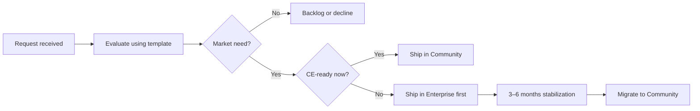

English | **[Русский](../../ru/enterprise/community-enterprise-lifecycle.md)**

# Community and Enterprise lifecycle

**Audience:** Contributors, partners, enterprise prospects  
**Related:** [Feature request evaluation template](./feature-request-evaluation.md)

---

## Overview

**DataSafeS3 Community Edition (CE)** is the open-source product in this repository. It is licensed under **Apache-2.0**. Today, all product features ship in the main repo without license gates.

**DataSafeS3 Enterprise** is a separate commercial offering for organizations that need vendor support, certified delivery, and contractual commitments. Enterprise is introduced **when market demand justifies it** — not as a default split on day one.

This document describes how features move between Enterprise and Community over time, what stays commercial forever, and how requests are evaluated.

---

## Product model today

| Aspect | Community Edition | Enterprise |
|--------|-------------------|------------|
| **License** | Apache-2.0 | Commercial agreement |
| **Source** | This repository (main branch) | Same codebase today; may use a separate distribution channel when Enterprise launches |
| **Features** | Full product surface in main repo | Value-add services and packaging, not arbitrary feature withholding from CE users |
| **Support** | Community channels (issues, discussions) | Paid support with SLA |
| **Builds** | Published release images (GHCR, SBOM, Cosign) | Certified builds, attestation packages for procurement |

Enterprise does **not** mean “a fork that hides core storage or governance from the community.” It means **commercial packaging** around the same platform when customers pay for accountability, not for basic product capability.

---

## Request-to-delivery flow

1. **Request** — customer, partner, or contributor proposes a feature or customization.
2. **Evaluate** — complete the [feature request evaluation template](./feature-request-evaluation.md).
3. **Decision**
   - **Community now** — broad CE value, low operational risk, no paid-customer dependency.
   - **Enterprise first** — strong commercial signal; ship under Enterprise terms, then open to CE after stabilization.
   - **Backlog** — valid idea, insufficient signal or capacity.
   - **Decline** — out of product scope or conflicts with CE principles.
4. **Enterprise-first delivery** — implement and support under Enterprise; document in the public maturity calendar (below).
5. **Community migration** — after **3–6 months** of production use and support learning, port the feature to CE (Apache-2.0) unless it is on the permanent Enterprise-only list.

This **Enterprise-first, Community-later** rhythm lets paying customers fund risky or niche work while keeping the open-source edition complete over time.

---

## Evaluation criteria

A request qualifies for **Enterprise-first** (rather than immediate CE) when **at least two** of the following are true:

| # | Criterion | Question |
|---|-----------|----------|
| 1 | **Paying customers** | Will one or more paying Enterprise customers fund or require this in the next two quarters? |
| 2 | **Deal blocker** | Does absence of this feature block an active enterprise procurement or renewal? |
| 3 | **High support cost** | Will CE-wide release create disproportionate support or operational burden before patterns are proven? |
| 4 | **Narrow CE audience** | Is it unlikely that **80% of CE deployments** would need this within **six months**? |

If fewer than two criteria apply and the feature fits product scope, prefer **Community now**.

Use the [evaluation template](./feature-request-evaluation.md) for scoring, sign-off, and target CE migration quarter.

---

## Permanent Enterprise-only

These capabilities stay **commercial** and do not migrate to Community:

| Category | Examples |
|----------|----------|
| **Support & SLA** | 24×7 support, response-time guarantees, dedicated escalation |
| **Certified delivery** | Vendor-signed attestation for RFPs, named release certification |
| **Professional services** | Custom integration, on-site rollout, training under contract |
| **Commercial license terms** | Multi-year agreements, indemnification, export compliance packages |

Product **features** (APIs, console, storage behavior) are not held on this list by default. If a capability is technically exclusive to Enterprise, the maturity calendar must state why and for how long.

---

## Public feature maturity calendar

DataSafeS3 maintains a **public feature maturity calendar** (published alongside release notes) so users can see:

| Field | Meaning |
|-------|---------|
| **Feature** | Short name and doc link |
| **Status** | `Planned` · `Enterprise preview` · `Enterprise GA` · `CE migration scheduled` · `Community GA` |
| **Enterprise GA** | Quarter when paying customers can use it under Enterprise terms |
| **Target CE quarter** | Planned Apache-2.0 release quarter (or `Enterprise-only` with reason) |
| **Notes** | Breaking changes, migration steps, dependencies |

The calendar is the single source of truth for “when does this land in CE?” Contributors should update it when an Enterprise-first feature is approved or when a CE migration date is set.

---

## Trademark

**DataSafeS3** is a trademark of Ilya Trachuk. The Apache-2.0 license grants use of the **software**; it does not grant rights to use the **DataSafeS3** name for derivative products or services without permission.

- **Allowed:** “Built on DataSafeS3 Community Edition,” “DataSafeS3-compatible API,” factual references in documentation.
- **Requires permission:** Product names that imply official endorsement (“DataSafeS3 Pro by Acme”), modified logos presented as official, or marketing that suggests affiliation without agreement.

See the repository [LICENSE](../../../LICENSE) for copyright and license terms.

---

## Principles

1. **CE stays complete** — the open-source edition remains a credible self-hosted platform; Enterprise funds services and early access, not permanent crippling of CE.
2. **Transparent timeline** — Enterprise-first features get a published CE migration target unless permanently commercial (support/SLA/certification only).
3. **No positioning by comparison** — product docs describe DataSafeS3 value; see [Product documentation TZ](../specs/product-documentation-tz.md).
4. **Same codebase discipline** — avoid long-lived proprietary forks; prefer feature flags, packaging, or distribution channels until a separate repo is justified.

---

## Related documentation

- [Feature request evaluation template](./feature-request-evaluation.md)
- [Contributing](../../../CONTRIBUTING.md)
- [Product documentation TZ](../specs/product-documentation-tz.md)
- [Security self-assessment](../../operations-guide/en/security-self-assessment.md) — CE controls vs external review
