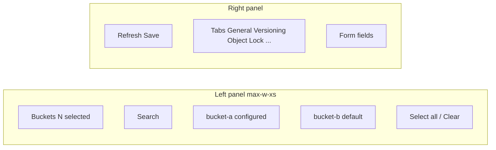

English | **[Русский](../../ru/specs/bucket-settings-multi-select-tz.md)**

# Spec: Multi-Select Buckets in Bucket Settings (Admin)

**Version:** 1.0  
**Date:** 2026-06-18  
**Status:** To be implemented  
**Related files:** `web/console/src/pages/settings-buckets.tsx`, `web/console/src/components/settings/BucketSettingsTabs.tsx`, `web/console/src/lib/api.ts`, `docs/specs/settings-ui-split-tz.md`

---

## 1. Goal

Allow administrator to **select multiple buckets** on **Administration → Settings → Bucket settings** and apply the same settings (visibility, quotas, versioning, etc.) to all selected buckets in one **Save** action.

### Current problem

Global picker is single `<Select>`. Bulk configuration of dozens of buckets requires repeating Save for each.

### Expected outcome

- Convenient navigation: searchable checklist on left, form on right.
- Correct handling of **mixed state** (selected buckets have different field values).
- Two apply modes: **overwrite all** / **only empty fields**.
- Deep link and backward compatibility with `?bucket=name`.
- No REST API changes (frontend `PUT` loop).

---

## 2. UX Flows

### 2.1. Bulk settings apply

1. Administrator opens `/admin/settings/buckets`.
2. In left panel checks 2+ buckets (search by name).
3. Right form shows common values; fields with differences — **"Multiple values"** (or counter "3 values").
4. Changes e.g. **Visibility → Public read**.
5. Clicks **Save**.
6. If at least one selected bucket has non-default settings (**configured** badge) and mode is **Overwrite all** — dialog: *"Apply to N buckets? Existing settings will be replaced."*
7. Toast: *"Saved 3/3 buckets"* or *"Saved 2/3 buckets (1 failed)"* with error name.

### 2.2. Single bucket (regression)

Behavior as now: one checkbox / one bucket in list, form without mixed-state, Save without dialog (unless bulk overwrite with configured).

### 2.3. Deep link

| URL | Behavior |
|-----|-----------|
| `?bucket=my-bucket` | One bucket selected (backward compatible) |
| `?buckets=a,b,c` | a, b, c selected |
| Both params | `buckets` takes priority; non-existent names ignored |

On selection change URL updates (`buckets=` for 2+, `bucket=` for 1, param removed for 0).

### 2.4. Minimum one bucket

With no buckets selected form is hidden, hint: *"Select at least one bucket to edit settings."*

---

## 3. UI Pattern: Multi-Select Checklist

### Layout (desktop)



- Left column: `max-w-xs`, fixed on `lg+`; on narrow screen — on top.
- Checkbox + name + badge:
  - **configured** — at least one deviation from default (see §4.2).
  - **default** — all fields at default.
- Search filters list without clearing selection.
- **Select all** / **Clear** — visible only (after filter) / all.

### Apply mode (above form or in header)

Radio or Select:

| Mode | EN (UI) | Behavior |
|-------|---------|-----------|
| `overwrite` | Overwrite all | `PUT` with full draft body per bucket |
| `only_empty` | Only empty fields | Per bucket send only fields empty/default for **that** bucket |

---

## 4. Mixed State

### 4.1. Definition

When N buckets selected, each editable field values are compared across all selected. If they differ — field is **mixed**.

Compared fields: `description`, `versioning_enabled`, `object_lock_enabled`, `retention_days`, `storage_class`, `visibility`, `max_size_bytes`, `max_objects`, `lifecycle_rules` (deep JSON compare).

`owner`, `name`, `tenant_id`, `tags` — not bulk-edited in v1 (owner read-only; tags remain in bucket detail).

### 4.2. "configured" badge

Bucket is **configured** if at least one of:

- `description` non-empty
- `versioning_enabled === true`
- `object_lock_enabled === true`
- `storage_class` set and not `"hot"`
- `visibility !== "private"`
- `max_size_bytes > 0` or `max_objects > 0`
- `lifecycle_rules.length > 0`

### 4.3. Mixed field display

| Field type | Mixed UI |
|----------|----------|
| Text / number | placeholder "Multiple values", empty value |
| Select | option "Multiple values" (disabled value `__mixed__`) |
| Checkbox | `indeterminate` + label "Multiple values" |
| Lifecycle JSON | placeholder + hint "N buckets differ" |

Editing mixed field clears mixed for that field and sets single value for Save.

---

## 5. Apply Modes (detail)

### Overwrite all

Per selected bucket:

```http
PUT /api/v1/settings/buckets/{name}
Content-Type: application/json

{ full draft without name/owner }
```

### Only empty fields

Per bucket build partial body: field included if **that** bucket has it empty/default **or** user explicitly changed mixed field (after edit).

Defaults: see §4.2 (inverse of configured).

---

## 6. API Strategy

### Choice: **Option A — frontend PUT loop**

| Criterion | Option A (PUT loop) | Option B (batch endpoint) |
|----------|-------------------|----------------------------|
| Backend changes | None | New handler, tests, docs |
| Consistency with split TZ | Yes ("no API changes") | API extension |
| Partial failure | Natural (per-bucket) | Composite response needed |
| Code volume | Less | More |

**Decision:** Option A. Helper `api.batchUpdateBucketSettings(names, body)` — `Promise.allSettled` over `updateBucketSettings`.

New batch endpoint — backlog (if >50 buckets and atomicity needed).

---

## 7. Roles and Access

Unchanged from `settings-ui-split-tz.md`:

- Page `/admin/settings/buckets` — `administrator` only (`AdminRoute`).
- `PUT /api/v1/settings/buckets/{name}` — `adminOnly` + `canWriteBucket` in handler.
- On partial failure 403 on individual bucket — show in toast, save others.

---

## 8. Acceptance Criteria

### Navigation and selection

- [ ] Searchable multi-select checklist replaces single Select.
- [ ] configured / default badges on each bucket.
- [ ] Minimum 1 bucket to show form.
- [ ] `?bucket=x` and `?buckets=a,b,c` work; URL syncs with selection.

### Mixed state

- [ ] Two buckets with different visibility — Select shows "Multiple values".
- [ ] After changing visibility and Save — both buckets updated (overwrite).

### Save

- [ ] Confirm dialog on overwrite with configured buckets in selection.
- [ ] Toast "Saved N/M buckets"; on errors — bucket names.
- [ ] only_empty mode: configured + default in selection — quotas apply only to default.

### Regression

- [ ] Single bucket — behavior as before task.
- [ ] `bucket-detail` → "Open in admin bucket settings" with `?bucket=` works.
- [ ] `npm run build` PASS.

---

## 9. Implementation Plan

1. **TZ** — this document.
2. **`lib/bucket-settings-merge.ts`** — `isBucketConfigured`, `mergeBucketSettings`, `buildBucketUpdatePayload`, `batchUpdateBucketSettings` in api.ts.
3. **`BucketSettingsPicker.tsx`** — left panel: search, checklist, badges, select all/clear.
4. **`BucketSettingsTabs.tsx`** — prop `mixedFields: Set<string>`, mixed UI on fields.
5. **`settings-buckets.tsx`** — multi-select state, URL sync, confirm, save mutation.
6. **`docs/user-guide/README.md`** — bulk bucket settings section.
7. Build, commits, push, `build-console.cmd` + restart caddy.

### Files

| File | Action |
|------|----------|
| `docs/specs/bucket-settings-multi-select-tz.md` | create |
| `web/console/src/lib/bucket-settings-merge.ts` | create |
| `web/console/src/components/settings/BucketSettingsPicker.tsx` | create |
| `web/console/src/components/settings/BucketSettingsTabs.tsx` | modify |
| `web/console/src/pages/settings-buckets.tsx` | modify |
| `web/console/src/lib/api.ts` | modify (batch helper) |
| `docs/user-guide/README.md` | modify |

---

## 10. Risks

| Risk | Mitigation |
|------|-----------|
| Large selection (100+ buckets) — many PUTs | Sequential allSettled; batch API in backlog |
| Mixed lifecycle JSON — complex UX | Placeholder + count; full edit overwrites all |
| Unsaved changes on selection change | `window.confirm` on dirty draft |
| only_empty unclear to user | Brief description under mode switch |
| Partial 403 | Toast listing failed buckets |

---

## Appendix. Example verify

1. Create `bucket-a` (private), `bucket-b` (public-read).
2. Select both → Visibility = "Multiple values".
3. Select Private → Save (overwrite) → confirm → both private.
4. Select `bucket-a` (with quotas) + `bucket-b` (default) → Quotas → only_empty → quotas only on `bucket-b`.
