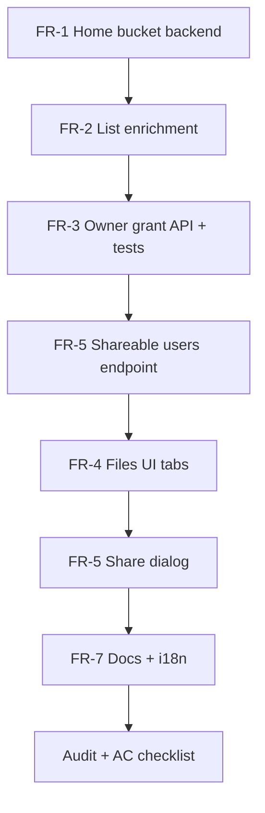

English | **[Русский](../../ru/specs/file-collaboration-tz.md)**

# Spec: File Collaboration — Web «My Files» (Phase 1)

**Version:** 1.1  
**Date:** 2026-06-23  
**Status:** **Phase 1–3 implemented** · Phase 4 mobile [backlog](./file-collaboration-phase4-backlog.md) — see [file-collaboration-status.md](./file-collaboration-status.md)  
**Parent:** [roadmap-to-9.md](../../analysis/roadmap-to-9.md) (segment: end-user file workspace)  
**Prerequisite:** [tenant-bucket-isolation-tz.md](./tenant-bucket-isolation-tz.md) — **Implemented**  
**License:** Apache-2.0 Community Edition — no paid gates  
**Audience:** Implementing agent / developer

---

## 0. Agent quick start

1. Read this TZ end-to-end; implement **Phase 1 only** unless user explicitly requests Phase 2+.
2. Search existing code before adding APIs:
   - `internal/api/bucket_access_handlers.go` — grants (tenant_admin only today)
   - `internal/api/bucket_access.go` — `bucketListFilter`, `grantBucketKeysForUser`
   - `internal/metadata/teams.go` — `BucketListFilter`, `BucketMatchesFilter`
   - `web/console/src/pages/bucket-detail.tsx` — Access tab (`showAccessTab`)
   - `web/console/src/pages/buckets.tsx` — bucket list + create
3. **Do not** break S3 semantics: logical bucket names, `storage_key`, existing RBAC tests.
4. After implementation:
   - `go test ./...`
   - `scripts/feature-audit-test.ps1` (93/93 must stay PASS)
   - Add Go tests for new grant permissions + list enrichment
   - Add Playwright or extend audit script for share flow (minimum: Go integration test)
   - Update **EN + RU** user-facing docs per [product-documentation-tz.md](./product-documentation-tz.md) — value narrative, **no competitor comparisons**
5. OpenAPI: extend `docs/api/openapi.yaml` Tier A if new stable JSON routes are added.

---

## 1. Goal

Give every authenticated user a **personal file workspace** in the web console («**My files**») and let **owners** and **tenant administrators** share buckets with specific users — reusing existing object storage and `bucket_access_grants`, without desktop/mobile sync clients.

**Outcomes:**

- User signs in → sees personal storage (default home bucket) and files shared by colleagues.
- Bucket owner shares read/write access with selected users from the console.
- Tenant admin continues to manage team buckets and grants (existing flow, unified UX).
- Product positioning remains **governed self-hosted object storage** with collaboration — not a claim of full desktop sync (Phase 3+).

---

## 2. Problem

| ID | Problem | Evidence |
|----|---------|----------|
| FC-1 | Console speaks «S3 buckets», not «my files» | `nav:buckets`, admin-centric sidebar |
| FC-2 | `bucket_access_grants` API restricted to `tenant_admin` | `handleListBucketAccess` → `isTenantAdmin` only |
| FC-3 | No default personal space on first login | User must manually create a bucket |
| FC-4 | Shared buckets not distinguished in UI | `GET /buckets` lacks `ownership` / `shared_by` |
| FC-5 | Owner cannot invite colleagues to **personal** bucket | Access tab hidden unless `canManageTenant` |
| FC-6 | No audit events for grant changes by owner | Activity log partial |

---

## 3. Glossary

| Term | Meaning |
|------|---------|
| **Home bucket** | Auto-provisioned personal bucket in owner scope (`ScopeOwner`) |
| **Owned bucket** | `bucket.owner_id == current user` |
| **Shared bucket** | User has row in `bucket_access_grants` but is not owner |
| **Tenant bucket** | `tenant_id` set and ≠ `default` |
| **Grant** | `bucket_access_grants` row: `can_read`, `can_write` |
| **Share** | Assigning grants to users (not public share links — those exist separately) |

---

## 4. Current state (do not reimplement)

| Layer | Status | Location |
|-------|--------|----------|
| Per-owner bucket scope | Done | `metadata.BucketScopeForUser`, migration `004` |
| `bucket_access_grants` table + Bolt bucket | Done | `internal/metadata/postgres/bucket_grants.go` |
| List buckets filtered by grants | Done | `bucketListFilter` → `GrantBucketKeys` |
| S3 access via grants | Done | `internal/api/s3/bucket_access.go` |
| Tenant admin Access tab | Done | `bucket-detail.tsx`, tenant-scoped API |
| User creates bucket | Done | `POST /api/v1/buckets/{name}` |
| Share links (public URL) | Done | separate feature — do not conflate |

---

## 5. Scope

### Phase 1 — In scope (this TZ)

| ID | Deliverable |
|----|-------------|
| P1-1 | Auto-provision **home bucket** on first login (configurable) |
| P1-2 | `GET /api/v1/buckets` enrichment: `ownership`, `can_write`, `shared_by` |
| P1-3 | **Owner-level** grant API on personal and owned buckets |
| P1-4 | Console: **My files** / **Shared with me** views (role `user` + all roles) |
| P1-5 | Console: **Share** dialog on bucket detail (owner + tenant_admin) |
| P1-6 | User picker (tenant members + search users in org — see FR-5) |
| P1-7 | Activity log events for grant create/update/delete |
| P1-8 | i18n EN/RU/de/fr for new strings |
| P1-9 | Tests + docs |

### Phase 1 — Out of scope

- Folder/prefix-level grants
- Desktop sync (Mac/Win/Linux)
- Mobile apps (iOS/Android)
- Real-time notifications / email invites
- In-browser document editing
- Replacing share links feature
- New metadata backend tables (reuse `bucket_access_grants`)

### Phase 2+ (reference — implemented in stages)

| Phase | Focus | Status |
|-------|-------|--------|
| **2** | Prefix grants, notifications, recent, home quota | **Implemented** (web) |
| **3** | Desktop client (Tauri), sync MVP | **Implemented** — `cmd/datasafe-sync` + `clients/desktop` |
| **4** | Mobile viewer + upload | **Backlog** — [phase4-backlog](./file-collaboration-phase4-backlog.md) |

See [Appendix B](#appendix-b--phase-23-outline-for-planning) and [clients/README.md](../../../clients/README.md).

---

## 6. Functional requirements (Phase 1)

### FR-1 Home bucket auto-provision

1. System settings (admin-configurable, defaults shown):

| Setting | Env var | Default |
|---------|---------|---------|
| Enable auto home bucket | `STORAGE_AUTO_HOME_BUCKET` | `true` |
| Home bucket logical name | `STORAGE_HOME_BUCKET_NAME` | `files` |
| Visibility | — | `private` |

2. **Trigger:** after successful login (`POST /api/v1/auth/login`, OIDC callback, LDAP login) OR first `GET /api/v1/me` when user has **zero owned buckets** in `ScopeOwner`.
3. Create bucket via existing create path: `owner_id = user.id`, `tenant_id` = user primary tenant or `default`, `storage_key = o:{owner_id}:{name}`.
4. If name `files` already taken in owner scope — skip (idempotent).
5. If `STORAGE_AUTO_HOME_BUCKET=false` — skip; UI shows empty state with CTA «Create storage».
6. Do **not** auto-create for `administrator` service accounts unless they have no buckets (same rule — keep simple).

**Files:** `internal/api/auth_handlers.go` or `me_handlers.go`, `internal/api/server.go` config, `web/console` empty state.

### FR-2 Bucket list enrichment

Extend `GET /api/v1/buckets` response items:

```json
{
  "name": "files",
  "created_at": "2026-06-23T10:00:00Z",
  "owner": "alice",
  "owner_id": "u-1",
  "tenant_id": "default",
  "visibility": "private",
  "storage_key": "o:u-1:files",
  "access": {
    "ownership": "owned",
    "can_read": true,
    "can_write": true,
    "shared_by": null
  }
}
```

| `access.ownership` | Condition |
|------------------|-----------|
| `owned` | `owner_id == caller` |
| `shared` | grant exists, not owner |
| `tenant` | tenant bucket visible via membership, not owner, no personal grant |

For `shared`, set `shared_by` to owner username (lookup).

Optional query: `GET /api/v1/buckets?filter=owned|shared|all` (default `all`). Server-side filter after enrichment.

**Backward compatibility:** new fields are additive; existing clients ignore them.

### FR-3 Owner grant API

New routes (preferred — bucket-scoped, works for personal + tenant buckets):

| Method | Path | Who may call |
|--------|------|--------------|
| GET | `/api/v1/buckets/{bucket}/access` | bucket **owner**, `tenant_admin` of bucket's tenant, **administrator** |
| PUT | `/api/v1/buckets/{bucket}/access` | same |
| DELETE | `/api/v1/buckets/{bucket}/access/{user_id}` | same |

Request/response body — same shape as tenant route:

```json
{
  "grants": [
    { "user_id": "u-2", "can_read": true, "can_write": false }
  ]
}
```

Response GET:

```json
{
  "bucket": "files",
  "tenant_id": "default",
  "grants": [
    { "user_id": "u-2", "username": "bob", "can_read": true, "can_write": false }
  ]
}
```

**Rules:**

1. Resolve bucket with `resolveBucketForUser` — caller must have at least read access to list; write access to mutate grants.
2. Grantee must exist and be active.
3. Grantee should belong to same **tenant** as bucket OR be member of a tenant that bucket belongs to — if bucket is personal (`default` tenant), allow granting to users visible to owner:
   - **MVP rule:** grantee must share at least one `tenant_members` tenant with owner OR grantee is in `default` tenant and owner is `tenant_admin` OR caller is `administrator`.
   - Document chosen rule in code comment + admin guide.
4. Owner cannot remove their own ownership via grants API.
5. When first grant is added to a bucket that previously used team/tenant-wide access, existing behavior (`HasGrants`) already restricts to grants + owner + tenant_admin — **no change**.
6. Keep existing tenant routes `/api/v1/tenants/{tenant}/buckets/{bucket}/access` — delegate to shared helper; tenant_admin path unchanged.

**Activity log:** `ActionSettingsChanged`, resource `bucket_access`, detail: bucket name, grantee count, actor.

### FR-4 Console — «Files» navigation

1. For role `user` (and optionally all roles in **user nav** section):
   - Rename label **Buckets** → **Files** (i18n key `nav:files`; keep `nav:buckets` alias deprecated or admin-only).
2. `/buckets` page tabs or sidebar filters:
   - **My files** — `ownership == owned`
   - **Shared with me** — `ownership == shared`
   - **Team** (optional) — `ownership == tenant` — hide if empty
3. Default landing for `user` role: **My files** tab.
4. Empty state **My files:** «Your personal storage is ready» with link to home bucket; if no home bucket and auto-provision off — CTA create bucket.
5. Administrator nav unchanged (still sees admin section).

**Files:** `web/console/src/pages/buckets.tsx`, `layouts/sidebar.tsx`, locales `nav.json`, `buckets.json` (+ de/fr).

### FR-5 Share dialog (UI)

1. On **bucket detail** page, show **Share** tab or button when:
   - `isAdmin` OR `canManageTenant(tenantId)` OR **current user is bucket owner** (`owner_id === me.id`).
2. Reuse Access table UX from tenant admin (checkboxes read/write, user list).
3. **User picker sources (MVP):**
   - If tenant bucket: `GET /api/v1/tenants/{id}/members`
   - If personal bucket: `GET /api/v1/users` **not allowed** for plain user — add:
     - `GET /api/v1/shareable-users?bucket={name}` → users in shared tenant(s) with username search `?q=` (max 50)
4. Save → `PUT /api/v1/buckets/{bucket}/access`.
5. Show effective access summary: owner, N collaborators.

### FR-6 Simplified user chrome (optional P1 — recommended)

Hide from sidebar for `role === user` only:

- Gateway, Federation, Cluster, Webhooks, Policy (already hidden — verify)

Keep: Dashboard (or redirect to Files), Files, Access keys, Usage, Profile.

### FR-7 Documentation (product)

| Doc | Update |
|-----|--------|
| `docs/use-cases/en/corporate-file-storage.md` | Add «Personal workspace + team sharing» |
| `docs/en/user-guide/README.md` | Section «Files and sharing» |
| RU mirrors | same |
| `docs/getting-started/en/what-is-datasafe.md` | One bullet under Collaboration |

**Forbidden:** competitor names, «better than X», comparison tables.

---

## 7. Non-functional requirements

| ID | Requirement |
|----|-------------|
| NFR-1 | Grant API p95 < 200 ms for ≤100 grants |
| NFR-2 | No regression in `go test ./internal/api/...` RBAC tests |
| NFR-3 | feature-audit **93/93 PASS** |
| NFR-4 | EN/RU strings complete; de/fr fall back to EN or machine keys filled |
| NFR-5 | OpenAPI drift check passes if routes documented |

---

## 8. RBAC matrix (Phase 1)

| Action | administrator | operator | user (owner) | user (grantee) | tenant_admin |
|--------|:-------------:|:--------:|:------------:|:--------------:|:------------:|
| List own + shared buckets | ✓ | ✓ | ✓ | ✓ | ✓ |
| Auto home bucket | ✓ | ✓ | ✓ | ✓ | ✓ |
| Share bucket (PUT access) | ✓ | — | ✓ if owner | — | ✓ if tenant bucket |
| Read grants | ✓ | — | ✓ if owner | — | ✓ |
| Write objects in shared bucket | ✓ | ✓ | per grant | per grant | per grant |

---

## 9. API summary (new/changed)

| Method | Path | Change |
|--------|------|--------|
| GET | `/api/v1/buckets` | Add `access` object; optional `?filter=` |
| GET | `/api/v1/buckets/{bucket}/access` | **New** — owner grant list |
| PUT | `/api/v1/buckets/{bucket}/access` | **New** — replace grants |
| DELETE | `/api/v1/buckets/{bucket}/access/{user_id}` | **New** |
| GET | `/api/v1/shareable-users` | **New** — `?bucket=&q=` |

Existing tenant access routes — refactor to shared `bucketAccessService` helper; behavior unchanged.

---

## 10. UI wireframe (logical)

```
Sidebar          Files page                    Bucket detail
────────         ──────────                    ─────────────
Dashboard        [My files][Shared][Team]      [Objects][Share][Settings]
Files      →     ┌──────────────────┐          Share tab:
Access keys      │ files      owned │          User      Read Write
Usage            │ team-data  tenant│          bob       [x]  [ ]
Profile          │ proj-x    shared│          carol     [x]  [x]
                 └──────────────────┘          [Save]
```

---

## 11. Tests

### Go unit/integration

| Test | File (suggested) |
|------|------------------|
| Owner can PUT grants on personal bucket | `internal/api/bucket_access_owner_test.go` |
| Non-owner cannot PUT grants | same |
| List buckets returns `ownership=shared` | same |
| Home bucket created once | `internal/api/home_bucket_test.go` |
| Grantee loses write when grant revoked | extend `rbac_access_test.go` |

### Console / E2E

| Test | Minimum |
|------|---------|
| User A shares bucket, User B sees under Shared | Playwright **or** audit script addition |
| Home bucket appears after first login | audit script |

### Regression

Run full `scripts/feature-audit-test.ps1` — **0 failures**.

---

## 12. Acceptance criteria (Phase 1 DoD)

- [ ] **AC-1** New user login → home bucket `files` exists (when auto enabled).
- [ ] **AC-2** `GET /buckets` includes `access.ownership` for owned and shared buckets.
- [ ] **AC-3** Owner opens Share tab on personal bucket → adds grant → grantee sees bucket under Shared with read-only.
- [ ] **AC-4** Grantee with `can_write` can upload via object browser.
- [ ] **AC-5** Tenant admin can still manage tenant bucket grants (no regression).
- [ ] **AC-6** Non-owner without grant gets 403 on bucket objects.
- [ ] **AC-7** Activity log records grant changes.
- [ ] **AC-8** `go test ./...` PASS.
- [ ] **AC-9** feature-audit 93/93 PASS.
- [ ] **AC-10** EN/RU docs updated; product TZ rules respected.

---

## 13. Implementation order



1. Backend: home bucket + list enrichment (no UI).
2. Backend: owner grant handlers + refactor tenant handlers.
3. API client types in `web/console/src/lib/api.ts`.
4. UI: tabs + share dialog.
5. Docs + locales.
6. Tests + audit.

---

## 14. Effort estimate

| Area | Size | Calendar (1 FTE) |
|------|------|------------------|
| Backend FR-1–3, shareable-users | M | 3–4 weeks |
| Console FR-4–5 | M | 3–4 weeks |
| Tests + audit + docs | S | 1–2 weeks |
| **Phase 1 total** | **L** | **7–10 weeks** |

With 1 backend + 1 frontend in parallel: **4–6 weeks**.

---

## 15. Dependencies

| Dependency | Status |
|------------|--------|
| `tenant-bucket-isolation-tz` | Implemented |
| PostgreSQL or Bolt metadata | Both supported |
| User accounts + tenants | Implemented |

---

## 16. Risks

| Risk | Mitigation |
|------|------------|
| Grantee discovery for personal buckets leaks user list | Restrict `shareable-users` to shared tenants; rate-limit |
| `HasGrants` mode locks out team members | Document: enabling Share switches bucket to grant-only mode (existing behavior) |
| Name collision `files` | Per-owner uniqueness already enforced |

---

## Appendix A — Code touch list

| Area | Files |
|------|-------|
| Config | `internal/api/server.go`, `.env.example` |
| Home bucket | new `internal/api/home_bucket.go` |
| Grants | `internal/api/bucket_access_handlers.go`, new owner handlers |
| List | `internal/api/server.go` `handleListBucketsJSON` |
| Shareable users | new handler |
| Console | `buckets.tsx`, `bucket-detail.tsx`, `api.ts`, `sidebar.tsx` |
| i18n | `web/console/src/locales/{en,ru,de,fr}/*.json` |
| OpenAPI | `docs/api/openapi.yaml` |
| Tests | `internal/api/*_test.go`, optional `web/console/e2e/` |

---

## Appendix B — Phase 2–3 outline (planning)

| Phase | Scope | Effort |
|-------|-------|--------|
| **2** Web | Prefix grants, notifications | 4–6 person-months |
| **3** Desktop | Tauri, one-folder sync MVP | 6–8 person-months |
| **4** Mobile | Flutter viewer + upload | 4–6 person-months |

Not part of Phase 1 agent work unless explicitly requested.

---

## Appendix C — Agent skill

Cursor agents: [.cursor/skills/datasafe-file-collaboration/SKILL.md](../../../.cursor/skills/datasafe-file-collaboration/SKILL.md)

---

*Spec version 1.0 · 2026-06-23*
