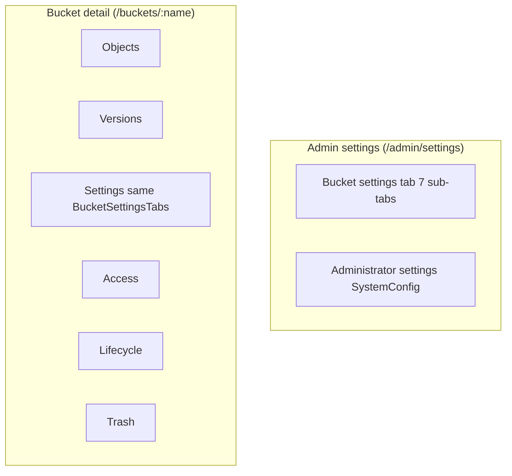

English | **[Русский](../../ru/specs/settings-ui-split-tz.md)**

# Spec: Settings UI Split — Bucket Settings vs Administrator Settings

**Version:** 1.0  
**Date:** 2026-06-18  
**Status:** Draft (to be implemented)  
**Related files:** `web/console/src/pages/settings.tsx`, `web/console/src/pages/bucket-detail.tsx`, `web/console/src/App.tsx`, `web/console/src/layouts/sidebar.tsx`, `web/console/src/lib/api.ts`

---

## 1. Goal and Problem

### Goal

Split the mixed **Administration → Settings** screen into two logically independent sections:

1. **Bucket Settings** — properties of a specific bucket (versioning, visibility, quotas, etc.).
2. **Administrator / System Settings** — global installation configuration (LDAP, OIDC, MFA policy, trash, logging, cluster).

### Current pain

Currently in one file `web/console/src/pages/settings.tsx` (~576 lines) on one scrollable page `/admin/settings` simultaneously:

- bucket selection and 7 bucket settings tabs (General, Versioning, Object Lock, Storage Class, Lifecycle, Visibility, Quotas);
- system settings cards: Soft delete / Trash, LDAP, OIDC, MFA policy, Cluster (MVP), External logging.

**Consequences:**

| Problem | Example |
|----------|--------|
| Cognitive overload | Admin searches for LDAP but sees bucket quotas and lifecycle JSON |
| UI duplication | Bucket settings in both `settings.tsx` and (reduced) **Settings** tab on `bucket-detail.tsx` |
| Inconsistent UX for same fields | Admin Settings — full tab set; bucket detail — versioning + visibility + quotas, lifecycle — separate tab, object lock / storage class missing |
| Inaccurate documentation | `docs/context/ui.md` describes `/admin/settings` only as "Bucket settings" though system config is there too |
| MFA confusion | "Require MFA for administrators" policy in Settings, personal TOTP — in **Profile** |

Task is **UI only** — REST API unchanged (see §8).

---

## 2. Terminology

| Term (RU) | EN (UI) | Description |
|-------------|---------|----------|
| **Настройки бакета** | Bucket Settings | Single bucket parameters: description, versioning, object lock, storage class, lifecycle, visibility, quotas, tags |
| **Настройки администратора** | Administrator Settings | Global `SystemConfig`: trash, LDAP, OIDC, MFA policy, cluster config, external logging |
| **Системные настройки** | System Settings | Synonym for Administrator Settings; backend: `GET/PUT /api/v1/settings/system` |
| **Контекст бакета** | Bucket context | Page `/buckets/:bucketName` — settings tied to bucket name from URL |
| **Глобальный список бакетов** | Global bucket picker | Admin page with `Select` over all buckets (`GET /api/v1/settings/buckets`) |

**Not in Administrator Settings (separate pages, do not move):**

- **Gateway** — `web/console/src/pages/gateway.tsx`, `/gateway`
- **Federation** (remote cluster registry) — `federation.tsx`, `/federation`
- **Cluster status** (node monitoring) — `cluster.tsx`, `/cluster`; `cluster.*` editing stays in System Settings
- **Webhooks** — `webhooks.tsx`, `/admin/webhooks`
- **Profile / personal MFA** — `profile.tsx`, `/profile`

---

## 3. Roles and Access

### System roles

| Role | Source | `isAdmin` in UI |
|------|----------|----------------|
| `administrator` | JWT `role` | `true` |
| `operator` | JWT `role` | `false` |
| `user` | JWT `role` | `false` |
| `tenant_admin` | `tenant_memberships[].role` + `is_tenant_admin` | `false` (but `isTenantAdmin`) |

Implementation: `web/console/src/hooks/use-auth.tsx`, types in `web/console/src/lib/api.ts` (`UserRole`, `TenantRole`).

### Who sees what (target state)

| UI section | administrator | operator | user (bucket owner) | tenant_admin |
|-----------|:-------------:|:--------:|:----------------------:|:------------:|
| Admin → **Administrator Settings** | ✓ | — | — | — |
| Admin → **Bucket Settings** (global picker) | ✓ | — | — | — |
| Bucket detail → **Settings** tab | ✓ | ✓* | ✓* | ✓* |
| Bucket detail → **Access** | ✓ / tenant_admin tenant | — | — | ✓ (own tenant) |
| Bucket detail → **Lifecycle** | ✓* | ✓* | ✓* | ✓* |

\* With `canAccessBucket` / `canWriteBucket` on backend.

### API constraints (important for UI)

| Endpoint | Middleware | Actual handler check |
|----------|------------|------------------------------|
| `GET /api/v1/settings/system` | `adminOnly` | — |
| `PUT /api/v1/settings/system` | `adminOnly` | — |
| `GET /api/v1/settings/buckets` | `adminOnly` | — |
| `PUT /api/v1/settings/buckets/{name}` | `adminOnly` | `canWriteBucket` |
| `GET /api/v1/buckets/{bucket}/settings` | `allRoles` | `canAccessBucket` |
| `PUT /api/v1/buckets/{bucket}/lifecycle` | `allRoles` | `canWriteBucket` |
| `PUT /api/v1/buckets/{bucket}/tags` | `allRoles` | `canWriteBucket` |

**Known mismatch (document in UI, do not fix API in this task):** `bucket-detail.tsx` calls `api.updateBucketSettings` → `PUT /settings/buckets/{name}` (administrator only), though Save button visible to all with bucket access. On implementation: either hide Save for non-admin, or (separate task) relax PUT middleware.

**tenant_admin** does not see Administration in sidebar (`sidebar.tsx`, lines 111–122), except **Tenants**. Bucket settings access — via bucket detail, not `/admin/settings`.

---

## 4. UI Structure

### 4.1. Interface language

Console is currently in **English** (page titles, buttons, tabs). Sidebar branding — "DataSafeS3". In spec for development:

| Element | EN (in UI) | RU (in documentation) |
|---------|-----------|---------------------|
| Top tab 1 | **Bucket settings** | Настройки бакетов |
| Top tab 2 | **Administrator settings** | Настройки администратора |
| Menu item (optional) | Settings | Настройки |

### 4.2. Navigation placement

**Sidebar** (`web/console/src/layouts/sidebar.tsx`):

- Item `{ to: "/admin/settings", label: "Settings" }` stays in **Administration** section (`isAdmin` only).
- Inside page — **two top tabs** (`Tabs` from `@/components/ui/tabs`), not two menu items (avoid bloating admin nav).

Alternative (not recommended v1): two menu items "Bucket settings" / "System settings" — rejected due to 9+ items in Administration.

### 4.3. "Bucket settings" tab (global admin)

**Where:** `/admin/settings/buckets` (or `/admin/settings` with default tab = buckets).

**Content** — move from lower part of current `settings.tsx`:

- `PageHeader`: title "Bucket settings", description "Configure bucket properties, lifecycle, and quotas."
- Refresh / Save buttons (as now).
- Bucket `Select` (`api.listBucketSettings()`).
- Nested tabs (keep names):
  - General, Versioning, Object Lock, Storage Class, Lifecycle, Visibility, Quotas.

**When not bucket detail:** when administrator needs overview of **all** buckets without entering object browser (bulk config, quota audit).

### 4.4. "Administrator settings" tab

**Where:** `/admin/settings/system`.

**Content** — move system cards from `settings.tsx` (lines 167–396):

| Section (Card) | `SystemConfig` fields |
|---------------|---------------------|
| Soft delete / Trash | `soft_delete_enabled`, `trash_retention_days` |
| LDAP / Active Directory | `ldap.*` + Test / Sync buttons |
| OIDC / SSO | `oidc.*` |
| MFA policy | `mfa.require_admin_mfa` |
| Cluster (MVP) | `cluster.distributed_mode`, `erasure_coding_planned`, `disk_paths` |
| External logging | `logging.syslog`, `loki`, `elasticsearch`, `webhook` |

`PageHeader`: title "Administrator settings", description "LDAP, SSO, logging, trash, and cluster configuration."

Separate Save buttons on Trash and External logging cards can merge into one **Save** in tab header (UX improvement, optional).

### 4.5. Bucket detail (bucket context)

**Where:** `/buckets/:bucketName` — **Settings** tab (exists, `TabsTrigger value="settings"`).

**v1 strategy:**

1. Extract shared bucket settings form component (see §10).
2. In bucket detail use **same component** in `mode="compact"` or full tab set — decision: **full tab set** as in admin, but no global picker (bucket from URL).
3. Link "Open in admin bucket settings" for administrator → `/admin/settings/buckets?bucket={name}`.
4. **Lifecycle**, **Access**, **Trash** tabs on bucket detail **remain** (lifecycle — separate API and UX with rules table; do not duplicate in Settings tabs admin page when working from bucket detail).

**Lifecycle duplication:** admin Bucket settings Lifecycle tab — JSON editor (`settings.tsx`); bucket detail — visual editor (`bucket-detail.tsx`, `TabsContent value="lifecycle"`). Acceptable in v1; backlog — unify on visual editor.

---

## 5. Settings Matrix

| Setting | Current UI location | New UI location | API endpoint | Role (minimum) |
|-----------|-------------------------|----------------------|--------------|----------------|
| Description | `settings.tsx` General; `bucket-detail` Settings | Bucket settings | `PUT .../settings/buckets/{name}` | administrator* |
| Versioning | both | Bucket settings | same | administrator* |
| Object Lock + retention | `settings.tsx` | Bucket settings | same | administrator* |
| Storage class | `settings.tsx` | Bucket settings | same | administrator* |
| Lifecycle rules (JSON) | `settings.tsx` Lifecycle tab | Bucket settings | same + `PUT .../buckets/{b}/lifecycle` | administrator* / write |
| Visibility | both | Bucket settings | same | administrator* |
| Quotas (size/objects) | both | Bucket settings | same | administrator* |
| Bucket tags | `bucket-detail` Settings | Bucket settings (add to shared component) | `PUT /api/v1/buckets/{bucket}/tags` | write |
| Tenant access grants | `bucket-detail` Access | unchanged | `PUT .../tenants/{t}/buckets/{b}/access` | tenant_admin |
| Soft delete / trash retention | `settings.tsx` (top of page) | Administrator settings | `GET/PUT /api/v1/settings/system` | administrator |
| LDAP | `settings.tsx` | Administrator settings | system + `POST .../settings/ldap/test|sync` | administrator |
| OIDC / SSO | `settings.tsx` | Administrator settings | system | administrator |
| MFA require for admins | `settings.tsx` | Administrator settings | system | administrator |
| Cluster config (edit) | `settings.tsx` | Administrator settings | system | administrator |
| Cluster status (read) | `cluster.tsx` | unchanged | `GET /api/v1/cluster/status` | administrator |
| External logging | `settings.tsx` | Administrator settings | system | administrator |
| Federation clusters | `federation.tsx` | unchanged | `/api/v1/federation/clusters` | administrator |
| Gateway / replication | `gateway.tsx` | unchanged | `/api/v1/gateway/*` | administrator |
| Webhooks | `webhooks.tsx` | unchanged | `/api/v1/webhooks` | administrator |
| Personal MFA (TOTP) | `profile.tsx` | unchanged | `/api/v1/mfa/*` | any authed |
| IAM bucket policy | `policy.tsx` | unchanged | `GET/PUT .../buckets/{b}/policy` | administrator |

\* See §3 — `adminOnly` middleware on PUT; read-only display for non-admin via `GET /buckets/{b}/settings`.

---

## 6. Routes

### 6.1. Target scheme

```
/admin/settings                    → redirect → /admin/settings/buckets
/admin/settings/buckets            → Bucket settings (admin, global picker)
/admin/settings/system             → Administrator settings (admin)
/admin/settings/buckets/:name      → optional v1.1: deep link with pre-selected bucket

/buckets/:bucketName               → bucket detail (tab query, see below)
/buckets/:bucketName?tab=settings  → open Settings tab
/buckets/:bucketName?tab=lifecycle   → unchanged

/legacy:
  /settings                        → redirect /admin/settings (if admin) else /
```

### 6.2. Changes in `App.tsx`

Current route:

```tsx
<Route path="admin/settings" element={<AdminRoute><SettingsPage /></AdminRoute>} />
```

Target — nested routes or single `SettingsLayoutPage`:

```tsx
<Route path="admin/settings" element={<AdminRoute><SettingsLayoutPage /></AdminRoute>}>
  <Route index element={<Navigate to="buckets" replace />} />
  <Route path="buckets" element={<BucketSettingsPage />} />
  <Route path="system" element={<AdministratorSettingsPage />} />
</Route>
```

Redirect from old URL: `admin/settings` → `admin/settings/buckets` (preserve bookmarks).

### 6.3. Tab ↔ URL sync

- Admin settings: path-based (`/buckets` vs `/system`).
- Bucket detail: add `useSearchParams` — `?tab=settings` on load sets `Tabs` value (currently internal state only).

---

## 7. Role Behavior

| Scenario | Behavior |
|----------|-----------|
| `user` opens `/admin/settings` | `AdminRoute` → redirect `/` (`App.tsx`) |
| `tenant_admin` opens `/admin/settings` | redirect `/` |
| `administrator` opens `/admin/settings/system` | full access, load `api.getSystemConfig()` |
| `administrator` on `/admin/settings/buckets` | `api.listBucketSettings()`, save via `api.updateBucketSettings` |
| Non-admin on bucket detail Settings | show form (data from `api.getBucketSettings`); **Save** — `disabled` + tooltip "Administrator only" until API fix |
| `tenant_admin` on bucket detail Access | unchanged (`showAccessTab`) |
| Non-admin deep link `/admin/settings/system` | redirect `/` |

---

## 8. UI Migration (no breaking API)

### Remove / move

| Action | File |
|----------|------|
| Split monolith | `settings.tsx` → layout + 2 page/component |
| Extract bucket tabs | new `components/settings/bucket-settings-tabs.tsx` |
| Extract system cards | new `components/settings/administrator-settings.tsx` |
| Wire in bucket detail | `bucket-detail.tsx` — import `BucketSettingsTabs` |
| Update routes | `App.tsx` |
| Update Cluster link | `cluster.tsx` line 18: "Admin → Settings" → "Admin → Settings → Administrator settings" |
| Update docs | `docs/context/ui.md` — route table |

### Do not change

- All `/api/v1/settings/*`, `/api/v1/buckets/{bucket}/settings`, LDAP test/sync paths.
- Sidebar label "Settings" (internal tabs sufficient).
- Separate Gateway, Federation, Cluster, Webhooks, Profile pages.

### Backward compatibility

- Redirect `/admin/settings` → `/admin/settings/buckets`.
- Query `?bucket=name` on `/admin/settings/buckets` replaces manual Select choice.

---

## 9. Acceptance Criteria

### Navigation and routes

- [ ] `/admin/settings` redirects to `/admin/settings/buckets`.
- [ ] On `/admin/settings/buckets` and `/admin/settings/system` two top tabs visible with switching without losing auth.
- [ ] Non-admin cannot open admin settings (redirect `/`).

### Bucket settings

- [ ] Global page: bucket selection, all 7 sub-tabs work as before refactor.
- [ ] Save calls `api.updateBucketSettings`, toast "Settings saved", invalidate `["bucket-settings"]`.
- [ ] Bucket detail Settings tab uses shared component; versioning, visibility, quotas, description fields sync with admin.
- [ ] `?tab=settings` on `/buckets/:name` opens correct tab.

### Administrator settings

- [ ] LDAP Test / Sync, OIDC fields, MFA policy, trash, cluster, logging — only on `/admin/settings/system`.
- [ ] On `/admin/settings/buckets` **no** LDAP/OIDC/Trash/logging cards.
- [ ] Save system config: `api.updateSystemConfig`, trash retention validation 1–3650 days.

### Regressions

- [ ] `scripts/feature-audit-test.ps1` — System settings, bucket settings PUT sections — PASS.
- [ ] Cluster page still shows status; link to correct settings subsection.
- [ ] Profile MFA untouched.

---

## 10. Implementation Plan (for agent)

Step order:

1. **Create components** (without route change):
   - `web/console/src/components/settings/bucket-settings-tabs.tsx` — props: `bucketName`, `draft`, `onDraftChange`, `onSave`, `isSaving`, `readOnly?`.
   - `web/console/src/components/settings/administrator-settings.tsx` — props: `draft: SystemConfig`, `onDraftChange`, `onSave`, trash unit state.
   - `web/console/src/components/settings/settings-layout.tsx` — top Tabs + `<Outlet />` or children.

2. **Create pages:**
   - `web/console/src/pages/settings-buckets.tsx` — picker logic + `listBucketSettings` query from current `settings.tsx`.
   - `web/console/src/pages/settings-system.tsx` — `getSystemConfig` / `updateSystemConfig` logic.

3. **Update `App.tsx`** — nested routes §6.2, index redirect.

4. **Remove/trim `settings.tsx`** — replace with layout re-export or delete after move.

5. **Refactor `bucket-detail.tsx`:**
   - Replace inline Settings card (lines 783–841) with `<BucketSettingsTabs ... />`.
   - Add `useSearchParams` for `tab`.
   - `readOnly={!isAdmin}` on Save (temporary).

6. **Secondary fixes:**
   - `cluster.tsx` — link text.
   - `docs/context/ui.md` — routes.
   - `web/console/src/components/global-search.tsx` — check settings links if any.

7. **Build:** `cd web/console && npm run build`.

8. **Audit:** `scripts/feature-audit-test.ps1` (or preflight).

### File estimate

| File | Action |
|------|----------|
| `settings.tsx` | split / delete |
| `settings-buckets.tsx` | create |
| `settings-system.tsx` | create |
| `components/settings/*` | create (3 files) |
| `bucket-detail.tsx` | modify |
| `App.tsx` | modify |
| `sidebar.tsx` | no change (v1) |
| `api.ts` | no change |

---

## 11. Risks and Edge Cases

| Risk | Mitigation |
|------|-----------|
| **Deep links** `/admin/settings` in README, Grafana, bookmarks | Permanent redirect to `/admin/settings/buckets` |
| **Unsaved changes** on top tab switch | `window.confirm` or toast "Unsaved changes" if draft !== server |
| **Two lifecycle sources** (JSON vs table) | Document; do not edit lifecycle in two places simultaneously |
| **MFA policy vs Profile** | In Administrator settings hint: "Personal MFA → Profile" |
| **Mobile / narrow screen** | System settings cards already in `grid lg:grid-cols-2`; check horizontal scroll on bucket sub-tabs |
| **Empty bucket list** | As now: only Administrator settings available (trash card); bucket tab — empty state "Create a bucket…" |
| **PUT bucket settings admin only** | UI read-only + tooltip; TZ backlog — API `allRoles` + `canWriteBucket` |
| **Federation/Cluster in sidebar without AdminRoute** | Federation/Cluster API — `adminOnly`; pages error for non-admin — out of scope, but do not confuse with Settings |

---

## 12. Testing

### Manual

| # | Step | Expected |
|---|-----|----------|
| 1 | Login as administrator → Administration → Settings | Two tabs; default Bucket settings |
| 2 | Switch to Administrator settings | LDAP, OIDC, logging; no bucket Select |
| 3 | Change trash retention → Save → refresh | Value persists |
| 4 | Bucket settings → select bucket → Versioning on → Save | `feature-audit` compatible |
| 5 | `/buckets/{name}?tab=settings` | Settings tab active |
| 6 | Login as user → `/admin/settings` | Redirect `/` |
| 7 | user → own bucket → Settings | Form visible; Save disabled (v1) |
| 8 | Profile → MFA enroll | Works independently of Administrator settings |

### Automated / audit script

File: `scripts/feature-audit-test.ps1`

Affected checks (lines ~106–116, 327–416, 578):

- `GET /api/v1/buckets/{bucket}/settings` — visibility
- `GET/PUT /api/v1/settings/system` — soft delete, logging sinks
- `PUT /api/v1/settings/buckets/{bucket}` — versioning, quotas
- `POST /api/v1/settings/ldap/test`

**Script changes not required** (same API). Optional: add comment in `HANDOFF.md` / `feature-audit-report.md` that UI is split, endpoints unchanged.

### Frontend build

```cmd
cd web\console
npm run build
```

---

## Appendix A. Current Code Inventory

### `settings.tsx` (monolith `/admin/settings`)

| Lines (approx.) | Block |
|-----------------|------|
| 31–69 | `getSystemConfig`, save system (trash) |
| 71–107 | `listBucketSettings`, save bucket |
| 167–205 | Card: Soft delete / Trash |
| 207–396 | Cards: LDAP, OIDC, MFA, Cluster, External logging |
| 398–571 | Tabs: bucket General … Quotas |

### `bucket-detail.tsx`

| Tab | Lines (approx.) | API |
|---------|-----------------|-----|
| Settings | 783–841 | `getBucketSettings`, `updateBucketSettings`, `putBucketTags` |
| Access | 843–927 | tenant bucket access |
| Lifecycle | 929+ | `getLifecycle`, `putLifecycle` |
| Trash | ~980 | `listTrash` |

### Sidebar (`adminNav`)

`Users`, `Tenants`, `Gateway`, `Federation`, `Cluster`, `Policies`, `Activity`, `Webhooks`, **`Settings`** → `/admin/settings`.

---

## Appendix B. Recommended Split (summary)



**Administrator settings** = trash + LDAP + OIDC + MFA policy + cluster edit + logging.  
**Bucket settings** = all per-bucket, including visibility and quotas.  
**Everything else** (Gateway, Federation status, Webhooks, Profile MFA) — separate menu items, no move.
