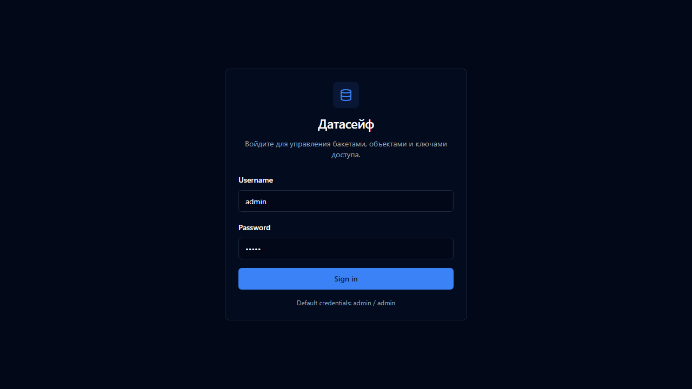

English | **[Русский](../../ru/user-guide/01-vvedenie-i-vhod.md)**

# 1. Introduction and Sign-In

[← Table of contents](README.md) | Next: [Dashboard and buckets →](02-dashboard-and-buckets.md)

---

## What is DataSafeS3?

**DataSafeS3** is your own cloud file storage. You can:

- create **buckets** (top-level folders) and upload files into them;
- share links to files;
- configure backup to external S3-compatible storage;
- manage users and access permissions.

Everything runs on your server — data does not leave to a third-party cloud unless you configure it.

---

## How to Open the Console

1. Make sure DataSafeS3 is running (see the [quick start in README](../../../README.md)).
2. Open your browser.
3. Go to: **http://localhost:8080/**

---

## Sign In

### Default Credentials (Local Installation)

| Field | Value |
|-------|-------|
| Login | `admin` |
| Password | `admin` |

> On a production server, the administrator should change the password after the first sign-in.

### Steps

1. Enter your **login** and **password**.
2. Click **Sign in**.
3. If multi-factor authentication (MFA) is enabled, a second screen appears — enter the 6 digits from the Google Authenticator app (see [chapter 4](04-security-and-profile.md)).
4. If sign-in through a corporate account (SSO/OIDC) is configured, click the provider sign-in button.

---

## User Roles

Each user has one of three roles:

| Role | Who | What They Can See and Do |
|------|-----|--------------------------|
| **user** | Regular employee | Their own buckets and their team's buckets; upload, download, access keys |
| **operator** | Technical specialist | All buckets (view and operations), but **without** the Administration section |
| **administrator** | Primary administrator | Everything: users, settings, Gateway, policies, activity log |

### Simple Rule

- **User** — works only with their own data.
- **Operator** — helps everyone with files but does not change system settings.
- **Administrator** — manages the entire system.

---

## Sidebar Menu

After sign-in, the menu appears on the left:

**Console** (available to everyone):

- Dashboard — summary
- Buckets — buckets and files
- Access — keys and tokens
- Usage — storage usage
- Profile — profile and MFA

**Administration** (administrator only):

- Users, Tenants, Gateway, Federation, Cluster, Policies, Activity, Webhooks, Settings

---

## Sign Out

At the bottom of the sidebar, click **Sign out**.

---

## What's Next?

- [Dashboard and working with buckets →](02-dashboard-and-buckets.md)
- [MFA setup →](04-security-and-profile.md)
