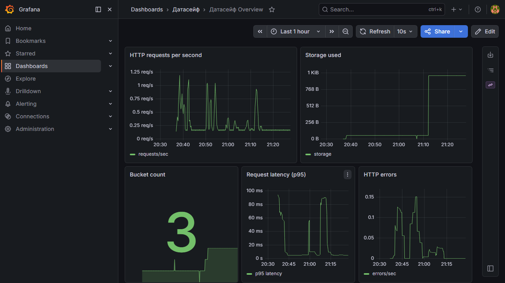

English | **[Русский](../../ru/user-guide/07-monitoring-i-bazy.md)**

# 7. Monitoring, PostgreSQL, and DBeaver

[← Gateway](06-gateway-and-minio.md) | [Table of contents](README.md) | Next: [Federation →](08-federation-and-cluster.md)

---

## Grafana — Simple Monitoring

**Grafana** is a site with **charts** of DataSafeS3 operation: request volume, storage used, errors.

| Parameter | Value (local) |
|-----------|---------------|
| URL | http://localhost:3000 |
| Login | `admin` |
| Password | `admin` |

### Ready-Made Dashboards

After sign-in, open:

| Dashboard | URL |
|-----------|-----|
| **DataSafeS3 System Overview** | http://localhost:3000/d/datasafe-overview/datasafe-overview |
| **DataSafeS3 Buckets** (per-bucket selector) | http://localhost:3000/d/datasafe-buckets/datasafe-buckets |



On the overview dashboard you will see:

- HTTP request count and errors;
- server response time;
- storage volume, bucket and object counts;
- S3 read/write operations;
- host CPU, disk, memory, and network metrics.

The **Buckets** dashboard adds a multi-select **Bucket** variable to drill into object count, storage size, and S3 ops per bucket.

> Grafana is for the **administrator** to monitor system health. A regular user only needs the **Usage** section in the console.

### Prometheus

Metrics are collected through **Prometheus** (http://localhost:9090). Grafana reads data from there. You usually do not need to open Prometheus manually.

---

## Bolt vs PostgreSQL — Which to Choose?

DataSafeS3 stores **metadata** (bucket list, users, settings) separately from the files themselves. There are two options:

| | **Bolt** (default) | **PostgreSQL** |
|---|-------------------|----------------|
| **In plain terms** | Single database file on disk | Full SQL database |
| **When it fits** | Single server, simple install | Production, large data, search, analytics |
| **Setup** | Nothing extra | `postgres` profile in Docker |
| **File / server** | `metadata.db` in the data folder | PostgreSQL container |

### Bolt — Quick Start

In `.env` (or by default):

```env
STORAGE_METADATA_BACKEND=bolt
```

Start:

```cmd
docker compose up -d --build
```

### PostgreSQL — Production

1. In `.env`:

```env
STORAGE_METADATA_BACKEND=postgres
STORAGE_POSTGRES_HOST=postgres
STORAGE_POSTGRES_USER=datasafe
STORAGE_POSTGRES_PASSWORD=datasafe
STORAGE_POSTGRES_DB=datasafe
STORAGE_POSTGRES_PUBLISH_PORT=5433
```

2. Start:

```cmd
docker compose --profile postgres up -d --build
```

> Migrating from Bolt to PostgreSQL: run `storage-server migrate-boltdb` (see [README](../../../README.md) or [local-dev.md](../context/local-dev.md)).

---

## DBeaver — Connecting to PostgreSQL

**DBeaver** is an application for viewing database tables (for administrators and developers).

### Important: Port 5433 on Windows

If PostgreSQL is already installed on the computer, it often uses port **5432**.  
The DataSafeS3 Docker container is then published on **5433**.

In `.env`, set:

```env
STORAGE_POSTGRES_PUBLISH_PORT=5433
```

Recreate the container:

```cmd
docker compose --profile postgres up -d postgres
```

### DBeaver Connection Parameters

| Field | Value |
|-------|-------|
| Type | PostgreSQL |
| Host | `localhost` |
| Port | **5433** (or 5432 if 5433 is not set) |
| Database | `datasafe` |
| Username | `datasafe` |
| Password | `datasafe` |
| SSL | disabled (`sslmode=disable`) |

**JDBC URL:**

```
jdbc:postgresql://localhost:5433/datasafe?sslmode=disable
```

### Command-Line Check

```cmd
docker run --rm -e PGPASSWORD=datasafe postgres:16-alpine psql -h host.docker.internal -p 5433 -U datasafe -d datasafe -c "SELECT 1;"
```

Should return `1`.

---

## What's Next?

- [Federation and Cluster →](08-federation-and-cluster.md)
- [Technical documentation →](../context/)
