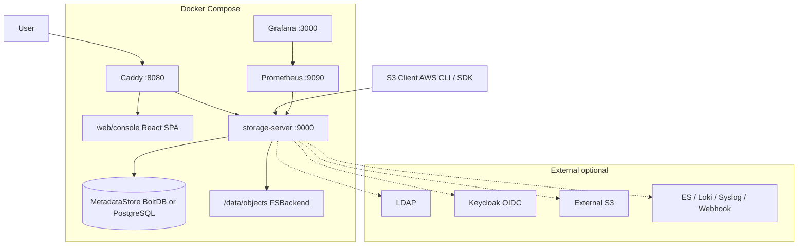
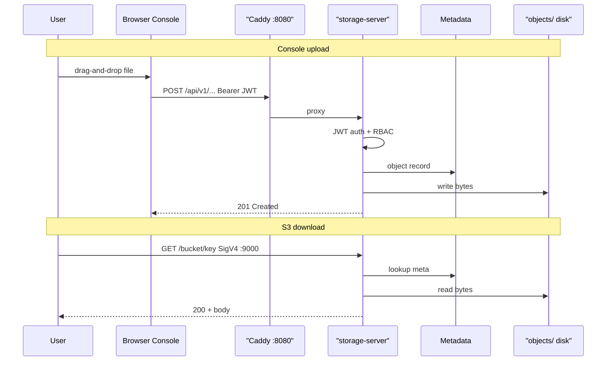
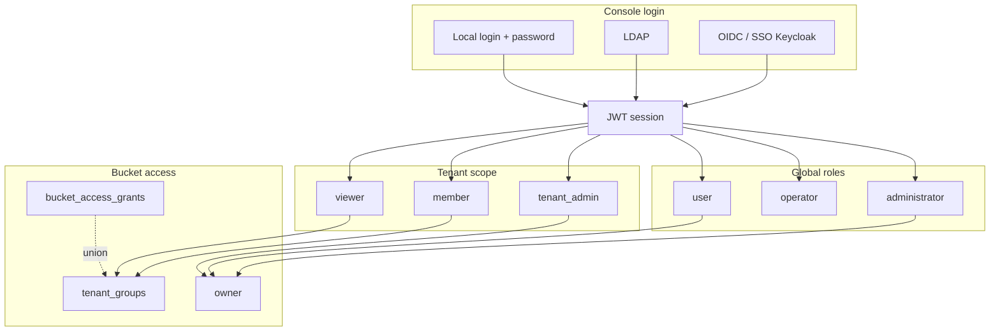
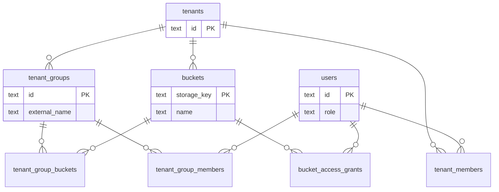
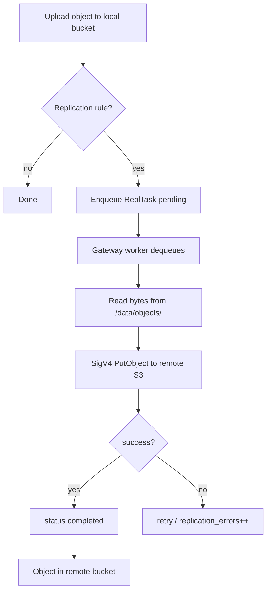
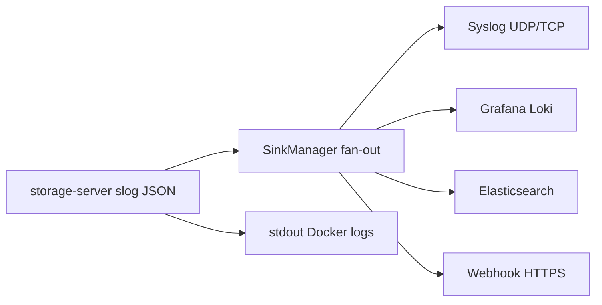
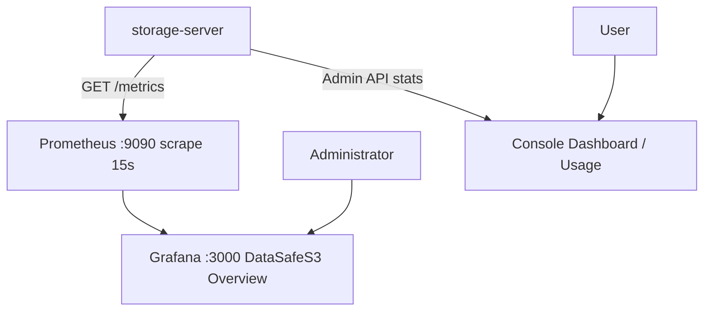
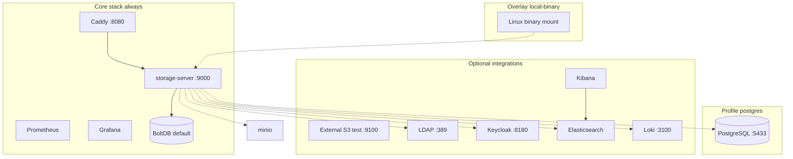

English | **[Русский](../../ru/user-guide/README.md)**

# DataSafeS3 (Датасейф S3) User Guide

**Author:** Ilya Trachuk  
**Last updated:** 2026-06-18

Single entry point for DataSafeS3 users and administrators. This document is self-contained: from installation through LDAP/SSO, monitoring, and troubleshooting.

For installation, architecture, and development, see the [repository README](../../../README.md) and [technical documentation](../context/).

---

## Table of contents

- [Product overview](#product-overview)
- [Architecture](#architecture)
- [Quick start](#quick-start)
  - [1. Minimal start](#1-minimal-start-boltdb-no-integrations)
  - [2. PostgreSQL metadata](#2-production-like-postgresql-metadata)
  - [Kubernetes / Helm](#kubernetes--helm)
  - [3. Local dev (Windows)](#3-local-dev-on-windows-local-binary-overlay)
  - [4. Optional integrations](#4-optional-integrations)
  - [5. Combined scenarios](#5-combined-scenarios)
  - [6. URLs and credentials](#6-default-urls-and-credentials-table)
  - [7. Post-install verification](#7-post-install-verification)
  - [8. What's next](#8-whats-next)
- [1. Introduction and sign-in](#1-introduction-and-sign-in)
- [First-time setup](#first-time-setup)
- [2. Dashboard and buckets](#2-dashboard-and-buckets)
- [3. Access keys, API tokens, and quotas](#3-access-keys-api-tokens-and-quotas)
- [4. Security and profile](#4-security-and-profile)
- [5. Administration](#5-administration)
- [6. Gateway replication](#6-gateway-replication)
- [7. LDAP and SSO (Keycloak)](#7-ldap-and-sso-keycloak)
- [8. Monitoring (Grafana)](#8-monitoring-grafana)
- [9. External logging and Kibana](#9-external-logging-and-kibana)
- [10. PostgreSQL and DBeaver](#10-postgresql-and-dbeaver)
- [11. Federation and Cluster](#11-federation-and-cluster)
- [12. Troubleshooting](#12-troubleshooting)
- [REST API & OpenAPI](#rest-api--openapi)
- [Additional resources](#additional-resources)
- [Roadmap](#roadmap)

---

## Product overview

**DataSafeS3 (Датасейф S3)** is a self-hosted, S3-compatible object storage system with a web console. Data stays on your server; you can optionally configure backup to external S3 (external S3-compatible storage).

### Audience

| Audience | What you get |
|----------|--------------|
| **Regular user (`user`)** | Your own buckets, upload/download, share links, S3 keys |
| **Operator (`operator`)** | Access to all buckets for support, without the Administration section |
| **Tenant administrator (`tenant_admin`)** | Members and roles in your tenant, **creating local users** in the tenant, bucket grants, bucket creation within tenant scope |
| **Administrator (`administrator`)** | Users, settings, Gateway, LDAP/OIDC, all tenants, full system access |

### Key capabilities

- buckets and object browser (folders, drag-and-drop, bulk operations);
- versioning, trash (soft delete), lifecycle, Object Lock / legal hold;
- presigned URLs and share links with download limits;
- per-user and per-bucket quotas;
- MFA (TOTP), LDAP, OIDC/SSO;
- Gateway — asynchronous replication to external S3;
- multi-tenant with `tenant_admin` / `member` / `viewer` roles, bucket name isolation per tenant;
- Prometheus + Grafana, external log sinks (Syslog, Loki, Elasticsearch, Webhook).

---

## Architecture

This section describes how DataSafeS3 components relate, how user requests flow, and where data is stored. Technical details for developers: [docs/context/architecture.md](../context/architecture.md).

> **Diagrams.** All diagrams below use **Mermaid** and render natively on GitHub — no build step required. Catalog: [docs/diagrams/README.md](../../diagrams/README.md).

### System components

| Component | Purpose |
|-----------|---------|
| **Caddy** | Reverse proxy on port **8080**: static web console, proxies `/api/*`, `/healthz`, `/metrics` to `storage-server` |
| **storage-server** | Single Go process: S3 API (SigV4), Admin REST API (`/api/v1/*`), Gateway worker, Prometheus metrics |
| **web/console** | React SPA (built to `web/console/dist`, served by Caddy) |
| **MetadataStore** | Metadata: users, buckets, tenants, grants, policies, shares, Gateway queue — **BoltDB** (`metadata.db`) or **PostgreSQL** (`postgres` profile) |
| **FSBackend** | Object bytes on disk in `STORAGE_DATA_DIR/objects/` (in Docker — volume `/data`) |
| **Prometheus** | Scrapes `storage-server:9000/metrics` every 15 s |
| **Grafana** | **DataSafeS3 Overview** dashboard, Prometheus datasource |
| **LDAP / Keycloak** | External IdPs (test containers outside the main compose stack) |
| **External S3** | Gateway replication target |
| **Elasticsearch + Kibana** | Optional structured log sink |

The S3 API is available **directly** on port **9000** (bypassing Caddy). The console is only through **8080**, so the UI and Admin API share one origin without CORS.

The diagram below shows the main Docker Compose stack and external integrations.



### Data flow: upload and download

**Via the console:** the browser sends a JWT in `Authorization: Bearer` to `/api/v1/...`. Caddy proxies requests to `storage-server`. The server checks role, tenant scope, and grants, updates metadata, and reads/writes files in `/data/objects/`.

**Via the S3 API:** the client signs the request with AWS Signature Version 4 (access key + secret). The same `storage-server` process handles `PutObject`, `GetObject`, multipart, and so on. The logical bucket name resolves to an internal `storage_key` (`t:{tenant_id}:{name}` or `o:{owner_id}:{name}`).



### Authentication and RBAC

Three independent **sign-in planes** for the console:

| Source | Mechanism | Where configured |
|--------|-----------|------------------|
| **Local** | Login + password → JWT; optional MFA (TOTP) | Users, Profile |
| **LDAP** | Bind to directory, sync groups → tenant groups | Administrator settings → LDAP |
| **OIDC / SSO** | Redirect to IdP (Keycloak), callback, JWT | Administrator settings → OIDC |

The S3 API always uses **access keys** (SigV4), not JWT. Bootstrap key from `.env`; user keys — in the Access section.

**Global roles** (`administrator`, `operator`, `user`) define access across the installation. **Tenant roles** (`tenant_admin`, `member`, `viewer`) apply inside a tenant. Access to a specific bucket is further limited by **tenant groups** and **grants** (Access tab).



### Tenant model (multi-tenant)

A **tenant** is a logical organization on one installation. A user can belong to multiple tenants with different roles.

- Bucket names are **unique within scope** (tenant or owner's personal space), but two tenants can have a bucket with the same logical name `reports`.
- Internal storage key: `storage_key` = `t:{tenant_id}:{name}` or `o:{owner_id}:{name}`.
- **Tenant groups** — named sets of buckets with `read` / `read_write` level. When at least one group exists, regular `member`/`viewer` users see only buckets in their groups (+ grants + own buckets).

Specifications: [tenant-bucket-isolation-tz.md](../specs/tenant-bucket-isolation-tz.md), [tenant-groups-tz.md](../specs/tenant-groups-tz.md).



### Gateway: replication to external S3

Gateway runs **asynchronously** inside `storage-server`. On upload/delete of an object in a local bucket with a replication rule, a task is enqueued (`replication_tasks`). A background worker reads the object from local disk and sends `PutObject` / `DeleteObject` to external S3 (external S3-compatible storage) via a configured **Connection**.

The administrator manages Connections, Replication Rules, and monitors **Sync Jobs / Health** in the console.



### External logging

All HTTP requests and system events are written as **structured JSON** (container stdout). When enabled in **Administrator settings → External logging**, records are **duplicated in parallel** to all active sinks via the `LogSink` interface — sinks are not mutually exclusive.

| Sink | Protocol | Notes |
|------|----------|-------|
| **Syslog** | UDP/TCP RFC5424 | `udp://host:514` |
| **Loki** | HTTP push | timestamp in nanoseconds |
| **Elasticsearch** | HTTP bulk index | Basic auth or ApiKey in the `token` field |
| **Webhook** | HTTPS POST | JSON body per record |



### Monitoring

Prometheus collects metrics from `http://storage-server:9000/metrics` (config `deploy/docker/prometheus.yml`). Grafana connects to Prometheus and shows the preconfigured **DataSafeS3 Overview** dashboard: RPS, latency, storage volume, bucket/object counts, Gateway replication queue, host load (Linux).

Console sections **Dashboard** and **Usage** show aggregates by user role (system-wide for admin, per tenant for `tenant_admin`, personal for `user`).



### Port summary

| Port | Service | Purpose |
|------|---------|---------|
| **8080** | Caddy | Web console + Admin API (proxy) |
| **9000** | storage-server | S3 API + Admin API (direct access) |
| **9090** | Prometheus | Metrics UI and API |
| **3000** | Grafana | Dashboards |
| **5432 / 5433** | PostgreSQL | Metadata (`postgres` profile) |
| **389 / 8180 / 9100 / 19200 / 5601** | LDAP / Keycloak / S3 test / ES / Kibana | Test stacks (outside compose) |

---

## Quick start

This section describes **deployment options** for DataSafeS3: from a single command to a full dev stack with PostgreSQL, LDAP, SSO, Gateway, and external logging. Test integrations live **outside** `docker-compose.yml` — enable them as needed.

Detailed installation and environment variables: [repository README — Installation](../../../README.md#установка).

Diagram of compose variants and optional containers:



---

### 1. Minimal start (BoltDB, no integrations)

The fastest path — one Docker Compose stack, metadata in **BoltDB** (`metadata.db` in the `storage-data` volume).

**Command:**

```cmd
copy .env.example .env
docker compose up -d --build
```

**What starts:**

| Service | Port | Purpose |
|---------|------|---------|
| Caddy | **8080** | Web console + Admin API proxy |
| storage-server | **9000** | S3 API + Admin API |
| Prometheus | **9090** | Metrics |
| Grafana | **3000** | **DataSafeS3 Overview** dashboard |

**Right after startup:**

| Item | Value |
|------|-------|
| Console | http://localhost:8080/ |
| Sign-in | `admin` / `admin` |
| S3 endpoint | http://localhost:9000/ |
| Bootstrap S3 key | `datasafe` / `datasafesecret` |

**What you get:** full-featured storage (buckets, objects, versioning, share links, quotas, MFA, monitoring). LDAP, OIDC, Gateway, and external log sinks are **not** included — configure them separately (see [§4](#4-optional-integrations)).

**When to choose BoltDB:** local development, demos, single server without SQL metadata analytics requirements.

---

### 2. Production-like: PostgreSQL metadata

For production-like deployments, or when you need SQL access to metadata (DBeaver, backups, migrations).

**Step 1 — `.env`:**

```env
STORAGE_METADATA_BACKEND=postgres
STORAGE_POSTGRES_PUBLISH_PORT=5433
```

> Port **5433** on the host is recommended on Windows if local PostgreSQL already listens on **5432**.

**Step 2 — start with the `postgres` profile:**

```cmd
docker compose --profile postgres up -d --build
```

The profile adds a **postgres:16-alpine** container; `storage-server` waits for `pg_isready` and connects to service `postgres:5432` inside the compose network.

**DBeaver / psql from the host:**

| Field | Value |
|-------|-------|
| Host | `localhost` |
| Port | **5433** (or `STORAGE_POSTGRES_PUBLISH_PORT`) |
| Database | `datasafe` |
| Username / Password | `datasafe` / `datasafe` |
| JDBC | `jdbc:postgresql://localhost:5433/datasafe?sslmode=disable` |

**Connection check:**

```cmd
docker run --rm -e PGPASSWORD=datasafe postgres:16-alpine psql -h host.docker.internal -p 5433 -U datasafe -d datasafe -c "SELECT 1;"
```

| | **BoltDB** | **PostgreSQL** |
|---|------------|----------------|
| When | Simple install, single node | Production, SQL access, migrations |
| Setup | default | `STORAGE_METADATA_BACKEND=postgres` + `--profile postgres` |
| Storage | `metadata.db` in volume | `postgres-data` container |
| Bolt → PG migration | — | `storage-server migrate-boltdb` — see [README](../../../README.md), [§10](#10-postgresql-and-dbeaver) |

---

### Kubernetes / Helm

For Kubernetes clusters, use the official Helm chart in [`deploy/helm/datasafe/`](../../../deploy/helm/datasafe/). It mirrors the Docker Compose stack: `storage-server`, Caddy (console on port 80 → Ingress **8080** equivalent), optional PostgreSQL StatefulSet, Prometheus/Grafana, and separate Ingress hosts for the console and S3 API.

**Install (BoltDB, default):**

```bash
helm install datasafe deploy/helm/datasafe --namespace datasafe --create-namespace
```

**PostgreSQL metadata:**

```bash
helm install datasafe deploy/helm/datasafe \
  --set postgres.enabled=true \
  --set storageServer.metadataBackend=postgres \
  --namespace datasafe --create-namespace
```

Add `datasafe.local` and `s3.datasafe.local` to DNS or `/etc/hosts`, or use `kubectl port-forward` (see chart `NOTES.txt`).

Full values reference, image build steps, LDAP/OIDC/logging knobs: **[Helm chart README](../../../deploy/helm/datasafe/README.md)**.

Русская версия: [Kubernetes / Helm](../../ru/user-guide/README.md#kubernetes--helm).

---

### 3. Local dev on Windows (local-binary overlay)

On Windows, `docker compose build` may fail when pulling base images if WinHTTP points to an unavailable proxy `127.0.0.1:10801`. The **`scripts\dev-docker-local-binary.cmd`** script works around this:

1. Builds a **Linux binary** locally (`GOOS=linux`, `CGO_ENABLED=0`).
2. Builds console static assets (`scripts\build-console.cmd`).
3. Mounts the binary via overlay [`docker-compose.local-binary.yml`](../../../docker-compose.local-binary.yml) — without a full image rebuild from sources.
4. Starts the stack with the **postgres** profile (as in the project dev environment).

**Run:**

```cmd
scripts\dev-docker-local-binary.cmd
```

The script waits for `POST /api/v1/admin/login` readiness and prints the console URL.

**Rebuild after Go code changes:**

```cmd
set CGO_ENABLED=0
set GOOS=linux
set GOARCH=amd64
go build -trimpath -ldflags="-s -w" -o deploy\docker\storage-server-linux .\cmd\storage-server
docker compose --profile postgres -f docker-compose.yml -f docker-compose.local-binary.yml up -d storage-server --no-deps
```

**Rebuild console only:**

```cmd
scripts\build-console.cmd
docker compose up -d caddy --no-deps
```

**Alternatives for Docker pull issues:** `scripts\ensure-docker-pull-proxy.cmd` (local direct-proxy on `127.0.0.1:10801`) or `netsh winhttp reset proxy`. Details: [local development](../context/local-dev.md).

---

### 4. Optional integrations

The containers below are **not** in the main `docker-compose.yml`. Start them after the core stack is running (`docker compose ps`).

| Integration | Script | Ports | Scenario |
|-------------|--------|-------|----------|
| **External S3 test** | `scripts\setup-minio-gateway.cmd` *(after test endpoint)* | 9100, 9101 | Async replication to external S3 |
| **LDAP** | `scripts\start-ldap-test.cmd` | 389, 636 | Directory sign-in + group sync |
| **Keycloak OIDC** | `scripts\start-keycloak-test.cmd` | 8180 | SSO + groups in JWT |
| **Elasticsearch** | `scripts\start-elasticsearch-test.cmd` | 19200 | Structured log sink |
| **Kibana** | `scripts\start-kibana-test.cmd` | 5601 | Discover on index `datasafe-logs*` |
| **Loki** | *no dedicated script* | 3100 (typical) | HTTP log push; your own container on network `datasafe_default` |

Stop LDAP/Keycloak: `scripts\stop-ldap-keycloak-test.cmd` (full reset: `--remove`).

Full LDAP/Keycloak guide: [ldap-keycloak-standalone.md](../integrations/ldap-keycloak-standalone.md).

#### External S3 test endpoint

**Purpose:** target S3 for [Gateway replication](#6-gateway-replication).

**Step 1 — S3 test container** (if not already running):

```cmd
docker run -d --name datasafe-minio-test -p 9100:9000 -p 9101:9001 -e MINIO_ROOT_USER=minioadmin -e MINIO_ROOT_PASSWORD=minioadmin minio/minio server /data --console-address ":9001"
```

**Step 2 — auto-configure Connection + replication rule:**

```cmd
scripts\setup-minio-gateway.cmd
```

Optional: `set GATEWAY_SOURCE_BUCKET=my-data` before the script — source bucket in DataSafeS3.

**Verification:** upload a file to the local bucket → **Administration → Gateway → Sync Jobs**; the object appears in remote S3 web UI http://localhost:9101 (`minioadmin` / `minioadmin`).

#### LDAP

```cmd
scripts\start-ldap-test.cmd
```

| Parameter | Value (test) |
|-----------|--------------|
| URL in Settings (from Docker) | `ldap://host.docker.internal:389` |
| Bind DN | `cn=admin,dc=datasafe,dc=local` |
| Bind password | `ldapadmin` |
| Base DN | `ou=users,dc=datasafe,dc=local` |
| Group DN | `ou=groups,dc=datasafe,dc=local` |
| Test user | `ldapuser` / `password` |

**Verification:**

```cmd
curl -s -X POST http://localhost:8080/api/v1/settings/ldap/test -H "Authorization: Bearer <JWT>" -H "Content-Type: application/json" -d "{\"url\":\"ldap://host.docker.internal:389\",\"bind_dn\":\"cn=admin,dc=datasafe,dc=local\",\"bind_password\":\"ldapadmin\",\"base_dn\":\"ou=users,dc=datasafe,dc=local\"}"
```

(Get a JWT first via `POST /api/v1/admin/login`.) Or use the **Test** button in **Administrator settings → LDAP**.

#### Keycloak (OIDC / SSO)

```cmd
scripts\start-keycloak-test.cmd
```

First Keycloak startup takes **30–60 s**. Realm `datasafe` is imported automatically.

| Parameter | Value (test) |
|-----------|--------------|
| Issuer URL (browser) | `http://localhost:8180/realms/datasafe` |
| Internal issuer (Docker) | `http://host.docker.internal:8180/realms/datasafe` |
| Client ID / secret | `datasafe-console` / `datasafe-console-secret` |
| Redirect URL | `http://localhost:8080/api/v1/auth/oidc/callback` |
| Keycloak Admin | http://localhost:8180/admin — `admin` / `admin` |
| SSO user | `ssouser` / `password` |

**Verification from container:**

```cmd
docker compose exec storage-server wget -qO- http://host.docker.internal:8180/realms/datasafe/.well-known/openid-configuration
```

#### Elasticsearch + Kibana (external logging)

```cmd
scripts\start-elasticsearch-test.cmd
scripts\start-kibana-test.cmd
scripts\setup-kibana-logs.cmd
```

Elasticsearch joins network **`datasafe_default`** (same as the compose project). In **Administrator settings → External logging**, set address `http://host.docker.internal:19200`, index `datasafe-logs`, Basic auth `elastic` / `ElasticTest123!`.

**Verification:** after saving settings, make any API request → **Kibana Discover** (index pattern `datasafe-logs*`, time field `time`).

#### Loki

There is **no** separate `start-loki-test.cmd` in the repository. If you have your own Loki on the Docker network `datasafe_default`, enable the sink in Settings: address `http://<container>:3100`. For manual testing see [feature-audit-report.md](../../testing/feature-audit-report.md) (container `datasafe-log-loki`, image `grafana/loki:2.9.4`).

---

### 5. Combined scenarios

Ready-made recipes — execute steps in order.

#### Matrix: what to enable

| Scenario | Core compose | `--profile postgres` | S3 test | LDAP | Keycloak | ES + Kibana |
|----------|:------------:|:--------------------:|:-----:|:----:|:--------:|:-----------:|
| Minimal | ✓ | — | — | — | — | — |
| Production-like metadata | ✓ | ✓ | — | — | — | — |
| Full dev stack | ✓ | ✓ | ✓ | ✓ | ✓ | opt. |
| SSO test only | ✓ | — | — | — | ✓ | — |
| Logging to ES | ✓ | — | — | — | — | ✓ |
| Gateway replication | ✓ | — | ✓ | — | — | — |

#### Recipe A — "Full dev stack"

1. `copy .env.example .env` → set `STORAGE_METADATA_BACKEND=postgres`, `STORAGE_POSTGRES_PUBLISH_PORT=5433`.
2. `scripts\dev-docker-local-binary.cmd` *(or `docker compose --profile postgres up -d --build`)*.
3. `docker run -d --name datasafe-minio-test -p 9100:9000 -p 9101:9001 ...` — see [External S3 test](#external-s3-test-endpoint).
4. `scripts\start-ldap-test.cmd`
5. `scripts\start-keycloak-test.cmd` — wait ~60 s.
6. In the console: **Administrator settings** → enable LDAP and OIDC → **Save**.
7. Optional: `scripts\setup-minio-gateway.cmd`.

#### Recipe B — "SSO test only"

1. `docker compose up -d --build`
2. `scripts\start-keycloak-test.cmd`
3. **Administrator settings → OIDC** — values from [Keycloak](#keycloak-oidc--sso) → **Save**.
4. `/login` → **Sign in with SSO** as `ssouser` / `password`.

#### Recipe C — "Logging to Elasticsearch"

1. `docker compose up -d --build`
2. `scripts\start-elasticsearch-test.cmd`
3. `scripts\start-kibana-test.cmd`
4. `scripts\setup-kibana-logs.cmd`
5. **Administrator settings → External logging** → Elasticsearch: `http://host.docker.internal:19200`, index `datasafe-logs`, credentials → **Save**.
6. Kibana Discover: http://localhost:5601

#### Recipe D — "Gateway replication"

1. `docker compose up -d --build`
2. Start S3 test endpoint on **9100** (see above).
3. `scripts\setup-minio-gateway.cmd`
4. Upload a file to the source bucket → check **Gateway → Health** and remote S3 web UI.

---

### 6. Default URLs and credentials table

Single reference for all services (**dev/test only** — change passwords in production).

| Service | URL | Login | Password | Notes |
|---------|-----|-------|----------|-------|
| **Web console** | http://localhost:8080/ | `admin` | `admin` | JWT after sign-in |
| **S3 API** | http://localhost:9000/ | `datasafe` | `datasafesecret` | SigV4, region `us-east-1` |
| **Grafana** | http://localhost:3000 | `admin` | `admin` | [System Overview](http://localhost:3000/d/datasafe-overview/datasafe-overview), [Buckets](http://localhost:3000/d/datasafe-buckets/datasafe-buckets) |
| **Prometheus** | http://localhost:9090 | — | — | Scrapes `/metrics` |
| **PostgreSQL** | `localhost:5433` | `datasafe` | `datasafe` | DB `datasafe`; `postgres` profile |
| **Remote S3 test** | http://localhost:9100 | `minioadmin` | `minioadmin` | Gateway test |
| **remote S3 web UI** | http://localhost:9101 | `minioadmin` | `minioadmin` | Remote S3 UI |
| **LDAP** | `ldap://localhost:389` | `ldapuser` | `password` | Bind admin: `cn=admin,dc=datasafe,dc=local` / `ldapadmin` |
| **Keycloak Admin** | http://localhost:8180/admin | `admin` | `admin` | Realm `datasafe` |
| **Keycloak SSO user** | — | `ssouser` | `password` | Group `datasafe-users` |
| **Elasticsearch** | http://localhost:19200 | `elastic` | `ElasticTest123!` | Indices `datasafe-logs*` |
| **Kibana** | http://localhost:5601 | `elastic` | `ElasticTest123!` | Discover |

---

### 7. Post-install verification

#### Basic verification (required)

**Health:**

```cmd
curl -s http://localhost:8080/healthz
curl -s http://localhost:9000/healthz
```

Expect HTTP 200.

**Console sign-in:**

```cmd
curl -s -X POST http://localhost:8080/api/v1/admin/login -H "Content-Type: application/json" -d "{\"username\":\"admin\",\"password\":\"admin\"}"
```

Response includes `token` (JWT). On a fresh install, complete the [setup wizard](#first-time-setup) in the browser before using other API endpoints as admin.

**S3 (optional):**

```cmd
aws --endpoint-url http://localhost:9000 s3 ls
```

*(with keys `datasafe` / `datasafesecret`, path-style if needed.)*

#### Preflight before audit (optional)

Reset admin quota and disable mandatory MFA for tests:

```cmd
set AUDIT_RESET_ADMIN=1
powershell -File scripts\feature-audit-preflight.ps1
```

Without `AUDIT_RESET_ADMIN=1` the script exits without changes.

#### Full feature audit (optional)

93+ automated API checks, LDAP/OIDC, Gateway, logging:

```cmd
powershell -File scripts\feature-audit-test.ps1
```

Requires a running core stack; for LDAP/OIDC/Gateway/ES blocks — corresponding test containers. Report: [feature-audit-report.md](../../testing/feature-audit-report.md).

---

### 8. What's next

| Topic | Guide section |
|-------|---------------|
| First sign-in, roles, menu | [§1. Introduction and sign-in](#1-introduction-and-sign-in) |
| Buckets, objects, share links | [§2. Dashboard and buckets](#2-dashboard-and-buckets) |
| S3 keys, quotas | [§3. Keys and quotas](#3-access-keys-api-tokens-and-quotas) |
| MFA, password change | [§4. Security](#4-security-and-profile) |
| Users, tenants, Settings | [§5. Administration](#5-administration) |
| Gateway replication | [§6. Gateway](#6-gateway-replication) |
| LDAP and Keycloak (detailed) | [§7. LDAP and SSO](#7-ldap-and-sso-keycloak), [ldap-keycloak-standalone.md](../integrations/ldap-keycloak-standalone.md) |
| Grafana | [§8. Monitoring](#8-monitoring-grafana) |
| Elasticsearch, Kibana | [§9. External logging](#9-external-logging-and-kibana) |
| PostgreSQL, DBeaver | [§10. PostgreSQL](#10-postgresql-and-dbeaver) |
| Docker, OIDC, Gateway issues | [§12. Troubleshooting](#12-troubleshooting) |

**UI screenshots:** folder [images/](../../user-guide/images/). Update: `scripts/capture-screenshots.mjs` — see [images/README.md](../../user-guide/images/README.md).

---

### Reset to fresh install

To test the setup wizard or return to factory state:

```cmd
scripts\reset-fresh-install.cmd
```

For PostgreSQL metadata: `scripts\reset-fresh-install.ps1 -Postgres`

---

## First-time setup

After a **clean install**, the first administrator sign-in launches a setup wizard at `/setup`:

1. **Welcome** — «Добро пожаловать!» → **Start setup**
2. **External S3** — endpoint, access key, secret key, bucket, region, Use SSL
3. **Test connection** — verifies HeadBucket and a test PutObject in the bucket
4. **Save** — stores credentials in system settings and enables full console access

Until setup completes:

- the login page shows the default `admin` / `admin` hint;
- other console sections are blocked (`403 setup_required` on API).

Primary object data stays on local disk (`STORAGE_DATA_DIR/objects/`). External S3 is used for Gateway replication and backups.

Spec: [initial-setup-wizard-tz.md](../specs/initial-setup-wizard-tz.md)

---

## 1. Introduction and sign-in

### What is DataSafeS3?

**DataSafeS3** is your own cloud file storage:

- create "buckets" (top-level folders) and upload files;
- share temporary links;
- configure backup to external S3;
- manage users and permissions.

Everything runs on your server — data does not leave to a third-party cloud unless you configure it.

### How to open the console

1. Make sure DataSafeS3 is running (see [Quick start](#quick-start)).
2. Open your browser: **http://localhost:8080/**


### Sign-in

| Field | Value (local) |
|-------|---------------|
| Login | `admin` |
| Password | `admin` |

> On a production server, change the password after first sign-in.

**Steps:**

1. Enter login and password → **Sign in**.
2. If MFA is enabled — enter 6 digits from Google Authenticator (see [section 4](#4-security-and-profile)).
3. If SSO is configured — click **Sign in with SSO** (see [section 7](#7-ldap-and-sso-keycloak)).

### User roles

#### Global roles (user `role` field)

| Role | Who | Capabilities |
|------|-----|--------------|
| **user** | Regular employee | Own buckets, team and tenant buckets by membership; upload, download, keys |
| **operator** | Support engineer | All buckets (view and operations), **without** Administration |
| **administrator** | System admin | Everything: users, settings, Gateway, policies, Activity, tenant CRUD |

#### Roles inside a tenant (`tenant_members.role`)

One user can belong to **multiple** tenants with different roles. Role identifier in API and DB: **`tenant_admin`** (not `tenant_administrator`).

| Tenant role | Capabilities |
|-------------|--------------|
| **tenant_admin** | Manage tenant members; **Access** tab on tenant buckets; create buckets in tenant scope; read and write all tenant buckets (including when grants are enabled) |
| **member** | Read and write tenant buckets (if no restricting grants) |
| **viewer** | Read-only access to tenant buckets |

**tenant_admin** ≠ **administrator**: a tenant administrator does not see other tenants, cannot change system Settings/LDAP/Gateway, and does not get access to others' buckets without membership.

Memberships appear in **Profile** and in `GET /api/v1/me` (`tenant_memberships`, `is_tenant_admin`).

### Sidebar menu

**Console** (all roles): Dashboard, Buckets, Access, Usage, Profile.

**Administration** (**administrator** only): Users, Tenants, Gateway, Federation, Cluster, Policies, Activity, Webhooks, **Settings** (two tabs: **Bucket settings** and **Administrator settings**).

**Tenant admin** (**tenant_admin** in at least one tenant, without global admin): **Tenants** item — only tenants where you are administrator (no tenant create/delete).

**Sign out:** **Sign out** at the bottom of the menu.

---

## 2. Dashboard and buckets

### Dashboard (home)

| Card | Shows |
|------|-------|
| Buckets | Bucket count |
| Objects | File count |
| Storage | Space used |
| Used / Quota / Remaining | Limit (if set) |

Below — volume growth chart. Statistics depend on role:

| Role | Dashboard / Usage |
|------|-------------------|
| **administrator** | System-wide stats (all buckets) |
| **operator** | All buckets, without system-level upload/download counters |
| **tenant_admin** / bucket owner | Own and tenant buckets; for tenant_admin — transfer metrics per tenant |
| **user** / **viewer** | Only accessible buckets and personal quota |


### Bucket list

1. Menu **Buckets** (administrators/operators) or **Files** (role `user`) → table of accessible buckets.

For end users, the list is split into tabs:

| Tab | Shows |
|-----|-------|
| **My files** | Buckets you own (including auto-provisioned home bucket `files`) |
| **Shared with me** | Buckets another user shared with you via grants |
| **Team** | Tenant buckets visible through membership (when present) |

**Home bucket:** when `STORAGE_AUTO_HOME_BUCKET=true` (default), the first sign-in creates a private bucket named `STORAGE_HOME_BUCKET_NAME` (default `files`) in your personal scope.

**Share a bucket:** open bucket → **Share** tab (bucket owner or tenant admin) → select colleagues → set read/write → **Save**. Grantees see the bucket under **Shared with me**.

**Folder sharing (prefix grants):** on the same **Share** tab, use **Folder sharing** to grant access to a path prefix (e.g. `reports/`) without opening the whole bucket. Grantees receive an in-app notification.

**Recent & notifications:** the **Files** page shows recently opened buckets/folders; the bell icon lists share notifications.

**Desktop sync (Phase 3):** build `cmd/datasafe-sync` (or use Tauri app in [clients/desktop](../../../clients/desktop/README.md)). Commands: `login`, `sync --pull --push --delete`, `watch --fsnotify`. See [clients/README.md](../../../clients/README.md).

**Mobile (Phase 4 — backlog):** prototype code in [clients/mobile](../../../clients/mobile/README.md) and [clients/mobile-web](../../../clients/mobile-web/README.md); not part of current delivery. Scope: [phase4-backlog](../specs/file-collaboration-phase4-backlog.md).


**Create bucket:** **Create bucket** → name (Latin letters, digits, hyphen) → confirm.

**Bucket names across tenants:** the same logical name (e.g. `data`) can exist for different tenants or different owners — 409 conflict only within one scope (one tenant or one `owner_id`). In API and S3 you always work with the **logical name**; the system transparently separates data within the installation.

**Bucket visibility:** in bucket **Settings** — **Private** (RBAC only) or **Public read only** (anonymous object read via S3, no listing). Response `POST /api/v1/buckets/{name}` always includes `visibility`.

**Delete bucket:** delete in the list → confirm. Bucket must be **empty**.

### Object browser

Click a bucket name — file view opens.


**Upload:**

- drag files/folders into the list area, or
- **Upload** → select files.

**Folders:** upload a file with path `reports/2026/file.pdf` or create an empty folder in the UI. Navigate by clicking names; breadcrumbs show the path.

**Download / delete:** row actions or bulk selection → **Delete** → confirm.

**Metadata** (right panel): size, date, tags, Legal Hold, WORM retention.

### Tabs inside a bucket

| Tab | Purpose |
|-----|---------|
| **Objects** | Files and folders |
| **Versions** | Version history |
| **Settings** | Versioning, lifecycle, quotas, visibility |
| **Access** | Fine-grained read/write per tenant user (**tenant_admin** or global admin only) |
| **Trash** | Deleted objects |

### Versioning

With **versioning** enabled, each upload with the same name creates a new version. Older versions — **Versions** tab. Enable: **Settings** → **Versioning**.

### Trash

Deleted files go to `.datasafe-trash`:

1. Bucket → **Trash** → **Restore** or **Purge**.
2. Retention period is set by administrator: **Administrator settings → Trash** (1–3650 days).

### Share links (presigned URL)

1. File action menu → **Share**.
2. Set expiry in seconds (`expires_in_sec` in API).
3. Optional — download limit (`max_downloads`).
4. Copy the link → send to recipient.

Public endpoint without auth: `GET /api/v1/public/share/{token}`. For **Public read only** buckets, objects are also available anonymously via S3 GET (no directory listing).

### Search and favorites

Global search across buckets and objects. Pin buckets/folders to favorites.

---

## 3. Access keys, API tokens, and quotas

### Access Keys (S3)

For AWS CLI, backup, scripts.

**Default system key:**

| Field | Value (local) |
|-------|---------------|
| Access Key ID | `datasafe` |
| Secret Key | `datasafesecret` |
| Endpoint | `http://localhost:9000` |
| Region | `us-east-1` |

**Create key:** **Access** → **Access Keys** → **Create key** → **copy Secret immediately** (not shown again).

### API Tokens (console REST / integrations)

`ds_*` tokens authenticate requests to the Community Integration API at `/api/v1/...`:

```http
Authorization: Bearer ds_...
```

**How to get a token (bootstrap):**

1. Sign in to the **web console** with your user account (human login — not documented in OpenAPI).
2. Open **Access → API tokens → Create**.
3. Set name, expiry, and scopes → **copy the token immediately** (shown once only).
4. Use the token in scripts, CI, or Swagger UI (**Authorize** → paste `ds_...`).

**Swagger UI:** http://localhost:8080/api/v1/docs — Community API only; admin routes are excluded. See [Swagger guide](../api/swagger.md).

For regular S3 file operations, **Access Keys** are enough; API tokens are for the JSON REST Integration API.

### Usage and quotas

**Usage** — volume and object count per bucket (admin sees the whole system).

Administrator sets limits: **Users → Set quota** (volume MB/GB/TB, object count).

On **Dashboard**: Used / Quota / Remaining. When exceeded, new uploads are rejected.

Per-bucket quotas: bucket **Settings** → **Quotas**.

---

## 4. Security and profile

### Profile

**Profile:** password change (local accounts only), MFA, recovery codes, tenant membership list.

**Password change:** `POST /api/v1/me/password` — for users with `auth_source` local. For **LDAP** and **OIDC**, password is managed by the external provider (403 response).


### MFA (TOTP)

**Google Authenticator** recommended (or Authy, Microsoft Authenticator).

**Enable:**

1. **Profile** → **Enable MFA** → scan QR.
2. Enter 6 digits → save **recovery codes**.

**Sign-in with MFA:** login/password → second screen → 6 digits (code ~30 s).

**Disable:** **Disable MFA** + password and code.

**Require MFA for administrators:** **Administrator settings → MFA policy** — all admins must configure MFA.

### Tips

| Tip | Why |
|-----|-----|
| Change `admin` password | Protection against compromise |
| Enable MFA | Sign-in without phone impossible if password leaks |
| Do not share Secret Key and API tokens | Full data access |
| HTTPS in production | Traffic encryption |

---

## 5. Administration

> Full **Administration** section — global **administrator** role only. **tenant_admin** sees **Tenants** (own tenants) and **Access** tab on buckets.

### Users

**Create user:** login, email, password, global role (user / operator / administrator).

**Set quota**, **Reset password**, **Delete** — in the user row.

Tenant membership is assigned on the **Tenants** page (not via `tenant_id` when creating a user).

### Teams

Shared buckets for a group of users. Dedicated Teams page is in development; membership is configured via API/migrations — see [docs/context/](../context/).

### Tenants

Multi-tenant: multiple organizations on one installation. Specification: [tenant-bucket-isolation-tz.md](../specs/tenant-bucket-isolation-tz.md).

**Global administrator:**

1. **Create tenant** → **Add member** with role `tenant_admin`, `member`, or `viewer`.
2. Delete tenant (except `default`) — button in the list.

**tenant_admin** (tenant administrator):

- sees only tenants where assigned `tenant_admin`;
- **creates local users** in their tenant (login, password, optional email) with role `member` or `viewer`;
- adds/removes members, changes roles (`member` / `viewer`; `tenant_admin` role assigned only by global administrator);
- manages **groups** — named sets of buckets with `read` or `read_write` access level;
- assigns one or more groups to members on create or in the Members list;
- does **not** create or delete tenants;
- does **not** create global administrator / operator.

| Tenant role | Bucket access |
|-------------|---------------|
| **tenant_admin** | Full access to tenant buckets; manage grants (**Access** tab), groups, and members |
| **member** | Read and write to buckets in their groups (or all tenant buckets if no groups) |
| **viewer** | Read-only (by groups or tenant default) |

#### Role matrix (summary)

| Action | administrator | tenant_admin | member | viewer |
|--------|:-------------:|:------------:|:------:|:------:|
| Create/delete tenants | ✓ | — | — | — |
| Manage Settings/LDAP/Gateway | ✓ | — | — | — |
| Create tenant groups | ✓ | ✓ (own tenant) | — | — |
| Assign buckets to groups | ✓ | ✓ | — | — |
| Create users in tenant | ✓ | ✓ | — | — |
| Assign groups to members | ✓ | ✓ | — | — |
| Create buckets in tenant | ✓ | ✓ | ✓ | — |
| Read objects (by groups) | ✓ | ✓ | ✓ | ✓ |
| Write objects (by groups) | ✓ | ✓ | ✓ | — |
| Access tab (grants) | ✓ | ✓ | — | — |

### Tenant Groups

Specification: [tenant-groups-tz.md](../specs/tenant-groups-tz.md).

A **group** is a named set of tenant buckets with an access level:

| Access level | Capabilities |
|--------------|--------------|
| `read` | View and download objects |
| `read_write` | Read and write objects |

**Behavior:**

1. Tenant admin creates groups on the **Groups** tab in Tenants.
2. Clicks **Buckets** for a group — opens tenant bucket list (API `GET /api/v1/tenants/{id}/buckets`).
3. Selects buckets and **Save buckets**.
4. Member is assigned groups on user create, member add, or in Members list.
5. If the tenant has **at least one group**, regular members see only buckets in their groups (+ explicit grants + own buckets). **tenant_admin** sees all tenant buckets.
6. If no groups — default tenant roles apply (as before).

**IdP mapping:** in Tenants → Groups set **IdP group name** (**IdP map** button or field on create). If IdP returns `audit-finance` and the console group is named `Finance`, set `audit-finance` in IdP map — on LDAP/OIDC login the user joins that tenant group.

**Bucket Access (grants):** grants and groups work as a **union**: grant or group membership with the bucket is sufficient. If a bucket has grants but the user has neither grant nor group with that bucket — access denied (except tenant_admin and owner).

Group API:

- `GET/POST /api/v1/tenants/{id}/groups`
- `GET /api/v1/tenants/{id}/buckets` — tenant bucket list for group assignment
- `GET/PUT/DELETE /api/v1/tenants/{id}/groups/{group_id}`
- `PUT /api/v1/tenants/{id}/groups/{group_id}/buckets`
- `PUT /api/v1/tenants/{id}/members/{user_id}/groups`

Grants API: `GET/PUT /api/v1/tenants/{tenant}/buckets/{bucket}/access`.

### Name isolation (storage scope)

Users see the ordinary bucket name (`reports`) in the console and S3. Inside the installation, buckets of different tenants or owners live in separate "spaces" — two companies can have a `data` bucket without conflict. No need to know or change the internal key.

### Settings

**Administration → Settings** opens two top tabs:

| Tab / route | Purpose |
|-------------|---------|
| **Bucket settings** (`/admin/settings/buckets`) | Multi-select buckets (searchable checklist) and settings: General, Versioning, Object Lock, Storage Class, Lifecycle, Visibility, Quotas. See [bulk bucket configuration](#bulk-bucket-configuration). |
| **Administrator settings** (`/admin/settings/system`) | Trash, MFA policy, LDAP, OIDC, Cluster, External logging |

On the bucket page (**Buckets → name → Settings**) the same bucket settings tabs are available (without global bucket picker). For administrator — link "Open in admin bucket settings". Saving bucket settings via API is **administrator** only; other roles see read-only form.

**Administrator settings:**

| Section | Purpose |
|---------|---------|
| **Trash** | Soft delete, trash retention |
| **MFA policy** | Mandatory MFA for admins (personal TOTP — **Profile**) |
| **LDAP** | Active Directory and others |
| **OIDC / SSO** | Keycloak, Authentik |
| **External logging** | Syslog, Loki, Elasticsearch (Basic auth + ApiKey), Webhook — **all sinks enabled in parallel** |
| **Cluster** | Distributed mode |

**Bucket settings (tabs):**

| Tab | Purpose |
|-----|---------|
| General | Description, Hot/Warm/Cold storage class |
| Versioning | Object versions |
| Object Lock | WORM |
| Lifecycle | Auto-delete |
| Visibility | **Private** or **Public read only** |
| Quotas | Per-bucket limit |

#### Bulk bucket configuration

On **Administration → Settings → Bucket settings** you can select **multiple buckets** at once:

1. In the left panel, check desired buckets (search by name, **Select visible** / **Clear**).
2. On the right, edit fields — if selected buckets differ, the field shows **Multiple values**.
3. Choose **Apply mode**:
   - **Overwrite all** — replace settings on all selected buckets;
   - **Only empty fields** — update only empty/default fields per bucket.
4. **Save** — confirmation appears when overwriting configured buckets.

Badges: **configured** (non-default settings), **default** (all defaults).

Deep link: `?bucket=name` (one bucket) or `?buckets=a,b,c` (multiple).

### Policies

**Administration → Policies** — IAM-like rules (visual editor or JSON).

### Activity

Log: bucket/file create/delete, sign-ins, settings. Filters by user, action, date.

### Webhooks

HTTP notifications on ObjectCreated, ObjectDeleted, BucketCreated/Deleted, UserCreated.

**Delivery log** — success/error, **Retry**.

---

## 6. Gateway replication

> **administrator** only.

**Gateway** copies files from DataSafeS3 to **external S3** (external S3) **in the background**.


### External S3 test endpoint

```cmd
docker run -d --name datasafe-minio-test -p 9100:9000 -p 9101:9001 -e MINIO_ROOT_USER=minioadmin -e MINIO_ROOT_PASSWORD=minioadmin minio/minio server /data --console-address ":9001"
```

| Service | Address | Login / password |
|---------|---------|------------------|
| Remote S3 test API | http://localhost:9100 | `minioadmin` / `minioadmin` |
| remote S3 web UI | http://localhost:9101 | `minioadmin` / `minioadmin` |

### Auto-configuration

```cmd
scripts\setup-minio-gateway.cmd
```

The script creates bucket `replica-test`, connection **External S3 Test**, replication rule.

Custom source bucket:

```cmd
set GATEWAY_SOURCE_BUCKET=my-data
scripts\setup-minio-gateway.cmd
```

### Manual configuration

**Connections → Add Connection:**

| Field | local test endpoint |
|-------|-------------|
| Endpoint | `http://host.docker.internal:9100` (from Docker) or `http://localhost:9100` |
| Access Key / Secret | `minioadmin` / `minioadmin` |
| Path-style | ✓ |
| Verify TLS | off for HTTP |

**Replication Rules:** source bucket → remote connection → remote bucket `replica-test`.

**Verification:** upload a file → **Sync Jobs** / **Health** → remote S3 web UI.

When replicating a **Public read only** bucket, Gateway may sync policy to remote S3 (public object read).

| Tab | Purpose |
|-----|---------|
| Connections | External S3 |
| Replication Rules | Local → remote bucket |
| Sync Jobs | Task queue |
| Health | Errors, bytes_replicated, queue_pending |

More: [docs/context/gateway.md](../context/gateway.md)

---

## 7. LDAP and SSO (Keycloak)

Full guide: [docs/integrations/ldap-keycloak-standalone.md](../integrations/ldap-keycloak-standalone.md).

Test containers are **outside** `docker-compose.yml` — dev/test only.

### LDAP

**Administrator settings → LDAP / Active Directory:**

| Field | Example (test) |
|-------|----------------|
| URL | `ldap://host.docker.internal:389` |
| Bind DN | `cn=admin,dc=datasafe,dc=local` |
| Bind password | `ldapadmin` |
| Base DN | `ou=users,dc=datasafe,dc=local` |
| Group DN | `ou=groups,dc=datasafe,dc=local` (for openldap `groupOfNames`; in AD — `memberOf` in Group attribute) |

Start: `scripts\start-ldap-test.cmd`

**Tenant group sync from LDAP:** on LDAP user sign-in, groups are read **before** password check (service bind). For openldap-test use **Group DN** (`ou=groups,dc=datasafe,dc=local`); for Active Directory — **Group attribute** = `memberOf`. Group names match **IdP map** (`external_name`) or **tenant group name** (case-insensitive). User must be in `tenant_members`; tenant group is created by **tenant_admin** (console name may differ from LDAP, e.g. IdP map `datasafe-users`).

Test users: `ldapuser` / `password`, `ldapadmin` / `password`.

**API:** `POST /api/v1/settings/ldap/test`, `POST /api/v1/settings/ldap/sync`.

> If `sync_on_login` is off, first LDAP user sign-in may require manual **Sync users**.

DataSafeS3 connects to LDAP **from the server** (from the container). URL `localhost:389` is automatically rewritten to `host.docker.internal` in Docker.

### OIDC / SSO (Keycloak)

**Administrator settings → OIDC / SSO:**

| Field | Value (test) |
|-------|--------------|
| Issuer URL | `http://localhost:8180/realms/datasafe` |
| Internal issuer URL | `http://host.docker.internal:8180/realms/datasafe` |
| Client ID | `datasafe-console` |
| Client secret | `datasafe-console-secret` |
| Redirect URL | `http://localhost:8080/api/v1/auth/oidc/callback` |
| Groups claim | `groups` (default) |

Start: `scripts\start-keycloak-test.cmd` (first start 30–60 s).

**Tenant group sync from Keycloak:** in the realm add **Group Membership** mapper to client scope (claim `groups` in access token or id token). Keycloak group names (e.g. `audit-finance`) map to DataSafeS3 tenant group names on each SSO sign-in. User must be a tenant member (`tenant_members`); tenant groups are created beforehand by **tenant_admin** with the same names as in Keycloak/LDAP.

Keycloak setup example: Client `datasafe-console` → Client scopes → add mapper **Group Membership**, Token Claim Name = `groups`, Full group path = off. Details: [ldap-keycloak-standalone.md](../integrations/ldap-keycloak-standalone.md).

Keycloak Admin: http://localhost:8180/admin — `admin` / `admin`  
SSO user: `ssouser` / `password`

**Flow:** `/login` → **Sign in with SSO** → IdP → callback → JWT.

> **Critical for Docker:** code→token exchange runs inside `storage-server` in the container. Set **Internal issuer** with `host.docker.internal`, otherwise token exchange to `localhost:8180` fails.

### E2E: LDAP / OIDC group sync (verified)

1. Start DataSafeS3 stack, `scripts\start-ldap-test.cmd`, `scripts\start-keycloak-test.cmd` (if `datasafe-realm.json` changed — `scripts\stop-ldap-keycloak-test.cmd --remove` and restart Keycloak).
2. **Settings:** enable LDAP (with Group DN) and OIDC, **Save**.
3. **Tenants** → create tenant → **Groups** → group `datasafe-users` (same name as in LDAP/Keycloak).
4. **Members:** add `ldapuser` / `ssouser` to tenant (role `member`).
5. Sign out and sign in as `ldapuser` / `password` or **Sign in with SSO** as `ssouser`.
6. Verify: tenant admin → **Groups** → `datasafe-users` — user in member list; or `GET /api/v1/tenants/{id}/groups/{group_id}` → `member_ids`.
7. **Buckets:** assign bucket to group → member sees only that bucket in the list.

Automated test: `powershell -File scripts\feature-audit-test.ps1` (LDAP/OIDC group sync blocks, 93 checks).

Stop: `scripts\stop-ldap-keycloak-test.cmd` (full reset: `--remove`).

---

## 8. Monitoring (Grafana)

| Parameter | Local |
|-----------|-------|
| URL | http://localhost:3000 |
| Login / password | `admin` / `admin` |

**Dashboards:**

| Dashboard | URL |
|-----------|-----|
| System Overview | http://localhost:3000/d/datasafe-overview/datasafe-overview |
| Buckets (multi-select) | http://localhost:3000/d/datasafe-buckets/datasafe-buckets |


Metrics: HTTP requests, latency, storage volume, bucket/object counts, per-bucket S3 ops, host CPU/disk/memory/network. Prometheus: http://localhost:9090 (usually no manual sign-in).

For regular users, **Usage** in the console is enough.

---

## 9. External logging and Kibana

**Administration → Settings → Administrator settings → External logging.** Structured JSON is duplicated to all enabled sinks simultaneously.

| Sink | Address (example) | Notes |
|------|-------------------|-------|
| **Syslog** | `udp://host:514` | RFC5424 payload |
| **Loki** | `http://loki:3100` | Timestamp — nanoseconds |
| **Elasticsearch** | `http://host.docker.internal:19200` | Index: `datasafe-logs`; **Basic auth** (username/password in Settings) or **ApiKey** (`token` field — base64 API key, not Bearer) |
| **Webhook** | HTTPS URL | JSON body per record |

JSON structure in API: `logging.syslog`, `logging.loki`, `logging.elasticsearch`, `logging.webhook` (not legacy `loki_url`, etc.).

### Test Elasticsearch + Kibana

```cmd
scripts\start-elasticsearch-test.cmd
scripts\start-kibana-test.cmd
scripts\setup-kibana-logs.cmd
```

| Service | URL | Credentials |
|---------|-----|-------------|
| Elasticsearch | http://localhost:19200 | `elastic` / `ElasticTest123!` |
| Kibana | http://localhost:5601 | `elastic` / `ElasticTest123!` |

**Discover:** index pattern `datasafe-logs*`, time field `time`. Useful fields: `level`, `msg`, `method`, `path`, `status`, `duration_ms`, `remote`.

Console sink setup: address `http://host.docker.internal:19200`, index `datasafe-logs`, username/password (e.g. `elastic` / test container password) or API key in token field.

---

## 10. PostgreSQL and DBeaver

| | **Bolt** (default) | **PostgreSQL** |
|---|---------------------|----------------|
| When | Single server, simple install | Production, search, analytics |
| Setup | `STORAGE_METADATA_BACKEND=bolt` | `postgres` profile in Docker |
| Storage | `metadata.db` in data | PostgreSQL container |

Bolt → PostgreSQL migration: `storage-server migrate-boltdb` — see [README](../../../README.md).

### DBeaver

| Field | Value |
|-------|-------|
| Host | `localhost` |
| Port | **5433** (or 5432) |
| Database | `datasafe` |
| Username / Password | `datasafe` / `datasafe` |
| SSL | disabled |

JDBC: `jdbc:postgresql://localhost:5433/datasafe?sslmode=disable`

Check:

```cmd
docker run --rm -e PGPASSWORD=datasafe postgres:16-alpine psql -h host.docker.internal -p 5433 -U datasafe -d datasafe -c "SELECT 1;"
```

---

## 11. Federation and Cluster

> **administrator** only.

### Federation

Registry of other DataSafeS3 servers (branches, DR sites). **Administration → Federation → Register cluster:** name, endpoint, region.

Currently a **configuration registry** — not the same as Gateway (copy to any S3).

### Cluster

**Cluster** page: distributed mode, erasure coding (roadmap), disk paths, nodes.

Single-node mode is the main production path. Distributed mode is MVP (configuration and monitoring "for the future").

**Administrator settings → Cluster:** distributed mode, disk paths, erasure coding planned.

| Feature | Purpose |
|---------|---------|
| **Gateway** | Copy to **external S3** — works |
| **Federation** | Registry of **other DataSafeS3** instances — MVP |
| **Cluster** | Multiple **nodes of one** DataSafeS3 — foundation |

---

## 12. Troubleshooting

### General

| Problem | Solution |
|---------|----------|
| Console won't open | `docker compose ps`, `storage-server` logs, port 8080 |
| S3 Access Denied | Check key, region `us-east-1`, path-style for path-style endpoints |
| Empty bucket list after create error | Check logs/API — possible FK or quota error |
| Stale Docker image | Rebuild `docker compose up -d --build` after update |

### Gateway

| Problem | Solution |
|---------|----------|
| Test Connection failed | Endpoint, path-style, credentials |
| File not on the remote endpoint | **Health** → errors, does queue decrease |
| Connection refused from Docker | `http://host.docker.internal:9100` |

### LDAP / OIDC

| Problem | Solution |
|---------|----------|
| LDAP `connection refused` from Docker | URL `ldap://host.docker.internal:389` |
| OIDC token exchange failed `[::1]:8180` | **Internal issuer** = `host.docker.internal:8180` |
| Redirect mismatch | Redirect in Keycloak and DataSafeS3 must match |
| LDAP bind failed | Bind DN, password, Base DN; user by `cn`, not email |
| `host.docker.internal` won't resolve (Linux) | `extra_hosts: host.docker.internal:host-gateway` in compose |

Check from container:

```cmd
docker compose exec storage-server wget -qO- http://host.docker.internal:8180/realms/datasafe/.well-known/openid-configuration
```

### Docker registry proxy

Script `scripts/ensure-docker-pull-proxy.cmd` expects proxy `127.0.0.1:10801`. If proxy is unavailable — build may fail silently; disable proxy or start it.

### Grafana without metrics

Ensure Prometheus scrape `storage-server:9000/metrics` is configured; restart stack.

### Elasticsearch sink

- Use **ApiKey**, not Bearer, in token field.
- Check index via `_search` after saving settings.
- Container `datasafe-elasticsearch-test` must be on network `datasafe_default`.

---

## REST API & OpenAPI

The **Community Integration API** is documented with OpenAPI 3.1 and served live by `storage-server`:

| Resource | URL |
|----------|-----|
| **Swagger UI** | http://localhost:8080/api/v1/docs |
| **OpenAPI JSON** | http://localhost:8080/api/v1/openapi.json |
| **Spec file (repo)** | [docs/api/openapi.yaml](../../api/openapi.yaml) |
| **Swagger guide** | [docs/en/api/swagger.md](../api/swagger.md) |

**Authentication for integrators:**

- Create an API token in the console: **Access → API tokens → Create** (sign in once as a human user first).
- Send `Authorization: Bearer ds_...` on every protected request.
- Swagger UI: click **Authorize** and paste your `ds_*` token (JWT/admin login is not in the spec).

**In scope:** health, `me`, buckets/objects, keys, presign, usage, share links, tokens, search, trash, favorites, tags, multipart.

**Out of scope (use web console):** users, system settings, webhooks, tenants, gateway, federation. **S3 XML API** (SigV4 on port **9000**) is separate — see [§3 Access keys](#3-access-keys-api-tokens-and-quotas).

Maintenance: [docs/api/README.md](../../api/README.md) · roadmap: [openapi-roadmap.md](../context/openapi-roadmap.md).

---

## Additional resources

| Document | Purpose |
|----------|---------|
| [Repository README](../../../README.md) | Installation, architecture, Admin API |
| [docs/context/](../context/) | Architecture, gateway, local-dev |
| [ldap-keycloak-standalone.md](../integrations/ldap-keycloak-standalone.md) | Full LDAP/Keycloak guide |
| [tenant-bucket-isolation-tz.md](../specs/tenant-bucket-isolation-tz.md) | Tenant scope, grants, tenant_admin role |
| [tenant-groups-tz.md](../specs/tenant-groups-tz.md) | Tenant groups, bucket access via groups |
| [gateway.md](../context/gateway.md) | Gateway technical documentation |

### Standalone chapters (legacy deep-links)

| # | File |
|---|------|
| 1 | [01-introduction-and-login.md](01-introduction-and-login.md) |
| 2 | [02-dashboard-and-buckets.md](02-dashboard-and-buckets.md) |
| 3 | [03-keys-and-quotas.md](03-keys-and-quotas.md) |
| 4 | [04-security-and-profile.md](04-security-and-profile.md) |
| 5 | [05-administration.md](05-administration.md) |
| 6 | [06-gateway-and-minio.md](06-gateway-and-minio.md) |
| 7 | [07-monitoring-and-databases.md](07-monitoring-and-databases.md) |
| 8 | [08-federation-and-cluster.md](08-federation-and-cluster.md) |

---

## Roadmap

Product development plans and feature audit tasks: **[docs/context/roadmap.md](../context/roadmap.md)**.
