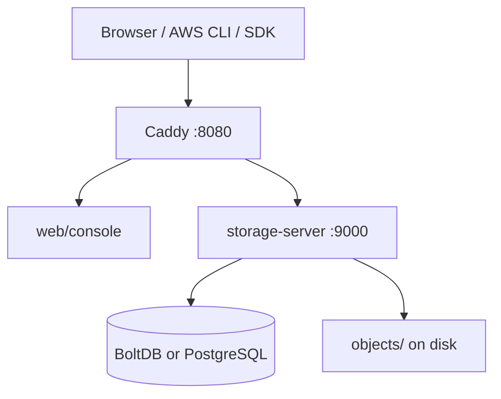
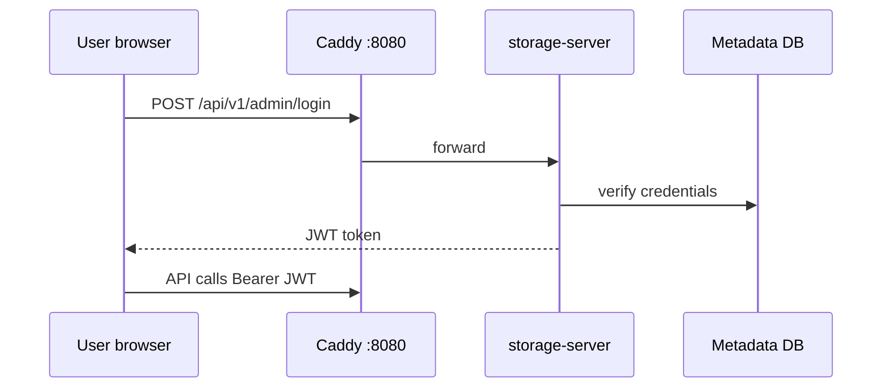
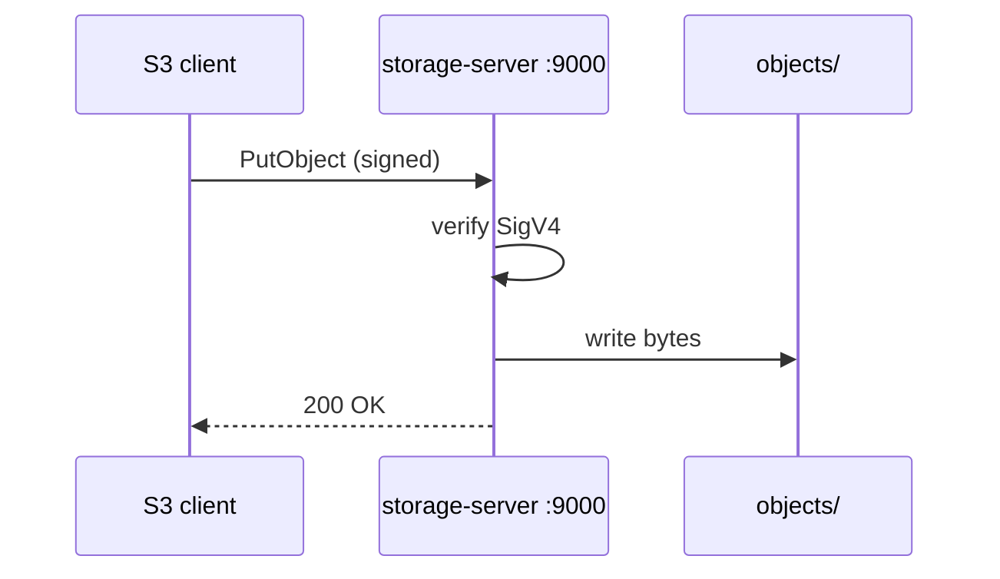

English | **[Русский](../ru/architecture.md)**

# Architecture overview

High-level architecture for operators. Deep technical reference: [../../en/context/architecture.md](../../en/context/architecture.md).

## Request flows

### Console login (JWT)

### S3 operations (SigV4)

## Data layout

| Path | Content |
|------|---------|
| `STORAGE_DATA_DIR/objects/` | Object bytes |
| `metadata.db` or PostgreSQL | Buckets, users, policies, tenants |

## Related

- [Gateway replication](../../en/user-guide/06-gateway-and-minio.md)
- [Database schema](../../en/database.md)
