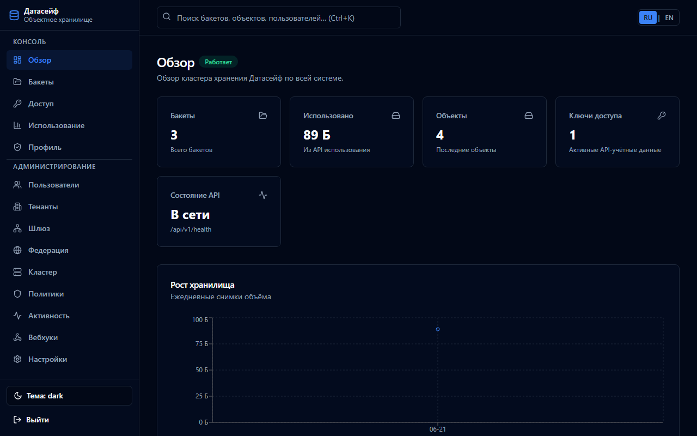
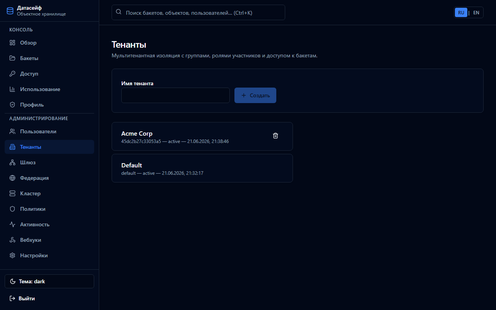
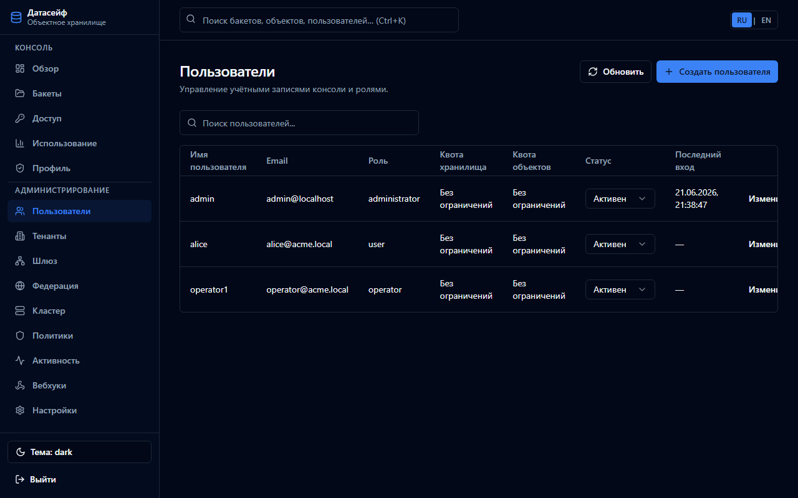
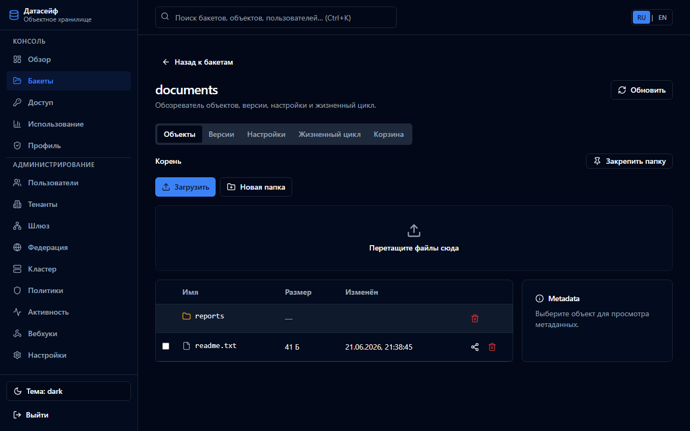

English | **[Русский](../ru/onboarding.md)**

# Onboarding checklist

Step-by-step guide from zero to a working DataSafeS3 deployment with users, tenants, and data.

## Phase 1 — Deploy

1. Clone the repository and copy `.env.example` → `.env`
2. Start stack: `docker compose --profile postgres up -d --build`
3. Verify health: `curl http://localhost:9000/api/v1/health`
4. Open **http://localhost:8080**

## Phase 2 — First admin login

1. Sign in with `admin` / `admin`
2. You are redirected to the **setup wizard**
3. **Change password** — use a strong password (required)
4. On the welcome screen, choose:
   - **Skip** external S3 (local-only storage), or
   - Configure external external S3 for Gateway replication
5. Click **Finish** — you land on the dashboard



## Phase 3 — First organization (tenant)

Tenants isolate buckets and members for departments or customers.

1. Go to **Administration → Tenants**
2. Click **Create tenant** — e.g. `Acme Corp`
3. Add members with roles:
   - `tenant_admin` — manage members and grants
   - `member` — read/write within granted buckets
   - `viewer` — read-only



See [Administrator guide — tenants](../../administrator-guide/en/tenants.md).

## Phase 4 — First users

1. Go to **Administration → Users**
2. Create users with roles:
   - `administrator` — full system access
   - `operator` — all buckets, no user admin
   - `user` — own buckets only
3. Optionally assign users to tenants



## Phase 5 — First bucket and upload

1. **Buckets → Create** — name `documents`, visibility `private`
2. Open the bucket → **Upload** or drag files
3. Verify objects appear in the object browser



Alternative: [S3 CLI first bucket](first-bucket.md#via-s3-cli).

## Phase 6 — Access keys (optional)

1. **Access → Access keys** — create S3-compatible keys for applications
2. Or **API tokens** (`ds_*`) for REST Admin API

## Phase 7 — Security hardening

| Task | Where |
|------|-------|
| LDAP | Admin → Settings → LDAP |
| OIDC / SSO | Admin → Settings → OIDC |
| MFA | Profile → Enable MFA |
| Change S3 bootstrap key | Settings or env `STORAGE_ACCESS_KEY` |

## Phase 8 — Operations

| Task | Where |
|------|-------|
| Monitoring | Grafana http://localhost:3000 (dashboard **DataSafeS3 Overview**) |
| Audit | Admin → Activity |
| Backup | Copy `STORAGE_DATA_DIR` + PostgreSQL dump — [operations guide](../../operations-guide/en/backup-restore.md) |

## Quick API bootstrap

For automation (CI, scripts):

```bash
# Login → change password → complete setup → create bucket
# See scripts/screenshots/capture.mjs for a full example
```

## Next steps

- [User guide](../../en/user-guide/README.md)
- [Administrator guide](../../administrator-guide/en/README.md)
- [Use cases](../../use-cases/README.md)
