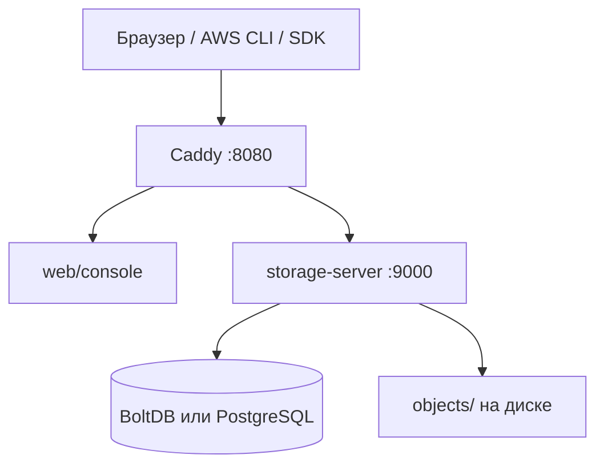
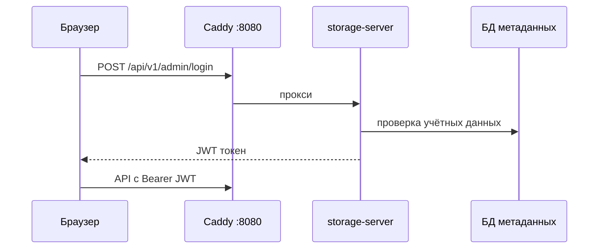
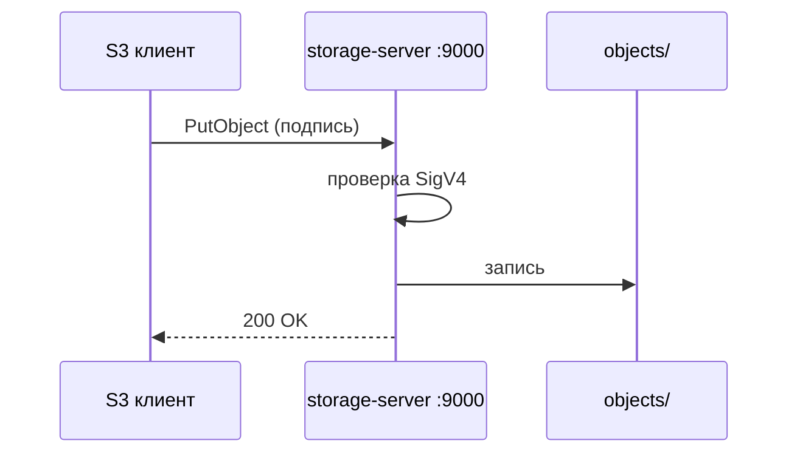

**[English](../en/architecture.md)** | Русский

# Обзор архитектуры

Высокоуровневая архитектура для операторов. Техническая документация: [../../ru/context/architecture.md](../../ru/context/architecture.md).

## Потоки запросов

### Вход в консоль (JWT)

### S3-операции (SigV4)

## Расположение данных

| Путь | Содержимое |
|------|------------|
| `STORAGE_DATA_DIR/objects/` | Байты объектов |
| `metadata.db` или PostgreSQL | Бакеты, пользователи, политики, арендаторы |

## См. также

- [Репликация Gateway](../../ru/user-guide/06-gateway-i-minio.md)
- [Схема БД](../../ru/database.md)
