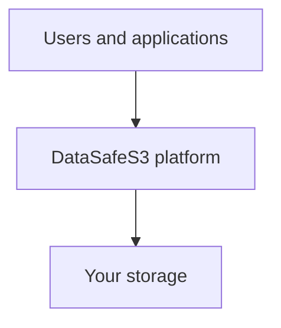
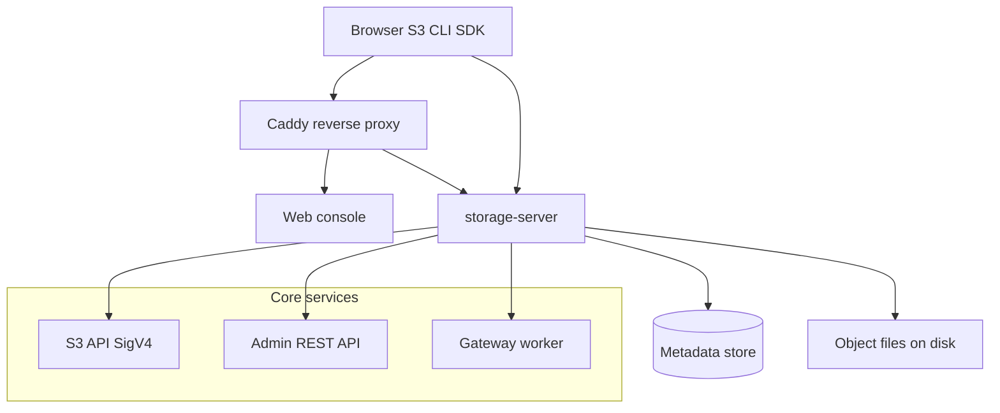
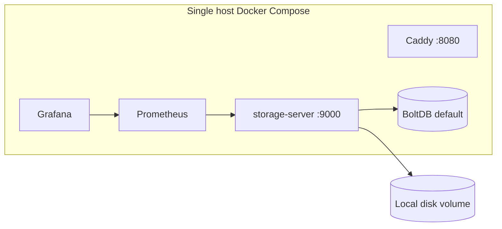
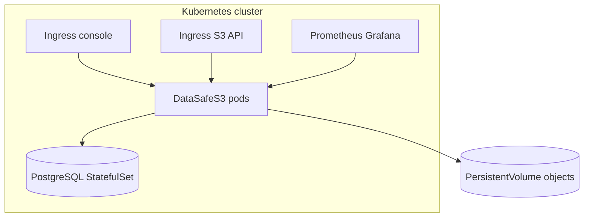
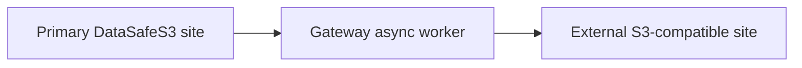
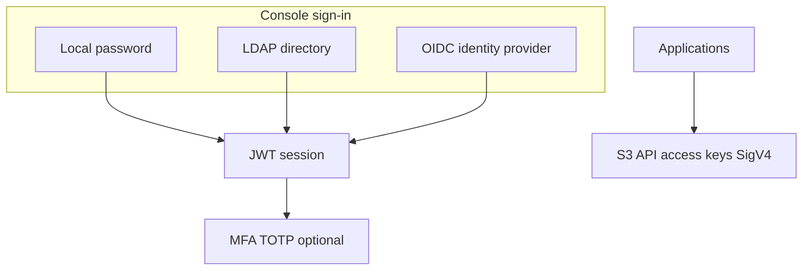

English | **[Русский](../ru/conceptual-architecture.md)**

# Conceptual architecture

High-level architecture for product understanding. For implementation detail see [logical architecture](../../en/context/architecture.md) and [database schema](../../en/database.md).

---

## Conceptual architecture (30 seconds)

DataSafeS3 sits between people (browser, S3 clients, automation) and disk storage. Identity, policy, audit, and monitoring wrap every request.

---

## Logical architecture

| Subsystem | Role |
|-----------|------|
| **Web console** | Administration and self-service for users |
| **storage-server** | S3 API, Admin API, replication worker, metrics |
| **Metadata store** | Users, buckets, policies, tenants, audit pointers |
| **Object store** | Content-addressed files under `STORAGE_DATA_DIR/objects/` |

---

## Deployment architecture — single node

Typical evaluation and small-team production: one VM or server, Compose stack, optional PostgreSQL profile for metadata.

Guide: [First run](../../getting-started/en/first-run.md)

---

## Production architecture

Production checklist: TLS, PostgreSQL metadata, backups, monitoring alerts, changed bootstrap credentials. Optional HA: [2-node reference](../../operations-guide/en/reference-deployment-2node.md), Helm `values-ha.yaml`.

Guide: [Helm chart](../../../deploy/helm/datasafe/README.md) · [Operations guide](../../operations-guide/en/README.md)

---

## Multi-site architecture — Gateway replication

Primary site accepts writes locally. Gateway replicates objects to an external bucket for off-site retention or DR.

Guide: [Replication](../../administrator-guide/en/replication.md) · [Gateway technical doc](../../en/context/gateway.md)

---

## Authentication architecture

| Path | Use case |
|------|----------|
| **LDAP** | Corporate directory sync and group mapping |
| **OIDC / SSO** | Single sign-on with external IdP |
| **MFA** | Second factor for console accounts |
| **S3 keys** | Application and automation access to object API |

Guides: [LDAP](../../administrator-guide/en/ldap.md) · [OIDC](../../administrator-guide/en/oidc.md) · [MFA](../../administrator-guide/en/mfa.md)

---

## Related

- [What is DataSafeS3?](../../getting-started/en/what-is-datasafe.md)
- [Why DataSafeS3?](../../en/why-datasafe.md)
- [Use cases](../../use-cases/README.md)
