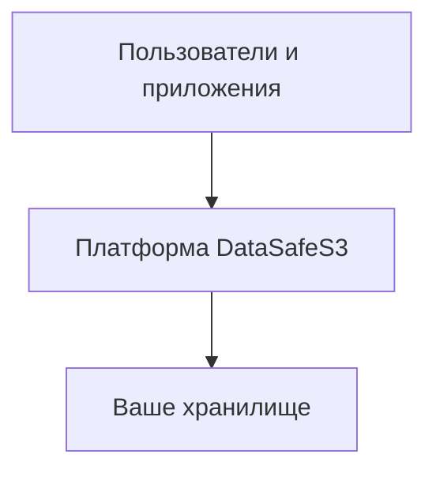
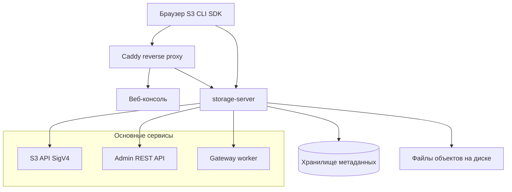
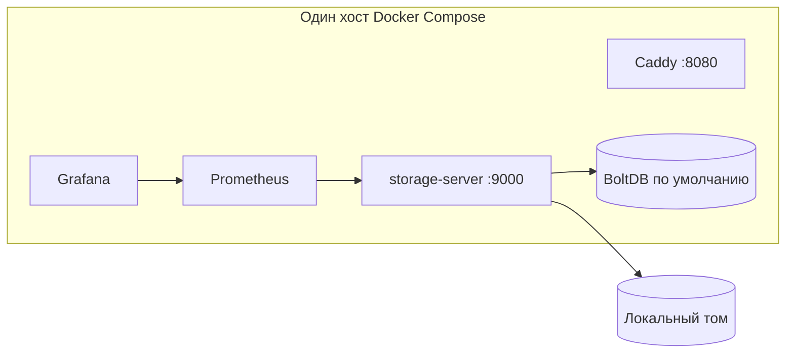
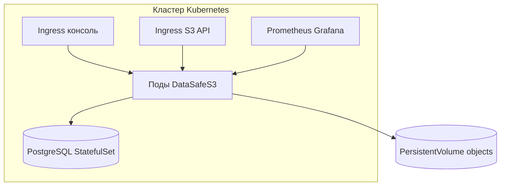
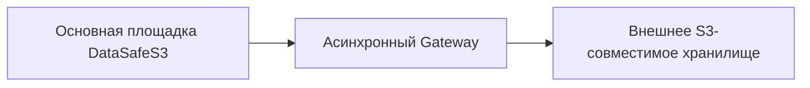
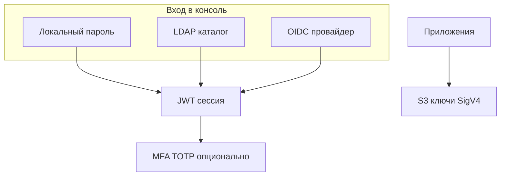

**[English](../en/conceptual-architecture.md)** | Русский

# Концептуальная архитектура

Высокоуровневая архитектура для понимания продукта. Детали реализации: [логическая архитектура](../../ru/context/architecture.md) и [схема БД](../../ru/database.md).

---

## Концептуальная архитектура (30 секунд)

DataSafeS3 находится между людьми (браузер, S3-клиенты, автоматизация) и дисковым хранилищем. Идентичность, политики, аудит и мониторинг оборачивают каждый запрос.

---

## Логическая архитектура

| Подсистема | Роль |
|------------|------|
| **Веб-консоль** | Администрирование и self-service пользователей |
| **storage-server** | S3 API, Admin API, worker репликации, метрики |
| **Метаданные** | Пользователи, бакеты, политики, тенанты, аудит |
| **Объектное хранилище** | Файлы под `STORAGE_DATA_DIR/objects/` |

---

## Развёртывание — один узел

Типично для оценки и небольших команд: одна VM, Compose, опционально PostgreSQL для метаданных.

Руководство: [Первый запуск](../../getting-started/ru/first-run.md)

---

## Production-архитектура

Production: TLS, PostgreSQL, резервное копирование, алерты, смена bootstrap-учётных данных. Опционально HA: [эталон 2-node](../../operations-guide/ru/reference-deployment-2node.md), Helm `values-ha.yaml`.

Руководство: [Helm chart](../../../deploy/helm/datasafe/README.md) · [Эксплуатация](../../operations-guide/ru/README.md)

---

## Multi-site — репликация Gateway

Основная площадка принимает записи локально. Gateway реплицирует объекты во внешний бакет для off-site копий и DR.

Руководство: [Репликация](../../administrator-guide/ru/replication.md) · [Gateway](../../ru/context/gateway.md)

---

## Архитектура аутентификации

| Путь | Сценарий |
|------|----------|
| **LDAP** | Корпоративный каталог и группы |
| **OIDC / SSO** | Единый вход через IdP |
| **MFA** | Второй фактор для консоли |
| **S3 keys** | Доступ приложений к object API |

Руководства: [LDAP](../../administrator-guide/ru/ldap.md) · [OIDC](../../administrator-guide/ru/oidc.md) · [MFA](../../administrator-guide/ru/mfa.md)

---

## См. также

- [Что такое DataSafeS3?](../../getting-started/ru/what-is-datasafe.md)
- [Почему DataSafeS3?](../../ru/why-datasafe.md)
- [Сценарии](../../use-cases/README.md)
