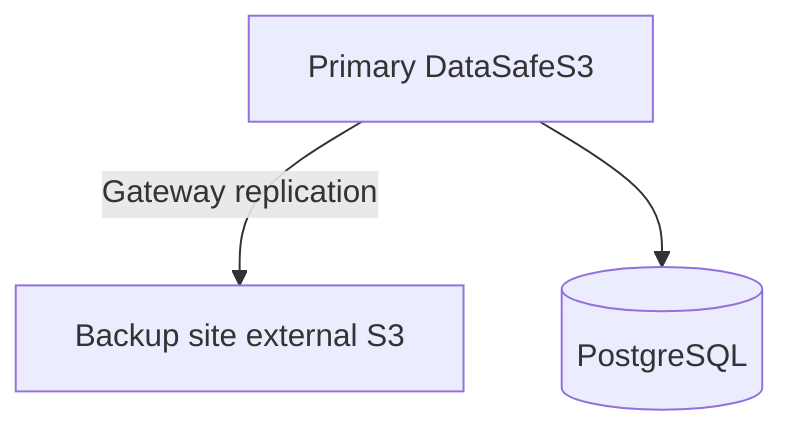

English | **[Русский](../ru/disaster-recovery.md)**

# Disaster recovery

## RPO / RTO targets

| Strategy | RPO | Complexity |
|----------|-----|------------|
| Daily tarball backup | 24h | Low |
| Gateway continuous replication | Minutes | Medium |
| PostgreSQL WAL + object sync | Low | High |

## DR architecture

## Recovery steps

1. Provision standby host or cloud instance
2. Restore PostgreSQL dump and `objects/` **or** fail over to replicated external S3
3. Point DNS / Ingress to standby
4. Verify `GET /api/v1/health` and sample object download

## Testing

Run quarterly DR drill: restore backup to isolated environment and validate checksums.
