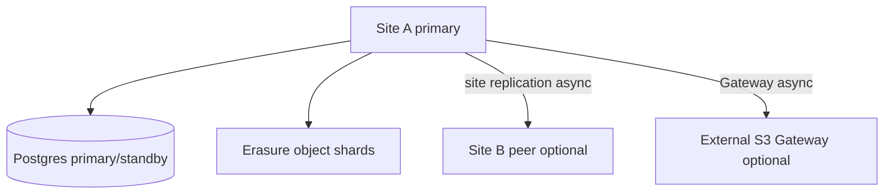

English | **[Русский](../ru/disaster-recovery.md)**

# Disaster recovery

## RPO / RTO targets (HA v2)

| Strategy | RPO (typical lab) | RTO (typical lab) | Complexity |
|----------|-------------------|-------------------|------------|
| Daily tarball backup | 24h | Hours | Low |
| Postgres streaming + erasure intra-site | Seconds (metadata lag) | ≤ 5 min (scripted metadata failover) | Medium |
| Site replication (DataSafeS3 peer) | 30–60s async | Minutes (DNS/ingress to peer site) | Medium |
| Gateway replication (external S3) | Minutes | Hours (restore + re-point) | Medium |
| Legacy shared-FS standby read API | Same as primary disk | N/A (read-only) | Low — **deprecated** |

**Automatic failover** for the full stack is **not** implied unless Patroni (or equivalent) is deployed and documented. CE ships orchestration **scripts**, not an always-on failover controller.

## DR architecture

```mermaid
flowchart TB
  siteA[Site A primary]
  pg[(Postgres primary/standby)]
  ec[Erasure object shards]
  siteB[Site B peer optional]
  ext[External S3 Gateway optional]
  siteA --> pg
  siteA --> ec
  siteA -->|site replication async| siteB
  siteA -->|Gateway async| ext
```

## Recovery steps

### Metadata loss / primary Postgres down

1. Promote standby Postgres (`scripts/ha/failover-metadata.ps1` or `pg_promote`).
2. Point `STORAGE_POSTGRES_DSN` at the new primary; clear stale leader lock if needed.
3. Restart leader `storage-server`; confirm `/healthz` `is_leader=true`.

### Object plane (erasure)

1. Restore **all** shard paths listed in `STORAGE_ERASURE_DATA_PATHS`.
2. Start storage-server with `STORAGE_OBJECT_BACKEND=erasure`; run heal worker until `erasure_degraded=false`.

### Site B takeover

1. Promote Site B Postgres if metadata was replicated (separate deployment).
2. Point DNS / Ingress to Site B console and S3 endpoint.
3. Verify sample object GET and `GET /api/v1/site-replication/status` on remaining site.

## Testing

Run quarterly DR drill: restore backup to isolated environment, run `scripts/ha/test-ha-cluster.ps1`, validate checksums.

See [reference deployment](./reference-deployment-2node.md) and [scaling](./scaling.md).
