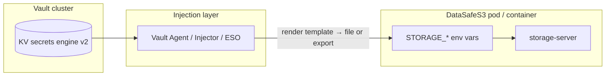

English | **[Русский](../ru/secrets-vault.md)**

# HashiCorp Vault integration (env injection)

DataSafeS3 **does not ship a Vault Go SDK** in v1.0.3. Operators inject secrets by rendering the same `STORAGE_*` environment variables the server already reads at startup — via **Vault Agent**, **Vault Agent Injector** (Kubernetes), or **External Secrets Operator** (ESO).

Default installs (`.env`, Helm `Secret`, Compose) are unchanged. Vault is **opt-in**.

## Architecture



1. Secrets live in Vault KV v2 (or synced from another backend).
2. Agent authenticates (Kubernetes auth, AppRole, or **dev token — local only**).
3. Templates map Vault paths → `STORAGE_*` names.
4. `storage-server` starts with populated env; `ValidateStartupSecrets()` runs as today.

## Secret inventory

| Sensitivity | `STORAGE_*` variable | Suggested Vault path (KV v2) | Notes |
|-------------|----------------------|------------------------------|-------|
| Critical | `STORAGE_JWT_SECRET` | `secret/datasafe/jwt` | Session signing; checked by `STORAGE_STRICT_SECRETS` |
| Critical | `STORAGE_SECRET_KEY` | `secret/datasafe/s3-secret` | Bootstrap SigV4 secret |
| Critical | `STORAGE_ADMIN_PASSWORD` | `secret/datasafe/admin-password` | Console admin bootstrap |
| High | `STORAGE_MFA_ENCRYPTION_KEY` | `secret/datasafe/mfa-encryption` | TOTP at rest; JWT fallback if unset |
| High | `STORAGE_SSE_MASTER_KEY` | `secret/datasafe/sse-master` | SSE-S3 master; see [backup-restore § SSE rotation](backup-restore.md#sse-master-key-rotation) |
| High | `STORAGE_OIDC_CLIENT_SECRET` | `secret/datasafe/oidc-client-secret` | OIDC confidential client |
| High | `STORAGE_LDAP_BIND_PASSWORD` | `secret/datasafe/ldap-bind` | Directory bind |
| High | `STORAGE_POSTGRES_PASSWORD` | `secret/datasafe/postgres` | Key `password` |
| High | `STORAGE_POSTGRES_DSN` | `secret/datasafe/postgres-dsn` | Key `dsn` (optional full DSN override) |

Lower sensitivity (often ConfigMap / plain env): `STORAGE_ACCESS_KEY`, `STORAGE_ADMIN_USER`, `STORAGE_REGION`, `STORAGE_POSTGRES_HOST`, OIDC issuer URLs.

**Local dev bundle:** `deploy/vault/init-kv.sh` also writes `secret/datasafe/bootstrap` with all keys for Agent templates and CI smoke tests.

## Kubernetes — Vault Agent Injector

Prerequisites: [Vault Agent Injector](https://developer.hashicorp.com/vault/docs/platform/k8s/injector) installed; Kubernetes auth role (e.g. `datasafe`) with read on `secret/data/datasafe/*`.

Example values overlay (non-breaking; default chart unchanged):

```bash
helm upgrade datasafe deploy/helm/datasafe \
  -f deploy/helm/datasafe/values-production.yaml \
  -f deploy/helm/datasafe/examples/values-vault-agent.yaml \
  -n datasafe
```

Key annotations (see full file for template body):

```yaml
storageServer:
  podAnnotations:
    vault.hashicorp.com/agent-inject: "true"
    vault.hashicorp.com/role: "datasafe"
    vault.hashicorp.com/agent-inject-secret-storage.env: "secret/data/datasafe/jwt"
    vault.hashicorp.com/agent-inject-template-storage.env: |
      {{- with secret "secret/data/datasafe/jwt" -}}
      STORAGE_JWT_SECRET={{ .Data.data.value }}
      {{- end }}
      # ... remaining paths — see values-vault-agent.yaml
```

The example overrides container `command`/`args` to `source /vault/secrets/storage.env` before `/docker-entrypoint.sh` — same pattern as Docker Compose.

**Alternative:** [External Secrets Operator](https://external-secrets.io/) → native Kubernetes `Secret` → existing Helm `secretRef` (no pod annotation changes).

## Docker Compose — `vault` profile (local)

| Overlay | Purpose |
|---------|---------|
| `docker-compose.vault.yml` | Dev Vault + Agent + entrypoint wrapper |
| `docker-compose.vault-product.yml` | `STORAGE_STRICT_SECRETS=true`, production-like flags |
| `docker-compose.local-data.yml` | Bind data to `DATASAFE_DATA_ROOT` (Windows: `D:/datasafe-data`) |

```powershell
# Windows — from repo root
$env:DATASAFE_DATA_ROOT = 'D:/datasafe-data'
.\deploy\vault\local\setup-vault-dev.ps1

docker compose -p datasafe `
  -f docker-compose.yml `
  -f docker-compose.local-data.yml `
  -f docker-compose.vault.yml `
  --profile vault up -d
```

```bash
# Linux / macOS
./deploy/vault/local/setup-vault-dev.sh

docker compose -p datasafe \
  -f docker-compose.yml \
  -f docker-compose.local-data.yml \
  -f docker-compose.vault.yml \
  --profile vault up -d
```

Step-by-step: [deploy/vault/README.md](../../../deploy/vault/README.md).

**Integration smoke:** `scripts/vault/smoke-vault-integration.sh` (or `.ps1`) — Vault KV check, `/healthz`, admin login, `GET /api/v1/settings/security-status` with no weak defaults.

Copy [`.env.vault.example`](../../../.env.vault.example) for vault-related compose variables.

## Product / production-like Compose contract

There is no separate `product` Compose profile. Production-like behaviour uses:

| Variable | Product intent |
|----------|----------------|
| `STORAGE_DEV=false` | No dev shortcuts |
| `STORAGE_STRICT_SECRETS=true` | Refuse default JWT / S3 secret / admin password |
| `STORAGE_OUTBOUND_HTTP_ALLOW=false` | HTTPS-only outbound URL policy |
| `STORAGE_OIDC_ROPC_ENABLED=false` | Disable ROPC grant |
| `STORAGE_LDAP_REQUIRE_TLS=true` | Reject `ldap://` |

Apply via `docker-compose.vault-product.yml` or Helm `values-production.yaml`. Secrets must come from Vault Agent (or operator `.env`), not compose defaults.

## Air-gapped / on-prem

| Topic | Guidance |
|-------|----------|
| Vault images | Mirror `hashicorp/vault` and DataSafeS3 images to internal registry |
| Agent auth | Prefer **Kubernetes auth** or **AppRole**; never root token in production |
| TLS | Terminate TLS on Vault and ingress; `STORAGE_DEV=false` |
| Policies | Least privilege: `read` on explicit `secret/data/datasafe/*` paths only |
| Audit | Enable Vault audit devices; correlate with DataSafeS3 activity log |
| No outbound Vault | In strict air-gap, run Vault on-cluster; Agent uses internal `VAULT_ADDR` |
| ESO | Fits GitOps: `ExternalSecret` CR → K8s Secret without in-pod Agent |

Native in-process Vault client (startup fetch API) is **not** in v1.0.3; env injection is the supported pattern.

## Verification

```bash
curl -s http://localhost:9000/healthz
# After admin login with Vault-injected password:
curl -s -H "Authorization: Bearer $TOKEN" http://localhost:9000/api/v1/settings/security-status
```

Expect `weak_secrets: []` when `STORAGE_STRICT_SECRETS=true` and non-default secrets are injected.

## Related docs

- [Security self-assessment](security-self-assessment.md)
- [Helm chart](../../../deploy/helm/datasafe/README.md)
- [Upgrade guide](upgrade.md)
