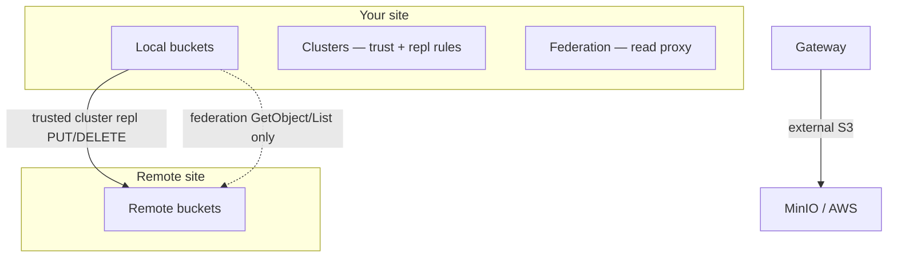

English | **[Русский](../ru/trusted-clusters.md)**

# Trusted clusters (multi-site trust)

This guide explains how DataSafeS3 **links two or more deployments** so they trust each other for **automated mTLS** and **object replication** — without sharing long-lived passwords in the database.

> **Status:** included in **v1.1.0** as CE lab foundation. Validate pairing URLs, cert backup, and replication in your network before production use.

## What problem does this solve?

You run DataSafeS3 in more than one place (office + DR site, two data centers, lab Site A + Site B). You need:

1. **Trust** — prove the remote site is really yours, not a man-in-the-middle.
2. **Replication** — copy buckets/objects to the remote site after PUT/DELETE.
3. **Optional read federation** — proxy GetObject/List to peers **scoped to a cluster**.

Trusted clusters cover (1) and (2). **Federation** (Admin → Federation) still handles (3) and now requires you to pick **which cluster** a peer belongs to.

## Concepts in plain language

| Term | Meaning |
|------|---------|
| **Local cluster** | This DataSafeS3 deployment (`STORAGE_CLUSTER_ID`, default `local`). |
| **Trusted remote cluster** | Another deployment you paired with — stored in metadata, health-checked over mTLS. |
| **Join token** (`dsjoin_*`) | One-time code (15 min TTL). Admin copies it once; only a hash is stored. |
| **Pairing** | Joiner calls initiator; both sides exchange CA certificates and sign client certs — **fully automatic**, no “confirm fingerprint” button. |
| **Safety number** | Short audit code derived from both CAs — for support logs only, not a security gate. |
| **Replication rule** | Maps `source_bucket` on you → `dest_bucket` on a trusted remote cluster. |

### Three features — do not confuse them



| Feature | Direction | Auth | Console |
|---------|-----------|------|---------|
| **Gateway replication** | Out to **any** S3 | Access key + secret | Gateway |
| **Site replication (classic)** | To another DataSafeS3 | Access key + secret on peer | Site replication |
| **Trusted cluster replication** | To a **paired** DataSafeS3 | mTLS client cert + local S3 SigV4 | Clusters → remote detail |
| **Federation** | Read proxy (Get/List) | Peer registry | Federation (+ **cluster** dropdown) |

Prefer **trusted cluster replication** for DataSafeS3↔DataSafeS3 DR when both sites run this version. Keep **Gateway** for MinIO/AWS. Use **Federation** when you only need cross-site reads.

## Security model (operator view)

| Control | Behaviour |
|---------|-----------|
| Transport | TLS 1.3 between sites; HTTP peers allowed only when `STORAGE_DEV=true` (lab). |
| Pairing | mTLS + join token hash; wrong CA → pairing fails (audit `cluster.pair.failed`). |
| Secrets in DB | Join tokens and legacy peer secrets stored as **hash** or **`enc:v1:`** — not plaintext. |
| Client cert TTL | 90 days; **automatic renewal** at ~75 days (leader-only rotator). |
| Revoke | Admin revokes remote cluster → CRL updated → workers stop using that peer. |
| Private keys | Stored on disk under `STORAGE_CLUSTER_CERT_DIR`, not in Postgres/Bolt. |

Backup `{STORAGE_DATA_DIR}/cluster-certs/` (or your `STORAGE_CLUSTER_CERT_DIR`) with the same care as TLS material.

## Environment variables

| Variable | Default | Purpose |
|----------|---------|---------|
| `STORAGE_CLUSTER_ID` | `local` | Unique id for this deployment (e.g. `ha-primary`, `dc-west`). |
| `STORAGE_CLUSTER_ENDPOINT` | From request Host | **Public URL** other sites use to reach this API (pairing + health). |
| `STORAGE_CLUSTER_CERT_DIR` | `{STORAGE_DATA_DIR}/cluster-certs` | CA and client key material. |
| `STORAGE_CLUSTER_CERT_RENEW_BEFORE_DAYS` | `75` | Renew client certs this many days before 90-day expiry. |
| `STORAGE_CLUSTER_CERT_ROTATOR_INTERVAL` | `1h` | How often the rotator runs (leader only when HA enabled). |
| `STORAGE_TRUSTED_CLUSTER_REPL_ENABLED` | `true` | Process replication rules tied to trusted clusters. |
| `STORAGE_SITE_REPLICATION_ENABLED` | `false` | Classic AK/SK site replication (separate from trusted repl). |
| `STORAGE_DEV` | `false` in prod | Allows HTTP and private IPs for lab pairing URLs. |

**Critical:** `STORAGE_CLUSTER_ENDPOINT` must be reachable **from the remote site’s container/process**. On Docker Desktop (Windows/macOS), use `http://host.docker.internal:9002`, not `http://127.0.0.1:9002`, when the peer runs inside a container.

## Pairing workflow (operations)

### Initiator (Site A)

1. Set `STORAGE_CLUSTER_ID` and `STORAGE_CLUSTER_ENDPOINT` to the URL Site B can call (see above).
2. Restart `storage-server`.
3. Console → **Clusters** → **Generate join token** → copy `dsjoin_…` (shown once).

### Joiner (Site B)

1. Set its own `STORAGE_CLUSTER_ID` and `STORAGE_CLUSTER_ENDPOINT` (reachable from A).
2. Console → **Clusters** → enter **Initiator URL** + token → **Connect & trust**.
3. Or API: `POST /api/v1/clusters/pair/join` with `{ "initiator_url", "token", "name" }`.

Both consoles should list the other under **Trusted clusters** with status **healthy** and cert expiry dates.

### After pairing — replication

1. Create buckets on both sides (e.g. `documents` locally, `documents-dr` remotely).
2. On initiator: open **remote cluster detail** → **Add replication rule** (source → dest bucket).
3. Upload an object to the source bucket; within a few seconds it should appear on the remote bucket (worker tick ~2s).
4. Monitor lag via site replication status API (shared queue): `GET /api/v1/site-replication/status`.

### Revoke

Console → remote cluster → **Revoke**. Replication and health checks stop immediately on your side; optional notify to peer over mTLS.

## Windows lab (HA + Cluster B)

Pre-built scripts (ports **8082/9002** and **9082/9193**):

```powershell
cd D:\cursor_p
# Build linux binary (required for new API)
$env:GOOS='linux'; $env:GOARCH='amd64'; $env:CGO_ENABLED='0'
go build -trimpath -o deploy/docker/storage-server-linux ./cmd/storage-server

# Site A (HA)
powershell -File scripts\ha\start-ha-stack.ps1 -SkipBuild

# Site B
powershell -File scripts\ha\start-ha-cluster-b.ps1 -SkipBuild

# Pairing smoke + repl attempt
powershell -File scripts\ha\test-trusted-cluster-pairing.ps1
```

Example `.env` snippets:

```env
# Site A (.env.ha)
STORAGE_CLUSTER_ID=ha-primary
STORAGE_CLUSTER_ENDPOINT=http://host.docker.internal:9002
STORAGE_TRUSTED_CLUSTER_REPL_ENABLED=true
STORAGE_DEV=true

# Site B (.env.site-b)
STORAGE_CLUSTER_ID=cluster-b
STORAGE_CLUSTER_ENDPOINT=http://host.docker.internal:9193
STORAGE_TRUSTED_CLUSTER_REPL_ENABLED=true
STORAGE_DEV=true
```

When joining from B, use initiator URL `http://host.docker.internal:9002`.

## Load balancing inside one cluster

For **one** cluster with multiple nodes (HA), front Caddy/HAProxy so **writes** hit the leader and **reads** hit any healthy node. See [deploy/caddy/multi-cluster-lb.md](../../../deploy/caddy/multi-cluster-lb.md) and Helm `caddy.multiClusterLB`.

Trusted-cluster **cross-site** traffic connects node-to-node with mTLS — do not terminate mTLS on the edge LB.

## PostgreSQL migrations

On first start after upgrade, migrations run automatically:

| Version | Content |
|---------|---------|
| `017` | `trusted_clusters`, pairing sessions, cluster certificates |
| `018` | `federation_clusters.cluster_id` |
| `019` | `site_replication_rules.trusted_cluster_id` |

See [upgrade guide](./upgrade.md#trusted-clusters-post-v110).

## Troubleshooting

| Symptom | Likely cause | Fix |
|---------|--------------|-----|
| Remote cluster **unhealthy** | Wrong `endpoint` in metadata (`127.0.0.1` from inside Docker) | Set `STORAGE_CLUSTER_ENDPOINT` to host-routable URL; revoke and re-pair |
| Pairing **401** / token invalid | Expired or reused `dsjoin_*` | Generate a new token (15 min TTL) |
| Pairing **CA verification failed** | MITM or wrong initiator URL | Check URL and TLS; review audit log |
| Objects not replicating | Rule missing, repl disabled, or peer unhealthy | Check rule on cluster detail; `STORAGE_TRUSTED_CLUSTER_REPL_ENABLED=true` |
| `run-all-ha-tests` port conflict | Main stack on `:9000` | Stop `datasafe` project or run HA suite alone |

## API reference

OpenAPI (admin): `docs/api/openapi-full.yaml` — paths under `/api/v1/clusters/…`.

Engineering spec: [multi-cluster-trusted-replication-tz.md](../../specs/multi-cluster-trusted-replication-tz.md).

Console walkthrough: [Administrator guide — trusted clusters](../../administrator-guide/en/trusted-clusters.md).

## Related

- [Replication models](../../administrator-guide/en/replication.md)
- [Scaling](./scaling.md)
- [HA reference deployment](./reference-deployment-2node.md)
- [Disaster recovery](./disaster-recovery.md)
