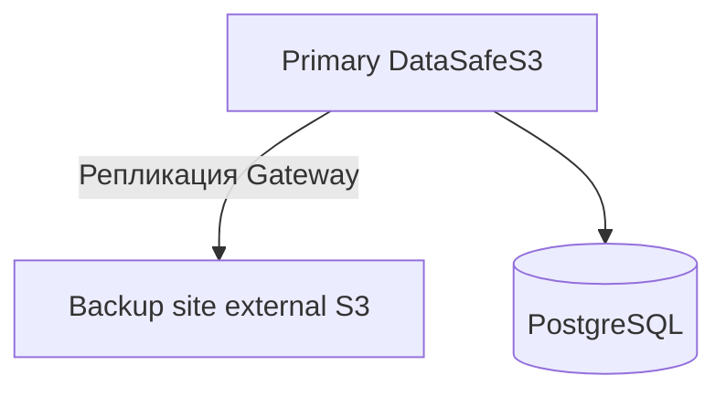

**[English](../en/disaster-recovery.md)** | Русский

# Аварийное восстановление

## Цели RPO / RTO

| Стратегия | RPO | Сложность |
|-----------|-----|-----------|
| Ежедневный tarball backup | 24ч | Низкая |
| Непрерывная репликация Gateway | Минуты | Средняя |
| PostgreSQL WAL + sync объектов | Низкий | Высокая |

## Архитектура DR

## Шаги восстановления

1. Подготовить standby-хост или облачный инстанс
2. Восстановить дамп PostgreSQL и `objects/` **или** failover на реплицированный внешний S3
3. Переключить DNS / Ingress на standby
4. Проверить `GET /api/v1/health` и скачивание тестового объекта

## Тестирование

Ежеквартальный DR drill: restore backup в изолированное окружение, проверка checksums.
