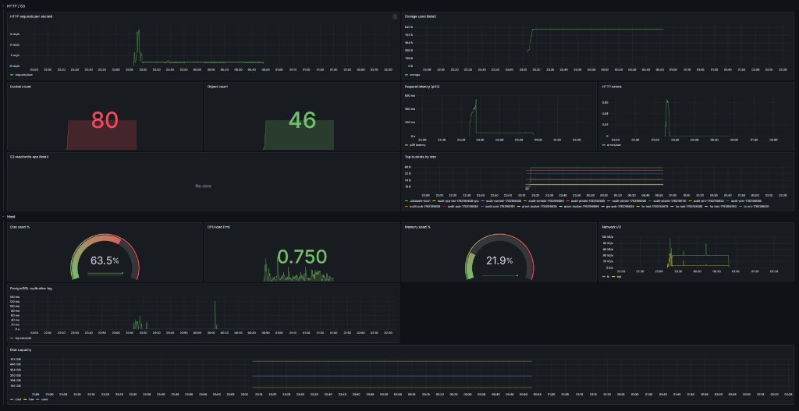

**[English](../en/monitoring.md)** | Русский

# Эксплуатационный мониторинг

## Prometheus

- Scrape: `storage-server:9000/metrics`
- Конфиг: `deploy/docker/prometheus.yml`
- **v1.1.0+:** при `STORAGE_METRICS_TOKEN` настройте bearer в Prometheus — см. `deploy/docker/prometheus.yml` и [upgrade § v1.1.0](upgrade.md#обновление-до-v110).
- **Консоль:** без bearer дашборд может показывать нули — используйте Grafana/Prometheus.

## Grafana

- URL: http://localhost:3000 (по умолчанию `admin`/`admin`)
- Дашборд: **DataSafeS3 Overview** (`deploy/docker/grafana/dashboards/datasafe-overview.json`)

## Рекомендуемые алерты

| Алерт | Метрика |
|-------|---------|
| Диск > 85% | node filesystem |
| Очередь Gateway | `datasafe_replication_queue_depth` |
| Lag site replication | `datasafe_site_replication_lag_seconds` |
| Очередь site replication | `datasafe_site_replication_queue_depth` |
| Degraded erasure | `datasafe_erasure_degraded_shard_sets` |
| Не leader при ожидании записи | `/healthz` `is_leader=false` |
| 5xx rate | HTTP metrics |
| Всплеск auth failures | login counter |

## Метрики HA v2 (v1.1.0+)

| Метрика | Смысл |
|---------|--------|
| `datasafe_erasure_degraded_shard_sets` | Наборы shard с потерянными фрагментами |
| `datasafe_erasure_heal_bytes_total` | Объём восстановлен heal worker |
| `datasafe_site_replication_lag_seconds` | Задержка site replication |
| `datasafe_site_replication_queue_depth` | Очередь site replication |

На **источнике** site replication: `STORAGE_SITE_REPLICATION_ENABLED=true`.

## Внешнее логирование

Пересылка JSON-логов в Loki/Elasticsearch для корреляции с audit.

### Политика исходящих URL (v1.0.2+)

URL sink'ов, webhooks и hook-test проверяются на SSRF (`internal/security/urlpolicy`):

- **Production** (`STORAGE_DEV=false`): только публичные `https://` (private IP, `localhost`, metadata IP запрещены).
- **Локальная разработка / CI**: `STORAGE_DEV=true` (например `docker-compose.audit.yml`). **`STORAGE_OUTBOUND_HTTP_ALLOW` удалена в v1.1.0.**
- Невалидный URL → `400` с `outbound url not allowed: …` при сохранении настроек или тесте hook.

Полное руководство: [../../ru/user-guide/07-monitoring-i-bazy.md](../../ru/user-guide/07-monitoring-i-bazy.md)
