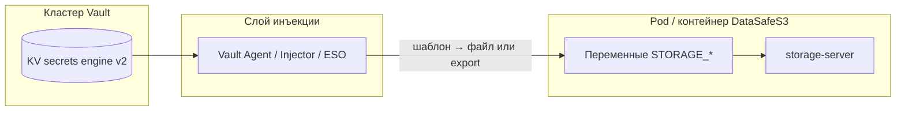

**[English](../en/secrets-vault.md)** | Русский

# Интеграция HashiCorp Vault (инъекция в env)

В v1.0.3 **нет Go SDK Vault** в приложении. Секреты передаются через те же переменные `STORAGE_*`, которые `storage-server` читает при старте — через **Vault Agent**, **Vault Agent Injector** (Kubernetes) или **External Secrets Operator** (ESO).

Установки по умолчанию (`.env`, Helm `Secret`, Compose) не меняются. Vault — **opt-in**.

## Архитектура



1. Секреты в Vault KV v2.
2. Agent аутентифицируется (Kubernetes auth, AppRole; **dev token — только локально**).
3. Шаблоны сопоставляют пути Vault → имена `STORAGE_*`.
4. Старт `storage-server` с заполненным env; `ValidateStartupSecrets()` как сейчас.

## Инвентарь секретов

| Чувствительность | Переменная `STORAGE_*` | Рекомендуемый путь Vault (KV v2) | Примечание |
|------------------|------------------------|----------------------------------|------------|
| Критично | `STORAGE_JWT_SECRET` | `secret/datasafe/jwt` | Подпись сессий; `STORAGE_STRICT_SECRETS` |
| Критично | `STORAGE_SECRET_KEY` | `secret/datasafe/s3-secret` | Bootstrap SigV4 |
| Критично | `STORAGE_ADMIN_PASSWORD` | `secret/datasafe/admin-password` | Пароль admin консоли |
| Высокая | `STORAGE_MFA_ENCRYPTION_KEY` | `secret/datasafe/mfa-encryption` | TOTP at rest |
| Высокая | `STORAGE_SSE_MASTER_KEY` | `secret/datasafe/sse-master` | SSE-S3; [ротация](backup-restore.md#sse-master-key-rotation) |
| Высокая | `STORAGE_OIDC_CLIENT_SECRET` | `secret/datasafe/oidc-client-secret` | OIDC client |
| Высокая | `STORAGE_LDAP_BIND_PASSWORD` | `secret/datasafe/ldap-bind` | LDAP bind |
| Высокая | `STORAGE_POSTGRES_PASSWORD` | `secret/datasafe/postgres` | Ключ `password` |
| Высокая | `STORAGE_POSTGRES_DSN` | `secret/datasafe/postgres-dsn` | Ключ `dsn` |

Меньшая чувствительность (ConfigMap / plain env): `STORAGE_ACCESS_KEY`, `STORAGE_ADMIN_USER`, `STORAGE_REGION`, хост Postgres, URL OIDC.

**Локальный bundle:** `deploy/vault/init-kv.sh` пишет также `secret/datasafe/bootstrap` для шаблонов Agent и CI.

## Kubernetes — Vault Agent Injector

Нужны: [Vault Agent Injector](https://developer.hashicorp.com/vault/docs/platform/k8s/injector); роль Kubernetes auth (например `datasafe`) с `read` на `secret/data/datasafe/*`.

```bash
helm upgrade datasafe deploy/helm/datasafe \
  -f deploy/helm/datasafe/values-production.yaml \
  -f deploy/helm/datasafe/examples/values-vault-agent.yaml \
  -n datasafe
```

Пример аннотаций:

```yaml
storageServer:
  podAnnotations:
    vault.hashicorp.com/agent-inject: "true"
    vault.hashicorp.com/role: "datasafe"
```

Полный шаблон и `command` для `source /vault/secrets/storage.env` — в `deploy/helm/datasafe/examples/values-vault-agent.yaml`.

**Альтернатива:** ESO → Kubernetes `Secret` → существующий Helm `secretRef`.

## Docker Compose — профиль `vault` (локально)

| Overlay | Назначение |
|---------|------------|
| `docker-compose.vault.yml` | Dev Vault + Agent + entrypoint |
| `docker-compose.vault-product.yml` | `STORAGE_STRICT_SECRETS=true` и prod-флаги |
| `docker-compose.local-data.yml` | Данные в `DATASAFE_DATA_ROOT` (`D:/datasafe-data`) |

```powershell
$env:DATASAFE_DATA_ROOT = 'D:/datasafe-data'
.\deploy\vault\local\setup-vault-dev.ps1

docker compose -p datasafe `
  -f docker-compose.yml `
  -f docker-compose.local-data.yml `
  -f docker-compose.vault.yml `
  --profile vault up -d
```

Подробно: [deploy/vault/README.md](../../../deploy/vault/README.md).

**Smoke:** `scripts/vault/smoke-vault-integration.ps1` / `.sh`.

Пример env: [`.env.vault.example`](../../../.env.vault.example).

## Контракт product / production-like Compose

Отдельного профиля `product` нет. Production-like:

| Переменная | Назначение |
|------------|------------|
| `STORAGE_DEV=false` | Без dev-режима |
| `STORAGE_STRICT_SECRETS=true` | Отказ при дефолтных секретах |
| `STORAGE_OUTBOUND_HTTP_ALLOW=false` | Исходящие URL только HTTPS |
| `STORAGE_OIDC_ROPC_ENABLED=false` | Без ROPC |
| `STORAGE_LDAP_REQUIRE_TLS=true` | Только `ldaps://` |

Через `docker-compose.vault-product.yml` или Helm `values-production.yaml`.

## Air-gap / on-prem

| Тема | Рекомендация |
|------|--------------|
| Образы | Внутренний registry для Vault и DataSafeS3 |
| Auth | Kubernetes auth или AppRole; не root token |
| TLS | На Vault и ingress; `STORAGE_DEV=false` |
| Политики | `read` только на явные пути `secret/data/datasafe/*` |
| Аудит | Audit devices Vault + activity log DataSafeS3 |
| Без исходящего Vault | Vault в том же кластере; внутренний `VAULT_ADDR` |
| ESO | GitOps без Agent в pod |

Встроенный Vault-клиент в приложении **не в v1.0.3**; поддерживается инъекция в env.

## Проверка

```bash
curl -s http://localhost:9000/healthz
curl -s -H "Authorization: Bearer $TOKEN" http://localhost:9000/api/v1/settings/security-status
```

При `STORAGE_STRICT_SECRETS=true` ожидайте `weak_secrets: []`.

## См. также

- [Самооценка безопасности](security-self-assessment.md)
- [Helm](../../../deploy/helm/datasafe/README.md)
- [Обновление](upgrade.md)
