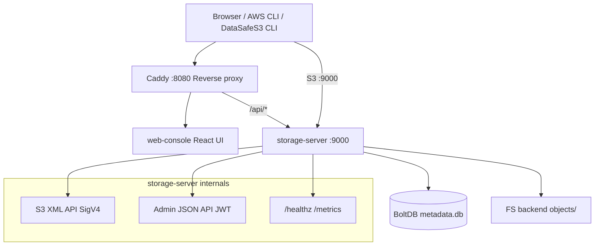

**[English](../../en/context/architecture.md)** | Русский

# Architecture

**Датасейф S3** (DataSafeS3) is a single-node, S3-compatible object storage service (S3-compatible). Author: **Трачук Илья**. Go module: `github.com/DirektorBani/datasafe`.

## Single-node по умолчанию

Community Edition по умолчанию — **один процесс `storage-server`** на одном хосте. Опциональные **паттерны HA** (streaming replication PostgreSQL, read-only standby, скрипты failover, Helm `values-ha.yaml`) документированы для метаданных и DR — без erasure multi-AZ на петабайты. См. [масштабирование](../../operations-guide/ru/scaling.md) и [эталон 2-node](../../operations-guide/ru/reference-deployment-2node.md).

| Возможность | Статус в Community Edition |
|-------------|----------------------------|
| Single-node хранилище + консоль | **Реализовано** |
| PostgreSQL для метаданных (опционально) | **Реализовано** |
| Gateway-репликация во внешний S3 | **Реализовано** |
| Federation (реестр + S3 proxy) | **Частично (MVP)** — GetObject + ListObjectsV2 между зарегистрированными пирами |
| HA метаданных (реплики Postgres + failover) | **Частично** — ручной promote; маршрутизация list на read replica |
| Read-only standby `storage-server` | **Реализовано** — `STORAGE_READ_ONLY`, `docker-compose.ha.yml` |
| Erasure coding / multi-AZ | **Частично (MVP)** — codec 2+1 в `internal/storage/erasure/`; не production multi-AZ |
| STS session tokens (scoped S3) | **Реализовано** — `POST /api/v1/sts/assume-role`; credentials привязаны к вызывающему пользователю; `X-Amz-Security-Token` в SigV4 |
| Уведомления о событиях | **Реализовано** — Webhook + опционально NATS (`STORAGE_NATS_URL`) |

## Components

## storage-server (Go)

Entry: `cmd/storage-server/main.go`

| Package | Role |
|---------|------|
| `internal/api` | HTTP mux, admin JSON handlers, wires S3 + auth |
| `internal/api/s3` | S3 XML handlers (buckets, objects, multipart, copy) |
| `internal/storage` | Filesystem object backend |
| `internal/metadata` | BoltDB: buckets, keys, policies, lifecycle |
| `internal/auth` | AWS SigV4 sign/verify, presign, JWT admin auth |
| `internal/policy` | Bucket policy evaluator (Allow subset) |
| `internal/observability` | Structured JSON logs, Prometheus metrics |

### Data layout

Under `STORAGE_DATA_DIR` (default `/data` in Docker, `./data` locally):

- `metadata.db` -- BoltDB
- `objects/` -- object bytes on disk

### Two auth planes

1. **S3 API** -- AWS Signature Version 4 (access key + secret). Bootstrap key from env; additional keys via admin API/metadata.
2. **Admin API** (`/api/v1/*`) -- JWT from `POST /api/v1/admin/login`. All admin routes except `/api/v1/health` require `Authorization: Bearer <token>`.

### S3 vs admin split

- S3 handlers serve XML on `/` (path-style bucket/object routes)
- Admin handlers serve JSON on `/api/v1/*`
- Same process, single port (9000)

## Caddy reverse proxy

File: `deploy/docker/Caddyfile`

| Path | Upstream |
|------|----------|
| `/api/*` | storage-server:9000 |
| `/healthz`, `/metrics` | storage-server:9000 |
| everything else | Статическая сборка (`web/console/dist`) |

Консоль и API на одном origin `:8080`. Для Vite HMR: `docker compose --profile dev -f docker-compose.yml -f docker-compose.dev.yml`.

## web-console

React + TypeScript SPA. **По умолчанию** в Compose и Helm — **production-сборка** из `web/console/dist` (или образ `ghcr.io/direktorbani/datasafe-console` в Kubernetes). Профиль **`dev`** — Vite с hot reload (`docker-compose.dev.yml`).

## Observability stack

- **Prometheus** scrapes storage-server metrics (config in `deploy/docker/prometheus.yml`)
- **Grafana** on port 3000 (default install, no custom dashboards in repo)

## CLI

`cmd/storage-cli` (DataSafeS3 CLI) — thin client over S3 API, configured via `DATASAFE_*` env vars (legacy alias `S3FORK_*`).

## Deployment notes

- **Single-node по умолчанию** — см. таблицу выше; multi-AZ HA не предполагается без [масштабирования](../../operations-guide/ru/scaling.md)
- No TLS in storage-server; terminate at Caddy or external LB
- Path-style addressing required (`--endpoint-url http://host:9000`)
- Смените `STORAGE_JWT_SECRET`, `STORAGE_SECRET_KEY` и пароль admin перед production; `STORAGE_STRICT_SECRETS=true` — отказ при дефолтах
