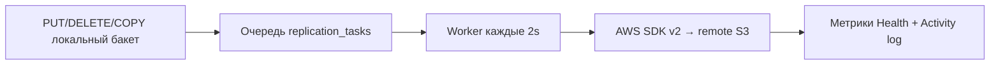

**[English](../../en/context/gateway.md)** | Русский

# DataSafeS3 Gateway — внешняя репликация S3

Author: **Трачук Илья** | Датасейф S3

Gateway реплицирует объекты из локальных бакетов Датасейф S3 во внешнее S3-совместимое хранилище (любой S3-совместимый провайдер) **асинхронно** через очередь задач.

---

## Быстрый старт (UI)

### Шаг 1 — Откройте Gateway

1. Войдите в консоль как **administrator** (`http://localhost:8080`).
2. В боковом меню: **Gateway** (только для администратора).

### Шаг 2 — Добавьте подключение (Connections)

1. Вкладка **Connections** → блок **Add Connection**.
2. Заполните поля:

| Поле | Пример (локальный тестовый endpoint) |
|------|-------------------------|
| Name | `External S3 Test` |
| Endpoint | `http://host.docker.internal:9100` *(из контейнера DataSafeS3)* или `http://localhost:9100` *(с хоста)* |
| Region | `us-east-1` |
| Access Key | `minioadmin` |
| Secret Key | `minioadmin` |
| Path-style | ✓ включить (обязательно для path-style endpoint) |
| Verify TLS | снять для HTTP без TLS |

3. Нажмите **Add Connection**.
4. Нажмите **Test Connection** — должно появиться «connected».

> **Подсказка:** Endpoint — URL S3 API **без** имени бакета. Для тестового контейнера это порт **9100** (не 9000 DataSafeS3).

### Шаг 3 — Создайте правило репликации (Replication Rules)

1. Вкладка **Replication Rules**.
2. **Source bucket** — выберите локальный бакет Датасейф S3 (например `my-data`).
3. **Remote connection** — выберите созданное подключение по имени.
4. **Remote bucket** — имя бакета на удалённом S3 (например `replica-test`).
5. Нажмите **Add Rule**.

При создании правила выполняется начальная постановка существующих объектов в очередь.

### Шаг 4 — Проверка репликации

1. Загрузите объект в локальный бакет (консоль или S3 API на `:9000`).
2. Откройте вкладку **Sync Jobs** / **Health** — смотрите `queue_pending`, `bytes_replicated`.
3. Через несколько секунд объект появится на удалённой стороне.

---

## Тестовый S3 endpoint (Docker)

Тестовый контейнер слушает **9100** (API) и **9101** (консоль), чтобы не конфликтовать с DataSafeS3 `:9000`.

```cmd
docker run -d --name datasafe-minio-test -p 9100:9000 -p 9101:9001 -e MINIO_ROOT_USER=minioadmin -e MINIO_ROOT_PASSWORD=minioadmin minio/minio server /data --console-address ":9001"
```

> Только для lab: образ `minio/minio` — удобный S3-совместимый сервер для локальных тестов; в документации это **тестовый внешний S3 endpoint**, а не референс для позиционирования.

Учётные данные по умолчанию:

- User: `minioadmin`
- Password: `minioadmin`
- Бакет `replica-test` создайте вручную (пример в разделе CLI ниже)


---

## Как проверить репликацию

Пошаговая проверка сквозной репликации из DataSafeS3 в удалённый S3.

### 1. Запустить тестовый S3 endpoint

Тестовый S3 endpoint — **отдельный** Docker-контейнер (не в `docker-compose` проекта). Порты: **9100** (S3 API), **9101** (веб-консоль).

```cmd
docker rm -f datasafe-minio-test
docker run -d --name datasafe-minio-test -p 9100:9000 -p 9101:9001 -e MINIO_ROOT_USER=minioadmin -e MINIO_ROOT_PASSWORD=minioadmin minio/minio server /data --console-address ":9001"
```

Проверка с хоста (должен быть ответ, не «connection refused»):

```cmd
curl http://localhost:9100/minio/health/live
curl http://localhost:9101/
```

Веб-UI удалённого S3: http://localhost:9101 (`minioadmin` / `minioadmin`).

Бакет назначения `replica-test` (если ещё нет):

```cmd
docker run --rm --entrypoint sh minio/mc:latest -c "mc alias set test http://host.docker.internal:9100 minioadmin minioadmin && mc mb test/replica-test --ignore-existing"
```

### 2. Подключение Gateway в UI DataSafeS3

1. Консоль **administrator** → **Gateway** → **Connections** → **Add Connection**.
2. Endpoint `http://host.docker.internal:9100` (из контейнера DataSafeS3) или `http://localhost:9100` с хоста; **Path-style** включён; Access Key / Secret: `minioadmin` / `minioadmin`.
3. **Test Connection** — статус **connected**.

### 3. Правило репликации

**Replication Rules** → **Source bucket** (локальный, напр. `my-data`) → **Remote connection** → **Remote bucket** `replica-test` → **Add Rule**.

### 4. Загрузка в локальный бакет

Загрузите объект в source bucket через консоль DataSafeS3 или S3 API на `:9000` (например `hello.txt` в `my-data`).

### 5. Проверка на удалённой стороне

- **Веб-UI:** http://localhost:9101 → Object Browser → бакет `replica-test` → тот же ключ/файл.
- **CLI:**

```cmd
docker run --rm --entrypoint sh minio/mc:latest -c "mc alias set test http://host.docker.internal:9100 minioadmin minioadmin && mc cat test/replica-test/hello.txt"
```

Ожидается содержимое, совпадающее с загруженным в DataSafeS3.

### 6. Health Gateway

В UI: **Gateway** → **Sync Jobs** / **Health** — очередь (`queue_pending` уменьшается до 0), растёт `bytes_replicated`, нет роста `replication_errors`.
### Запуск DataSafeS3 с локальным бинарником

```cmd
scripts\dev-docker-local-binary.cmd
```

### Пример подключения из UI

| Поле | Значение |
|------|----------|
| Endpoint | `http://host.docker.internal:9100` |
| Path-style | ✓ |
| Access Key / Secret | `minioadmin` / `minioadmin` |

---

## Проверка через CLI

### 1. Создать подключение (API)

```cmd
curl -s -X POST http://localhost:8080/api/v1/admin/login ^
  -H "Content-Type: application/json" ^
  -d "{\"username\":\"admin\",\"password\":\"admin\"}"
```

Сохраните `token`, затем:

```cmd
curl -s -X POST http://localhost:8080/api/v1/gateway/connections ^
  -H "Authorization: Bearer TOKEN" ^
  -H "Content-Type: application/json" ^
  -d "{\"name\":\"External S3 Test\",\"endpoint\":\"http://host.docker.internal:9100\",\"region\":\"us-east-1\",\"access_key\":\"minioadmin\",\"secret_key\":\"minioadmin\",\"path_style\":true,\"tls_verify\":false}"
```

### 2. Тест подключения

```cmd
curl -s -X POST http://localhost:8080/api/v1/gateway/connections/CONNECTION_ID/test ^
  -H "Authorization: Bearer TOKEN"
```

### 3. Правило репликации

```cmd
curl -s -X POST http://localhost:8080/api/v1/gateway/replication ^
  -H "Authorization: Bearer TOKEN" ^
  -H "Content-Type: application/json" ^
  -d "{\"source_bucket\":\"my-data\",\"dest_connection_id\":\"CONNECTION_ID\",\"dest_bucket\":\"replica-test\"}"
```

### 4. Загрузка в DataSafeS3

```cmd
curl -s -X PUT "http://localhost:9000/my-data/hello.txt" ^
  -H "Content-Type: text/plain" ^
  --data "hello from datasafe"
```

*(с подписью AWS SigV4 или через консоль)*

### 5. Проверка на удалённой стороне

```cmd
docker run --rm --network host minio/mc:latest mc alias set test http://localhost:9100 minioadmin minioadmin
docker run --rm --network host minio/mc:latest mc cat test/replica-test/hello.txt
```

Ожидаемый вывод: `hello from datasafe`

### 6. Health / очередь

```cmd
curl -s http://localhost:8080/api/v1/gateway/health -H "Authorization: Bearer TOKEN"
curl -s http://localhost:8080/api/v1/gateway/replication/queue -H "Authorization: Bearer TOKEN"
```

---

## Как работает репликация



- **События:** PUT, DELETE (включая delete marker), COPY через S3 API и консоль.
- **Retry:** экспоненциальный backoff, до 5 попыток (`STORAGE_GATEWAY_MAX_RETRIES`).
- **Плановый sync:** полный обход бакетов раз в час (`STORAGE_GATEWAY_FULL_SYNC_INTERVAL`).
- **Ручной sync:** кнопка «Sync now» на правиле — полная синхронизация.

---

## Переменные окружения

| Переменная | По умолчанию | Описание |
|------------|--------------|----------|
| `STORAGE_GATEWAY_WORKER_INTERVAL` | `2s` | Интервал обработки очереди |
| `STORAGE_GATEWAY_MAX_RETRIES` | `5` | Макс. попыток на задачу |
| `STORAGE_GATEWAY_FULL_SYNC_INTERVAL` | `1h` | Периодический полный sync |

---

## Устранение неполадок

| Симптом | Решение |
|---------|---------|
| Test Connection failed | Проверьте endpoint, path-style для path-style endpoint, credentials |
| Объект не появляется на удалённой стороне | Health → `queue_pending` > 0? Проверьте `replication_errors` |
| `replication_errors` растёт, ошибка `gateway connection "…" not found` | Правило ссылается на **удалённое** подключение. Удалите правило и создайте заново с актуальным connection ID, либо нажмите **Retry failed** после исправления |
| `rules_broken` > 0 в Health | Одно или несколько правил указывают на несуществующее подключение — пересоздайте правило |
| DELETE репликация в ошибках | После обновления DELETE идемпотентен (404 на remote = OK). Нажмите **Clear errors** для сброса старых записей |
| PUT: remote bucket missing | Worker автоматически создаёт `dest_bucket` на remote при PUT; для path-style endpoint достаточно прав `s3:CreateBucket` |
| Connection refused из Docker | Используйте `host.docker.internal:9100` (Windows/Mac) |
| 403 на remote bucket | Проверьте credentials удалённого S3; бакет создаётся автоматически при первом PUT |
| Нельзя удалить Connection | Сначала удалите replication rules, использующие это подключение |

### Автонастройка Gateway (External S3 Test)

После поднятия стека с Postgres и отдельного тестового endpoint на `9100`/`9101`:

`cmd
scripts\setup-minio-gateway.cmd
`

Скрипт идемпотентен: создаёт connection **External S3 Test** (`http://host.docker.internal:9100`), тестирует его, создаёт bucket `replica-test` на удалённой стороне (`mc mb --ignore-existing`), добавляет правило репликации. Локальный source bucket — первый из списка API, либо задайте `GATEWAY_SOURCE_BUCKET=my-data` перед запуском.

Полный перезапуск DataSafeS3 с Postgres и локальным бинарником:

`cmd
docker compose --profile postgres down
scripts\dev-docker-local-binary.cmd
docker compose --profile postgres -f docker-compose.yml -f docker-compose.local-binary.yml up -d
`

(`dev-docker-local-binary.cmd` поднимает только storage-server и caddy; для Postgres используйте вторую команду или расширьте профиль в скрипте.)
