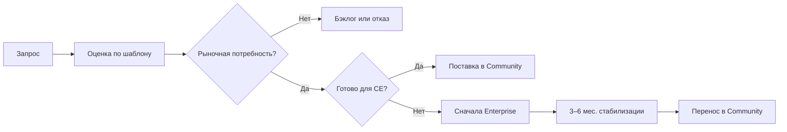

**[English](../../en/enterprise/community-enterprise-lifecycle.md)** | Русский

# Жизненный цикл Community и Enterprise

**Аудитория:** контрибьюторы, партнёры, enterprise-заказчики  
**Связанный документ:** [Шаблон оценки запроса на функцию](./feature-request-evaluation.md)

---

## Обзор

**DataSafeS3 Community Edition (CE)** — открытый продукт в этом репозитории под лицензией **Apache-2.0**. Сегодня все функции продукта поставляются из main без платных gate.

**DataSafeS3 Enterprise** — отдельное коммерческое предложение для организаций, которым нужна поддержка вендора, сертифицированная поставка и договорные обязательства. Enterprise появляется **когда рынок этого требует**, а не как обязательное разделение с первого дня.

Документ описывает, как функции переходят между Enterprise и Community, что остаётся коммерческим навсегда и как оцениваются запросы.

---

## Модель продукта сегодня

| Аспект | Community Edition | Enterprise |
|--------|-------------------|------------|
| **Лицензия** | Apache-2.0 | Коммерческое соглашение |
| **Исходники** | Этот репозиторий (main) | Тот же код; при запуске Enterprise возможен отдельный канал дистрибуции |
| **Функции** | Полная поверхность продукта в main | Дополнительные услуги и упаковка, а не произвольное удержание базовых возможностей от CE |
| **Поддержка** | Community (issues, discussions) | Платная поддержка со SLA |
| **Сборки** | Релизные образы (GHCR, SBOM, Cosign) | Сертифицированные сборки, пакеты аттестации для закупок |

Enterprise **не** означает «форк, скрывающий хранение или governance от сообщества». Это **коммерческая упаковка** вокруг той же платформы, когда заказчики платят за подотчётность, а не за базовую функциональность.

---

## Поток от запроса к поставке

1. **Запрос** — заказчик, партнёр или контрибьютор предлагает функцию или кастомизацию.
2. **Оценка** — заполнить [шаблон оценки запроса](./feature-request-evaluation.md).
3. **Решение**
   - **Community сейчас** — широкая ценность для CE, низкий операционный риск.
   - **Сначала Enterprise** — сильный коммерческий сигнал; поставка на условиях Enterprise, затем открытие для CE.
   - **Бэклог** — идея валидна, сигнал или ресурсы недостаточны.
   - **Отказ** — вне scope продукта или противоречит принципам CE.
4. **Поставка Enterprise-first** — реализация и поддержка в Enterprise; фиксация в публичном календаре зрелости.
5. **Миграция в Community** — через **3–6 месяцев** промышленной эксплуатации и накопления опыта поддержки — перенос в CE (Apache-2.0), если функция не в списке permanent Enterprise-only.

Ритм **сначала Enterprise, потом Community** позволяет платящим заказчикам финансировать рискованную или нишевую работу, сохраняя полноту открытой редакции со временем.

---

## Критерии оценки

Запрос подходит для **Enterprise-first** (вместо немедленного CE), если выполняются **минимум два** из четырёх критериев:

| # | Критерий | Вопрос |
|---|----------|--------|
| 1 | **Платящие заказчики** | Один или несколько Enterprise-заказчиков профинансируют или потребуют это в ближайшие два квартала? |
| 2 | **Блокер сделки** | Отсутствие функции блокирует активную enterprise-закупку или продление? |
| 3 | **Высокая стоимость поддержки** | Релиз для всего CE создаст непропорциональную нагрузку на поддержку до отработки паттернов? |
| 4 | **Узкая аудитория CE** | Маловероятно, что **80% развёртываний CE** понадобится это в течение **шести месяцев**? |

Если меньше двух критериев и функция в scope продукта — предпочитайте **Community сейчас**.

Для скоринга, согласования и целевого квартала миграции в CE используйте [шаблон оценки](./feature-request-evaluation.md).

---

## Permanent Enterprise-only

Эти возможности остаются **коммерческими** и не мигрируют в Community:

| Категория | Примеры |
|-----------|---------|
| **Поддержка и SLA** | Поддержка 24×7, гарантии времени реакции, выделенная эскалация |
| **Сертифицированная поставка** | Аттестация вендора для RFP, именованная сертификация релиза |
| **Профессиональные услуги** | Кастомная интеграция, внедрение на площадке, обучение по договору |
| **Коммерческие условия** | Многолетние соглашения, indemnification, пакеты export compliance |

Продуктовые **функции** (API, консоль, поведение хранения) по умолчанию не попадают в этот список. Если возможность технически эксклюзивна для Enterprise, в календаре зрелости указывается причина и срок.

---

## Публичный календарь зрелости функций

DataSafeS3 ведёт **публичный календарь зрелости** (рядом с release notes), где видно:

| Поле | Смысл |
|------|--------|
| **Функция** | Краткое имя и ссылка на документацию |
| **Статус** | `Planned` · `Enterprise preview` · `Enterprise GA` · `CE migration scheduled` · `Community GA` |
| **Enterprise GA** | Квартал, когда платящие заказчики получают функцию на условиях Enterprise |
| **Целевой квартал CE** | Планируемый релиз Apache-2.0 (или `Enterprise-only` с причиной) |
| **Примечания** | Breaking changes, шаги миграции, зависимости |

Календарь — единый источник правды для вопроса «когда это появится в CE?». Контрибьюторы обновляют его при одобрении Enterprise-first функции или при установке даты миграции в CE.

---

## Товарный знак

**DataSafeS3** — товарный знак Ilya Trachuk. Лицензия Apache-2.0 разрешает использование **программного обеспечения**; она **не** даёт права использовать имя **DataSafeS3** для производных продуктов или услуг без разрешения.

- **Допустимо:** «На базе DataSafeS3 Community Edition», «совместимый с DataSafeS3 API», фактические упоминания в документации.
- **Требует разрешения:** названия продуктов с намёком на официальную поддержку («DataSafeS3 Pro от Acme»), модифицированные логотипы как официальные, маркетинг с намёком на аффилиацию без соглашения.

См. [LICENSE](../../../LICENSE) в репозитории.

---

## Принципы

1. **CE остаётся полным** — открытая редакция остаётся жизнеспособной self-hosted платформой; Enterprise финансирует услуги и ранний доступ, а не постоянное урезание CE.
2. **Прозрачные сроки** — у Enterprise-first функций публикуется целевой квартал миграции в CE, если только они не permanent commercial (поддержка/SLA/сертификация).
3. **Без позиционирования через сравнения** — продуктовые документы описывают ценность DataSafeS3; см. [ТЗ продуктовой документации](../specs/product-documentation-tz.md).
4. **Одна кодовая база** — избегать долгоживущих проприетарных форков; feature flags, упаковка или каналы дистрибуции до обоснованного отдельного репозитория.

---

## Связанная документация

- [Шаблон оценки запроса на функцию](./feature-request-evaluation.md)
- [Contributing](../../../CONTRIBUTING.md)
- [ТЗ продуктовой документации](../specs/product-documentation-tz.md)
- [Security self-assessment](../../operations-guide/ru/security-self-assessment.md) — контроли CE vs внешний аудит
