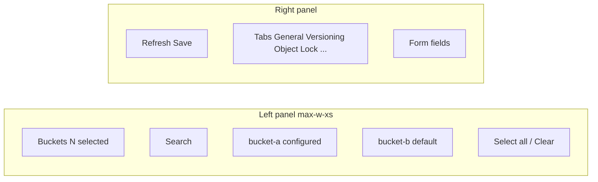

**[English](../../en/specs/bucket-settings-multi-select-tz.md)** | Русский

# ТЗ: Мульти-выбор бакетов в Bucket Settings (Admin)

**Версия:** 1.0  
**Дата:** 2026-06-18  
**Статус:** К реализации  
**Связанные файлы:** `web/console/src/pages/settings-buckets.tsx`, `web/console/src/components/settings/BucketSettingsTabs.tsx`, `web/console/src/lib/api.ts`, `docs/specs/settings-ui-split-tz.md`

---

## 1. Цель

Дать администратору возможность **выбрать несколько бакетов** на странице **Administration → Settings → Bucket settings** и применить одни и те же настройки (visibility, квоты, versioning и т.д.) ко всем выбранным бакетам за одно действие **Save**.

### Проблема сейчас

Глобальный picker — одиночный `<Select>`. Массовая настройка десятков бакетов требует повторять Save для каждого.

### Ожидаемый результат

- Удобная навигация: searchable checklist слева, форма справа.
- Корректная обработка **смешанного состояния** (у выбранных бакетов разные значения полей).
- Два режима применения: **перезаписать всё** / **только пустые поля**.
- Deep link и обратная совместимость с `?bucket=name`.
- Без изменений REST API (цикл `PUT` на фронтенде).

---

## 2. UX-потоки

### 2.1. Массовое применение настроек

1. Администратор открывает `/admin/settings/buckets`.
2. В левой панели отмечает 2+ бакета (поиск по имени).
3. Справа форма показывает общие значения; поля с расхождениями — **«Multiple values»** (или счётчик «3 values»).
4. Меняет, например, **Visibility → Public read**.
5. Нажимает **Save**.
6. Если хотя бы у одного выбранного бакета есть ненулевые настройки (badge **configured**) и режим **Overwrite all** — диалог: *«Apply to N buckets? Existing settings will be replaced.»*
7. Toast: *«Saved 3/3 buckets»* или *«Saved 2/3 buckets (1 failed)»* с именем ошибки.

### 2.2. Один бакет (регрессия)

Поведение как сейчас: один чекбокс / один бакет в списке, форма без mixed-state, Save без диалога (если не bulk overwrite с configured).

### 2.3. Deep link

| URL | Поведение |
|-----|-----------|
| `?bucket=my-bucket` | Выбран один бакет (обратная совместимость) |
| `?buckets=a,b,c` | Выбраны a, b, c |
| Оба параметра | `buckets` имеет приоритет; несуществующие имена игнорируются |

При изменении выбора URL обновляется (`buckets=` при 2+, `bucket=` при 1, параметр удаляется при 0).

### 2.4. Минимум один бакет

Без выбранных бакетов форма скрыта, подсказка: *«Select at least one bucket to edit settings.»*

---

## 3. Паттерн UI: multi-select checklist

### Макет (desktop)



- Левая колонка: `max-w-xs`, фиксированная на `lg+`; на узком экране — сверху.
- Чекбокс + имя + badge:
  - **configured** — есть хотя бы одно отклонение от дефолта (см. §4.2).
  - **default** — все поля по умолчанию.
- Поиск фильтрует список без сброса выбора.
- **Select all** / **Clear** — только видимые (после фильтра) / все.

### Режим применения (над формой или в header)

Radio или Select:

| Режим | EN (UI) | Поведение |
|-------|---------|-----------|
| `overwrite` | Overwrite all | `PUT` с полным телом draft для каждого бакета |
| `only_empty` | Only empty fields | Для каждого бакета отправляются только поля, которые у **этого** бакета пустые/дефолтные |

---

## 4. Смешанное состояние (mixed state)

### 4.1. Определение

При выборе N бакетов для каждого редактируемого поля сравниваются значения всех выбранных. Если не совпадают — поле **mixed**.

Сравниваемые поля: `description`, `versioning_enabled`, `object_lock_enabled`, `retention_days`, `storage_class`, `visibility`, `max_size_bytes`, `max_objects`, `lifecycle_rules` (deep JSON compare).

`owner`, `name`, `tenant_id`, `tags` — не bulk-редактируются в v1 (owner read-only; tags остаются в bucket detail).

### 4.2. Badge «configured»

Бакет считается **configured**, если выполняется хотя бы одно:

- `description` не пустой
- `versioning_enabled === true`
- `object_lock_enabled === true`
- `storage_class` задан и не `"hot"`
- `visibility !== "private"`
- `max_size_bytes > 0` или `max_objects > 0`
- `lifecycle_rules.length > 0`

### 4.3. Отображение mixed в форме

| Тип поля | Mixed UI |
|----------|----------|
| Text / number | placeholder «Multiple values», пустое value |
| Select | пункт «Multiple values» (disabled value `__mixed__`) |
| Checkbox | `indeterminate` + label «Multiple values» |
| Lifecycle JSON | placeholder + подсказка «N buckets differ» |

Редактирование mixed-поля снимает mixed для этого поля и задаёт единое значение для Save.

---

## 5. Режимы применения (детально)

### Overwrite all

Для каждого выбранного бакета:

```http
PUT /api/v1/settings/buckets/{name}
Content-Type: application/json

{ полный draft без name/owner }
```

### Only empty fields

Для каждого бакета формируется частичное тело: поле включается, если у **этого** бакета оно пустое/дефолтное **или** пользователь явно изменил mixed-поле (после редактирования).

Дефолты: см. §4.2 (инверсия configured).

---

## 6. API-стратегия

### Выбор: **Option A — цикл PUT на фронтенде**

| Критерий | Option A (цикл PUT) | Option B (batch endpoint) |
|----------|-------------------|----------------------------|
| Изменения бэкенда | Нет | Новый handler, тесты, документация |
| Согласованность с TZ split | Да («API не меняем») | Расширение API |
| Partial failure | Естественно (per-bucket) | Нужен составной ответ |
| Объём кода | Меньше | Больше |

**Решение:** Option A. Хелпер `api.batchUpdateBucketSettings(names, body)` — `Promise.allSettled` по `updateBucketSettings`.

Новый batch endpoint — backlog (если >50 бакетов и нужна атомарность).

---

## 7. Роли и доступ

Без изменений относительно `settings-ui-split-tz.md`:

- Страница `/admin/settings/buckets` — только `administrator` (`AdminRoute`).
- `PUT /api/v1/settings/buckets/{name}` — `adminOnly` + `canWriteBucket` в handler.
- При partial failure 403 на отдельном бакете — показать в toast, остальные сохранить.

---

## 8. Критерии приёмки

### Навигация и выбор

- [ ] Searchable multi-select checklist заменяет одиночный Select.
- [ ] Badges configured / default на каждом бакете.
- [ ] Минимум 1 бакет для отображения формы.
- [ ] `?bucket=x` и `?buckets=a,b,c` работают; URL синхронизируется с выбором.

### Mixed state

- [ ] Два бакета с разной visibility — Select показывает «Multiple values».
- [ ] После смены visibility и Save — оба бакета обновлены (overwrite).

### Save

- [ ] Confirm dialog при overwrite и наличии configured бакетов в выборе.
- [ ] Toast «Saved N/M buckets»; при ошибках — имена бакетов.
- [ ] Режим only_empty: configured + default в выборе — квоты применяются только к default.

### Регрессия

- [ ] Один бакет — поведение как до задачи.
- [ ] `bucket-detail` → «Open in admin bucket settings» с `?bucket=` работает.
- [ ] `npm run build` PASS.

---

## 9. План реализации

1. **TZ** — этот документ.
2. **`lib/bucket-settings-merge.ts`** — `isBucketConfigured`, `mergeBucketSettings`, `buildBucketUpdatePayload`, `batchUpdateBucketSettings` в api.ts.
3. **`BucketSettingsPicker.tsx`** — левая панель: search, checklist, badges, select all/clear.
4. **`BucketSettingsTabs.tsx`** — prop `mixedFields: Set<string>`, mixed UI на полях.
5. **`settings-buckets.tsx`** — multi-select state, URL sync, confirm, save mutation.
6. **`docs/user-guide/README.md`** — секция bulk bucket settings.
7. Сборка, коммиты, push, `build-console.cmd` + restart caddy.

### Файлы

| Файл | Действие |
|------|----------|
| `docs/specs/bucket-settings-multi-select-tz.md` | create |
| `web/console/src/lib/bucket-settings-merge.ts` | create |
| `web/console/src/components/settings/BucketSettingsPicker.tsx` | create |
| `web/console/src/components/settings/BucketSettingsTabs.tsx` | modify |
| `web/console/src/pages/settings-buckets.tsx` | modify |
| `web/console/src/lib/api.ts` | modify (batch helper) |
| `docs/user-guide/README.md` | modify |

---

## 10. Риски

| Риск | Митигация |
|------|-----------|
| Большой выбор (100+ бакетов) — много PUT | Последовательный allSettled; batch API в backlog |
| Mixed lifecycle JSON — сложный UX | Placeholder + count; полная правка перезаписывает у всех |
| Несохранённые изменения при смене выбора | `window.confirm` при dirty draft |
| only_empty неочевиден для пользователя | Краткое описание под переключателем режима |
| Partial 403 | Toast с перечислением failed buckets |

---

## Приложение. Пример verify

1. Создать `bucket-a` (private), `bucket-b` (public-read).
2. Выбрать оба → Visibility = «Multiple values».
3. Выбрать Private → Save (overwrite) → confirm → оба private.
4. Выбрать `bucket-a` (с квотами) + `bucket-b` (default) → Quotas → only_empty → квоты только у `bucket-b`.
