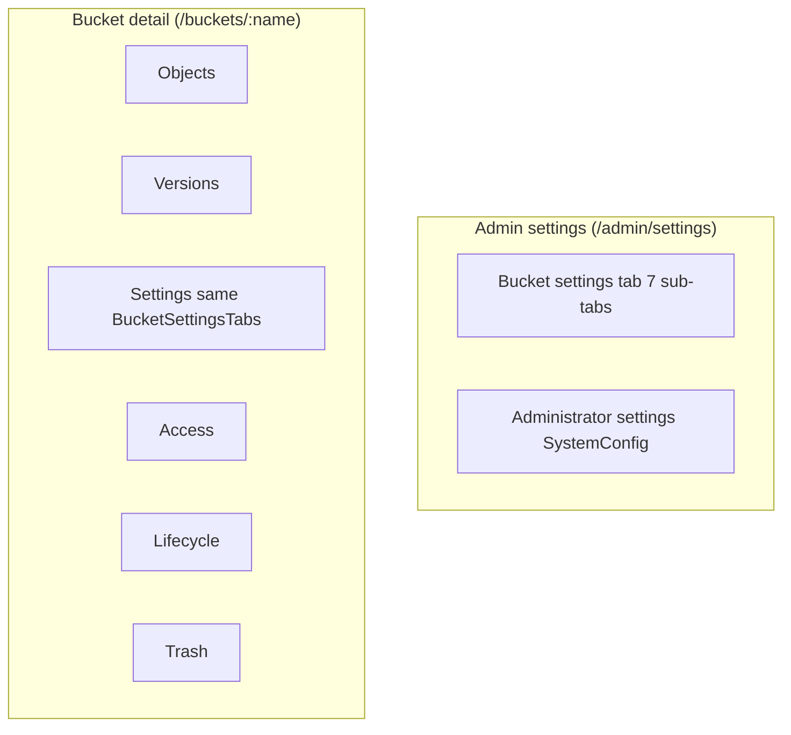

**[English](../../en/specs/settings-ui-split-tz.md)** | Русский

# ТЗ: Разделение UI настроек — Bucket Settings vs Administrator Settings

**Версия:** 1.0  
**Дата:** 2026-06-18  
**Статус:** Черновик (к реализации)  
**Связанные файлы:** `web/console/src/pages/settings.tsx`, `web/console/src/pages/bucket-detail.tsx`, `web/console/src/App.tsx`, `web/console/src/layouts/sidebar.tsx`, `web/console/src/lib/api.ts`

---

## 1. Цель и проблема

### Цель

Разделить смешанный экран **Administration → Settings** на два логически независимых раздела:

1. **Настройки бакетов (Bucket Settings)** — свойства конкретного бакета (versioning, visibility, квоты и т.д.).
2. **Настройки администратора (Administrator / System Settings)** — глобальная конфигурация установки (LDAP, OIDC, MFA policy, trash, logging, cluster).

### Текущая боль

Сейчас в одном файле `web/console/src/pages/settings.tsx` (~576 строк) на одной прокручиваемой странице `/admin/settings` одновременно отображаются:

- выбор бакета и 7 вкладок bucket settings (General, Versioning, Object Lock, Storage Class, Lifecycle, Visibility, Quotas);
- карточки system settings: Soft delete / Trash, LDAP, OIDC, MFA policy, Cluster (MVP), External logging.

**Последствия:**

| Проблема | Пример |
|----------|--------|
| Когнитивная перегрузка | Админ ищет LDAP, но видит квоты бакета и lifecycle JSON |
| Дублирование UI | Bucket settings есть и в `settings.tsx`, и (урезанно) во вкладке **Settings** на `bucket-detail.tsx` |
| Разный UX одних полей | В admin Settings — полный набор вкладок; в bucket detail — versioning + visibility + quotas, lifecycle — отдельная вкладка, object lock / storage class отсутствуют |
| Неточная документация | `docs/context/ui.md` описывает `/admin/settings` только как «Bucket settings», хотя там и system config |
| Путаница с MFA | Политика «Require MFA for administrators» в Settings, личная настройка TOTP — в **Profile** |

Задача **только UI** — REST API не меняем (см. §8).

---

## 2. Терминология

| Термин (RU) | EN (UI) | Описание |
|-------------|---------|----------|
| **Настройки бакета** | Bucket Settings | Параметры одного бакета: описание, versioning, object lock, storage class, lifecycle, visibility, квоты, теги |
| **Настройки администратора** | Administrator Settings | Глобальный `SystemConfig`: trash, LDAP, OIDC, MFA policy, cluster config, external logging |
| **Системные настройки** | System Settings | Синоним Administrator Settings; бэкенд: `GET/PUT /api/v1/settings/system` |
| **Контекст бакета** | Bucket context | Страница `/buckets/:bucketName` — настройки привязаны к имени бакета из URL |
| **Глобальный список бакетов** | Global bucket picker | Admin-страница с `Select` по всем бакетам (`GET /api/v1/settings/buckets`) |

**Не входят в Administrator Settings (отдельные страницы, не переносим):**

- **Gateway** — `web/console/src/pages/gateway.tsx`, `/gateway`
- **Federation** (реестр удалённых кластеров) — `federation.tsx`, `/federation`
- **Cluster status** (мониторинг нод) — `cluster.tsx`, `/cluster`; редактирование `cluster.*` остаётся в System Settings
- **Webhooks** — `webhooks.tsx`, `/admin/webhooks`
- **Profile / личная MFA** — `profile.tsx`, `/profile`

---

## 3. Роли и доступ

### Роли в системе

| Роль | Источник | `isAdmin` в UI |
|------|----------|----------------|
| `administrator` | JWT `role` | `true` |
| `operator` | JWT `role` | `false` |
| `user` | JWT `role` | `false` |
| `tenant_admin` | `tenant_memberships[].role` + `is_tenant_admin` | `false` (но `isTenantAdmin`) |

Реализация: `web/console/src/hooks/use-auth.tsx`, типы в `web/console/src/lib/api.ts` (`UserRole`, `TenantRole`).

### Кто что видит (целевое состояние)

| Раздел UI | administrator | operator | user (владелец бакета) | tenant_admin |
|-----------|:-------------:|:--------:|:----------------------:|:------------:|
| Admin → **Administrator Settings** | ✓ | — | — | — |
| Admin → **Bucket Settings** (глобальный picker) | ✓ | — | — | — |
| Bucket detail → вкладка **Settings** | ✓ | ✓* | ✓* | ✓* |
| Bucket detail → **Access** | ✓ / tenant_admin tenant | — | — | ✓ (свой tenant) |
| Bucket detail → **Lifecycle** | ✓* | ✓* | ✓* | ✓* |

\* При наличии `canAccessBucket` / `canWriteBucket` на бэкенде.

### Ограничения API (важно для UI)

| Endpoint | Middleware | Фактическая проверка в handler |
|----------|------------|------------------------------|
| `GET /api/v1/settings/system` | `adminOnly` | — |
| `PUT /api/v1/settings/system` | `adminOnly` | — |
| `GET /api/v1/settings/buckets` | `adminOnly` | — |
| `PUT /api/v1/settings/buckets/{name}` | `adminOnly` | `canWriteBucket` |
| `GET /api/v1/buckets/{bucket}/settings` | `allRoles` | `canAccessBucket` |
| `PUT /api/v1/buckets/{bucket}/lifecycle` | `allRoles` | `canWriteBucket` |
| `PUT /api/v1/buckets/{bucket}/tags` | `allRoles` | `canWriteBucket` |

**Известное расхождение (зафиксировать в UI, не чинить API в этой задаче):** `bucket-detail.tsx` вызывает `api.updateBucketSettings` → `PUT /settings/buckets/{name}` (только administrator), хотя кнопка Save видна всем с доступом к бакету. При реализации: либо скрывать Save для не-admin, либо (отдельная задача) ослабить middleware на PUT.

**tenant_admin** не видит пункт Administration в sidebar (`sidebar.tsx`, строки 111–122), кроме **Tenants**. Доступ к bucket settings — через bucket detail, не через `/admin/settings`.

---

## 4. UI структура

### 4.1. Язык интерфейса

Консоль сейчас на **английском** (заголовки страниц, кнопки, вкладки). Брендинг sidebar — «Датасейф S3». В TZ для разработки:

| Элемент | EN (в UI) | RU (в документации) |
|---------|-----------|---------------------|
| Верхняя вкладка 1 | **Bucket settings** | Настройки бакетов |
| Верхняя вкладка 2 | **Administrator settings** | Настройки администратора |
| Пункт меню (опционально) | Settings | Настройки |

### 4.2. Placement в навигации

**Sidebar** (`web/console/src/layouts/sidebar.tsx`):

- Пункт `{ to: "/admin/settings", label: "Settings" }` остаётся в секции **Administration** (только `isAdmin`).
- Внутри страницы — **две верхние вкладки** (`Tabs` из `@/components/ui/tabs`), а не два пункта меню (избегаем раздувания admin nav).

Альтернатива (не рекомендуется в v1): два пункта меню «Bucket settings» / «System settings» — отклонено из-за 9+ пунктов в Administration.

### 4.3. Вкладка «Bucket settings» (глобальный admin)

**Где:** `/admin/settings/buckets` (или `/admin/settings` с default tab = buckets).

**Содержимое** — перенос из нижней части текущего `settings.tsx`:

- `PageHeader`: title «Bucket settings», description «Configure bucket properties, lifecycle, and quotas.»
- Кнопки Refresh / Save (как сейчас).
- `Select` выбора бакета (`api.listBucketSettings()`).
- Вложенные вкладки (сохранить имена):
  - General, Versioning, Object Lock, Storage Class, Lifecycle, Visibility, Quotas.

**Когда не bucket detail:** когда администратору нужен обзор **всех** бакетов без входа в object browser (массовая настройка, аудит квот).

### 4.4. Вкладка «Administrator settings»

**Где:** `/admin/settings/system`.

**Содержимое** — перенос system-карточек из `settings.tsx` (строки 167–396):

| Секция (Card) | Поля `SystemConfig` |
|---------------|---------------------|
| Soft delete / Trash | `soft_delete_enabled`, `trash_retention_days` |
| LDAP / Active Directory | `ldap.*` + кнопки Test / Sync |
| OIDC / SSO | `oidc.*` |
| MFA policy | `mfa.require_admin_mfa` |
| Cluster (MVP) | `cluster.distributed_mode`, `erasure_coding_planned`, `disk_paths` |
| External logging | `logging.syslog`, `loki`, `elasticsearch`, `webhook` |

`PageHeader`: title «Administrator settings», description «LDAP, SSO, logging, trash, and cluster configuration.»

Отдельные кнопки Save на карточках Trash и External logging можно объединить в одну **Save** в header вкладки (улучшение UX, опционально).

### 4.5. Bucket detail (контекст бакета)

**Где:** `/buckets/:bucketName` — вкладка **Settings** (уже есть, `TabsTrigger value="settings"`).

**Стратегия v1:**

1. Вынести общий компонент формы bucket settings (см. §10).
2. В bucket detail использовать **тот же компонент** в режиме `mode="compact"` или полный набор вкладок — решение: **полный набор вкладок** как в admin, но без глобального picker (бакет из URL).
3. Ссылка «Open in admin bucket settings» для administrator → `/admin/settings/buckets?bucket={name}`.
4. Вкладки **Lifecycle**, **Access**, **Trash** на bucket detail **остаются** (lifecycle — отдельный API и UX с таблицей правил; не дублировать в Settings tabs admin page при работе из bucket detail).

**Дублирование lifecycle:** в admin Bucket settings вкладка Lifecycle — JSON editor (`settings.tsx`); в bucket detail — визуальный редактор (`bucket-detail.tsx`, `TabsContent value="lifecycle"`). В v1 допустимо; в backlog — унифицировать на визуальный редактор.

---

## 5. Матрица настроек

| Настройка | Текущее расположение UI | Новое расположение UI | API endpoint | Роль (минимум) |
|-----------|-------------------------|----------------------|--------------|----------------|
| Description | `settings.tsx` General; `bucket-detail` Settings | Bucket settings | `PUT .../settings/buckets/{name}` | administrator* |
| Versioning | оба | Bucket settings | то же | administrator* |
| Object Lock + retention | `settings.tsx` | Bucket settings | то же | administrator* |
| Storage class | `settings.tsx` | Bucket settings | то же | administrator* |
| Lifecycle rules (JSON) | `settings.tsx` Lifecycle tab | Bucket settings | то же + `PUT .../buckets/{b}/lifecycle` | administrator* / write |
| Visibility | оба | Bucket settings | то же | administrator* |
| Quotas (size/objects) | оба | Bucket settings | то же | administrator* |
| Bucket tags | `bucket-detail` Settings | Bucket settings (добавить в общий компонент) | `PUT /api/v1/buckets/{bucket}/tags` | write |
| Tenant access grants | `bucket-detail` Access | без изменений | `PUT .../tenants/{t}/buckets/{b}/access` | tenant_admin |
| Soft delete / trash retention | `settings.tsx` (верх страницы) | Administrator settings | `GET/PUT /api/v1/settings/system` | administrator |
| LDAP | `settings.tsx` | Administrator settings | system + `POST .../settings/ldap/test|sync` | administrator |
| OIDC / SSO | `settings.tsx` | Administrator settings | system | administrator |
| MFA require for admins | `settings.tsx` | Administrator settings | system | administrator |
| Cluster config (edit) | `settings.tsx` | Administrator settings | system | administrator |
| Cluster status (read) | `cluster.tsx` | без изменений | `GET /api/v1/cluster/status` | administrator |
| External logging | `settings.tsx` | Administrator settings | system | administrator |
| Federation clusters | `federation.tsx` | без изменений | `/api/v1/federation/clusters` | administrator |
| Gateway / replication | `gateway.tsx` | без изменений | `/api/v1/gateway/*` | administrator |
| Webhooks | `webhooks.tsx` | без изменений | `/api/v1/webhooks` | administrator |
| Personal MFA (TOTP) | `profile.tsx` | без изменений | `/api/v1/mfa/*` | любой authed |
| IAM bucket policy | `policy.tsx` | без изменений | `GET/PUT .../buckets/{b}/policy` | administrator |

\* См. §3 — middleware `adminOnly` на PUT; отображение read-only для не-admin через `GET /buckets/{b}/settings`.

---

## 6. Маршруты

### 6.1. Целевая схема

```
/admin/settings                    → redirect → /admin/settings/buckets
/admin/settings/buckets            → Bucket settings (admin, глобальный picker)
/admin/settings/system             → Administrator settings (admin)
/admin/settings/buckets/:name      → опционально v1.1: deep link с предвыбранным бакетом

/buckets/:bucketName               → bucket detail (tab query, см. ниже)
/buckets/:bucketName?tab=settings  → открыть вкладку Settings
/buckets/:bucketName?tab=lifecycle → без изменений

/legacy:
  /settings                        → redirect /admin/settings (если admin) иначе /
```

### 6.2. Изменения в `App.tsx`

Текущий маршрут:

```tsx
<Route path="admin/settings" element={<AdminRoute><SettingsPage /></AdminRoute>} />
```

Целевой вариант — вложенные маршруты или один `SettingsLayoutPage`:

```tsx
<Route path="admin/settings" element={<AdminRoute><SettingsLayoutPage /></AdminRoute>}>
  <Route index element={<Navigate to="buckets" replace />} />
  <Route path="buckets" element={<BucketSettingsPage />} />
  <Route path="system" element={<AdministratorSettingsPage />} />
</Route>
```

Редирект со старого URL: `admin/settings` → `admin/settings/buckets` (сохранить bookmark'и).

### 6.3. Синхронизация tab ↔ URL

- Admin settings: path-based (`/buckets` vs `/system`).
- Bucket detail: добавить `useSearchParams` — `?tab=settings` при загрузке выставляет `Tabs` value (сейчас только внутренний state).

---

## 7. Поведение по ролям

| Сценарий | Поведение |
|----------|-----------|
| `user` открывает `/admin/settings` | `AdminRoute` → redirect `/` (`App.tsx`) |
| `tenant_admin` открывает `/admin/settings` | redirect `/` |
| `administrator` открывает `/admin/settings/system` | полный доступ, загрузка `api.getSystemConfig()` |
| `administrator` на `/admin/settings/buckets` | `api.listBucketSettings()`, save через `api.updateBucketSettings` |
| Не-admin на bucket detail Settings | показать форму (данные из `api.getBucketSettings`); кнопку **Save** — `disabled` + tooltip «Administrator only» до исправления API |
| `tenant_admin` на bucket detail Access | без изменений (`showAccessTab`) |
| Deep link не-admin на `/admin/settings/system` | redirect `/` |

---

## 8. Миграция UI (без breaking API)

### Удалить / переместить

| Действие | Файл |
|----------|------|
| Разбить монолит | `settings.tsx` → layout + 2 page/component |
| Вынести bucket tabs | новый `components/settings/bucket-settings-tabs.tsx` |
| Вынести system cards | новый `components/settings/administrator-settings.tsx` |
| Подключить в bucket detail | `bucket-detail.tsx` — импорт `BucketSettingsTabs` |
| Обновить маршруты | `App.tsx` |
| Обновить ссылку в Cluster | `cluster.tsx` строка 18: «Admin → Settings» → «Admin → Settings → Administrator settings» |
| Обновить docs | `docs/context/ui.md` — таблица маршрутов |

### Не менять

- Все пути `/api/v1/settings/*`, `/api/v1/buckets/{bucket}/settings`, LDAP test/sync.
- Sidebar label «Settings» (достаточно внутренних вкладок).
- Отдельные страницы Gateway, Federation, Cluster, Webhooks, Profile.

### Обратная совместимость

- Редирект `/admin/settings` → `/admin/settings/buckets`.
- Query `?bucket=name` на `/admin/settings/buckets` для замены ручного выбора в Select.

---

## 9. Acceptance criteria

### Навигация и маршруты

- [ ] `/admin/settings` редиректит на `/admin/settings/buckets`.
- [ ] На `/admin/settings/buckets` и `/admin/settings/system` видны две верхние вкладки с переключением без потери auth.
- [ ] Не-admin не может открыть admin settings (redirect `/`).

### Bucket settings

- [ ] Глобальная страница: выбор бакета, все 7 подвкладок работают как до рефакторинга.
- [ ] Save вызывает `api.updateBucketSettings`, toast «Settings saved», invalidate `["bucket-settings"]`.
- [ ] Bucket detail вкладка Settings использует общий компонент; поля versioning, visibility, quotas, description синхронны с admin.
- [ ] `?tab=settings` на `/buckets/:name` открывает нужную вкладку.

### Administrator settings

- [ ] LDAP Test / Sync, OIDC поля, MFA policy, trash, cluster, logging — только на `/admin/settings/system`.
- [ ] На `/admin/settings/buckets` **нет** карточек LDAP/OIDC/Trash/logging.
- [ ] Save system config: `api.updateSystemConfig`, trash retention validation 1–3650 дней.

### Регрессии

- [ ] `scripts/feature-audit-test.ps1` — секции System settings, bucket settings PUT — PASS.
- [ ] Cluster page по-прежнему показывает status; ссылка на правильный подраздел settings.
- [ ] Profile MFA не затронут.

---

## 10. План реализации (для агента)

Порядок шагов:

1. **Создать компоненты** (без смены маршрутов):
   - `web/console/src/components/settings/bucket-settings-tabs.tsx` — props: `bucketName`, `draft`, `onDraftChange`, `onSave`, `isSaving`, `readOnly?`.
   - `web/console/src/components/settings/administrator-settings.tsx` — props: `draft: SystemConfig`, `onDraftChange`, `onSave`, trash unit state.
   - `web/console/src/components/settings/settings-layout.tsx` — верхние Tabs + `<Outlet />` или children.

2. **Создать страницы:**
   - `web/console/src/pages/settings-buckets.tsx` — логика picker + query `listBucketSettings` из текущего `settings.tsx`.
   - `web/console/src/pages/settings-system.tsx` — логика `getSystemConfig` / `updateSystemConfig`.

3. **Обновить `App.tsx`** — вложенные маршруты §6.2, редирект index.

4. **Удалить/сократить `settings.tsx`** — заменить на re-export layout или удалить после переноса.

5. **Рефакторинг `bucket-detail.tsx`:**
   - Заменить inline Settings card (строки 783–841) на `<BucketSettingsTabs ... />`.
   - Добавить `useSearchParams` для `tab`.
   - `readOnly={!isAdmin}` на Save (временно).

6. **Правки второго порядка:**
   - `cluster.tsx` — текст ссылки.
   - `docs/context/ui.md` — маршруты.
   - `web/console/src/components/global-search.tsx` — если есть ссылки на settings (проверить).

7. **Сборка:** `cd web/console && npm run build`.

8. **Аудит:** `scripts/feature-audit-test.ps1` (или preflight).

### Оценка файлов

| Файл | Действие |
|------|----------|
| `settings.tsx` | split / delete |
| `settings-buckets.tsx` | create |
| `settings-system.tsx` | create |
| `components/settings/*` | create (3 файла) |
| `bucket-detail.tsx` | modify |
| `App.tsx` | modify |
| `sidebar.tsx` | без изменений (v1) |
| `api.ts` | без изменений |

---

## 11. Риски и edge cases

| Риск | Митигация |
|------|-----------|
| **Deep links** `/admin/settings` в README, Grafana, закладки | Permanent redirect на `/admin/settings/buckets` |
| **Несохранённые изменения** при переключении верхних вкладок | `window.confirm` или toast «Unsaved changes» если draft !== server |
| **Два источника lifecycle** (JSON vs table) | Документировать; не редактировать lifecycle в двух местах одновременно |
| **MFA policy vs Profile** | В Administrator settings подсказка: «Personal MFA → Profile» |
| **Mobile / узкий экран** | Карточки system settings уже в `grid lg:grid-cols-2`; проверить горизонтальный скролл подвкладок bucket |
| **Пустой список бакетов** | Как сейчас: только Administrator settings доступны (trash card); bucket tab — empty state «Create a bucket…» |
| **PUT bucket settings только admin** | UI read-only + tooltip; в TZ backlog — API `allRoles` + `canWriteBucket` |
| **Federation/Cluster в sidebar без AdminRoute** | Federation/Cluster API — `adminOnly`; страницы отдают ошибку не-admin — вне scope, но не путать с Settings |

---

## 12. Тестирование

### Ручное

| # | Шаг | Ожидание |
|---|-----|----------|
| 1 | Login как administrator → Administration → Settings | Две вкладки; default Bucket settings |
| 2 | Переключить на Administrator settings | LDAP, OIDC, logging; нет bucket Select |
| 3 | Изменить trash retention → Save → refresh | Значение сохраняется |
| 4 | Bucket settings → выбрать бакет → Versioning on → Save | `feature-audit` совместимо |
| 5 | `/buckets/{name}?tab=settings` | Вкладка Settings активна |
| 6 | Login как user → `/admin/settings` | Redirect `/` |
| 7 | user → свой бакет → Settings | Форма видна; Save disabled (v1) |
| 8 | Profile → MFA enroll | Работает независимо от Administrator settings |

### Автоматическое / audit script

Файл: `scripts/feature-audit-test.ps1`

Затрагиваемые проверки (строки ~106–116, 327–416, 578):

- `GET /api/v1/buckets/{bucket}/settings` — visibility
- `GET/PUT /api/v1/settings/system` — soft delete, logging sinks
- `PUT /api/v1/settings/buckets/{bucket}` — versioning, quotas
- `POST /api/v1/settings/ldap/test`

**Изменения скрипта не обязательны** (API те же). Опционально: добавить комментарий в `HANDOFF.md` / `feature-audit-report.md`, что UI разделён, endpoints без изменений.

### Сборка frontend

```cmd
cd web\console
npm run build
```

---

## Приложение A. Инвентаризация текущего кода

### `settings.tsx` (монолит `/admin/settings`)

| Строки (прибл.) | Блок |
|-----------------|------|
| 31–69 | `getSystemConfig`, save system (trash) |
| 71–107 | `listBucketSettings`, save bucket |
| 167–205 | Card: Soft delete / Trash |
| 207–396 | Cards: LDAP, OIDC, MFA, Cluster, External logging |
| 398–571 | Tabs: bucket General … Quotas |

### `bucket-detail.tsx`

| Вкладка | Строки (прибл.) | API |
|---------|-----------------|-----|
| Settings | 783–841 | `getBucketSettings`, `updateBucketSettings`, `putBucketTags` |
| Access | 843–927 | tenant bucket access |
| Lifecycle | 929+ | `getLifecycle`, `putLifecycle` |
| Trash | ~980 | `listTrash` |

### Sidebar (`adminNav`)

`Users`, `Tenants`, `Gateway`, `Federation`, `Cluster`, `Policies`, `Activity`, `Webhooks`, **`Settings`** → `/admin/settings`.

---

## Приложение B. Рекомендуемый split (кратко)



**Administrator settings** = trash + LDAP + OIDC + MFA policy + cluster edit + logging.  
**Bucket settings** = всё per-bucket, включая visibility и квоты.  
**Всё остальное** (Gateway, Federation status, Webhooks, Profile MFA) — отдельные пункты меню без переноса.
