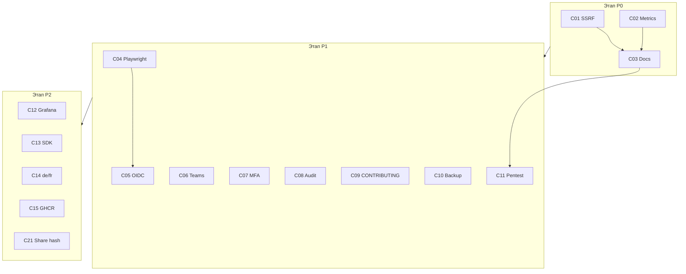

**[English](../../specs/v1.1.0-trust-debt-oss-growth-tz.md)** | Русский

# ТЗ: DataSafeS3 v1.1.0 — Trust Debt & OSS Growth

**Версия:** 1.0  
**Дата:** 2026-07-03  
**Статус:** Draft  
**Charter:** Первый **minor** после trust-line v1.0.x — закрытие **запланированного security debt**, усиление **CI/E2E гейтов**, **contributor-ready** репозиторий. Без hyperscale HA, mobile GA, Enterprise KMS и field encryption v2.  
**Baseline release:** [v1.0.3](https://github.com/DirektorBani/DataSafeS3/releases/tag/v1.0.3)  
**Решение по scope (internal):** `_local/publishing/v1.1.0-scope-decision-2026-07-03.md`  
**Связанные документы:**

| Документ | Путь |
|----------|------|
| Upgrade guide EN/RU | `docs/operations-guide/en/upgrade.md`, `docs/operations-guide/ru/upgrade.md` |
| CHANGELOG | `CHANGELOG.md` |
| Статус проекта | `docs/ru/context/project-status.md` |
| Security self-assessment | `docs/operations-guide/ru/security-self-assessment.md` |
| Граница field encryption | `_local/publishing/field-encryption-governance-decision-2026-06-30.md` |
| Roadmap AUD-* | `docs/ru/context/roadmap.md` |
| Конкурентная страница | `docs/en/why-datasafes3-vs.md` |

---

## 1. Executive summary (RU)

**DataSafeS3 CE v1.1.0** — первый minor после линии доверия v1.0.x. Релиз **не расширяет** hyperscale/mobile/Enterprise KMS; он **закрывает запланированный security contract** (SSRF escape hatch, auth на `/metrics`), усиливает **автоматические гейты** (Playwright, feature-audit) и делает репозиторий **готовым для contributors**.

**Бизнес-ценность OSS:** операторы regulated self-hosted S3 получают предсказуемый путь миграции; интеграторы — CI шире smoke; админы CE — Teams/MFA UX без license gates. Целевая зрелость **≥9.2/10**.

**Вне тега:** Vault Transit in-process (PO 9.2), mobile GA, Kafka, auto-failover, production erasure, **field encryption v2** — отдельный epic.

---

## 2. Цели и non-goals

### 2.1 Цели

См. таблицу G1–G12 в [английской версии](../../specs/v1.1.0-trust-debt-oss-growth-tz.md#2-goals--non-goals) — идентичный scope: C01–C15, C21.

### 2.2 Non-goals

Scope decision §6; [field-encryption-governance-decision](../../_local/publishing/field-encryption-governance-decision-2026-06-30.md): field enc v2, mobile, Kafka, auto-failover, Vault Transit in-process, license gates на CE.

---

## 3. Метрики успеха

| Метрика | Baseline (v1.0.3) | Цель (v1.1.0) |
|---------|-------------------|---------------|
| Внутренняя зрелость /10 | 9.0 | **≥9.2** |
| Feature-audit | 100/105, 4 SKIP | **≥103/105**, ≤2 SKIP |
| Playwright CI | только smoke | **≥6 specs** green на PR |
| Security P0 open | metrics auth, SSRF hatch | **0** |
| Competitive narrative Δ | 8.7 | **+0.2** (internal) |
| Contributor friction | minimal CONTRIBUTING | Расширенный guide + **3+** `good first issue` |
| Breaking changes | 0 | **2** (SSRF, metrics) |
| Production adopters | 0 | Трекинг; **не gate** |

---

## 4. Поэтапная реализация

### Этап P0 — Must ship (блокер релиза)

**Ёмкость:** ~2–3 dev-weeks + QA.  
**Гейт этапа:** `go test ./...`; `security_remediation_test.go` green; feature-audit **0 FAIL**; C01–C03; upgrade docs **до** тега.

---

#### C01 — Удаление `STORAGE_OUTBOUND_HTTP_ALLOW`

| Поле | Значение |
|------|----------|
| **PO** | **5.8 / 10** · **CE** · M |

**Бизнес-ценность:** Запланированное breaking change закрывает SSRF escape hatch для всех CE production. Private Loki/ES → HTTPS или `STORAGE_DEV=true` только на non-prod.

**Спецификация для агента:** см. AC-C01-1 … AC-C01-8 в [EN TZ § C01](../../specs/v1.1.0-trust-debt-oss-growth-tz.md#c01--remove-storage_outbound_http_allow).

**Ключевые пути:** `internal/security/urlpolicy/urlpolicy.go`, `internal/api/security_remediation_test.go`, `docker-compose.audit.yml`.

**Реализация (шаги):**

1. Удалить ветку `STORAGE_OUTBOUND_HTTP_ALLOW` из `DefaultOptions()`.
2. Заменить `TestPutLoggingConfig_allowsLoopbackWhenOutboundHTTPAllow` на dev-mode тест.
3. Очистить compose/Helm/env.
4. `go test ./internal/security/urlpolicy/... ./internal/api/... -run 'PutLoggingConfig|HooksTest'`.

**Автотесты:** `urlpolicy_test.go`; `TestSSRFRegressionMatrix_v110` в `security_remediation_test.go`; feature-audit ES/Loki с `STORAGE_DEV=true`.

**Миграции БД:** **нет**.

**Документация EN/RU:** `upgrade.md` § v1.1.0; `security-self-assessment.md`; `monitoring.md`; `SECURITY.md`.

**DoD:** AC-C01-1…7; ноль runtime-ссылок на env; audit 0 FAIL.

---

#### C02 — Аутентификация `/metrics` (`STORAGE_METRICS_TOKEN`)

| Поле | Значение |
|------|----------|
| **PO** | **5.4 / 10** · **CE** · M |

**Бизнес-ценность:** Закрывает observability leak для regulated pilots; Prometheus scrape с `Authorization: Bearer`.

**Спецификация:** AC-C02-1 … AC-C02-9 — [EN § C02](../../specs/v1.1.0-trust-debt-oss-growth-tz.md#c02--metrics-authentication-storage_metrics_token).

**Реализация:** `MetricsAuthHandler` в `internal/observability/metrics.go`; wire в `server.go:~549`; 4-case matrix тестов.

**Автотесты:**

| Уровень | Артефакт |
|---------|----------|
| Go | `metrics_auth_test.go` — `TestMetricsAuth_*` (4 кейса) |
| Go | `security_remediation_test.go` — `TestMetricsEndpoint_*` |
| Compose | `docker-compose.security-test.yml`, `.env.security-test` |
| Audit | `feature-audit-test.ps1` + `AUDIT_METRICS_TOKEN` |

**Миграции БД:** **нет**.

**Документация:** `monitoring.md` EN/RU; `upgrade.md`; Helm README; `.env.example`.

**DoD:** 4-case matrix green; пример scrape в ops guide.

---

#### C03 — Upgrade guide EN/RU + CHANGELOG

| Поле | Значение |
|------|----------|
| **PO** | **4.2 / 10** · **CE** · S |

**Бизнес-ценность:** Обязательные migration comms для двух breaking changes.

**Спецификация:** AC-C03-1 … AC-C03-5 — [EN § C03](../../specs/v1.1.0-trust-debt-oss-growth-tz.md#c03--v110-upgrade-guide-enru--changelog).

**Миграции БД:** **нет**.

**DoD:** `CHANGELOG [1.1.0]`; EN/RU upgrade § v1.1.0; `project-status` обновлён.

---

### Этап P1 — High value (в теге при ёмкости; иначе 1.1.1)

**Гейт:** P0 готов; ≥6 Playwright specs; AUD-15/18 при C08.

---

#### C04 — Расширение Playwright CI (≥6 specs)

| **PO 5.1** · CE · M | **Зона решения ≥5.1 — approval maintainer** |

**Бизнес-ценность:** Phase 4 starter; доверие contributors.

**Спецификация:** `smoke`, `buckets`, `settings`, `files`, `share`, `security-mfa` в `.github/workflows/ci.yml`.

**Автотесты:** 6+ `web/console/e2e/*.spec.ts`; CI job `e2e-smoke`.

**Миграции:** **нет**. **Docs:** `CONTRIBUTING.md`, `project-status.md`.

---

#### C05 — OIDC Keycloak browser E2E (AUD-14)

| **PO 4.8** · CE · L |

**Бизнес-ценность:** SSO credibility; закрытие AUD-14 partial.

**Спецификация:** `security-oidc-keycloak.spec.ts`; real redirect; `exchange_code` flow; nightly/optional CI.

**Пути:** `auth_handlers.go`, `login.tsx`, `scripts/oidc-browser-e2e.mjs`, `scripts/start-keycloak-test.cmd`.

**Миграции:** **нет**. **Docs:** `onboarding.md` EN/RU.

---

#### C06 — Teams: Admin REST API + консоль

| **PO 5.3** · CE · M | **Hybrid zone — approval** |

**Бизнес-ценность:** Metadata/RBAC Teams есть (`TestTeamBucketVisibility`), **HTTP API и UI отсутствуют**. Не путать с Tenant Groups (`/api/v1/tenants/{id}/groups`).

**Спецификация:**

- `internal/api/teams_handlers.go` — CRUD teams, members
- Routes: `GET/POST /api/v1/teams`, `GET/PUT/DELETE /api/v1/teams/{id}`, members endpoints
- UI: `web/console/src/pages/teams.tsx`, sidebar, i18n `teams:*`
- OpenAPI drift test

**Автотесты:** `teams_handlers_test.go`; optional `e2e/teams.spec.ts`.

**Миграции БД:** **нет** (`002_teams_buckets` уже есть).

**Docs:** administrator-guide EN/RU; `database.md` Teams vs Tenant Groups.

---

#### C07 — MFA admin wizard (AUD-17)

| **PO 5.2** · CE · M |

**Бизнес-ценность:** Полноценный wizard при `require_admin_mfa` (AUD-17).

**Спецификация:** middleware allowlist `auth_middleware.go`; wizard в `profile.tsx` / `MfaEnrollWizard.tsx`; `RequireMfaSetup` в `App.tsx`.

**Автотесты:** `mfa_policy_test.go`; `security-mfa.spec.ts` AUD-17 case.

**Миграции:** **нет**. **Docs:** `security-self-assessment.md` EN/RU.

---

#### C08 — Feature-audit AUD-15 + AUD-18

| **PO 4.6** · CE · M |

**Бизнес-ценность:** Tenant viewer/member и trash restore в живом audit.

**Спецификация:** Расширить `scripts/feature-audit-test.ps1` — viewer 403 on write; `POST /api/v1/trash/{id}/restore` после soft delete.

**Автотесты:** audit script; `audit.yml` nightly.

**Миграции:** **нет**. **Docs:** `roadmap.md` AUD-15/18 → done.

---

#### C09 — CONTRIBUTING + good-first-issues

| **PO 4.5** · CE · S |

**Бизнес-ценность:** OSS growth Phase 4.

**Спецификация:** Compose handoff, audit gate, Playwright list, lifecycle links; ≥3 issues `good first issue`.

**Миграции:** **нет**.

---

#### C10 — Reference-arch backup script

| **PO 4.4** · CE · M |

**Бизнес-ценность:** Phase 4 FR-3 pilot.

**Спецификация:** Расширить `scripts/reference-arch-backup.ps1`; link `docs/use-cases/ru/backup-storage.md`.

**Миграции:** **нет**.

---

#### C11 — Pen-test preparation doc

| **PO 4.8** · CE · S |

**Бизнес-ценность:** RFP hygiene без cert claims.

**Спецификация:** `docs/operations-guide/en/pen-test-preparation.md` + RU; STRIDE; scope; link `SECURITY.md`.

**Миграции:** **нет**.

---

### Этап P2 — Stretch / 1.1.1

| ID | Кратко | PO | Миграции |
|----|--------|-----|----------|
| **C12** | Grafana panel smoke (AUD-10) | 4.0 | нет |
| **C13** | SDK examples Go (+Python) | 4.3 | нет |
| **C14** | de/fr getting-started stubs | 3.8 | нет |
| **C15** | GHCR publish on `main` (AUD-01) | 4.2 | нет |
| **C21** | Share link hash-only | 5.6 | **да** `013_share_token_hash` |

Детальные AC — [EN TZ § Stage P2](../../specs/v1.1.0-trust-debt-oss-growth-tz.md#stage-p2--stretch--111-if-slip).

---

## 5. Сквозные concerns

### 5.1 Breaking changes

| Изменение | Действие оператора |
|-----------|-------------------|
| SSRF (C01) | Убрать `STORAGE_OUTBOUND_HTTP_ALLOW`; HTTPS или `STORAGE_DEV` на dev/CI |
| Metrics (C02) | Задать `STORAGE_METRICS_TOKEN`; bearer в Prometheus |
| Парный релиз | storage-server + console вместе |

### 5.2 Compose overlays

`local-data`, `local-binary`, `audit` (без OUTBOUND_HTTP_ALLOW, `STORAGE_DEV=true`), `security-test`, `oidc-e2e` (C05).

### 5.3 Helm

Убрать OUTBOUND_HTTP_ALLOW; добавить `metricsToken`; пример scrape auth в README.

---

## 6. Реестр рисков

| Риск | Митигация |
|------|-----------|
| SSRF ломает private Loki/ES | Upgrade guide C03 |
| Metrics ломает Prometheus | Bearer docs |
| OIDC E2E flaky | Nightly vs PR (C05) |
| Scope creep | PO gate; §2.2 |
| Teams PO 5.3 | Maintainer approval |
| Teams API отсутствовал | C06 = REST + UI |
| Нет production adopters | Без battle-tested claims |

---

## 7. Порядок выполнения для агента

**Параллельно после P0:** security/docs (C11); QA/CI (C04→C05, C08); UX (C06, C07); OSS (C09, C10).

---

## 8. Приложение A — Env vars (v1.1.0)

| Переменная | v1.0.3 | v1.1.0 |
|------------|--------|--------|
| `STORAGE_OUTBOUND_HTTP_ALLOW` | Deprecated | **Удалена** |
| `STORAGE_METRICS_TOKEN` | Stub | **Enforced** при non-empty |
| `STORAGE_DEV` | Relaxes urlpolicy | Единственный relax для HTTP/private IP |

---

## 9. Приложение B — Маппинг AUD ID

| Work item | AUD |
|-----------|-----|
| C05 | AUD-14 |
| C07 | AUD-17 |
| C08 | AUD-15, AUD-18 |
| C12 | AUD-10 |
| C15 | AUD-01 |

Полная таблица — [EN Appendix B](../../specs/v1.1.0-trust-debt-oss-growth-tz.md#9-appendix-b--aud-id-mapping).

---

## 10. Чеклист approval

- [ ] PO: P0/P1; C06 Teams CE approved
- [ ] Security: C01/C02 regression
- [ ] QA: метрики §3
- [ ] Docs: breaking comms до тега
- [ ] Enterprise: field enc v2 вне scope
- [ ] User: «approve v1.1.0 scope»

---

*Draft TZ 2026-07-03. Технические AC с идентификаторами кода — в [английской версии](../../specs/v1.1.0-trust-debt-oss-growth-tz.md) (полная agent-ready детализация).*
