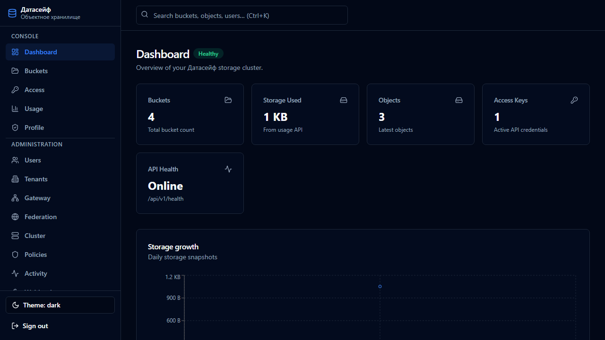
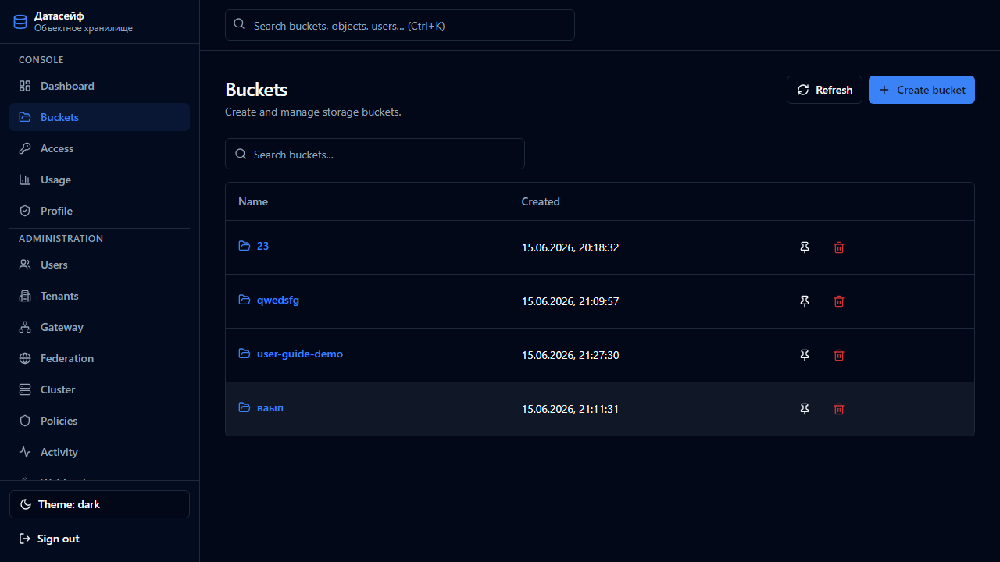
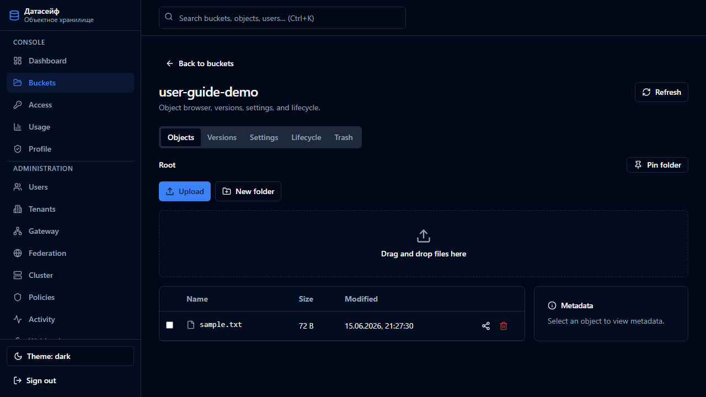

**[English](../../en/user-guide/02-dashboard-and-buckets.md)** | Русский

# 2. Главная страница и бакеты

[← Введение](01-vvedenie-i-vhod.md) | [К содержанию](README.md) | Далее: [Ключи и квоты →](03-klyuchi-i-kvoty.md)

---

## Главная (дашборд)

После входа открывается **Обзор** — краткая сводка:

| Карточка | Что показывает |
|----------|----------------|
| Бакеты | Сколько у вас бакетов |
| Объекты | Сколько файлов (объектов) |
| Хранилище | Сколько места занято |
| Использовано / Квота / Остаток | Ваш лимит (если администратор задал квоту) |

Ниже — график роста объёма данных за последнее время.

> Администратор видит общую статистику по системе. Обычный пользователь — только по своим бакетам.

---

## Список бакетов

1. В меню слева выберите **Бакеты**.
2. Отобразится таблица всех доступных вам бакетов.

### Создать бакет

1. Нажмите **Создать бакет** (или аналогичную кнопку).
2. Введите **имя** — только латиница, цифры и дефис, без пробелов.
3. Подтвердите создание.

### Удалить бакет

1. Найдите бакет в списке.
2. Нажмите удаление и подтвердите.

> Бакет должен быть **пустым**, иначе удаление может быть запрещено.

---

## Браузер объектов (файлов)

Нажмите на имя бакета — откроется просмотр файлов внутри.

### Загрузка файлов

**Способ 1 — перетаскивание**

1. Перетащите файлы или папки в область списка.

**Способ 2 — кнопка**

1. Нажмите **Загрузить**.
2. Выберите файлы на компьютере.

### Папки

- Чтобы создать «папку», загрузите файл с путём, например `отчёты/2026/январь/файл.pdf`, или создайте пустую папку через интерфейс (если доступно).
- Переход по папкам — клик по имени; «хлебные крошки» вверху показывают текущий путь.

### Скачать файл

- Кликните по файлу или используйте действие **Скачать** в меню строки.

### Удалить файл

1. Выберите файл (или несколько — массовое выделение).
2. Нажмите **Удалить**.
3. Подтвердите.

Если включена **корзина** (Trash), файл попадёт в корзину, а не удалится навсегда (см. ниже).

### Метаданные файла

При выборе файла справа может открыться панель с информацией:

- размер, дата, тип;
- теги;
- **Legal Hold** (юридическая блокировка — запрет удаления);
- срок хранения (WORM), если настроен на бакете.

---

## Вкладки внутри бакета

| Вкладка | Назначение |
|---------|------------|
| **Объекты** | Список файлов и папок |
| **Версии** | История версий (если включено версионирование) |
| **Настройки** | Настройки бакета: версии, lifecycle, квоты |
| **Корзина** | Корзина удалённых объектов |

---

## Версионирование

Если администратор включил **versioning** для бакета:

- каждая новая загрузка файла с тем же именем создаёт **новую версию**;
- старые версии можно просмотреть на вкладке **Версии**;
- удаление может создать «маркер удаления», а данные останутся в старых версиях.

Включение: **Настройки** бакета → **Versioning** → включить.

---

## Корзина (Trash)

При включённой мягкой удалении удалённые файлы попадают в служебный бакет `.datasafe-trash`.

1. Откройте бакет → вкладка **Корзина**.
2. Найдите удалённый объект.
3. **Восстановить** — восстановить в исходный бакет.
4. **Удалить навсегда** — удалить окончательно.

Срок хранения в корзине задаёт администратор в **Настройки → Корзина** (от 1 до 3650 дней).

---

## Поделиться файлом (presigned URL)

Временная ссылка даёт доступ к файлу без логина в консоль.

1. В списке объектов откройте меню действий у файла → **Share** (или аналог).
2. Выберите срок действия ссылки (например 1 час, 24 часа).
3. Скопируйте сгенерированную **ссылку**.
4. Отправьте ссылку получателю.

> После истечения срока ссылка перестанет работать.

---

## Поиск

В консоли есть **глобальный поиск** по бакетам и объектам — введите имя или часть имени в поле поиска.

---

## Избранное

Можно «закрепить» часто используемые бакеты или папки в избранном для быстрого доступа.

---

## Что дальше?

- [Ключи доступа и квоты →](03-klyuchi-i-kvoty.md)
- [Администрирование бакетов (политики, lifecycle) →](05-administraciya.md)
