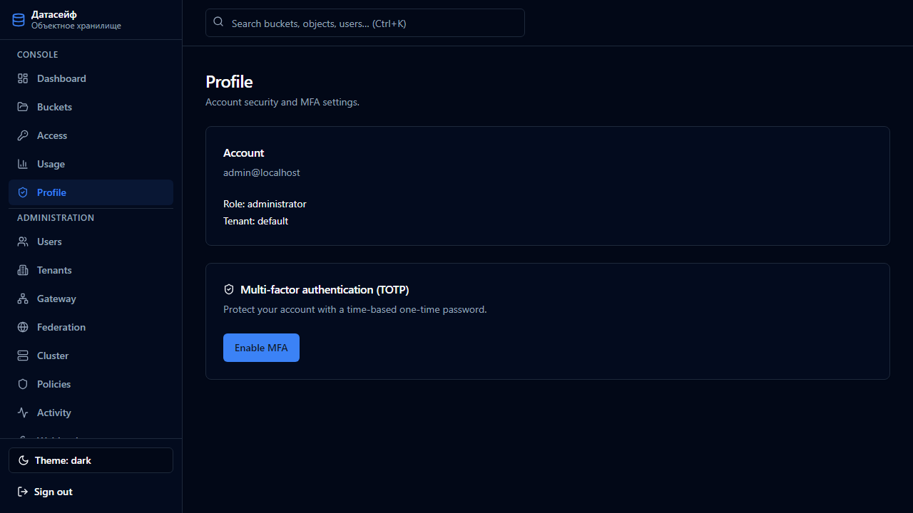

**[English](../../en/user-guide/04-security-and-profile.md)** | Русский

# 4. Безопасность и профиль

[← Ключи и квоты](03-klyuchi-i-kvoty.md) | [К содержанию](README.md) | Далее: [Администрирование →](05-administraciya.md)

---

## Профиль

Меню **Профиль** — настройки вашей учётной записи:

- смена пароля (если доступно);
- **двухфакторная аутентификация (MFA)**;
- коды восстановления.

---

## MFA — двухфакторная аутентификация

MFA добавляет второй шаг при входе: кроме пароля нужен одноразовый код из телефона.

Рекомендуемое приложение: **Google Authenticator** (также подойдут Authy, Microsoft Authenticator и любое TOTP-приложение).

### Включить MFA

1. Войдите в консоль → **Профиль**.
2. Нажмите **Включить MFA**.
3. На экране появится **QR-код**.
4. Откройте Google Authenticator → **Добавить** → **Сканировать QR-код**.
5. Введите **6 цифр** из приложения в поле подтверждения на странице **Профиль**.
6. Сохраните **коды восстановления** — нажмите «Копировать» или «Скачать».  
   Они понадобятся, если потеряете телефон.

### Вход с MFA

1. Введите логин и пароль как обычно.
2. Откроется второй экран.
3. Введите текущие **6 цифр** из Authenticator.
4. Нажмите подтвердить.

Код меняется каждые ~30 секунд — если не успели, дождитесь нового.

### Отключить MFA

1. **Profile** → **Disable MFA**.
2. Введите пароль и код из приложения (или recovery code).

### Recovery codes

- Одноразовые коды на случай потери телефона.
- Храните их отдельно от пароля (бумага, сейф, менеджер паролей).
- После использования код сгорает.

### Требование MFA для администраторов

Администратор может включить в **Settings → MFA** опцию **Require MFA for administrators** — тогда все админы обязаны настроить MFA.

---

## Советы по безопасности

| Совет | Зачем |
|-------|-------|
| Смените пароль `admin` после установки | Защита от взлoma |
| Включите MFA | Даже при утечке пароля вход без телефона невозможен |
| Не передавайте Secret Key и API tokens | Полный доступ к данным |
| Используйте HTTPS на боевом сервере | Шифрование трафика |

---

## Что дальше?

- [Администрирование →](05-administraciya.md)
