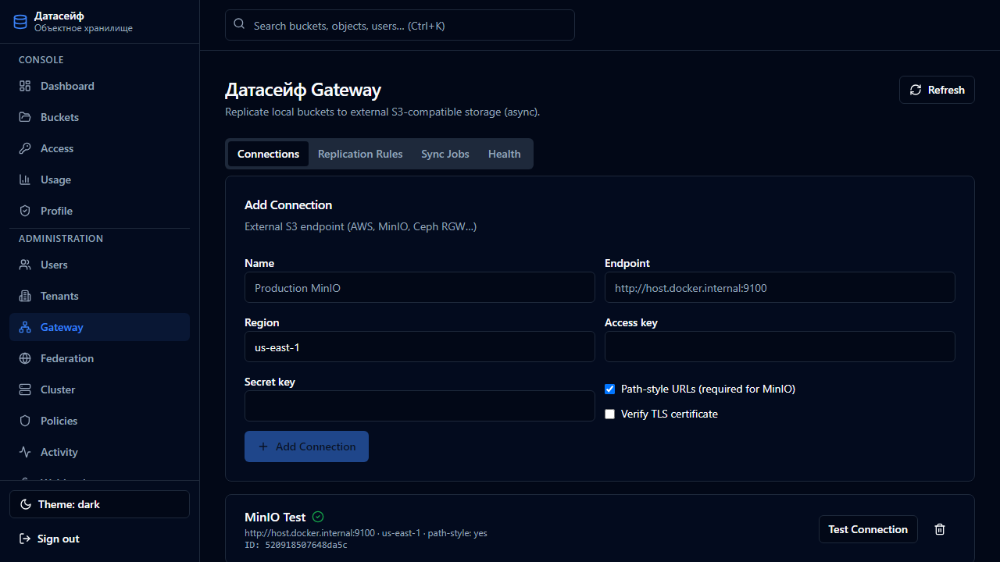

**[English](../../en/user-guide/06-gateway-and-minio.md)** | Русский

# 6. Gateway — репликация

[← Администрирование](05-administraciya.md) | [К содержанию](README.md) | Далее: [Мониторинг →](07-monitoring-i-bazy.md)

> Раздел **Gateway** доступен только **администратору**.

---

## Зачем Gateway

**Gateway** автоматически **копирует файлы** из DataSafeS3 во **внешнее S3-совместимое хранилище**:

- off-site backup;
- второй регион или площадка;
- любой endpoint с S3 API.

Копирование **в фоне** — через несколько секунд объект появляется на удалённой стороне.



---

## Подготовка: локальный тестовый S3 endpoint

Для лабораторной проверки поднимите отдельный S3-совместимый контейнер на портах **9100** (API) и **9101** (веб-UI), без конфликта с DataSafeS3 **9000**:

```cmd
docker run -d --name datasafe-minio-test -p 9100:9000 -p 9101:9001 -e MINIO_ROOT_USER=s3test -e MINIO_ROOT_PASSWORD=s3testsecret minio/minio server /data --console-address ":9001"
```

| Сервис | Адрес | Учётные данные (пример) |
|--------|-------|-------------------------|
| Удалённый S3 API | http://localhost:9100 | `s3test` / `s3testsecret` |
| Веб-UI удалённого S3 | http://localhost:9101 | те же |

> Имя контейнера `datasafe-minio-test` используется скриптами проекта; образ — стандартный S3-сервер только для локальных тестов.

---

## Автонастройка (скрипт)

После запуска DataSafeS3 и тестового endpoint:

```cmd
scripts\setup-minio-gateway.cmd
```

Скрипт (идемпотентно):

1. Создаёт бакет `replica-test` на удалённой стороне.
2. Добавляет подключение **External S3 Test** в Gateway.
3. Проверяет подключение.
4. Создаёт правило репликации (локальный бакет → `replica-test`).

Исходный бакет:

```cmd
set GATEWAY_SOURCE_BUCKET=my-data
scripts\setup-minio-gateway.cmd
```

---

## Ручная настройка в консоли

### Шаг 1 — Connection

1. **Gateway** → **Connections** → **Add Connection**.
2. Пример для локального тестового endpoint:

| Поле | Пример |
|------|--------|
| Name | `External S3 Test` |
| Endpoint | `http://host.docker.internal:9100` или `http://localhost:9100` |
| Region | `us-east-1` |
| Access Key | `s3test` |
| Secret Key | `s3testsecret` |
| Path-style | ✓ включить |
| Verify TLS | выключить для HTTP |

3. **Test Connection** — статус connected.

### Шаг 2 — Правило репликации

1. Вкладка **Replication Rules**.
2. **Source bucket** — ваш бакет в DataSafeS3.
3. **Remote connection** — `External S3 Test`.
4. **Remote bucket** — `replica-test`.
5. **Add Rule**.

### Шаг 3 — Проверка

1. Загрузите файл в локальный бакет.
2. **Sync Jobs** / **Health**.
3. Веб-UI на http://localhost:9101 — бакет `replica-test`.

---

## Вкладки Gateway

| Вкладка | Назначение |
|---------|------------|
| **Connections** | Внешние S3 endpoint |
| **Replication Rules** | Локальный → удалённый бакет |
| **Sync Jobs** | Очередь и история |
| **Health** | Ошибки, объём, pending |

---

## Частые проблемы

| Проблема | Решение |
|----------|---------|
| Test Connection failed | Endpoint, path-style, credentials |
| Объект не на удалённой стороне | **Health** → ошибки; очередь уменьшается? |
| Connection refused из Docker | `http://host.docker.internal:9100` |
| Не удалить connection | Сначала удалите правила репликации |

Подробнее: [docs/context/gateway.md](../../context/gateway.md)

---

## Далее

- [Grafana и БД →](07-monitoring-i-bazy.md)
