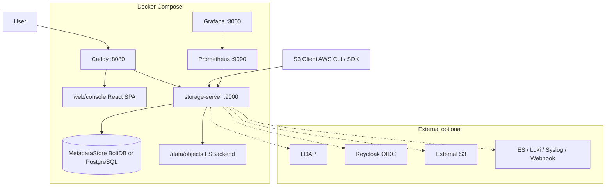
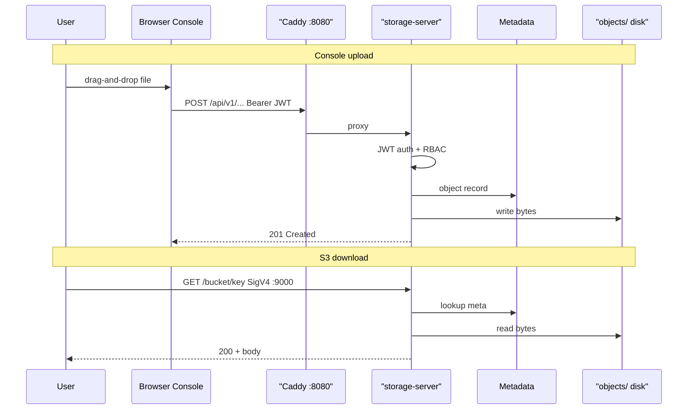
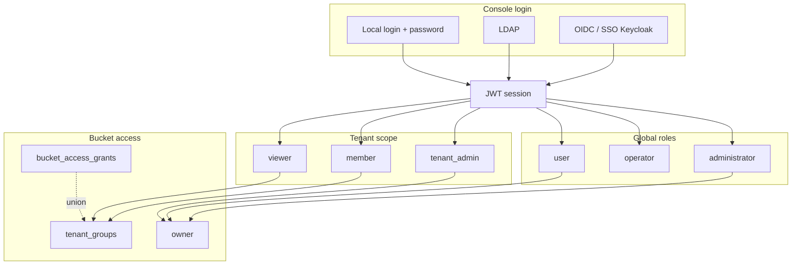
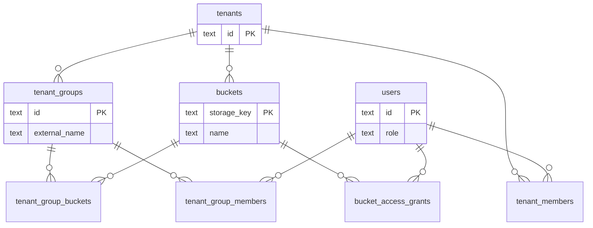
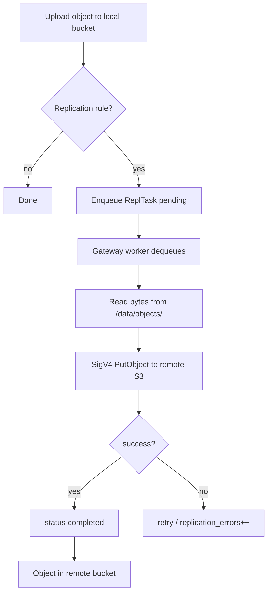
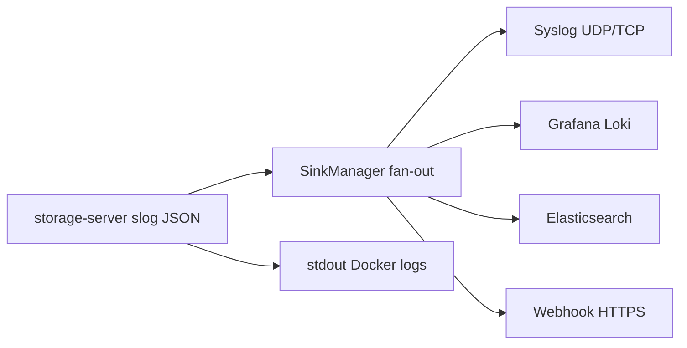
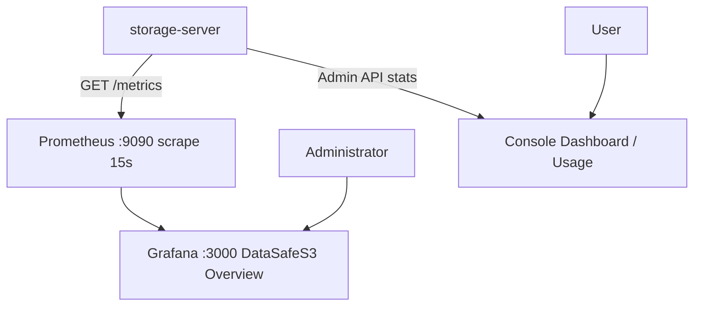
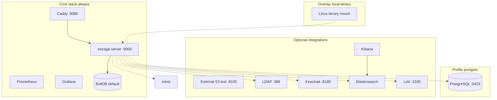

**[English](../../en/user-guide/README.md)** | Русский

# Руководство пользователя Датасейф S3 (DataSafeS3)

**Автор:** Трачук Илья  
**Последнее обновление:** 2026-06-18

Единая точка входа для пользователей и администраторов Датасейф S3. Документ самодостаточен: от установки до LDAP/SSO, мониторинга и устранения неполадок.

Для установки, архитектуры и разработки см. [README репозитория](../../../README.md) и [техническую документацию](../context/).

---

## Содержание

- [Обзор продукта](#обзор-продукта)
- [Архитектура](#архитектура)
- [Быстрый старт](#быстрый-старт)
  - [1. Минимальный старт](#1-минимальный-старт-boltdb-без-интеграций)
  - [2. PostgreSQL metadata](#2-production-like-postgresql-metadata)
  - [Kubernetes / Helm](#kubernetes--helm)
  - [3. Local dev (Windows)](#3-local-dev-на-windows-local-binary-overlay)
  - [4. Опциональные интеграции](#4-опциональные-интеграции)
  - [5. Комбинированные сценарии](#5-комбинированные-сценарии)
  - [6. URL и учётные данные](#6-таблица-url-и-учётных-данных-по-умолчанию)
  - [7. Проверка после установки](#7-проверка-после-установки)
  - [8. Что дальше](#8-что-дальше)
- [1. Введение и вход в систему](#1-введение-и-вход-в-систему)
- [Первичная настройка](#первичная-настройка)
- [2. Dashboard и бакеты](#2-dashboard-и-бакеты)
- [3. Ключи доступа, API-токены и квоты](#3-ключи-доступа-api-токены-и-квоты)
- [4. Безопасность и профиль](#4-безопасность-и-профиль)
- [5. Администрирование](#5-администрирование)
- [6. Gateway — репликация](#6-gateway-репликация)
- [7. LDAP и SSO (Keycloak)](#7-ldap-и-sso-keycloak)
- [8. Мониторинг (Grafana)](#8-мониторинг-grafana)
- [9. Внешнее логирование и Kibana](#9-внешнее-логирование-и-kibana)
- [10. PostgreSQL и DBeaver](#10-postgresql-и-dbeaver)
- [11. Federation и Cluster](#11-federation-и-cluster)
- [12. Устранение неполадок](#12-устранение-неполадок)
- [REST API и OpenAPI](#rest-api-и-openapi)
- [Дополнительные материалы](#дополнительные-материалы)
- [Дорожная карта](#дорожная-карта)

---

## Обзор продукта

**Датасейф S3 (DataSafeS3)** — self-hosted S3-совместимое объектное хранилище с веб-консолью. Данные остаются на вашем сервере; при необходимости можно настроить резервное копирование во внешнее S3 (внешнее S3-совместимое хранилище).

### Для кого

| Аудитория | Что вы получаете |
|-----------|------------------|
| **Обычный пользователь (user)** | Свои бакеты, загрузка/скачивание, share-ссылки, ключи S3 |
| **Оператор (operator)** | Доступ ко всем бакетам для поддержки, без раздела Administration |
| **Администратор арендатора (tenant_admin)** | Участники и роли своего tenant, **создание локальных пользователей** в tenant, grants на бакеты, создание бакетов в scope tenant |
| **Администратор (administrator)** | Пользователи, настройки, Gateway, LDAP/OIDC, все tenants, полный доступ к системе |

### Основные возможности

- бакеты и браузер объектов (папки, drag-and-drop, массовые операции);
- versioning, корзина (soft delete), lifecycle, Object Lock / legal hold;
- presigned URL и share-ссылки с лимитом скачиваний;
- квоты на пользователя и бакет;
- MFA (TOTP), LDAP, OIDC/SSO;
- Gateway — асинхронная репликация во внешнее S3;
- multi-tenant с ролями `tenant_admin` / `member` / `viewer`, изоляция имён бакетов по tenant;
- Prometheus + Grafana, внешние sink логов (Syslog, Loki, Elasticsearch, Webhook).

---

## Архитектура

Раздел описывает, как компоненты Датасейф S3 связаны между собой, как проходят запросы пользователей и где хранятся данные. Технические детали для разработчиков: [docs/context/architecture.md](../context/architecture.md).

> **Диаграммы.** Ниже — **Mermaid**; GitHub отображает их без сборки. Каталог: [docs/diagrams/README.md](../../diagrams/README.md).

### Компоненты системы

| Компонент | Назначение |
|-----------|------------|
| **Caddy** | Reverse proxy на порту **8080**: статическая веб-консоль, проксирование `/api/*`, `/healthz`, `/metrics` на `storage-server` |
| **storage-server** | Единый Go-процесс: S3 API (SigV4), Admin REST API (`/api/v1/*`), Gateway worker, метрики Prometheus |
| **web/console** | React SPA (сборка в `web/console/dist`, отдаётся Caddy) |
| **MetadataStore** | Метаданные: пользователи, бакеты, tenants, grants, политики, shares, очередь Gateway — **BoltDB** (`metadata.db`) или **PostgreSQL** (профиль `postgres`) |
| **FSBackend** | Байты объектов на диске в `STORAGE_DATA_DIR/objects/` (в Docker — volume `/data`) |
| **Prometheus** | Scrape `storage-server:9000/metrics` каждые 15 с |
| **Grafana** | Дашборд **Датасейф S3 Overview**, datasource Prometheus |
| **LDAP / Keycloak** | Внешние IdP (тестовые контейнеры вне основного compose) |
| **External S3** | Цель Gateway-репликации |
| **Elasticsearch + Kibana** | Опциональный sink структурированных логов |

S3 API доступен **напрямую** на порту **9000** (минуя Caddy). Консоль — только через **8080**, чтобы UI и Admin API были на одном origin без CORS.

Схема ниже показывает основной Docker Compose стек и внешние интеграции.



### Поток данных: загрузка и скачивание

**Через консоль:** браузер отправляет JWT в `Authorization: Bearer` на `/api/v1/...`. Caddy проксирует запросы на `storage-server`. Сервер проверяет роль, tenant scope и grants, обновляет метаданные и читает/пишет файлы в `/data/objects/`.

**Через S3 API:** клиент подписывает запрос AWS Signature Version 4 (access key + secret). Тот же процесс `storage-server` обрабатывает `PutObject`, `GetObject`, multipart и т.д. Логическое имя бакета резолвится во внутренний `storage_key` (`t:{tenant_id}:{name}` или `o:{owner_id}:{name}`).



### Аутентификация и RBAC

Три независимых **плоскости входа** в консоль:

| Источник | Механизм | Где настраивается |
|----------|----------|-------------------|
| **Local** | Логин + пароль → JWT; опционально MFA (TOTP) | Users, Profile |
| **LDAP** | Bind к каталогу, sync групп → tenant groups | Настройки администратора → LDAP |
| **OIDC / SSO** | Redirect на IdP (Keycloak), callback, JWT | Настройки администратора → OIDC |

S3 API всегда использует **access keys** (SigV4), не JWT. Bootstrap-ключ из `.env`; пользовательские ключи — в разделе Access.

**Глобальные роли** (`administrator`, `operator`, `user`) задают доступ ко всей установке. **Роли tenant** (`tenant_admin`, `member`, `viewer`) — внутри арендатора. Доступ к конкретному бакету дополнительно ограничивается **группами tenant** и **grants** (вкладка Access).



### Модель арендаторов (multi-tenant)

**Tenant** — логическая организация на одной установке. Пользователь может состоять в нескольких tenants с разными ролями.

- Имена бакетов **уникальны внутри scope** (tenant или личное пространство владельца), но два tenant могут иметь бакет с одинаковым логическим именем `reports`.
- Внутренний ключ хранения: `storage_key` = `t:{tenant_id}:{name}` или `o:{owner_id}:{name}`.
- **Tenant groups** — именованные наборы бакетов с уровнем `read` / `read_write`. При наличии хотя бы одной группы обычные `member`/`viewer` видят только бакеты своих групп (+ grants + собственные бакеты).

Спецификации: [tenant-bucket-isolation-tz.md](../specs/tenant-bucket-isolation-tz.md), [tenant-groups-tz.md](../specs/tenant-groups-tz.md).



### Gateway: репликация во внешнее S3

Gateway работает **асинхронно** внутри `storage-server`. При загрузке/удалении объекта в локальном бакете с правилом репликации создаётся задача в очереди (`replication_tasks`). Фоновый worker читает объект с локального диска и отправляет `PutObject` / `DeleteObject` во внешний S3 (внешнее S3-совместимое хранилище) через настроенное **Connection**.

Администратор управляет Connections, Replication Rules и мониторит **Sync Jobs / Health** в консоли.



### Внешнее логирование

Все HTTP-запросы и системные события пишутся в **structured JSON** (stdout контейнера). При включении в **Настройки администратора → External logging** записи **дублируются параллельно** во все активные sink через интерфейс `LogSink` — без взаимного исключения.

| Sink | Протокол | Примечание |
|------|----------|------------|
| **Syslog** | UDP/TCP RFC5424 | `udp://host:514` |
| **Loki** | HTTP push | timestamp в nanoseconds |
| **Elasticsearch** | HTTP bulk index | Basic auth или ApiKey в поле `token` |
| **Webhook** | HTTPS POST | JSON body на каждую запись |



### Мониторинг

Prometheus собирает метрики с `http://storage-server:9000/metrics` (конфиг `deploy/docker/prometheus.yml`). Grafana подключается к Prometheus и показывает преднастроенный дашборд **Датасейф S3 Overview**: RPS, latency, объём хранилища, число бакетов/объектов, очередь репликации Gateway, нагрузка на хост (Linux).

Консольные разделы **Обзор** и **Использование** показывают агрегаты по роли пользователя (системные для admin, по tenant для `tenant_admin`, личные для `user`).



### Сводка портов

| Порт | Сервис | Назначение |
|------|--------|------------|
| **8080** | Caddy | Веб-консоль + Admin API (прокси) |
| **9000** | storage-server | S3 API + Admin API (прямой доступ) |
| **9090** | Prometheus | UI и API метрик |
| **3000** | Grafana | Дашборды |
| **5432 / 5433** | PostgreSQL | Метаданные (профиль `postgres`) |
| **389 / 8180 / 9100 / 19200 / 5601** | LDAP / Keycloak / S3 test / ES / Kibana | Тестовые стеки (вне compose) |

---

## Быстрый старт

Раздел описывает **варианты запуска** Датасейф S3: от одной команды до полного dev-стека с PostgreSQL, LDAP, SSO, Gateway и внешним логированием. Тестовые интеграции живут **вне** `docker-compose.yml` — их можно подключать по мере необходимости.

Подробная установка и переменные окружения: [README репозитория — Установка](../../../README.md#установка).

Схема вариантов compose и опциональных контейнеров:



---

### 1. Минимальный старт (BoltDB, без интеграций)

Самый быстрый путь — один Docker Compose стек, метаданные в **BoltDB** (`metadata.db` в volume `storage-data`).

**Команда:**

```cmd
copy .env.example .env
docker compose up -d --build
```

**Что поднимается:**

| Сервис | Порт | Назначение |
|--------|------|------------|
| Caddy | **8080** | Веб-консоль + прокси Admin API |
| storage-server | **9000** | S3 API + Admin API |
| Prometheus | **9090** | Метрики |
| Grafana | **3000** | Дашборд **Датасейф S3 Overview** |

**Сразу после старта:**

| Что | Значение |
|-----|----------|
| Консоль | http://localhost:8080/ |
| Вход | `admin` / `admin` |
| S3 endpoint | http://localhost:9000/ |
| Bootstrap S3 key | `datasafe` / `datasafesecret` |

**Что вы получаете:** полнофункциональное хранилище (бакеты, объекты, versioning, share-ссылки, квоты, MFA, мониторинг). LDAP, OIDC, Gateway и внешние sink логов **не** включены — их настраивают отдельно (см. [§4](#4-опциональные-интеграции)).

**Когда выбирать BoltDB:** локальная разработка, демо, один сервер без требований к SQL-аналитике метаданных.

---

### 2. Production-like: PostgreSQL metadata

Для установок, близких к production, или когда нужен доступ к метаданным через SQL (DBeaver, бэкапы, миграции).

**Шаг 1 — `.env`:**

```env
STORAGE_METADATA_BACKEND=postgres
STORAGE_POSTGRES_PUBLISH_PORT=5433
```

> Порт **5433** на хосте рекомендуется на Windows, если локальный PostgreSQL уже слушает **5432**.

**Шаг 2 — запуск с профилем `postgres`:**

```cmd
docker compose --profile postgres up -d --build
```

Профиль добавляет контейнер **postgres:16-alpine**; `storage-server` ждёт `pg_isready` и подключается по имени сервиса `postgres:5432` внутри сети compose.

**DBeaver / psql с хоста:**

| Поле | Значение |
|------|----------|
| Host | `localhost` |
| Port | **5433** (или значение `STORAGE_POSTGRES_PUBLISH_PORT`) |
| Database | `datasafe` |
| Username / Password | `datasafe` / `datasafe` |
| JDBC | `jdbc:postgresql://localhost:5433/datasafe?sslmode=disable` |

**Проверка подключения:**

```cmd
docker run --rm -e PGPASSWORD=datasafe postgres:16-alpine psql -h host.docker.internal -p 5433 -U datasafe -d datasafe -c "SELECT 1;"
```

| | **BoltDB** | **PostgreSQL** |
|---|------------|----------------|
| Когда | Простая установка, один узел | Production, SQL-доступ, миграции |
| Настройка | по умолчанию | `STORAGE_METADATA_BACKEND=postgres` + `--profile postgres` |
| Хранение | `metadata.db` в volume | контейнер `postgres-data` |
| Миграция Bolt → PG | — | `storage-server migrate-boltdb` — см. [README](../../../README.md), [§10](#10-postgresql-и-dbeaver) |

---

### Kubernetes / Helm

Для кластеров Kubernetes используйте официальный Helm chart в [`deploy/helm/datasafe/`](../../../deploy/helm/datasafe/). Он повторяет стек Docker Compose: `storage-server`, Caddy (консоль на порту 80 → аналог Ingress **8080**), опциональный PostgreSQL StatefulSet, Prometheus/Grafana и отдельные Ingress-хосты для консоли и S3 API.

**Установка (BoltDB, по умолчанию):**

```bash
helm install datasafe deploy/helm/datasafe --namespace datasafe --create-namespace
```

**Метаданные PostgreSQL:**

```bash
helm install datasafe deploy/helm/datasafe \
  --set postgres.enabled=true \
  --set storageServer.metadataBackend=postgres \
  --namespace datasafe --create-namespace
```

Добавьте `datasafe.local` и `s3.datasafe.local` в DNS или `/etc/hosts`, либо используйте `kubectl port-forward` (см. `NOTES.txt` chart'а).

Полный справочник values, сборка образов, LDAP/OIDC/logging: **[README Helm chart](../../../deploy/helm/datasafe/README.md)**.

English version: [Kubernetes / Helm](../../en/user-guide/README.md#kubernetes--helm).

---

### 3. Local dev на Windows (local-binary overlay)

На Windows `docker compose build` может падать при pull базовых образов, если WinHTTP указывает на недоступный прокси `127.0.0.1:10801`. Скрипт **`scripts\dev-docker-local-binary.cmd`** обходит проблему:

1. Собирает **Linux-бинарник** локально (`GOOS=linux`, `CGO_ENABLED=0`).
2. Собирает статику консоли (`scripts\build-console.cmd`).
3. Монтирует бинарник через overlay [`docker-compose.local-binary.yml`](../../../docker-compose.local-binary.yml) — без полной пересборки образа с исходниками.
4. Поднимает стек с профилем **postgres** (как в dev-окружении проекта).

**Запуск:**

```cmd
scripts\dev-docker-local-binary.cmd
```

Скрипт ждёт готовности `POST /api/v1/admin/login` и выводит URL консоли.

**Пересборка после изменений Go-кода:**

```cmd
set CGO_ENABLED=0
set GOOS=linux
set GOARCH=amd64
go build -trimpath -ldflags="-s -w" -o deploy\docker\storage-server-linux .\cmd\storage-server
docker compose --profile postgres -f docker-compose.yml -f docker-compose.local-binary.yml up -d storage-server --no-deps
```

**Пересборка только консоли:**

```cmd
scripts\build-console.cmd
docker compose up -d caddy --no-deps
```

**Альтернативы при проблемах с Docker pull:** `scripts\ensure-docker-pull-proxy.cmd` (локальный direct-proxy на `127.0.0.1:10801`) или `netsh winhttp reset proxy`. Подробнее: [локальная разработка](../context/local-dev.md).

---

### 4. Опциональные интеграции

Контейнеры ниже **не входят** в основной `docker-compose.yml`. Запускайте их после того, как core-стек уже работает (`docker compose ps`).

| Интеграция | Скрипт | Порты | Сценарий |
|------------|--------|-------|----------|
| **External S3 test** | `scripts\setup-minio-gateway.cmd` *(после тестового endpoint)* | 9100, 9101 | Асинхронная репликация во внешнее S3 |
| **LDAP** | `scripts\start-ldap-test.cmd` | 389, 636 | Вход по каталогу + sync групп |
| **Keycloak OIDC** | `scripts\start-keycloak-test.cmd` | 8180 | SSO + группы в JWT |
| **Elasticsearch** | `scripts\start-elasticsearch-test.cmd` | 19200 | Sink структурированных логов |
| **Kibana** | `scripts\start-kibana-test.cmd` | 5601 | Discover по индексу `datasafe-logs*` |
| **Loki** | *отдельного скрипта нет* | 3100 (типично) | HTTP push логов; свой контейнер в сети `datasafe_default` |

Остановка LDAP/Keycloak: `scripts\stop-ldap-keycloak-test.cmd` (полный сброс: `--remove`).

Полная инструкция LDAP/Keycloak: [ldap-keycloak-standalone.md](../integrations/ldap-keycloak-standalone.md).

#### Тестовый S3 endpoint

**Назначение:** целевое S3 для [Gateway-репликации](#6-gateway-репликация).

**Шаг 1 — S3 test container** (если ещё не запущен):

```cmd
docker run -d --name datasafe-minio-test -p 9100:9000 -p 9101:9001 -e MINIO_ROOT_USER=minioadmin -e MINIO_ROOT_PASSWORD=minioadmin minio/minio server /data --console-address ":9001"
```

**Шаг 2 — автонастройка Connection + правило репликации:**

```cmd
scripts\setup-minio-gateway.cmd
```

Опционально: `set GATEWAY_SOURCE_BUCKET=my-data` перед скриптом — исходный бакет в Датасейф S3.

**Проверка:** загрузите файл в локальный бакет → **Администрирование → Gateway → Sync Jobs**; объект появится в remote S3 web UI http://localhost:9101 (`minioadmin` / `minioadmin`).

#### LDAP

```cmd
scripts\start-ldap-test.cmd
```

| Параметр | Значение (тест) |
|----------|-----------------|
| URL в Settings (из Docker) | `ldap://host.docker.internal:389` |
| Bind DN | `cn=admin,dc=datasafe,dc=local` |
| Bind password | `ldapadmin` |
| Base DN | `ou=users,dc=datasafe,dc=local` |
| Group DN | `ou=groups,dc=datasafe,dc=local` |
| Тестовый пользователь | `ldapuser` / `password` |

**Проверка:**

```cmd
curl -s -X POST http://localhost:8080/api/v1/settings/ldap/test -H "Authorization: Bearer <JWT>" -H "Content-Type: application/json" -d "{\"url\":\"ldap://host.docker.internal:389\",\"bind_dn\":\"cn=admin,dc=datasafe,dc=local\",\"bind_password\":\"ldapadmin\",\"base_dn\":\"ou=users,dc=datasafe,dc=local\"}"
```

(Сначала получите JWT через `POST /api/v1/admin/login`.) Либо кнопка **Test** в **Настройки администратора → LDAP**.

#### Keycloak (OIDC / SSO)

```cmd
scripts\start-keycloak-test.cmd
```

Первый старт Keycloak — **30–60 с**. Realm `datasafe` импортируется автоматически.

| Параметр | Значение (тест) |
|----------|-----------------|
| Issuer URL (браузер) | `http://localhost:8180/realms/datasafe` |
| Internal issuer (Docker) | `http://host.docker.internal:8180/realms/datasafe` |
| Client ID / secret | `datasafe-console` / `datasafe-console-secret` |
| Redirect URL | `http://localhost:8080/api/v1/auth/oidc/callback` |
| Keycloak Admin | http://localhost:8180/admin — `admin` / `admin` |
| SSO-пользователь | `ssouser` / `password` |

**Проверка из контейнера:**

```cmd
docker compose exec storage-server wget -qO- http://host.docker.internal:8180/realms/datasafe/.well-known/openid-configuration
```

#### Elasticsearch + Kibana (внешнее логирование)

```cmd
scripts\start-elasticsearch-test.cmd
scripts\start-kibana-test.cmd
scripts\setup-kibana-logs.cmd
```

Elasticsearch подключается к сети **`datasafe_default`** (та же, что у compose-проекта). В **Настройки администратора → External logging** укажите address `http://host.docker.internal:19200`, index `datasafe-logs`, Basic auth `elastic` / `ElasticTest123!`.

**Проверка:** после сохранения настроек выполните любой API-запрос → **Kibana Discover** (index pattern `datasafe-logs*`, time field `time`).

#### Loki

Отдельного `start-loki-test.cmd` в репозитории **нет**. При наличии своего Loki в Docker-сети `datasafe_default` включите sink в Settings: address `http://<container>:3100`. Для ручного теста см. [feature-audit-report.md](../../testing/feature-audit-report.md) (контейнер `datasafe-log-loki`, образ `grafana/loki:2.9.4`).

---

### 5. Комбинированные сценарии

Готовые «рецепты» — выполняйте шаги по порядку.

#### Матрица: что включать

| Сценарий | Core compose | `--profile postgres` | S3 test | LDAP | Keycloak | ES + Kibana |
|----------|:------------:|:--------------------:|:-----:|:----:|:--------:|:-----------:|
| Минимальный | ✓ | — | — | — | — | — |
| Production-like metadata | ✓ | ✓ | — | — | — | — |
| Полный стек для разработки | ✓ | ✓ | ✓ | ✓ | ✓ | опц. |
| Только SSO тест | ✓ | — | — | — | ✓ | — |
| Логирование в ES | ✓ | — | — | — | — | ✓ |
| Gateway репликация | ✓ | — | ✓ | — | — | — |

#### Рецепт A — «Полный стек для разработки»

1. `copy .env.example .env` → задать `STORAGE_METADATA_BACKEND=postgres`, `STORAGE_POSTGRES_PUBLISH_PORT=5433`.
2. `scripts\dev-docker-local-binary.cmd` *(или `docker compose --profile postgres up -d --build`)*.
3. `docker run -d --name datasafe-minio-test -p 9100:9000 -p 9101:9001 ...` — см. [External S3 test](#external-s3-test-endpoint).
4. `scripts\start-ldap-test.cmd`
5. `scripts\start-keycloak-test.cmd` — подождать ~60 с.
6. В консоли: **Настройки администратора** → включить LDAP и OIDC → **Save**.
7. Опционально: `scripts\setup-minio-gateway.cmd`.

#### Рецепт B — «Только SSO тест»

1. `docker compose up -d --build`
2. `scripts\start-keycloak-test.cmd`
3. **Настройки администратора → OIDC** — значения из [Keycloak](#keycloak-oidc--sso) → **Save**.
4. `/login` → **Sign in with SSO** как `ssouser` / `password`.

#### Рецепт C — «Логирование в Elasticsearch»

1. `docker compose up -d --build`
2. `scripts\start-elasticsearch-test.cmd`
3. `scripts\start-kibana-test.cmd`
4. `scripts\setup-kibana-logs.cmd`
5. **Настройки администратора → External logging** → Elasticsearch: `http://host.docker.internal:19200`, index `datasafe-logs`, credentials → **Save**.
6. Kibana Discover: http://localhost:5601

#### Рецепт D — «Gateway репликация»

1. `docker compose up -d --build`
2. Запустить тестовый S3 endpoint на **9100** (см. выше).
3. `scripts\setup-minio-gateway.cmd`
4. Загрузить файл в исходный бакет → проверить **Gateway → Health** и remote S3 web UI.

---

### 6. Таблица URL и учётных данных по умолчанию

Единая справка по всем сервисам (только **dev/test** — на production смените пароли).

| Сервис | URL | Логин | Пароль | Примечание |
|--------|-----|-------|--------|------------|
| **Веб-консоль** | http://localhost:8080/ | `admin` | `admin` | JWT после входа |
| **S3 API** | http://localhost:9000/ | `datasafe` | `datasafesecret` | SigV4, region `us-east-1` |
| **Grafana** | http://localhost:3000 | `admin` | `admin` | [Обзор](http://localhost:3000/d/datasafe-overview/datasafe-overview), [Бакеты](http://localhost:3000/d/datasafe-buckets/datasafe-buckets) |
| **Prometheus** | http://localhost:9090 | — | — | Scrape `/metrics` |
| **PostgreSQL** | `localhost:5433` | `datasafe` | `datasafe` | БД `datasafe`; профиль `postgres` |
| **Remote S3 test** | http://localhost:9100 | `minioadmin` | `minioadmin` | Тест Gateway |
| **remote S3 web UI** | http://localhost:9101 | `minioadmin` | `minioadmin` | Remote S3 UI |
| **LDAP** | `ldap://localhost:389` | `ldapuser` | `password` | Bind admin: `cn=admin,dc=datasafe,dc=local` / `ldapadmin` |
| **Keycloak Admin** | http://localhost:8180/admin | `admin` | `admin` | Realm `datasafe` |
| **Keycloak SSO user** | — | `ssouser` | `password` | Группа `datasafe-users` |
| **Elasticsearch** | http://localhost:19200 | `elastic` | `ElasticTest123!` | Индексы `datasafe-logs*` |
| **Kibana** | http://localhost:5601 | `elastic` | `ElasticTest123!` | Discover |

---

### 7. Проверка после установки

#### Базовая проверка (обязательно)

**Health:**

```cmd
curl -s http://localhost:8080/healthz
curl -s http://localhost:9000/healthz
```

Ожидается HTTP 200.

**Вход в консоль:**

```cmd
curl -s -X POST http://localhost:8080/api/v1/admin/login -H "Content-Type: application/json" -d "{\"username\":\"admin\",\"password\":\"admin\"}"
```

В ответе — поле `token` (JWT). На чистой установке сначала завершите [мастер настройки](#первичная-настройка) в браузере.

**S3 (опционально):**

```cmd
aws --endpoint-url http://localhost:9000 s3 ls
```

*(с ключами `datasafe` / `datasafesecret`, path-style при необходимости.)*

#### Preflight перед аудитом (опционально)

Сброс квоты admin и отключение обязательной MFA для тестов:

```cmd
set AUDIT_RESET_ADMIN=1
powershell -File scripts\feature-audit-preflight.ps1
```

Без `AUDIT_RESET_ADMIN=1` скрипт завершается без изменений.

#### Полный feature audit (опционально)

93+ автоматических проверок API, LDAP/OIDC, Gateway, логирование:

```cmd
powershell -File scripts\feature-audit-test.ps1
```

Требует запущенный core-стек; для блоков LDAP/OIDC/Gateway/ES — соответствующие тестовые контейнеры. Отчёт: [feature-audit-report.md](../../testing/feature-audit-report.md).

---

### 8. Что дальше

| Тема | Раздел руководства |
|------|-------------------|
| Первый вход, роли, меню | [§1. Введение и вход](#1-введение-и-вход-в-систему) |
| Бакеты, объекты, share-ссылки | [§2. Dashboard и бакеты](#2-dashboard-и-бакеты) |
| S3-ключи, квоты | [§3. Ключи и квоты](#3-ключи-доступа-api-токены-и-квоты) |
| MFA, смена пароля | [§4. Безопасность](#4-безопасность-и-профиль) |
| Пользователи, tenants, Settings | [§5. Администрирование](#5-администрирование) |
| Gateway | [§6. Gateway](#6-gateway-репликация) |
| LDAP и Keycloak (подробно) | [§7. LDAP и SSO](#7-ldap-и-sso-keycloak), [ldap-keycloak-standalone.md](../integrations/ldap-keycloak-standalone.md) |
| Grafana | [§8. Мониторинг](#8-мониторинг-grafana) |
| Elasticsearch, Kibana | [§9. Внешнее логирование](#9-внешнее-логирование-и-kibana) |
| PostgreSQL, DBeaver | [§10. PostgreSQL](#10-postgresql-и-dbeaver) |
| Проблемы с Docker, OIDC, Gateway | [§12. Устранение неполадок](#12-устранение-неполадок) |

**Скриншоты интерфейса:** папка [images/](../../user-guide/images/). Обновление: `scripts/capture-screenshots.mjs` — см. [images/README.md](../../user-guide/images/README.md).

---

### Сброс к чистой установке

Для проверки мастера настройки или возврата к заводскому состоянию:

```cmd
scripts\reset-fresh-install.cmd
```

С PostgreSQL: `scripts\reset-fresh-install.ps1 -Postgres`

---

## Первичная настройка

После **чистой установки** первый вход администратора открывает мастер `/setup`:

1. **Приветствие** — «Добро пожаловать!» → **Начать настройку**
2. **Внешний S3** — endpoint, ключи, bucket, region, Use SSL
3. **Проверить подключение** — HeadBucket и тестовый PutObject
4. **Сохранить** — учётные данные в system settings, полный доступ к консоли

До завершения:

- на странице входа видна подсказка `admin` / `admin`;
- остальные разделы заблокированы (`403 setup_required`).

Объекты по-прежнему на локальном диске (`STORAGE_DATA_DIR/objects/`). Внешний S3 — для Gateway-репликации и резервных копий.

ТЗ: [initial-setup-wizard-tz.md](../specs/initial-setup-wizard-tz.md)

---

## 1. Введение и вход в систему

### Что такое Датасейф S3?

**Датасейф S3** — ваше собственное облачное хранилище файлов:

- создавайте «бакеты» (папки верхнего уровня) и загружайте файлы;
- делитесь временными ссылками;
- настраивайте резервное копирование во внешнее S3;
- управляйте пользователями и правами.

Всё работает на вашем сервере — данные не уходят в чужое облако, если вы сами этого не настроите.

### Как открыть консоль

1. Убедитесь, что Датасейф S3 запущен (см. [Быстрый старт](#быстрый-старт)).
2. Откройте браузер: **http://localhost:8080/**


### Вход в систему

| Поле | Значение (локально) |
|------|---------------------|
| Логин | `admin` |
| Пароль | `admin` |

> На боевом сервере смените пароль после первого входа.

**Шаги:**

1. Введите логин и пароль → **Sign in**.
2. Если включена MFA — введите 6 цифр из Google Authenticator (см. [раздел 4](#4-безопасность-и-профиль)).
3. Если настроен SSO — нажмите **Sign in with SSO** (см. [раздел 7](#7-ldap-и-sso-keycloak)).

### Роли пользователей

#### Глобальные роли (поле `role` у пользователя)

| Роль | Кто это | Возможности |
|------|---------|-------------|
| **user** | Обычный сотрудник | Свои бакеты, бакеты команды и tenant по членству; загрузка, скачивание, ключи |
| **operator** | Техспециалист | Все бакеты (просмотр и операции), **без** Administration |
| **administrator** | Главный админ системы | Всё: пользователи, настройки, Gateway, политики, Activity, CRUD tenants |

#### Роли внутри tenant (`tenant_members.role`)

Один пользователь может состоять в **нескольких** tenants с разными ролями. Идентификатор роли в API и БД: **`tenant_admin`** (не `tenant_administrator`).

| Роль tenant | Возможности |
|-------------|-------------|
| **tenant_admin** | Управление участниками tenant; вкладка **Access** на бакетах tenant; создание бакетов в scope tenant; чтение и запись всех бакетов tenant (в т.ч. при включённых grants) |
| **member** | Чтение и запись бакетов tenant (если нет ограничивающих grants) |
| **viewer** | Только чтение бакетов tenant |

**tenant_admin** ≠ **administrator**: администратор арендатора не видит другие tenants, не меняет системные Settings/LDAP/Gateway и не получает доступ к чужим бакетам без членства.

Членства отображаются в **Profile** и в ответе `GET /api/v1/me` (`tenant_memberships`, `is_tenant_admin`).

### Боковое меню

**Консоль** (все роли): Обзор, Бакеты, Доступ, Использование, Профиль.

**Администрирование** (только **administrator**): Пользователи, Тенанты, Шлюз, Федерация, Кластер, Политики, Активность, Вебхуки, **Настройки** (две вкладки: **Настройки бакетов** и **Настройки администратора**).

**Tenant admin** (роль **tenant_admin** хотя бы в одном tenant, без глобального admin): пункт **Тенанты** — только арендаторы, где вы администратор (без создания/удаления tenant).

**Выход:** **Выйти** внизу меню.

---

## 2. Dashboard и бакеты

### Dashboard (главная)

| Карточка | Что показывает |
|----------|----------------|
| Бакеты | Число бакетов |
| Объекты | Число файлов |
| Хранилище | Занято места |
| Использовано / Квота / Остаток | Лимит (если задан) |

Ниже — график роста объёма. Статистика зависит от роли:

| Роль | Обзор / Использование |
|------|-------------------|
| **administrator** | Системная статистика (все бакеты) |
| **operator** | Все бакеты, без счётчиков upload/download на уровне системы |
| **tenant_admin** / владелец бакетов | Свои и tenant-бакеты; для tenant_admin — метрики передачи по tenant |
| **user** / **viewer** | Только доступные бакеты и личная квота |


### Список бакетов

1. Меню **Бакеты** (администратор/оператор) или **Файлы** (роль `user`) → таблица доступных бакетов.

Для конечных пользователей список разделён на вкладки:

| Вкладка | Содержимое |
|---------|------------|
| **Мои файлы** | Бакеты, которыми вы владеете (включая автосозданный `files`) |
| **Доступные мне** | Бакеты, к которым вас допустили по grant |
| **Команда** | Бакеты тенанта по членству (если есть) |

**Домашний бакет:** при `STORAGE_AUTO_HOME_BUCKET=true` (по умолчанию) первый вход создаёт приватный бакет `STORAGE_HOME_BUCKET_NAME` (по умолчанию `files`).

**Поделиться бакетом:** карточка бакета → вкладка **Доступ** (владелец или tenant admin) → выберите коллег → read/write → **Сохранить**.

**Доступ к папкам:** на той же вкладке — блок **Доступ к папкам** (префикс, например `reports/`). Получатель видит уведомление в колокольчике.

**Недавние и уведомления:** на странице **Файлы** — недавние бакеты/папки; иконка колокольчика — оповещения о шаринге.

**Desktop-синхронизация (фаза 3):** CLI `datasafe-sync` или Tauri-приложение — [clients/README.md](../../../clients/README.md), [desktop](../../../clients/desktop/README.md).

**Мобильный клиент (фаза 4 — беклог):** прототипы в [clients/mobile](../../../clients/mobile/README.md) и [mobile-web](../../../clients/mobile-web/README.md); не в поставке. Scope: [phase4-backlog](../specs/file-collaboration-phase4-backlog.md).


**Создать бакет:** **Создать бакет** → имя (латиница, цифры, дефис) → подтвердить.

**Имена бакетов в разных tenants:** одно и то же логическое имя (например `data`) может существовать у разных арендаторов или у разных владельцев — конфликт 409 только внутри одного scope (один tenant или один `owner_id`). В API и S3 вы всегда работаете с **логическим именем**; система прозрачно разделяет данные внутри установки.

**Видимость бакета (visibility):** в **Настройках** бакета — **Частный** (только по RBAC) или **Только публичное чтение** (анонимное чтение объектов по S3, без листинга). Ответ `POST /api/v1/buckets/{name}` всегда включает поле `visibility`.

**Удалить бакет:** удаление в списке → подтвердить. Бакет должен быть **пустым**.

### Браузер объектов

Нажмите имя бакета — откроется просмотр файлов.


**Загрузка:**

- перетащите файлы/папки в область списка, или
- **Загрузить** → выберите файлы.

**Папки:** загрузите файл с путём `отчёты/2026/файл.pdf` или создайте пустую папку через интерфейс. Навигация — клик по имени; «хлебные крошки» показывают путь.

**Скачать / удалить:** действия в строке или массовое выделение → **Удалить** → подтвердить.

**Метаданные** (панель справа): размер, дата, теги, Legal Hold, срок WORM.

### Вкладки внутри бакета

| Вкладка | Назначение |
|---------|------------|
| **Объекты** | Файлы и папки |
| **Версии** | История версий |
| **Настройки** | Versioning, lifecycle, квоты, visibility |
| **Доступ** | Тонкая настройка read/write по пользователям tenant (только **tenant_admin** или глобальный admin) |
| **Корзина** | Корзина удалённых объектов |

### Версионирование

При включённом **versioning** каждая загрузка с тем же именем создаёт новую версию. Старые версии — вкладка **Версии**. Включение: **Настройки** → **Versioning**.

### Корзина (Trash)

Удалённые файлы попадают в `.datasafe-trash`:

1. Бакет → **Корзина** → **Восстановить** или **Удалить навсегда**.
2. Срок хранения задаёт администратор: **Настройки администратора → Корзина** (1–3650 дней).

### Share-ссылки (presigned URL)

1. Меню действий у файла → **Share**.
2. Укажите срок в секундах (`expires_in_sec` в API).
3. Опционально — лимит скачиваний (`max_downloads`).
4. Скопируйте ссылку → отправьте получателю.

Публичный endpoint без auth: `GET /api/v1/public/share/{token}`. Для бакетов с **Public read only** объекты также доступны анонимно по S3 GET (без листинга каталога).

### Поиск и избранное

Глобальный поиск по бакетам и объектам. Можно закрепить бакеты/папки в избранном.

---

## 3. Ключи доступа, API-токены и квоты

### Access Keys (S3)

Для AWS CLI, резервного копирования, скриптов.

**Системный ключ по умолчанию:**

| Поле | Значение (локально) |
|------|---------------------|
| Access Key ID | `datasafe` |
| Secret Key | `datasafesecret` |
| Endpoint | `http://localhost:9000` |
| Region | `us-east-1` |

**Создать ключ:** **Access** → **Access Keys** → **Create key** → **сразу скопируйте Secret** (больше не покажут).

### API Tokens (REST / интеграции)

Токены `ds_*` для Community Integration API по `/api/v1/...`:

```http
Authorization: Bearer ds_...
```

**Как получить токен (bootstrap):**

1. Войдите в **веб-консоль** под своей учётной записью (человеческий вход — не описан в OpenAPI).
2. **Access → API tokens → Create**.
3. Имя, срок, scopes → **скопируйте токен сразу** (показывается один раз).
4. Используйте в скриптах, CI или Swagger UI (**Authorize** → вставьте `ds_...`).

**Swagger UI:** http://localhost:8080/api/v1/docs — только Community API; admin-маршруты исключены. См. [руководство Swagger](../api/swagger.md).

Для обычных S3-операций достаточно **Access Keys**; API-токены — для JSON REST Integration API.

### Usage и квоты

**Usage** — объём и число объектов по бакетам (админ видит всю систему).

Администратор задаёт лимиты: **Users → Set quota** (объём MB/GB/TB, число объектов).

На **Обзоре**: использовано / квота / остаток. При превышении новые загрузки отклоняются.

Квоты на бакет: **Settings** бакета → **Quotas**.

---

## 4. Безопасность и профиль

### Профиль

**Profile:** смена пароля (только локальные учётки), MFA, recovery codes, список tenant-членств.

**Смена пароля:** `POST /api/v1/me/password` — для пользователей с `auth_source` local. Для **LDAP** и **OIDC** пароль управляется внешним провайдером (ответ 403).


### MFA (TOTP)

Рекомендуется **Google Authenticator** (или Authy, Microsoft Authenticator).

**Включить:**

1. **Профиль** → **Включить MFA** → отсканируйте QR.
2. Введите 6 цифр → сохраните **recovery codes**.

**Вход с MFA:** логин/пароль → второй экран → 6 цифр (код ~30 с).

**Отключить:** **Disable MFA** + пароль и код.

**Require MFA for administrators:** **Настройки администратора → MFA policy** — все админы обязаны настроить MFA.

### Советы

| Совет | Зачем |
|-------|-------|
| Смените пароль `admin` | Защита от взлома |
| Включите MFA | Вход без телефона невозможен при утечке пароля |
| Не передавайте Secret Key и API tokens | Полный доступ к данным |
| HTTPS на production | Шифрование трафика |

---

## 5. Администрирование

> Полный раздел **Администрирование** — только глобальная роль **administrator**. **tenant_admin** видит **Тенанты** (свои арендаторы) и вкладку **Доступ** на бакетах.

### Users

**Create user:** логин, email, пароль, глобальная роль (user / operator / administrator).

**Задать квоту**, **Сбросить пароль**, **Удалить** — в строке пользователя.

Членство в tenant назначается на странице **Tenants** (не через поле `tenant_id` при создании пользователя).

### Teams (команды)

Общие бакеты для группы пользователей. Отдельная страница Teams в разработке; членство настраивается через API/миграции — см. [docs/context/](../context/).

### Tenants (арендаторы)

Multi-tenant: несколько организаций на одной установке. Спецификация: [tenant-bucket-isolation-tz.md](../specs/tenant-bucket-isolation-tz.md).

**Глобальный administrator:**

1. **Create tenant** → **Add member** с ролью `tenant_admin`, `member` или `viewer`.
2. Удаление tenant (кроме `default`) — кнопка в списке.

**tenant_admin** (администратор арендатора):

- видит только tenants, где назначен `tenant_admin`;
- **создаёт локальных пользователей** в своём tenant (логин, пароль, опционально email) с ролью `member` или `viewer`;
- добавляет/удаляет участников, меняет их роли (`member` / `viewer`; роль `tenant_admin` назначает только глобальный administrator);
- управляет **группами** (Groups) — именованные наборы бакетов с уровнем доступа `read` или `read_write`;
- назначает участникам одну или несколько групп при создании или в списке Members;
- **не** создаёт и **не** удаляет сами tenants;
- **не** создаёт глобальных administrator / operator.

| Роль tenant | Доступ к бакетам |
|-------------|------------------|
| **tenant_admin** | Полный доступ к бакетам tenant; управление grants (вкладка **Access**), группами и участниками |
| **member** | Чтение и запись к бакетам своих групп (или всех бакетов tenant, если групп нет) |
| **viewer** | Только чтение (по группам или дефолтно по tenant) |

#### Матрица ролей (кратко)

| Действие | administrator | tenant_admin | member | viewer |
|----------|:-------------:|:------------:|:------:|:------:|
| Создание/удаление tenants | ✓ | — | — | — |
| Управление Settings/LDAP/Gateway | ✓ | — | — | — |
| Создание групп tenant | ✓ | ✓ (свой tenant) | — | — |
| Назначение бакетов группам | ✓ | ✓ | — | — |
| Создание пользователей в tenant | ✓ | ✓ | — | — |
| Назначение групп участникам | ✓ | ✓ | — | — |
| Создание бакетов в tenant | ✓ | ✓ | ✓ | — |
| Чтение объектов (по группам) | ✓ | ✓ | ✓ | ✓ |
| Запись объектов (по группам) | ✓ | ✓ | ✓ | — |
| Вкладка Access (grants) | ✓ | ✓ | — | — |

### Tenant Groups (группы арендатора)

Спецификация: [tenant-groups-tz.md](../specs/tenant-groups-tz.md).

**Группа** — именованный набор бакетов tenant с уровнем доступа:

| Access level | Возможности |
|--------------|-------------|
| `read` | Просмотр и скачивание объектов |
| `read_write` | Чтение и запись объектов |

**Поведение:**

1. Tenant admin создаёт группы на вкладке **Groups** в Tenants.
2. Нажимает **Buckets** у группы — открывается список бакетов tenant (API `GET /api/v1/tenants/{id}/buckets`).
3. Выбирает бакеты и **Сохранить бакеты**.
4. Участнику назначаются группы при создании пользователя, добавлении member или в списке Members.
5. Если в tenant есть **хотя бы одна группа**, обычные участники видят только бакеты своих групп (+ явные grants + собственные бакеты). **tenant_admin** видит все бакеты tenant.
6. Если групп нет — действуют роли tenant по умолчанию (как раньше).

**IdP mapping:** в Tenants → Groups задайте **IdP group name** (кнопка **IdP map** или поле при создании). Если IdP отдаёт `audit-finance`, а группа в консоли называется `Finance`, укажите `audit-finance` в IdP map — при LDAP/OIDC login пользователь попадёт в эту tenant-группу.

**Bucket Access (grants):** grants и группы работают как **объединение** (union): достаточно grant или членства в группе с нужным бакетом. Если на бакете есть grants, но у пользователя нет grant и нет группы с этим бакетом — доступ запрещён (кроме tenant_admin и владельца).

API групп:

- `GET/POST /api/v1/tenants/{id}/groups`
- `GET /api/v1/tenants/{id}/buckets` — список бакетов tenant для назначения группам
- `GET/PUT/DELETE /api/v1/tenants/{id}/groups/{group_id}`
- `PUT /api/v1/tenants/{id}/groups/{group_id}/buckets`
- `PUT /api/v1/tenants/{id}/members/{user_id}/groups`

API grants: `GET/PUT /api/v1/tenants/{tenant}/buckets/{bucket}/access`.

### Изоляция имён (storage scope)

Пользователь в консоли и S3 видит обычное имя бакета (`reports`). Внутри установки бакеты разных tenants или владельцев хранятся в отдельных «пространствах» — это позволяет двум компаниям иметь бакет `data` без конфликта. Менять или знать внутренний ключ не требуется.

### Settings

**Администрирование → Settings** открывает две верхние вкладки:

| Вкладка / маршрут | Назначение |
|-------------------|------------|
| **Настройки бакетов** (`/admin/settings/buckets`) | Мульти-выбор бакетов (searchable checklist) и настройки: General, Versioning, Object Lock, Storage Class, Lifecycle, Visibility, Quotas. См. [массовая настройка](#массовая-настройка-бакетов). |
| **Настройки администратора** (`/admin/settings/system`) | Trash, MFA policy, LDAP, OIDC, Cluster, External logging |

На странице бакета (**Buckets → имя → Settings**) доступен тот же набор вкладок bucket settings (без глобального выбора бакета). У администратора — ссылка «Open in admin bucket settings». Сохранение bucket settings через API доступно только **administrator**; остальные роли видят форму read-only.

**Настройки администратора:**

| Раздел | Назначение |
|--------|------------|
| **Trash** | Мягкое удаление, срок корзины |
| **MFA policy** | Обязательная MFA для админов (личная настройка TOTP — **Profile**) |
| **LDAP** | Active Directory и др. |
| **OIDC / SSO** | Keycloak, Authentik |
| **External logging** | Syslog, Loki, Elasticsearch (Basic auth + ApiKey), Webhook — **все sink включаются параллельно** |
| **Cluster** | Распределённый режим |

**Настройки бакетов (вкладки):**

| Вкладка | Назначение |
|---------|------------|
| General | Описание, класс хранения Hot/Warm/Cold |
| Versioning | Версии объектов |
| Object Lock | WORM |
| Lifecycle | Автоудаление |
| Visibility | **Private** или **Public read only** |
| Quotas | Лимит на бакет |

#### Массовая настройка бакетов

На **Администрирование → Настройки → Настройки бакетов** можно выбрать **несколько бакетов** сразу:

1. В левой панели отметьте нужные бакеты (поиск по имени, **Выбрать видимые** / **Очистить**).
2. Справа отредактируйте поля — если у выбранных бакетов значения различаются, поле показывает **Multiple values**.
3. Выберите режим **Apply mode**:
   - **Overwrite all** — заменить настройки на всех выбранных бакетах;
   - **Only empty fields** — обновить только пустые/дефолтные поля у каждого бакета.
4. **Save** — при перезаписи настроенных бакетов появится подтверждение.

Бейджи: **configured** (есть ненулевые настройки), **default** (всё по умолчанию).

Deep link: `?bucket=имя` (один бакет) или `?buckets=a,b,c` (несколько).

### Policies

**Администрирование → Policies** — IAM-подобные правила (визуальный редактор или JSON).

### Activity

Журнал: создание/удаление бакетов и файлов, входы, настройки. Фильтры по пользователю, действию, дате.

### Webhooks

HTTP-уведомления при ObjectCreated, ObjectDeleted, BucketCreated/Deleted, UserCreated.

**Delivery log** — успех/ошибка, **Retry**.

---

## 6. Gateway — репликация

> Только **administrator**.

**Gateway** копирует файлы из Датасейф S3 во **внешнее S3** (external S3) **в фоне**.


### Тестовый S3 endpoint

```cmd
docker run -d --name datasafe-minio-test -p 9100:9000 -p 9101:9001 -e MINIO_ROOT_USER=minioadmin -e MINIO_ROOT_PASSWORD=minioadmin minio/minio server /data --console-address ":9001"
```

| Сервис | Адрес | Логин / пароль |
|--------|-------|----------------|
| Remote S3 test API | http://localhost:9100 | `minioadmin` / `minioadmin` |
| remote S3 web UI | http://localhost:9101 | `minioadmin` / `minioadmin` |

### Автонастройка

```cmd
scripts\setup-minio-gateway.cmd
```

Скрипт создаёт бакет `replica-test`, подключение **External S3 Test**, правило репликации.

Свой исходный бакет:

```cmd
set GATEWAY_SOURCE_BUCKET=my-data
scripts\setup-minio-gateway.cmd
```

### Ручная настройка

**Connections → Add Connection:**

| Поле | локальный тестовый endpoint |
|------|-----------------|
| Endpoint | `http://host.docker.internal:9100` (из Docker) или `http://localhost:9100` |
| Access Key / Secret | `minioadmin` / `minioadmin` |
| Path-style | ✓ |
| Verify TLS | выкл. для HTTP |

**Replication Rules:** source bucket → remote connection → remote bucket `replica-test`.

**Проверка:** загрузите файл → **Sync Jobs** / **Health** → remote S3 web UI.

При репликации бакета с **Public read only** Gateway при необходимости синхронизирует политику на удалённом S3 (публичное чтение объектов).

| Вкладка | Назначение |
|---------|------------|
| Connections | Внешние S3 |
| Replication Rules | Локальный → удалённый бакет |
| Sync Jobs | Очередь задач |
| Health | Ошибки, bytes_replicated, queue_pending |

Подробнее: [docs/context/gateway.md](../context/gateway.md)

---

## 7. LDAP и SSO (Keycloak)

Полная инструкция: [docs/integrations/ldap-keycloak-standalone.md](../integrations/ldap-keycloak-standalone.md).

Тестовые контейнеры **вне** `docker-compose.yml` — только для dev/test.

### LDAP

**Настройки администратора → LDAP / Active Directory:**

| Поле | Пример (тест) |
|------|---------------|
| URL | `ldap://host.docker.internal:389` |
| Bind DN | `cn=admin,dc=datasafe,dc=local` |
| Bind password | `ldapadmin` |
| Base DN | `ou=users,dc=datasafe,dc=local` |
| Group DN | `ou=groups,dc=datasafe,dc=local` (для openldap `groupOfNames`; в AD — `memberOf` в Group attribute) |

Запуск: `scripts\start-ldap-test.cmd`

**Синхронизация tenant-групп из LDAP:** при входе LDAP-пользователя группы читаются **до** проверки пароля (service bind). Для openldap-test используйте **Group DN** (`ou=groups,dc=datasafe,dc=local`); для Active Directory — атрибут **Group attribute** = `memberOf`. Имена групп сопоставляются с полем **IdP map** (`external_name`) или **именем группы tenant** (без учёта регистра). Пользователь должен быть в `tenant_members`; tenant-группу создаёт **tenant_admin** (имя в консоли может отличаться от LDAP, например IdP map `datasafe-users`).

Тестовые пользователи: `ldapuser` / `password`, `ldapadmin` / `password`.

**API:** `POST /api/v1/settings/ldap/test`, `POST /api/v1/settings/ldap/sync`.

> Если `sync_on_login` выключен, первый вход LDAP-пользователя может потребовать **Sync users** вручную.

DataSafeS3 подключается к LDAP **с сервера** (из контейнера). URL `localhost:389` автоматически переписывается на `host.docker.internal` при работе в Docker.

### OIDC / SSO (Keycloak)

**Настройки администратора → OIDC / SSO:**

| Поле | Значение (тест) |
|------|-----------------|
| Issuer URL | `http://localhost:8180/realms/datasafe` |
| Internal issuer URL | `http://host.docker.internal:8180/realms/datasafe` |
| Client ID | `datasafe-console` |
| Client secret | `datasafe-console-secret` |
| Redirect URL | `http://localhost:8080/api/v1/auth/oidc/callback` |
| Groups claim | `groups` (по умолчанию) |

Запуск: `scripts\start-keycloak-test.cmd` (первый старт 30–60 с).

**Синхронизация tenant-групп из Keycloak:** в realm добавьте **Group Membership** mapper в client scope (claim `groups` в access token или id token). Имена групп Keycloak (например `audit-finance`) сопоставляются с именами групп в tenant DataSafeS3 при каждом SSO-входе. Пользователь должен быть участником tenant (`tenant_members`); группы tenant создаёт **tenant_admin** заранее с теми же именами, что и в Keycloak/LDAP.

Пример настройки Keycloak: Client `datasafe-console` → Client scopes → добавить mapper **Group Membership**, Token Claim Name = `groups`, Full group path = off. Подробнее: [ldap-keycloak-standalone.md](../integrations/ldap-keycloak-standalone.md).

Keycloak Admin: http://localhost:8180/admin — `admin` / `admin`  
SSO-пользователь: `ssouser` / `password`

**Поток:** `/login` → **Sign in with SSO** → IdP → callback → JWT.

> **Критично для Docker:** обмен code→token выполняет `storage-server` внутри контейнера. Задайте **Internal issuer** с `host.docker.internal`, иначе token exchange на `localhost:8180` завершится ошибкой.

### E2E: синхронизация групп LDAP / OIDC (проверено)

1. Запустите стек DataSafeS3, `scripts\start-ldap-test.cmd`, `scripts\start-keycloak-test.cmd` (при смене `datasafe-realm.json` — `scripts\stop-ldap-keycloak-test.cmd --remove` и повторный старт Keycloak).
2. **Settings:** включите LDAP (с Group DN) и OIDC, **Save**.
3. **Tenants** → создайте tenant → **Groups** → группа `datasafe-users` (имя как в LDAP/Keycloak).
4. **Members:** добавьте `ldapuser` / `ssouser` в tenant (роль `member`).
5. Выйдите и войдите как `ldapuser` / `password` или **Sign in with SSO** как `ssouser`.
6. Проверка: tenant admin → **Groups** → `datasafe-users` — пользователь в списке участников; или `GET /api/v1/tenants/{id}/groups/{group_id}` → `member_ids`.
7. **Buckets:** назначьте бакет группе → участник видит только этот бакет в списке.

Автотест: `powershell -File scripts\feature-audit-test.ps1` (блоки LDAP/OIDC group sync, 93 проверки).

Остановка: `scripts\stop-ldap-keycloak-test.cmd` (полный сброс: `--remove`).

---

## 8. Мониторинг (Grafana)

| Параметр | Локально |
|----------|----------|
| URL | http://localhost:3000 |
| Логин / пароль | `admin` / `admin` |

**Дашборды:**

| Дашборд | URL |
|---------|-----|
| Обзор системы | http://localhost:3000/d/datasafe-overview/datasafe-overview |
| Бакеты (мультивыбор) | http://localhost:3000/d/datasafe-buckets/datasafe-buckets |


Метрики: HTTP-запросы, задержка, объём хранилища, число бакетов/объектов, S3-операции по бакетам, CPU/диск/память/сеть хоста. Prometheus: http://localhost:9090 (обычно не требует ручного входа).

Обычному пользователю достаточно **Usage** в консоли.

---

## 9. Внешнее логирование и Kibana

**Администрирование → Settings → Настройки администратора → External logging.** Structured JSON дублируется во все включённые sink одновременно.

| Sink | Address (пример) | Примечание |
|------|------------------|------------|
| **Syslog** | `udp://host:514` | RFC5424 payload |
| **Loki** | `http://loki:3100` | Timestamp — nanoseconds |
| **Elasticsearch** | `http://host.docker.internal:19200` | Index: `datasafe-logs`; **Basic auth** (username/password в Settings) или **ApiKey** (поле `token` — base64 API key, не Bearer) |
| **Webhook** | HTTPS URL | JSON body на каждую запись |

JSON-структура в API: `logging.syslog`, `logging.loki`, `logging.elasticsearch`, `logging.webhook` (не устаревшие `loki_url` и т.п.).

### Тестовый Elasticsearch + Kibana

```cmd
scripts\start-elasticsearch-test.cmd
scripts\start-kibana-test.cmd
scripts\setup-kibana-logs.cmd
```

| Сервис | URL | Учётные данные |
|--------|-----|----------------|
| Elasticsearch | http://localhost:19200 | `elastic` / `ElasticTest123!` |
| Kibana | http://localhost:5601 | `elastic` / `ElasticTest123!` |

**Discover:** index pattern `datasafe-logs*`, time field `time`. Полезные поля: `level`, `msg`, `method`, `path`, `status`, `duration_ms`, `remote`.

Настройка sink в консоли: address `http://host.docker.internal:19200`, index `datasafe-logs`, username/password (например `elastic` / пароль тестового контейнера) или API key в поле token.

---

## 10. PostgreSQL и DBeaver

| | **Bolt** (по умолчанию) | **PostgreSQL** |
|---|-------------------------|----------------|
| Когда | Один сервер, простая установка | Production, поиск, аналитика |
| Настройка | `STORAGE_METADATA_BACKEND=bolt` | профиль `postgres` в Docker |
| Хранение | `metadata.db` в data | контейнер PostgreSQL |

Миграция Bolt → PostgreSQL: `storage-server migrate-boltdb` — см. [README](../../../README.md).

### DBeaver

| Поле | Значение |
|------|----------|
| Host | `localhost` |
| Port | **5433** (или 5432) |
| Database | `datasafe` |
| Username / Password | `datasafe` / `datasafe` |
| SSL | отключить |

JDBC: `jdbc:postgresql://localhost:5433/datasafe?sslmode=disable`

Проверка:

```cmd
docker run --rm -e PGPASSWORD=datasafe postgres:16-alpine psql -h host.docker.internal -p 5433 -U datasafe -d datasafe -c "SELECT 1;"
```

---

## 11. Federation и Cluster

> Только **administrator**.

### Federation

Реестр других серверов Датасейф S3 (филиалы, резервные площадки). **Администрирование → Federation → Register cluster:** имя, endpoint, region.

Сейчас это **реестр конфигурации** — не путать с Gateway (копирование в любое S3).

### Cluster

Страница **Cluster:** distributed mode, erasure coding (roadmap), disk paths, nodes.

Однонодовый режим — основной production-путь. Распределённый режим — MVP (конфигурация и мониторинг «на будущее»).

**Настройки администратора → Cluster:** distributed mode, disk paths, erasure coding planned.

| Функция | Назначение |
|---------|------------|
| **Gateway** | Копирование во **внешнее S3** — работает |
| **Federation** | Реестр **других Датасейф S3** — MVP |
| **Cluster** | Несколько **нод одного** Датасейф S3 — foundation |

---

## 12. Устранение неполадок

### Общие

| Проблема | Решение |
|----------|---------|
| Консоль не открывается | `docker compose ps`, логи `storage-server`, порт 8080 |
| S3 Access Denied | Проверьте ключ, region `us-east-1`, path-style для path-style endpoint |
| Пустой список бакетов после ошибки создания | Проверьте логи/API — возможна ошибка FK или квоты |
| Stale Docker-образ | Пересоберите `docker compose up -d --build` после обновления |

### Gateway

| Проблема | Решение |
|----------|---------|
| Не удалось проверить подключение | Endpoint, path-style, credentials |
| Файл не на удалённой стороне | **Health** → ошибки, уменьшается ли queue |
| Connection refused из Docker | `http://host.docker.internal:9100` |

### LDAP / OIDC

| Проблема | Решение |
|----------|---------|
| LDAP `connection refused` из Docker | URL `ldap://host.docker.internal:389` |
| OIDC token exchange failed `[::1]:8180` | **Internal issuer** = `host.docker.internal:8180` |
| Redirect mismatch | Redirect в Keycloak и DataSafeS3 должны совпадать |
| LDAP bind failed | Bind DN, пароль, Base DN; пользователь по `cn`, не email |
| `host.docker.internal` не резолвится (Linux) | `extra_hosts: host.docker.internal:host-gateway` в compose |

Проверка из контейнера:

```cmd
docker compose exec storage-server wget -qO- http://host.docker.internal:8180/realms/datasafe/.well-known/openid-configuration
```

### Docker registry proxy

Скрипт `scripts/ensure-docker-pull-proxy.cmd` ожидает прокси `127.0.0.1:10801`. Если прокси недоступен — сборка может молча падать; отключите прокси или поднимите его.

### Grafana без метрик

Убедитесь, что Prometheus scrape `storage-server:9000/metrics` настроен; перезапустите стек.

### Elasticsearch sink

- Используйте **ApiKey**, не Bearer, в поле token.
- Проверьте индекс через `_search` после сохранения настроек.
- Контейнер `datasafe-elasticsearch-test` должен быть в сети `datasafe_default`.

---

## REST API и OpenAPI

**Community Integration API** описан в OpenAPI 3.1 и отдаётся `storage-server`:

| Ресурс | URL |
|--------|-----|
| **Swagger UI** | http://localhost:8080/api/v1/docs |
| **OpenAPI JSON** | http://localhost:8080/api/v1/openapi.json |
| **Файл спеки (репозиторий)** | [docs/api/openapi.yaml](../../api/openapi.yaml) |
| **Руководство Swagger** | [docs/ru/api/swagger.md](../api/swagger.md) |

**Аутентификация для интеграторов:**

- Создайте API-токен в консоли: **Access → API tokens → Create** (сначала войдите как пользователь).
- Заголовок `Authorization: Bearer ds_...` на защищённых запросах.
- Swagger UI: **Authorize** → вставьте `ds_*` (JWT/admin login не в спеке).

**В спеке:** health, `me`, бакеты/объекты, ключи, presign, usage, share links, tokens, search, trash, favorites, tags, multipart.

**Вне спеки (веб-консоль):** users, system settings, webhooks, tenants, gateway, federation. **S3 XML API** (SigV4, порт **9000**) — отдельно, см. [§3 Ключи](#3-ключи-доступа-api-токены-и-квоты).

Сопровождение: [docs/api/README.md](../../api/README.md) · roadmap: [openapi-roadmap.md](../context/openapi-roadmap.md).

---

## Дополнительные материалы

| Документ | Назначение |
|----------|------------|
| [README репозитория](../../../README.md) | Установка, архитектура, Admin API |
| [docs/context/](../context/) | Архитектура, gateway, local-dev |
| [ldap-keycloak-standalone.md](../integrations/ldap-keycloak-standalone.md) | Полная инструкция LDAP/Keycloak |
| [tenant-bucket-isolation-tz.md](../specs/tenant-bucket-isolation-tz.md) | Tenant scope, grants, роль tenant_admin |
| [tenant-groups-tz.md](../specs/tenant-groups-tz.md) | Группы tenant, доступ к бакетам через группы |
| [gateway.md](../context/gateway.md) | Техническая документация Gateway |

### Отдельные главы (legacy deep-links)

| № | Файл |
|---|------|
| 1 | [01-vvedenie-i-vhod.md](01-vvedenie-i-vhod.md) |
| 2 | [02-dashbord-i-bakety.md](02-dashbord-i-bakety.md) |
| 3 | [03-klyuchi-i-kvoty.md](03-klyuchi-i-kvoty.md) |
| 4 | [04-bezopasnost-i-profil.md](04-bezopasnost-i-profil.md) |
| 5 | [05-administraciya.md](05-administraciya.md) |
| 6 | [06-gateway-i-minio.md](06-gateway-i-minio.md) |
| 7 | [07-monitoring-i-bazy.md](07-monitoring-i-bazy.md) |
| 8 | [08-federation-i-cluster.md](08-federation-i-cluster.md) |

---

## Дорожная карта

Планы развития продукта и задачи из feature audit: **[docs/context/roadmap.md](../context/roadmap.md)**.
