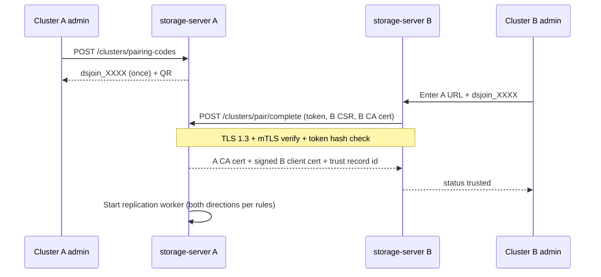

# TZ: Multi-cluster trusted replication (раздел «Кластеры»)

**Version:** 1.0  
**Date:** 2026-07-04  
**Status:** Draft — approved by PO with security amendments  
**Target:** v1.1.0 CE  
**Related:** [ha-replication-v2-tz.md](./ha-replication-v2-tz.md), field encryption `internal/security/fieldenc`, share token hash pattern (migration 013)

**Human-readable docs (operators & admins):**

| Audience | EN | RU |
|----------|----|----|
| Operations (env, lab, security) | [operations-guide/en/trusted-clusters.md](../operations-guide/en/trusted-clusters.md) | [operations-guide/ru/trusted-clusters.md](../operations-guide/ru/trusted-clusters.md) |
| Console walkthrough | [administrator-guide/en/trusted-clusters.md](../administrator-guide/en/trusted-clusters.md) | [administrator-guide/ru/trusted-clusters.md](../administrator-guide/ru/trusted-clusters.md) |
| User guide (overview) | [en/user-guide/08-federation-and-cluster.md](../en/user-guide/08-federation-and-cluster.md) | [ru/user-guide/08-federation-i-cluster.md](../ru/user-guide/08-federation-i-cluster.md) |

**PO amendments (mandatory):**

1. **MITM protection — fully automated** (no manual OOB as default gate).
2. **Credential lifecycle — automatic** when mTLS is active (90d cert TTL, rotate before expiry, revoke propagates without operator cron).
3. **Metadata at rest — encrypt or hash only**; no recoverable secrets in plaintext columns.

---

## 1. Vision (unchanged)

- Single Admin UI: **Кластеры** — local + all remote trusted clusters, nodes, replication lag.
- Add cluster → one-time join token → **automated trust** → replication starts.
- Per-cluster load balancer (leader pool for writes, read pool for GET/LIST).
- Parallel S3 multipart / adaptive chunks for upload performance.

---

## 2. Security requirements (PO amendments)

### 2.1 Automated MITM protection (Amendment #1)

**Default path must not require manual fingerprint comparison.**

| Control | Mechanism | Automation |
|---------|-----------|------------|
| Transport | **TLS 1.3 only** between clusters; `urlpolicy` rejects HTTP to peers in prod | Built-in |
| Identity | **Cluster PKI** — each deployment has internal CA (or operator-provided CA via Helm) | Generated on first `storage-server` HA enable / `datasafe cluster init-ca` |
| Pairing | Join token (`dsjoin_*`, TTL 15m, single-use, stored as **hash only**) | Admin copies token once; joiner POSTs to initiator |
| Trust establishment | **Mutual TLS handshake** during `POST /clusters/pair/complete`: both sides present client certs signed by own CA; initiator validates joiner cert chain + join token; joiner validates initiator cert chain | **Fully automatic** |
| Pinning | Store **SPKI SHA256** of peer CA (not per-session) in `trusted_clusters.peer_ca_fingerprint`; reject cert from wrong CA | Automatic on every connection |
| Revocation | Compromised peer → `POST /clusters/{id}/revoke` adds serial to **local CRL** in metadata; workers drop TLS handshakes immediately | Automatic worker stop |

**Optional (audit only, not gate):** log `safety_number = SHA256(local_ca_fp || peer_ca_fp)[0:8]` for support — display in UI as read-only, **no** «confirm to enable replication».

**Reject:** replication traffic if TLS verify fails, CA fingerprint mismatch, or cert expired/revoked.

### 2.2 Automatic rotate / revoke under mTLS (Amendment #2)

When `trusted_clusters.auth_mode = mtls` (default for inter-cluster repl):

| Aspect | Policy |
|--------|--------|
| **Client cert TTL** | **90 days** |
| **Rotation** | Background job **`cluster-cert-rotator`** (leader only): renew at **75 days** (configurable `STORAGE_CLUSTER_CERT_RENEW_BEFORE_DAYS`); zero-downtime: issue new cert → dual-trust window 24h → retire old serial |
| **Revoke** | UI button **Revoke cluster** → serial added to CRL + delete `trusted_clusters` active flag; **no** manual token rotation step |
| **Peer notification** | `POST /clusters/{id}/revoke-notify` (mTLS) optional; if unreachable, local revoke still applies |
| **Fallback AK/SK** | **None** for mtls peers — data plane auth = client cert only |
| **UI** | Show: `cert_expires_at`, `last_rotated_at`, `next_rotation_at`, `status: healthy | renewing | revoked` — operator **does not** click «rotate» in normal ops |

**JWT `ds_cluster_*` scoped tokens:** deprecated for mtls mode; if legacy mode enabled (dev only, `STORAGE_CLUSTER_AUTH=token`), then manual rotate in UI applies — **not** CE default.

### 2.3 Metadata encryption / hashing (Amendment #3)

**Rule:** anything that can authenticate cross-cluster or recover secrets → **never plaintext in DB**.

| Field | Storage | Pattern |
|-------|---------|---------|
| Join token (pairing) | `cluster_pairing_sessions.token_hash` | SHA-256 or bcrypt; plaintext shown once to admin |
| Join token used | `used_at` + delete hash after success | Single-use |
| Peer **client cert** private key | **Not in DB** | File: `/var/lib/datasafe/cluster-certs/` or K8s secret; optional wrap with existing **field encryption KEK** |
| Peer **client cert** PEM (public) | OK plaintext | Public material |
| Peer CA fingerprint | plaintext | Public |
| Legacy secret_key (migration) | `enc:v1:` via `fieldenc.PathClusterPeerSecret` | Same as gateway credentials |
| API token hash pattern | `cluster_credentials.secret_hash` | Like `api_tokens.token_hash` — verify only, never store plaintext after issue |
| Replication task payloads | no secrets | bucket/key/event only |

**Extend field encryption paths** (`internal/security/fieldenc/paths.go`):

```go
PathClusterPeerSecret   = "trusted_clusters.credential_secret" // if any shared symmetric fallback
PathSiteReplSecretKey   = "site_replication_peers.secret_key"    // migrate 016 table
```

**Postgres migration 017+:**

- `trusted_clusters` table (replaces remote federation + site peer secrets in UI model)
- `cluster_pairing_sessions(token_hash, expires_at, used_at)`
- `cluster_certificates(serial, cluster_id, role, not_before, not_after, revoked_at)`
- Drop plaintext `secret_key` from `site_replication_peers` after backfill to `enc:v1:` or remove column when mtls-only

**Bolt:** same semantics; encrypt at rest via fieldenc on write.

---

## 3. Pairing flow (automated mTLS)



**AC-MITM-1:** Pairing succeeds without any manual «confirm fingerprint» click.  
**AC-MITM-2:** Inject wrong CA in MITM test → pairing fails, audit `cluster.pair.failed`.  
**AC-MITM-3:** Replay used token → 401.

---

## 4. Load balancer + chunks (unchanged from plan)

- **LB:** Caddy/HAProxy — write pool = leader only (`/healthz` + `is_leader=true`); read pool = all healthy nodes.
- **Chunks:** Console parallel multipart; repl triggers on **CompleteMultipart** or PUT complete; erasure shards separate.

---

## 5. UI «Кластеры»

| View | Content |
|------|---------|
| Overview | All clusters (local + remote), trust status, cert expiry, repl lag |
| Local nodes | HA members, leader badge, backend mode |
| Add cluster | Generate `dsjoin_*` → show QR → auto-trust on joiner connect |
| Remote detail | Cert timeline, revoke button, replication rules |
| **Remove** separate «Федерация» nav (merge into Clusters) |

---

## 6. Implementation phases

| Phase | Deliverable |
|-------|-------------|
| **P0** | `trusted_clusters` model + UI list; automated mTLS pairing; hash-only join tokens; urlpolicy |
| **P0** | Metadata: enc/hash for any remaining secrets; migration from `site_replication_peers` |
| **P1** | Cert rotator job (75d renew / 90d TTL); CRL revoke; LB compose/Helm templates |
| **P1** | Replication worker on trusted clusters only |
| **P2** | Parallel multipart UI; bidirectional repl policy |

---

## 7. Test / AppSec gates

- `TestClusterPairing_mTLSRequired`
- `TestClusterPairing_rejectsWrongCA` (MITM sim)
- `TestClusterCert_autoRotate_beforeExpiry`
- `TestClusterRevoke_stopsWorker`
- `TestTrustedClusterMetadata_noPlaintextSecrets` (grep + integration)
- feature-audit: pairing happy path, revoke, repl object on peer

---

## 8. Residual risks

| Risk | Mitigation |
|------|------------|
| Compromised **local CA private key** | CA in HSM/Vault EE; CE: file permissions + backup encryption |
| First pairing before CA exists | Auto-generate CA on enable cluster mode; document backup |
| mTLS + LB passthrough misconfig | Helm validates «no TLS terminate on inter-cluster port» |

---

*PO amendments 2026-07-04 integrated. AppSec agent: automated mTLS PKI, no OOB gate.*
