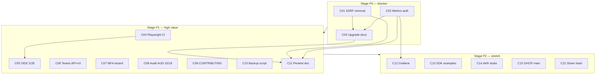

# TZ: DataSafeS3 v1.1.0 — Trust Debt & OSS Growth

**Version:** 1.0  
**Date:** 2026-07-03  
**Status:** Draft  
**Charter:** First **minor** after trust-line v1.0.x — close **scheduled security debt**, harden **CI/E2E gates**, improve **contributor readiness**. Not hyperscale HA, mobile GA, Enterprise KMS, or field encryption v2.  
**Baseline release:** [v1.0.3](https://github.com/DirektorBani/DataSafeS3/releases/tag/v1.0.3)  
**Scope decision (internal):** `_local/publishing/v1.1.0-scope-decision-2026-07-03.md`  
**Related docs:**

| Doc | Path |
|-----|------|
| Upgrade guide EN/RU | `docs/operations-guide/en/upgrade.md`, `docs/operations-guide/ru/upgrade.md` |
| CHANGELOG | `CHANGELOG.md` |
| Project status | `docs/en/context/project-status.md` |
| Security self-assessment | `docs/operations-guide/en/security-self-assessment.md` |
| Field encryption boundary | `_local/publishing/field-encryption-governance-decision-2026-06-30.md` |
| Roadmap AUD-* | `docs/en/context/roadmap.md` |
| Competitive page | `docs/en/why-datasafes3-vs.md` |
| RU mirror | [docs/ru/specs/v1.1.0-trust-debt-oss-growth-tz.md](../ru/specs/v1.1.0-trust-debt-oss-growth-tz.md) |

---

## 1. Executive summary (RU)

**DataSafeS3 CE v1.1.0** — первый minor после линии доверия v1.0.x. Релиз **не расширяет** продуктовую поверхность hyperscale/mobile/Enterprise KMS; он **закрывает запланированный security contract** (SSRF escape hatch, auth на `/metrics`), усиливает **автоматические гейты** (Playwright, feature-audit) и делает репозиторий **contributor-ready**.

**Бизнес-ценность для OSS:** операторы regulated self-hosted S3 получают предсказуемый breaking-change путь; интеграторы и contributors — зелёный CI шире smoke; админы CE — Teams/MFA UX без Enterprise license gates. Целевая внутренняя зрелость **≥9.2/10** (+0.2 к v1.0.3).

**Явно вне тега:** Vault Transit in-process KEK (PO 9.2), mobile GA, Kafka, auto-failover, production erasure, **field encryption v2** (admin rewrap API, share token encryption) — отдельный security epic.

---

## 2. Goals & non-goals

### 2.1 Goals

| # | Goal | Traceability |
|---|------|--------------|
| G1 | Remove `STORAGE_OUTBOUND_HTTP_ALLOW`; prod outbound = HTTPS or `STORAGE_DEV` on non-prod only | C01, scope §5 P0 |
| G2 | Enforce `STORAGE_METRICS_TOKEN` on `GET /metrics` | C02 |
| G3 | Documented breaking changes EN/RU before tag | C03 |
| G4 | CI Playwright ≥6 specs green on PR | C04 |
| G5 | OIDC Keycloak real browser E2E (AUD-14) | C05 |
| G6 | Teams admin REST API + console (metadata/RBAC exist; HTTP UI missing) | C06 |
| G7 | MFA admin enforcement wizard polish (AUD-17) | C07 |
| G8 | Feature-audit AUD-15 tenant viewer/member + AUD-18 trash restore | C08 |
| G9 | CONTRIBUTING expansion + good-first-issue labels | C09 |
| G10 | Reference-arch backup script (tested) | C10 |
| G11 | Pen-test preparation doc (not certification) | C11 |
| G12 | Stretch: Grafana smoke, SDK examples, de/fr stubs, GHCR on main, share hash-only | C12–C15, C21 |

### 2.2 Non-goals

See scope decision §6 and [field-encryption-governance-decision](../../_local/publishing/field-encryption-governance-decision-2026-06-30.md): field enc v2, mobile, Kafka, auto-failover, Vault Transit in-process, license gates on CE.

---

## 3. Success metrics

| Metric | Baseline (v1.0.3) | Target (v1.1.0) |
|--------|-------------------|-----------------|
| Internal maturity /10 | 9.0 | **≥9.2** |
| Feature-audit | 100/105, 4 SKIP | **≥103/105**, ≤2 SKIP |
| Playwright CI | smoke only (`smoke.spec.ts`) | **≥6 specs** green on PR |
| Security P0 open | metrics auth, SSRF hatch | **0** |
| Competitive narrative Δ | 8.7 roadmap claim | **+0.2** documented (internal reassessment) |
| Contributor friction | minimal CONTRIBUTING | Expanded guide + **3+** `good first issue` labels |
| Breaking changes | 0 in v1.0.3 default path | **2 documented** (SSRF, metrics) |
| Production adopters | 0 | Track pilots; **not a release gate** |

---

## 4. Staged implementation

### Stage P0 — Must ship (release blocker)

**Capacity:** ~2–3 dev-weeks (1 engineer) + QA pass.  
**Stage gate:** `go test ./...` PASS; `security_remediation_test.go` green; feature-audit **0 FAIL**; C01–C03 merged; upgrade docs ready **before** tag.

---

#### C01 — Remove `STORAGE_OUTBOUND_HTTP_ALLOW`

| Field | Value |
|-------|-------|
| **PO score** | **5.8 / 10** |
| **Edition** | Community (CE) |
| **Size** | M |
| **Dependencies** | None (blocks C03 narrative) |

**Business value (RU):** Запланированное breaking change закрывает SSRF escape hatch для **всех CE production** деплоев. Операторы с private Loki/ES должны мигрировать на HTTPS или dev-only `STORAGE_DEV=true`; это повышает доверие к self-assessment и parity с MinIO table stakes по outbound policy.

**Agent-ready specification**

| AC | Requirement |
|----|-------------|
| AC-C01-1 | `internal/security/urlpolicy/urlpolicy.go` — remove `STORAGE_OUTBOUND_HTTP_ALLOW` branch from `DefaultOptions()`; `AllowHTTP` and `AllowPrivate` depend only on `STORAGE_DEV` |
| AC-C01-2 | `grep -r STORAGE_OUTBOUND_HTTP_ALLOW` across repo → **zero** runtime references (docs may mention removal in migration sections only) |
| AC-C01-3 | `docker-compose.audit.yml` — remove `STORAGE_OUTBOUND_HTTP_ALLOW`; keep `STORAGE_DEV=true` for audit Loki/ES loopback |
| AC-C01-4 | `.env.example`, `docker-compose.security-test.yml`, `deploy/helm/datasafe/values*.yaml` — remove variable; document `STORAGE_DEV` for dev overlays |
| AC-C01-5 | `PUT /api/v1/settings/system` with `logging.loki.address=http://127.0.0.1:3100` and `STORAGE_DEV=false` → **400** `outbound url not allowed` |
| AC-C01-6 | Same request with `STORAGE_DEV=true` → **200** |
| AC-C01-7 | `POST /api/v1/hooks/test`, `POST /api/v1/webhooks` — SSRF to `169.254.169.254` still **400** (existing `TestHooksTest_blocksPrivateIP`, `TestCreateWebhook_blocksSSRF`) |
| AC-C01-8 | Startup: unknown env `STORAGE_OUTBOUND_HTTP_ALLOW` ignored (no read); optional log line in `cmd/storage-server` if env present — **warn once** "deprecated removed in v1.1.0" (optional, not required for DoD) |

**Code search hints:** `internal/security/urlpolicy/`, `internal/api/log_sinks.go`, `internal/api/webhook_handlers.go`, `internal/api/security_remediation_test.go` (`TestPutLoggingConfig_*`).

**Technical implementation**

1. Edit `urlpolicy.DefaultOptions()` — delete `allowHTTP := dev \|\| os.Getenv("STORAGE_OUTBOUND_HTTP_ALLOW") == "true"`.
2. Update `urlpolicy_test.go` table cases — remove `allowHTTP` env column; add dev vs non-dev matrix.
3. Delete/update `TestPutLoggingConfig_allowsLoopbackWhenOutboundHTTPAllow` in `security_remediation_test.go` → replace with `TestPutLoggingConfig_allowsLoopbackWhenDevMode`.
4. Scrub compose/Helm/env templates.
5. Run `go test ./internal/security/urlpolicy/... ./internal/api/... -run 'PutLoggingConfig|HooksTest|CreateWebhook'`.

**Autotest coverage**

| Layer | File / function |
|-------|-----------------|
| Go unit | `internal/security/urlpolicy/urlpolicy_test.go` — `TestDefaultOptions_*`, `TestValidateOutboundURL_*` |
| Go integration | `internal/api/security_remediation_test.go` — rename/add `TestPutLoggingConfig_allowsLoopbackWhenDevMode`, keep `TestPutLoggingConfig_blocksLoopbackLoki` |
| Go regression | `internal/api/security_remediation_test.go` — `TestSSRFRegressionMatrix_v110` (new): matrix dev/prod × loki loopback × webhook private IP |
| feature-audit | Existing `Admin` ES/Loki delivery checks — must PASS with audit overlay (`STORAGE_DEV=true`) |
| CI gate | `go test ./...` in `.github/workflows/ci.yml` |

**DB migrations:** **none** (urlpolicy is env-only).

**Documentation**

| EN | RU |
|----|-----|
| `docs/operations-guide/en/upgrade.md` § Upgrading to v1.1.0 | `docs/operations-guide/ru/upgrade.md` |
| `docs/operations-guide/en/security-self-assessment.md` SSRF row | `docs/operations-guide/ru/security-self-assessment.md` |
| `docs/operations-guide/en/monitoring.md` dev Loki note | `docs/operations-guide/ru/monitoring.md` |
| `SECURITY.md` deprecation removal note | same (EN primary) |
| `.env.example` | — |

**Threat notes (STRIDE):** Spoofing/Tampering via SSRF to metadata endpoints — **mitigated** by strict urlpolicy. **Residual:** operator misconfigures `STORAGE_DEV=true` in prod — document in upgrade checklist.

**Definition of Done**

- [ ] AC-C01-1 … AC-C01-7 verified with test output
- [ ] No `STORAGE_OUTBOUND_HTTP_ALLOW` in runtime code or default compose
- [ ] EN/RU upgrade § v1.1.0 drafted (or completed in C03)
- [ ] feature-audit 0 FAIL with audit overlay

---

#### C02 — `/metrics` authentication (`STORAGE_METRICS_TOKEN`)

| Field | Value |
|-------|-------|
| **PO score** | **5.4 / 10** |
| **Edition** | Community (CE) |
| **Size** | M |
| **Dependencies** | None (pairs with C03, C12) |

**Business value (RU):** Неаутентифицированный `/metrics` — gap для regulated pilots и RFP (DS-SEC-008 area). Реализация env stub закрывает observability leak без license gate; операторы Prometheus добавляют `Authorization: Bearer` в scrape config.

**Agent-ready specification**

| AC | Requirement |
|----|-------------|
| AC-C02-1 | Read `STORAGE_METRICS_TOKEN` from env in `cmd/storage-server` (or server bootstrap); empty string = **legacy open mode** with **startup warning** when `STORAGE_DEV=false` |
| AC-C02-2 | When token **non-empty**: `GET /metrics` without `Authorization: Bearer <token>` → **401**; wrong token → **401**; correct bearer → **200** + Prometheus text |
| AC-C02-3 | When token **non-empty**: `GET /healthz` and `/api/v1/*` — **unchanged** (no metrics token on admin API) |
| AC-C02-4 | Implement wrapper in `internal/observability/metrics.go` — `MetricsAuthHandler(token string, inner http.Handler) http.Handler` |
| AC-C02-5 | Wire in `internal/api/server.go` line ~549: `mux.Handle("GET /metrics", ...)` |
| AC-C02-6 | `deploy/docker/prometheus.yml` — comment + example `bearer_token` / `authorization` scrape config for tokenized deploys |
| AC-C02-7 | Helm: `storageServer.config.metricsToken` → env `STORAGE_METRICS_TOKEN`; `deploy/helm/datasafe/templates/caddy-configmap.yaml` — `/metrics` may stay proxied; token validated at storage-server |
| AC-C02-8 | Console `web/console/src/lib/api.ts` `fetchMetrics()` — if UI reads metrics, pass bearer from admin session **or** document admin-only via direct Prometheus (prefer: remove console scrape of `/metrics` if unauthorized) |
| AC-C02-9 | `STORAGE_STRICT_SECRETS=true` — optional future: treat empty metrics token as weak secret (stretch; **not** required v1.1.0 unless trivial) |

**Code search hints:** `internal/observability/metrics.go`, `internal/api/server.go`, `internal/api/s3/policy_test.go` `TestAdminLoginAndMetrics`, `docker-compose.security-test.yml`, `.env.security-test`.

**Technical implementation**

1. Add `MetricsAuthHandler` with constant-time compare (`subtle.ConstantTimeCompare`).
2. Parse `Authorization: Bearer ` prefix only (not query param token).
3. Update `TestAdminLoginAndMetrics` — split into open vs tokenized subtests via `t.Setenv`.
4. Add `TestMetricsAuth_*` 4-case matrix: no token/open; token set + no header/401; wrong/401; correct/200.
5. Update feature-audit `Monitoring` `Prometheus /metrics` — when `STORAGE_METRICS_TOKEN` set in CI security job, use header (or keep open in default audit overlay — document split).

**Autotest coverage**

| Layer | File / function |
|-------|-----------------|
| Go | `internal/observability/metrics_auth_test.go` — `TestMetricsAuth_noTokenAllowsAnonymous`, `TestMetricsAuth_rejectsMissingBearer`, `TestMetricsAuth_rejectsWrongBearer`, `TestMetricsAuth_acceptsValidBearer` |
| Go | `internal/api/security_remediation_test.go` — `TestMetricsEndpoint_openWhenTokenEmpty`, `TestMetricsEndpoint_requiresBearerWhenTokenSet` |
| Go | Update `internal/api/s3/policy_test.go` `TestAdminLoginAndMetrics` if needed |
| Compose | `docker-compose.security-test.yml` + `.env.security-test` (`STORAGE_METRICS_TOKEN=test-metrics-token`) — optional CI job or documented local run |
| feature-audit | `scripts/feature-audit-test.ps1` — extend `Record 'Monitoring' 'Prometheus /metrics'` to send bearer when env `AUDIT_METRICS_TOKEN` set |
| CI | Add metrics auth tests to `go test`; optional workflow matrix job `security-test` overlay |

**DB migrations:** **none**.

**Documentation**

| EN | RU |
|----|-----|
| `docs/operations-guide/en/monitoring.md` — bearer scrape example | `docs/operations-guide/ru/monitoring.md` |
| `docs/operations-guide/en/upgrade.md` § v1.1.0 breaking: metrics auth | `docs/operations-guide/ru/upgrade.md` |
| `deploy/helm/datasafe/README.md` | — |
| `.env.example` — `# STORAGE_METRICS_TOKEN=` | — |

**Threat notes:** Information disclosure (metrics reveal bucket counts, RPS) — **High** without auth; **mitigated** with bearer. Do not log token values.

**Definition of Done**

- [ ] 4-case metrics auth matrix green
- [ ] Prometheus scrape example in ops guide EN/RU
- [ ] Default audit/CI path documented (open vs tokenized)
- [ ] No regression on `datasafe_http_requests_total` series name

---

#### C03 — v1.1.0 upgrade guide EN/RU + CHANGELOG

| Field | Value |
|-------|-------|
| **PO score** | **4.2 / 10** |
| **Edition** | Community (CE) |
| **Size** | S |
| **Dependencies** | C01, C02 (content describes their behavior) |

**Business value (RU):** Без честной migration comms breaking changes (SSRF, metrics) создают support debt и undermines trust narrative. Обязательный companion к P0 security work.

**Agent-ready specification**

| AC | Requirement |
|----|-------------|
| AC-C03-1 | `CHANGELOG.md` — section `[1.1.0]` with **Security**, **Changed**, **Removed**, **Migration** subsections |
| AC-C03-2 | `docs/operations-guide/en/upgrade.md` — `## Upgrading to v1.1.0` with paired server+console update, SSRF checklist, metrics bearer checklist |
| AC-C03-3 | RU mirror `docs/operations-guide/ru/upgrade.md` — structural parity |
| AC-C03-4 | Cross-link from `SECURITY.md` to upgrade § v1.1.0 |
| AC-C03-5 | `docs/en/context/project-status.md` + RU — update "Out of scope 1.1.0" → move completed items to "Shipped in v1.1.0" after tag (draft text OK pre-tag) |

**Technical implementation**

1. Draft migration tables (from → to) for outbound URLs and Prometheus.
2. Include Helm values snippet: `storageServer.config.metricsToken`.
3. Note `docker-compose.audit.yml` uses `STORAGE_DEV=true` post-C01.
4. Explicit **field encryption v2 NOT in 1.1.0** one-liner pointing to governance doc.

**Autotest coverage**

| Layer | Check |
|-------|-------|
| Docs | Manual review checklist; link lint optional |
| CI | No automated gate (docs-only) |

**DB migrations:** **none**.

**Documentation:** (this item **is** documentation deliverable)

**Definition of Done**

- [ ] CHANGELOG `[1.1.0]` migration section complete
- [ ] EN/RU upgrade § v1.1.0 peer-reviewed
- [ ] project-status draft updated

---

### Stage P1 — High value (in tag if capacity; else 1.1.1)

**Capacity:** +3–5 dev-weeks parallel QA/Dev.  
**Stage gate:** P0 complete; ≥6 Playwright specs in CI; AUD-15/18 PASS if C08 shipped.

---

#### C04 — Playwright CI expansion (≥6 specs)

| Field | Value |
|-------|-------|
| **PO score** | **5.1 / 10** |
| **Edition** | CE (hybrid zone — **maintainer approval** per PO gate) |
| **Size** | M |
| **Dependencies** | Compose CI stack (existing `e2e-smoke` job) |

**Business value (RU):** Единственный `smoke.spec.ts` не ловит регрессии buckets/settings/files/share. Расширение CI — Phase 4 starter и сигнал доверия для contributors.

**Agent-ready specification**

| AC | Requirement |
|----|-------------|
| AC-C04-1 | `.github/workflows/ci.yml` job `e2e-smoke` runs **≥6** spec files on PR |
| AC-C04-2 | Minimum set: `smoke.spec.ts`, `buckets.spec.ts`, `settings.spec.ts`, `files.spec.ts`, `share.spec.ts`, `security-mfa.spec.ts` |
| AC-C04-3 | `PLAYWRIGHT_BASE_URL=http://127.0.0.1:8080`; stack = postgres profile + local-binary overlay (match existing job) |
| AC-C04-4 | Health wait: `curl -sf http://127.0.0.1:8080/healthz` before Playwright |
| AC-C04-5 | Specs must be stable (no flaky sleeps >5s); use role/name selectors per `datasafe-qa` skill |
| AC-C04-6 | Existing specs pass locally after `docker compose ... up -d --build` |

**Code paths:** `web/console/e2e/*.spec.ts`, `web/console/playwright.config.ts`, `.github/workflows/ci.yml`.

**Technical implementation**

1. Change CI `npx playwright test e2e/smoke.spec.ts` → `npx playwright test e2e/smoke.spec.ts e2e/buckets.spec.ts ...` or `npx playwright test --grep-invert @nightly`.
2. Fix any failing specs (login flows, i18n regex).
3. Document in `CONTRIBUTING.md` (C09).

**Autotest coverage**

| Layer | Files |
|-------|-------|
| Playwright | 6+ specs listed above |
| CI | `.github/workflows/ci.yml` `e2e-smoke` job |
| Optional | Tag flaky OIDC full redirect as `@nightly` if moved to C05 |

**DB migrations:** **none**.

**Documentation:** `CONTRIBUTING.md` — CI Playwright list; `docs/en/context/project-status.md` test gates row.

**Definition of Done**

- [ ] CI green with ≥6 specs on sample PR
- [ ] Local repro steps in CONTRIBUTING

---

#### C05 — OIDC Keycloak real browser E2E (AUD-14)

| Field | Value |
|-------|-------|
| **PO score** | **4.8 / 10** |
| **Edition** | CE |
| **Size** | L |
| **Dependencies** | Keycloak test compose; C04 infrastructure |

**Business value (RU):** SSO credibility для enterprise-adjacent CE pilots; mock-only OIDC E2E недостаточен для AUD-14 partial closure.

**Agent-ready specification**

| AC | Requirement |
|----|-------------|
| AC-C05-1 | New Playwright spec `web/console/e2e/security-oidc-keycloak.spec.ts` — **real** redirect to Keycloak test realm (not route mock) |
| AC-C05-2 | Flow: `/login` → SSO button → Keycloak login → callback with `exchange_code` → `POST /api/v1/auth/oidc/exchange` → session token in `sessionStorage` (`datasafe_admin_token`) |
| AC-C05-3 | Update `scripts/oidc-browser-e2e.mjs` — expect `exchange_code` not `?token=` (legacy); align with `security-oidc.spec.ts` mock pattern |
| AC-C05-4 | Compose profile: `scripts/start-keycloak-test.cmd` + documented ports (`KEYCLOAK_URL=http://localhost:8180`) |
| AC-C05-5 | CI strategy: **nightly** or optional job with `continue-on-error: false` when Keycloak service healthy; PR blocker only if flake rate <5% over 10 runs |
| AC-C05-6 | Skip gracefully when Keycloak down: `test.skip()` with reason (not FAIL) in PR job if profile absent |

**Code search hints:** `internal/api/auth_handlers.go` `handleOIDCExchange`, `web/console/src/pages/login.tsx`, `web/console/e2e/security-oidc.spec.ts`.

**Technical implementation**

1. Ensure OIDC enabled in test system config (feature-audit preflight pattern).
2. Implement Playwright Keycloak selectors (`#username`, `#password`, `#kc-login`).
3. Add `docker-compose.oidc-e2e.yml` overlay if missing (or extend existing).
4. Wire nightly workflow `.github/workflows/audit.yml` or new `e2e-oidc.yml`.

**Autotest coverage**

| Layer | Artifact |
|-------|----------|
| Playwright | `security-oidc-keycloak.spec.ts` |
| Script | `scripts/oidc-browser-e2e.mjs` updated |
| feature-audit | Existing `Users/Auth` `OIDC config` + password-login path remains |
| AUD ID | **AUD-14** → status **done** in `docs/en/context/roadmap.md` |

**DB migrations:** **none**.

**Documentation:** `docs/getting-started/en/onboarding.md` OIDC test section; RU mirror; `CONTRIBUTING.md` Keycloak prereq.

**Definition of Done**

- [ ] Real browser OIDC pass recorded (CI or nightly log)
- [ ] AUD-14 marked done with evidence path
- [ ] Flake policy documented

---

#### C06 — Teams admin REST API + console UI

| Field | Value |
|-------|-------|
| **PO score** | **5.3 / 10** |
| **Edition** | CE (**hybrid zone — explicit maintainer approval**) |
| **Size** | M |
| **Dependencies** | None |

**Business value (RU):** Legacy **Teams** (`teams`, `user_teams`, bucket `team_id`) работают в metadata/RBAC (`TestTeamBucketVisibility`), но **нет Admin HTTP API и UI** — админы вынуждены использовать прямые DB/метаданные хаки. Закрывает UX debt с v1.0.1. *Не путать с Tenant Groups* (`/api/v1/tenants/{id}/groups` — уже есть API + `tenants.tsx`).

**Agent-ready specification**

| AC | Requirement |
|----|-------------|
| AC-C06-1 | New handlers `internal/api/teams_handlers.go` registered in `server.go` |
| AC-C06-2 | Routes (admin-only): `GET/POST /api/v1/teams`, `GET/PUT/DELETE /api/v1/teams/{id}`, `PUT /api/v1/teams/{id}/members` (body: `user_ids[]`), `GET /api/v1/teams/{id}/members` |
| AC-C06-3 | `PUT /api/v1/users/{id}` accepts optional `team_id` (primary team) — extend `users_handlers.go` if missing |
| AC-C06-4 | `POST /api/v1/buckets/{bucket}` JSON body optional `team_id` for admin assignment |
| AC-C06-5 | Console page `web/console/src/pages/teams.tsx` — list/create/delete teams; assign members; link from sidebar for `administrator` |
| AC-C06-6 | i18n keys `teams:*` in `web/console/src/locales/en|ru/` (de/fr nav stub optional) |
| AC-C06-7 | OpenAPI: update `docs/api/openapi.yaml` + `go test ./internal/api/... -run OpenAPI` |
| AC-C06-8 | RBAC: only `administrator` manages teams; operators/users consume via existing bucket list filter |

**Code search hints:** `internal/metadata/teams.go`, `internal/metadata/postgres/teams.go`, `internal/api/rbac_access_test.go` `TestTeamBucketVisibility`, `internal/api/bucket_access.go` `userTeamIDs`, migration `002_teams_buckets.up.sql`.

**Technical implementation**

1. Implement handlers calling `meta.ListTeams`, `PutTeam`, `DeleteTeam`, `AddUserTeam`, `RemoveUserTeam`, `ListUserTeamIDs`.
2. Add API client methods in `web/console/src/lib/api.ts`.
3. Add route in `web/console/src/App.tsx` + sidebar `layouts/sidebar.tsx`.
4. Playwright smoke: navigate to Teams, create team, assign user (stretch in `e2e/teams.spec.ts`).

**Autotest coverage**

| Layer | Tests |
|-------|-------|
| Go | `internal/api/teams_handlers_test.go` — `TestTeamsCRUD`, `TestTeamMembersAssign`, `TestTeamBucketVisibilityViaAPI` |
| Go | Extend `rbac_access_test.go` if needed |
| Playwright | `web/console/e2e/teams.spec.ts` (P1 stretch; counts toward C04 if added) |
| feature-audit | Optional new `Record 'Admin' 'Teams CRUD'` |

**DB migrations:** **none** — tables exist (`002_teams_buckets.up.sql`). Rollback N/A.

**Documentation**

| EN | RU |
|----|-----|
| `docs/administrator-guide/en/` — Teams section (or user-guide § RBAC) | RU mirror |
| `docs/en/database.md` — clarify Teams vs Tenant Groups | `docs/ru/database.md` |

**Definition of Done**

- [ ] Admin can CRUD teams and members via UI end-to-end
- [ ] `TestTeamBucketVisibility` pattern reproducible via API-only setup
- [ ] OpenAPI drift test PASS

---

#### C07 — MFA admin wizard (AUD-17)

| Field | Value |
|-------|-------|
| **PO score** | **5.2 / 10** |
| **Edition** | CE |
| **Size** | M |
| **Dependencies** | None |

**Business value (RU):** При `require_admin_mfa=true` админ без MFA получает `mfa_setup_required`, но UX wizard неполный (AUD-17). Закрывает security policy enforcement gap для CE admins.

**Agent-ready specification**

| AC | Requirement |
|----|-------------|
| AC-C07-1 | Login response includes `mfa_setup_required: true` when `sysCfg.MFA.RequireAdminMFA` and admin has no TOTP/WebAuthn — existing `server.go` ~642 |
| AC-C07-2 | `requireAuth` middleware blocks admin API with **403** `mfa_setup_required` except allowlist: `/api/v1/me`, `/api/v1/mfa/*`, `/api/v1/me/mfa/*`, `/api/v1/me/password`, `/api/v1/admin/logout` — verify `auth_middleware.go` |
| AC-C07-3 | Console: `RequireMfaSetup` in `App.tsx` redirects to `/profile`; enhance `MfaSetupBanner` + profile page with **step wizard** (TOTP enroll + verify OR WebAuthn register) |
| AC-C07-4 | After successful enroll, clear `datasafe_mfa_setup_required` localStorage; `GET /api/v1/me` shows `mfa_enabled: true` |
| AC-C07-5 | Administrator settings toggle `require_admin_mfa` — existing `AdministratorSettings.tsx`; add confirm dialog explaining lockout risk |
| AC-C07-6 | Cannot disable MFA via API if policy requires admin MFA and user is last admin without break-glass doc |

**Code search hints:** `internal/api/auth_middleware.go`, `web/console/src/components/mfa-setup-banner.tsx`, `web/console/src/pages/profile.tsx`, `web/console/e2e/security-mfa.spec.ts`.

**Technical implementation**

1. Audit middleware allowlist vs blocklist.
2. Build wizard UI component `MfaEnrollWizard.tsx` embedded in profile.
3. Add Playwright flow: enable policy via API → login → forced profile → enroll TOTP (test secret from API).

**Autotest coverage**

| Layer | Tests |
|-------|-------|
| Go | `internal/api/mfa_policy_test.go` — `TestAdminMFASetupRequired_blocksBucketsUntilEnrolled` |
| Playwright | Extend `security-mfa.spec.ts` — `test('AUD-17 admin MFA wizard')` |
| feature-audit | Mark AUD-17 related MFA enroll SKIP → PASS when enroll succeeds |

**DB migrations:** **none** (`system_config.mfa` JSON exists).

**Documentation:** `docs/operations-guide/en/security-self-assessment.md` MFA row; admin guide MFA policy EN/RU.

**Definition of Done**

- [ ] AUD-17 → **done** in roadmap.md
- [ ] Playwright MFA wizard green
- [ ] Go middleware regression test

---

#### C08 — Feature-audit AUD-15 + AUD-18

| Field | Value |
|-------|-------|
| **PO score** | **4.6 / 10** |
| **Edition** | CE |
| **Size** | M |
| **Dependencies** | None |

**Business value (RU):** Tenant viewer/member сценарии только в Go-тестах; trash restore не покрыт audit — риск регрессии RBAC и soft-delete flows.

**Agent-ready specification**

| AC | Requirement |
|----|-------------|
| AC-C08-1 | **AUD-15:** In `scripts/feature-audit-test.ps1`, add explicit viewer cannot write / member read+write with grant after tenant setup (extend existing tenant block ~L568+) |
| AC-C08-2 | Record names: `Record 'Tenant' 'Viewer write blocked after role grant'` and `Record 'Tenant' 'Member read-only without grant'` with PASS/FAIL |
| AC-C08-3 | **AUD-18:** After `Soft delete to trash`, call `POST /api/v1/trash/{id}/restore`, verify object readable again |
| AC-C08-4 | Record: `Record 'Admin' 'Trash restore cycle'` PASS with notes `restored_key=...` |
| AC-C08-5 | Target audit score ≥103/105, ≤2 SKIP |

**Code search hints:** `scripts/feature-audit-test.ps1` lines 655–674 (trash), tenant section; `internal/api/server.go` trash routes; `defect_fixes_test.go` trash tests.

**Technical implementation**

1. Implement restore block after soft-delete in audit script.
2. Tighten tenant viewer/member assertions (HTTP 403 on PUT object).
3. Run full audit against compose stack.

**Autotest coverage**

| Layer | Artifact |
|-------|----------|
| feature-audit | AUD-15, AUD-18 records |
| Go | Existing `rbac_access_test.go` tenant tests remain green |
| CI | `.github/workflows/audit.yml` nightly |

**DB migrations:** **none**.

**Documentation:** `docs/en/context/roadmap.md` AUD-15/18 → done; `docs/testing/` autotest report template.

**Definition of Done**

- [ ] feature-audit script shows new PASS lines
- [ ] AUD-15/18 status **done** in roadmap EN/RU

---

#### C09 — CONTRIBUTING expansion + good-first-issues

| Field | Value |
|-------|-------|
| **PO score** | **4.5 / 10** |
| **Edition** | CE |
| **Size** | S |
| **Dependencies** | C04 (references Playwright list) |

**Business value (RU):** Минимальный CONTRIBUTING тормозит OSS growth (Phase 4 FR). Расширение снижает friction для первого PR.

**Agent-ready specification**

| AC | Requirement |
|----|-------------|
| AC-C09-1 | `CONTRIBUTING.md` — sections: Local stack (Windows `docker-compose.local-data.yml` + `local-binary`), Feature-audit gate, Playwright specs list, Edition policy links (existing URLs) |
| AC-C09-2 | Link `docs/testing/agent-handoff-template.md` if present; else `AGENTS.md` native dev path |
| AC-C09-3 | GitHub: ensure **≥3** open issues labeled `good first issue` (manual maintainer action; document titles in CONTRIBUTING) |
| AC-C09-4 | PO/community lifecycle link: `docs/en/enterprise/community-enterprise-lifecycle.md` |

**Autotest coverage:** None (docs + issue tracker).

**DB migrations:** **none**.

**Documentation:** `CONTRIBUTING.md` (primary deliverable).

**Definition of Done**

- [ ] CONTRIBUTING merged with compose + audit + CI sections
- [ ] ≥3 `good first issue` labels exist (listed in doc)

---

#### C10 — Reference-arch backup script (tested)

| Field | Value |
|-------|-------|
| **PO score** | **4.4 / 10** |
| **Edition** | CE |
| **Size** | M |
| **Dependencies** | Running stack |

**Business value (RU):** Phase 4 FR-3 pilot — один проверенный reference architecture script для backup landing zone narrative.

**Agent-ready specification**

| AC | Requirement |
|----|-------------|
| AC-C10-1 | Extend `scripts/reference-arch-backup.ps1` beyond healthz: create bucket `backup-arch-$ts`, upload object, list, optional restic dry-run stub |
| AC-C10-2 | Exit 0 only when all steps PASS; exit 1 with stderr message on failure |
| AC-C10-3 | Cross-link `docs/use-cases/en/backup-storage.md` + RU |
| AC-C10-4 | Optional Go-free CI step: run script against compose in `audit.yml` (stretch) |

**Technical implementation**

1. Use `Invoke-DS` pattern from `feature-audit-test.ps1` or `Invoke-RestMethod` with admin login.
2. Document prerequisites in script header.

**Autotest coverage**

| Layer | Artifact |
|-------|----------|
| Script | `scripts/reference-arch-backup.ps1` |
| Manual/CI | Log artifact in test run doc |

**DB migrations:** **none**.

**Documentation:** `docs/use-cases/en/backup-storage.md`, `docs/use-cases/ru/backup-storage.md` — "Verified script" subsection.

**Definition of Done**

- [ ] Script PASS against local compose
- [ ] Use-case doc links script

---

#### C11 — Pen-test preparation doc

| Field | Value |
|-------|-------|
| **PO score** | **4.8 / 10** |
| **Edition** | CE |
| **Size** | S |
| **Dependencies** | C01, C02 (control list) |

**Business value (RU):** RFP hygiene без ложных cert claims — internal/public ops doc для external pentest scope.

**Agent-ready specification**

| AC | Requirement |
|----|-------------|
| AC-C11-1 | New `docs/operations-guide/en/pen-test-preparation.md` + RU mirror |
| AC-C11-2 | Sections: scope boundaries, in-scope URLs, test accounts, OIDC/LDAP test profiles, **out-of-scope** (field enc v2, mobile), evidence links (self-assessment, feature-audit) |
| AC-C11-3 | STRIDE summary table referencing v1.1.0 controls (metrics auth, urlpolicy) |
| AC-C11-4 | Explicit "not a certification" disclaimer |
| AC-C11-5 | Link from `SECURITY.md` and `security-self-assessment.md` |

**Autotest coverage:** None.

**DB migrations:** **none**.

**Documentation:** (primary deliverable)

**Definition of Done**

- [ ] EN/RU pen-test prep published
- [ ] SECURITY.md cross-link

---

### Stage P2 — Stretch / 1.1.1 if slip

**Stage gate:** P0+P1 complete or explicitly deferred with CHANGELOG note.

---

#### C12 — Grafana panel query smoke (AUD-10)

| PO **4.0** | CE | S |

**Business value (RU):** Observability credibility — подтвердить, что дашборд `datasafe-overview` видит `datasafe_http_requests_total` после fresh install.

**Agent-ready specification:** Extend feature-audit `Monitoring` section — `Record 'Monitoring' 'Grafana datasafe-overview panel query'` with HTTP call to Grafana API or Prometheus query matching dashboard JSON in `deploy/docker/grafana/`. **AUD-10** → partial/done.

**Autotest:** `feature-audit-test.ps1`; optional `deploy/docker/grafana/dashboards/*.json` lint.

**DB migrations:** **none**. **Docs:** `docs/operations-guide/en/monitoring.md`.

**DoD:** AUD-10 evidence in audit output.

---

#### C13 — SDK examples Go (+Python stretch)

| PO **4.3** | CE | M |

**Business value (RU):** Integrator growth — минимальные примеры SigV4 + admin JWT в api-guide.

**Agent-ready specification:** Add `docs/api-guide/en/examples/go/` with `list_buckets.go`, `put_object.go`; RU mirror; link from `docs/api-guide/en/README.md`. Python stretch: `examples/python/` single script.

**Autotest:** `go run` compile check in CI (optional); no network in unit compile.

**DB migrations:** **none**.

**DoD:** Examples compile; README links.

---

#### C14 — de/fr getting-started stubs

| PO **3.8** | CE | M |

**Business value (RU):** i18n narrative starter без полной 35-doc parity.

**Agent-ready specification:** Create `docs/getting-started/de/README.md` + `what-is-datasafe.md`, `docs/getting-started/fr/` same; link from `docs/getting-started/README.md`; nav stubs in console already exist.

**DB migrations:** **none**.

**DoD:** 2×2 stub files; README index updated.

---

#### C15 — GHCR publish on `main` (AUD-01)

| PO **4.2** | CE | M |

**Business value (RU):** Fresh images for testers; AUD-01 closure.

**Agent-ready specification:** `.github/workflows/ci.yml` or new `publish-main.yml` — build+push `ghcr.io/direktorbani/datasafe-storage-server:main` and console on merge to `main` (digest tags). **Not** replacement for versioned release tags. Document cosign optional for main (release only today).

**Autotest:** Workflow dry-run on fork; image pull smoke.

**DB migrations:** **none**. **Docs:** `README.md` § GHCR main tags.

**DoD:** AUD-01 partial/done with workflow link.

---

#### C21 — Share link token hash-only

| PO **5.6** | CE | M | **Slip-friendly**

**Business value (RU):** `shared_links.token` plaintext in DB — security depth; can ship 1.1.1.

**Agent-ready specification:** Store `token_hash` only (bcrypt/sha256); lookup by hash; migration backfill optional; breaking: existing links invalidated unless dual-read period. See `field-encryption-1.0.3-tz.md` non-goals phase 2.

**Technical:** `internal/metadata/shared_links.go`, `internal/metadata/postgres/shared_links.go`, handlers `handleCreateSharedLink`, `handlePublicShareDownload`.

**Autotest:** `internal/api/share_handlers_test.go` — `TestShareLink_hashOnlyStorage`; feature-audit share tests updated.

**DB migrations:** **yes** — new migration `013_share_token_hash.up.sql`: add `token_hash` column, index; `.down.sql` drops column. **Rollback:** restore plaintext column; reverts hash-only mode.

**DoD:** Security review; migration tested on Postgres + Bolt parity plan documented.

---

## 5. Cross-cutting concerns

### 5.1 Breaking changes migration

| Change | Operator action |
|--------|-----------------|
| SSRF (C01) | Remove `STORAGE_OUTBOUND_HTTP_ALLOW`; use HTTPS sinks or `STORAGE_DEV=true` on dev/CI only |
| Metrics (C02) | Set `STORAGE_METRICS_TOKEN`; update Prometheus `authorization` credentials |
| Paired release | Bump **both** `storage-server` and `console` images |

### 5.2 Compose profiles

| Overlay | Purpose post-v1.1.0 |
|---------|---------------------|
| `docker-compose.local-data.yml` | Windows D: data root (required local dev) |
| `docker-compose.local-binary.yml` | Dev binary mount |
| `docker-compose.audit.yml` | `STORAGE_DEV=true`, high login limit — **no** OUTBOUND_HTTP_ALLOW |
| `docker-compose.security-test.yml` | `STORAGE_METRICS_TOKEN`, strict outbound |
| `docker-compose.oidc-e2e.yml` (C05) | Keycloak test IdP |

### 5.3 Helm values

Update `deploy/helm/datasafe/values.yaml` and `examples/values-production.yaml`:

- Remove `STORAGE_OUTBOUND_HTTP_ALLOW`
- Add `storageServer.config.metricsToken`
- Prometheus subchart scrape `authorization` example in README

---

## 6. Risk register

| Risk | Severity | Mitigation |
|------|----------|------------|
| SSRF breaking private Loki/ES | High | Upgrade guide (C03); v1.0.3 notice already shipped |
| Metrics auth breaks Prometheus | Medium | Bearer docs; dual-period warning in CHANGELOG |
| OIDC E2E flaky | Medium | Keycloak container; nightly vs PR gate (C05) |
| Scope creep (field enc v2, mobile) | High | PO gate; charter §2.2 |
| Teams UI PO 5.3 | Low | Maintainer approval recorded |
| C06 API was missing (store-only) | Medium | TZ specifies full REST+UI |
| Zero production consumers | Info | No battle-tested claims |

---

## 7. Agent execution order

**Recommended parallel tracks after P0:**

1. **Security/docs:** C11 after C03
2. **QA/CI:** C04 → C05; C08 parallel
3. **Product UX:** C06, C07 parallel
4. **OSS:** C09, C10 parallel

---

## 8. Appendix A — Environment variables (v1.1.0 delta)

| Variable | v1.0.3 | v1.1.0 |
|----------|--------|--------|
| `STORAGE_OUTBOUND_HTTP_ALLOW` | Deprecated escape hatch | **Removed** — use `STORAGE_DEV` |
| `STORAGE_METRICS_TOKEN` | Stub in compose only | **Enforced** on `/metrics` when non-empty |
| `STORAGE_DEV` | Relaxes urlpolicy + secrets warnings | Unchanged — **only** supported relax for outbound HTTP/private IPs |

Full list: `.env.example`, `docs/operations-guide/en/upgrade.md`.

---

## 9. Appendix B — AUD ID mapping

| Work item | AUD / gate |
|-----------|------------|
| C01 | SSRF regression (security remediation) |
| C02 | DS-SEC-008 `/metrics` |
| C04 | Phase 4 FR-6 Playwright CI |
| C05 | **AUD-14** OIDC E2E |
| C07 | **AUD-17** MFA admin enforcement |
| C08 | **AUD-15**, **AUD-18** |
| C10 | Phase 4 FR-3 reference arch |
| C12 | **AUD-10** Grafana |
| C15 | **AUD-01** GHCR on main |

---

## 10. Approval checklist (maintainers)

- [ ] PO: P0/P1 scope accepted; C06 Teams CE-now approved (≥5.1)
- [ ] Security: C01/C02 threat model + regression signed
- [ ] QA: §3 success metrics agreed
- [ ] Docs: breaking comms before tag
- [ ] Enterprise: C20 / field enc v2 explicitly out
- [ ] User: explicit «approve v1.1.0 scope»

---

*Draft TZ 2026-07-03 — agent-ready. Pair with RU mirror `docs/ru/specs/v1.1.0-trust-debt-oss-growth-tz.md`.*
