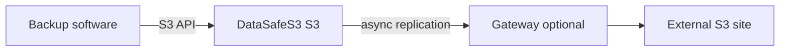

English | **[Русский](../ru/backup-storage.md)**

# Backup repository

## Problem

Backup tools (Veeam, restic, Velero, custom scripts) need a durable S3-compatible target on infrastructure the organization controls.

## Solution

Use DataSafeS3 as the primary backup landing zone:

1. Deploy with PostgreSQL metadata for production ([first run](../../getting-started/en/first-run.md))
2. Create dedicated buckets per workload (e.g. `backups-database`, `backups-k8s`)
3. Issue S3 access keys per backup job (least privilege)
4. Optional: [Gateway replication](../../administrator-guide/en/replication.md) for off-site copies
5. [Lifecycle rules](../../administrator-guide/en/lifecycle.md) to expire old restore points

## Result

Predictable, self-hosted backup target with optional geo-redundant copies via Gateway — under your retention and access policies.
