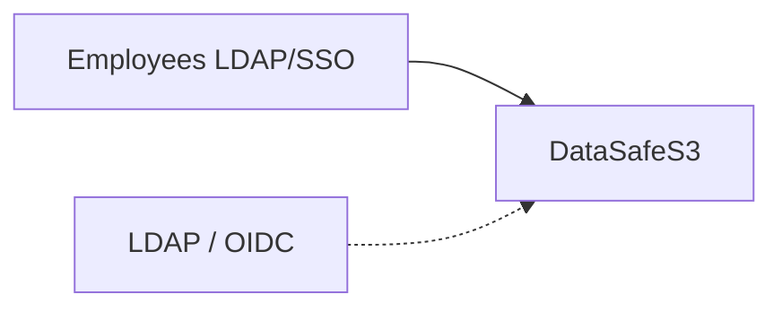

English | **[Русский](../ru/corporate-file-storage.md)**

# Enterprise file storage

## Problem

Teams need shared file storage with access control, SSO, and audit — while keeping data on infrastructure the organization operates.

## Solution

Deploy DataSafeS3 as the central object store and integrate corporate identity:

- Create **tenants** per department or business unit
- Use **groups** for project teams and bucket access
- Issue **share links** for external partners (expiry + download limit)
- Enable **MFA** for administrators and **activity logging** for compliance
- **Personal workspace:** each user gets a private home bucket (`files` by default) on first sign-in
- **Team sharing:** bucket owners and tenant admins grant read/write access to colleagues from the console **Share** tab
- **Folder sharing (Phase 2):** grant access to a prefix inside a bucket (e.g. `reports/`) without sharing the whole bucket
- **Notifications:** grantees receive in-app alerts when files or folders are shared with them
- **Recent:** the Files page shows recently opened buckets and folders
- **Desktop sync (Phase 3):** optional folder mirror via `datasafe-sync` CLI or Tauri desktop app — [clients/README.md](../../../clients/README.md)

Implementation: [LDAP](../../administrator-guide/en/ldap.md) · [OIDC](../../administrator-guide/en/oidc.md) · [Tenants](../../administrator-guide/en/tenants.md) · [Audit](../../administrator-guide/en/audit.md)

## Result

Centralized self-hosted storage with enterprise identity, activity visibility, and quotas — data remains under organizational control.
