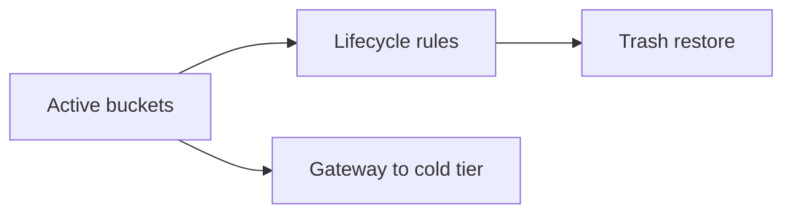

English | **[Русский](../ru/data-archive.md)**

# Document archive

## Problem

Cold data must be retained for years with controlled cost while remaining searchable and restorable under policy.

## Solution

Combine lifecycle rules, soft delete, and optional Gateway replication:

1. Define [lifecycle rules](../../administrator-guide/en/lifecycle.md) — expire or transition after N days
2. Use **Gateway** to replicate archive buckets to external cold storage tier
3. Periodic [backup](../../operations-guide/en/backup-restore.md) of metadata
4. Document restore in [disaster recovery plan](../../operations-guide/en/disaster-recovery.md)

## Result

Tiered archive: fast local access for recent data, automated retention, and optional off-site cold copies.
